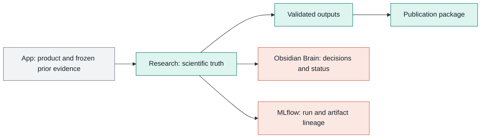

# Research Operating Model

> **Deprecated active instruction.** The current authority map is
> `AGENTS.md`, `LOCAL_RESEARCH_HARNESS_BUILD_PLAN.md`, and
> `00_governance/TOOLCHAIN.md`. This file is retained temporarily for migration
> provenance and must not override IS1 V0.1 Gate C/R, confirmation, dashboard,
> dependency, or MLflow rules. Archive/delete requires exact Owner approval.

## System boundaries

<!-- mermaid-id: 02-01-research-system-boundaries -->

Research owns scientific truth for new work. The Obsidian Brain is the only
active memory layer and contains readable summaries, decisions, status, and
pointers. It does not replace manifests, evidence, or results. MLflow stores
experiment lineage. HyperResearch and source-staging workspaces are disposable,
not canonical repositories.

## Evidence workflow

Approved PDF, repository, dataset, web and project-history inputs are verified,
registered and digested in Research. HyperResearch is an optional Claude-only
staging flow, not a required second literature system. Development gates precede
method freeze, prospective confirmation and publication review.

## Optimizer policy

- GEPA is a shared optimizer/comparator, not a fourth track.
- SkillOpt v0.2.0 is the fixed baseline for HarnessOpt, not the target architecture.
- SPEAR may be a diagnostic comparator when per-example errors justify it.
- Track C/H optimizes exposure and the governed harness; Track R freezes the
  candidate pool before ranking; Track S is optional methods work.

## Positive publication policy

Each track must define a useful positive contribution that remains valid even
when the primary method does not win: a benchmark, diagnostic taxonomy,
validated boundary, transfer finding, or reproducible efficiency result. Claims
must follow measured evidence; the publication narrative cannot redefine a
failed primary endpoint after seeing held-out results.
