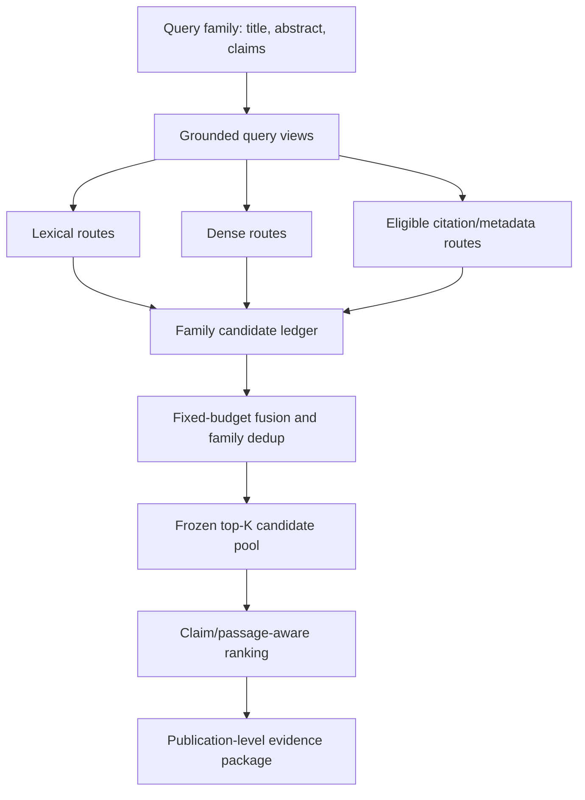

# IS1 Research V0.1 Scientific Protocol

Status: `OWNER_APPROVED_ARCHITECTURE_IMPLEMENTATION_ACTIVE_RUNS_GATED`
Execution authority: `PLAN.md` and `00_governance/OWNER_GATES.md`
Historical alias: `Paper E`
Benchmark unit: patent family

## Research thesis

Prior myIS studies show that a reranker cannot recover a relevant patent family
that first-stage retrieval never exposes. IS1 V0.1 therefore tests a causal
sequence: recover candidate families through complementary grounded routes,
freeze the candidate pool, then measure ranking and evidence quality without
changing pool membership.

The proposed method family is **CrossRoute**. It is a retrieval and evidence
system, not a legal novelty or freedom-to-operate evaluator.

Paper D remains a frozen historical boundary. Its bytes, claims, and reported
results are not reopened, rewritten, or used as hidden optimizer feedback.

## Research questions and falsifiable claims

| ID | Question | Primary endpoint | Falsification |
|---|---|---|---|
| C | Does CrossRoute expose more relevant OUT-domain families than one preregistered protocol-matched reproduced baseline? | OUT Recall@100 | confirmation point delta <= 0 |
| C-route | Which routes uniquely recover relevant families after family deduplication? | unique relevant-family recovery and overlap | no non-leaking unique recovery |
| R | On the identical frozen pool, does claim/passage-aware ranking improve order over no rerank? | OUT nDCG@100 | confirmation point delta <= 0 |
| R-evidence | Can the system provide exact publication-level claim/passage evidence with traceability? | evidence coverage/support/error taxonomy | unsupported or untraceable evidence |
| S | Does skill+typed-policy adaptation differ from skill-only adaptation under matched controls? | preregistered selection utility plus primary retrieval endpoints | A3 does not exceed A2 or violates controls |

Gate C and Gate R are separate claims. A positive Gate C and negative Gate R,
or the reverse, are both interpretable outcomes. R cannot attribute improvement
to ranking if its candidate pool differs from the frozen C pool.

## Benchmark and data contract

DAPFAM contains 1,247 query families and 45,336 target families according to
the published benchmark. Local manifests must verify these counts before use.
Evaluation aggregates at family level and reports ALL, IN, and OUT. The primary
cutoff is 100.

Published passage baselines are reproduction references:

| Method | OUT nDCG@100 | OUT Recall@100 |
|---|---:|---:|
| BM25 passage | 0.0589 | 0.1521 |
| Dense passage | 0.0590 | 0.1552 |
| Hybrid RRF K=30 | 0.0625 | 0.1653 |

They are not results produced by this repository. A primary comparator is
chosen once from a protocol-matched local reproduction before method selection.

DAPFAM qrels have informed earlier development. Therefore no DAPFAM cohort is
described as globally untouched. Before development, freeze and commit to:

- split-generation seed and stratum definition;
- adaptation, selection, and confirmation membership hashes;
- qrels snapshot hashes;
- exact query and OUT-positive availability/count;
- evaluator, family mapping, parser, corpus, and baseline hashes;
- network policy preventing protected re-download.

Only adaptation and selection qrels are visible to an optimizer. Confirmation
membership, qrels, protected payloads, and per-query outcomes stay outside the
agent workspace. Before permanently freezing the proposed 60/20/20 split, run
an OUT-primary prospective MDE/power audit. The final ratio is an Owner decision
based on available positives and design sensitivity, not a legacy code default.

A full-1,247-query result is protocol-matched descriptive benchmarking rather
than unseen confirmation when DAPFAM qrels informed development.

## CrossRoute architecture



Every generated term must point to source span IDs from title, abstract, or
claims, or be marked `quarantine_ungrounded`. Views may express TAC, independent
claims, limitations, mechanism, function, structure/material, process/operation,
application/use, and conservative restatement. Qrels and relevant-document text
cannot be inputs to view generation.

Routes require an explicit hypothesis and provenance:

| Route | Hypothesis | Required provenance |
|---|---|---|
| BM25 TAC/passage | exact terms, numerals, compounds | view, field/passage, rank, score |
| BM25 claim/element | claim-limitation overlap | claim/source spans, normalized tokens |
| Dense TAC/passage | vocabulary mismatch | model/revision, field, truncation |
| Dense claim view | claim-level semantic match | grounded view and candidate passage |
| Citation graph | prior-art relation beyond text | source, timestamp, mapping coverage |
| Metadata/class | controlled routing/filtering | IPC/CPC/date source; never relevance proof |

Allocate route-specific depth and quota before fusion. Final family budget is
identical across arms. The ledger retains family ID, publication ID, route,
view, rank, score, matched passage, component provenance, and deterministic
tie-break fields. Family dedup occurs before metric scoring.

## Candidate exposure protocol

F1 reproduces BM25, dense, and Hybrid RRF. C0 then reports Recall@100/200/1000,
judged-query coverage, zero-hit rate, OUT-positive counts, candidate exposure,
and oracle performance inside each pool.

C1 evaluates manual ablations in a preregistered order, beginning with cheap
credible routes. C2 opens only if manual variants establish a valid responsive
surface; its optimizer edits typed policy fields only and cannot add arbitrary
tools or executable code.

Development and selection use this rule:

```text
accept candidate iff preregistered primary selection score > current best
reject exact ties and lower scores
```

For Gate C the primary selection score is OUT Recall@100. Secondary metrics,
cost, and guardrails diagnose a candidate but cannot rescue a tie or loss unless
the preregistered score itself explicitly includes them for a separate S study.

CF freezes code, query views, routes, model identity, environment, policy,
candidate ledger, final pool, comparator, and analysis hashes. A new pool is a
new protocol proposal, not an edit to the existing freeze.

## Ranking and evidence protocol

R0 measures no-rerank nDCG, oracle/reachable nDCG, query coverage, field
availability, and family promotions/demotions on the CF pool. R1 compares
no-rerank, a protocol-matched practical reranker, passage-aware scoring, and
claim-limitation coverage. General rerankers are controls/baselines, not presumed
improvements.

Gate R selection uses strictly greater OUT nDCG@100 and rejects ties. Every
comparison must pass the identical candidate-pool SHA-256 to
`FrozenPoolRankingComparison`.

R2 evidence records include:

```text
query_id
family_id
publication_id
priority/publication date
route and rank provenance
claim limitation
verbatim evidence span
page/section/offset
support: supports | partial | contradicts | unclear
confidence and unresolved gaps
```

Evidence generation cannot modify relevance labels or candidate ranks. A model
interpretation is separated from quoted source text. Missing support produces an
abstention or `unclear`, never a more assertive legal conclusion.

## PageIndex boundary

PageIndex is optional and only for BM25/dense-routed within-document evidence
retrieval after large-corpus candidate retrieval has selected publications. A
pilot preregisters development queries, repeats if stochastic, a section-aware
BM25/dense locator comparator, evidence hit/traceability/latency/cost/repeat
agreement, and source/license handling. It cannot silently replace first-stage
retrieval over the DAPFAM corpus.

## Optional Track S protocol

| Arm | Editable surface |
|---|---|
| A0 | frozen baseline; no adaptation |
| A1 | human-authored seed skill; frozen harness |
| A2 | optimized skill; frozen harness |
| A3 | optimized skill plus declared typed policy fields |

A2 and A3 use the same initial state, optimizer model, provider, reasoning
effort, data access, evaluator, module pool, trial/token/time/cost ceiling,
repeats, order balancing, tools, and stopping rule. Start calibration with
GPT-5.6 Sol Medium on qrels-blind fixtures; escalate to High only if validity
criteria fail, then freeze the selected setting. Luna is restricted to support
tasks or a separate cost ablation and is not mixed into main A2/A3. Third-party
providers are development-only by default. Silent fallback invalidates a run.

Every repeat is reported. The best repeat cannot be selected as the headline.
An S utility score must be preregistered and remains an optimizer decision
metric; it does not replace Gate C or Gate R publication endpoints.

## Estimation and confirmation framework

MDE and power are prospective design-sensitivity analyses. They are reported
separately and never become observed-result pass thresholds.

Each gate preregisters one primary baseline and one primary comparison. The
external Owner-run evaluator computes on identical confirmation query IDs:

- exact query count `n`;
- baseline and candidate point estimates;
- paired per-query delta;
- deterministic 10,000-resample paired-bootstrap 95% CI;
- rank-biserial effect size;
- win/loss/tie counts;
- comparison-family role and correction metadata;
- input, request, and output hashes.

Interpretation:

| Result | Classification | Allowed claim |
|---|---|---|
| delta > 0 and CI lower > 0 | statistically supported superiority | superior/outperformed under the protocol |
| delta > 0 and CI includes 0 | higher measured score with uncertain superiority | achieved a higher measured score; uncertainty noted |
| delta <= 0 | no observed improvement | did not detect improvement |

The CI lower bound is not a hard success gate. Holm correction applies only to
the preregistered family of additional confirmatory comparisons. Gate C and R
are classified independently.

Confirmation executes outside the agent workspace. This repository contains no
confirmation evaluator or protected-data loader. It emits a hash-only
`ConfirmationRequest` and accepts only a schema-validated aggregate package.
The browser, dashboard, Brain, MCP, MLflow, logs, and manifests never expose
confirmation membership, qrels, protected payloads, or per-query outcomes.

## Compute and dependency protocol

`pyproject.toml` plus `uv.lock` is the sole dependency authority and Python 3.11
is required. Every measured run records exact Python patch, uv version, OS,
architecture, accelerator/CUDA stack, groups/extras, and lock SHA-256. Replay
uses `uv sync --locked` with those exact selections. Hashed requirements may be
exported for interoperability only.

Implementation uses GPT-5.6 Sol High. Paid API, GPU, Vast.ai, vLLM, new dense
index generation, PageIndex model calls, and external datasets require their
scoped Owner Gates and declared budgets. One measured arm cannot silently change
provider, model, effort, endpoint class, or fallback behavior.

## Publication strategy

A positive publication strategy does not require manufacturing a metric win.
Valid contributions include:

1. statistically supported or uncertain-but-positive Gate C and/or Gate R;
2. route-level unique recovery and cost/quality frontier;
3. a reproducible exposure-versus-ranking loss decomposition;
4. a validated negative boundary showing why a route or adaptation surface is
   flat under strong controls;
5. publication-level evidence traceability and transparent failure taxonomy.

Required reports include protocol-matched baseline reproduction, candidate
exposure and route overlap, frozen-pool ranking, paired uncertainty, evidence
quality, cost/latency, optional A0-A3 results, and limitations. Report `did not
detect` rather than universal failure. Do not change endpoints, comparator, or
narrative after confirmation. Retrieval relevance remains decision support and
never becomes a legal opinion.
