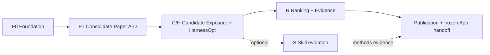

# แผน Research Program ฉบับใช้งาน

> สถานะ: `OWNER-APPROVED_IMPLEMENTATION_ROADMAP`
> วันที่ฐาน: 2026-07-27
> อำนาจการรัน: [`PLAN.md`](PLAN.md) และ [`00_governance/OWNER_GATES.md`](00_governance/OWNER_GATES.md) ยังเป็น execution authority
> ขอบเขตที่เปิดแล้ว: restructure, PDF triage/digest, offline harness และ notebook demo
> ขอบเขตที่ยังปิด: paid API, GPU/Vast.ai, scientific MLflow run และ confirmation cohort จนกว่าจะผ่าน R3/R4

## 1. เป้าหมายของโปรแกรม

พัฒนาระบบวิจัยเพื่อค้นหา จัดอันดับ และเชื่อมหลักฐานสิทธิบัตรข้ามโดเมน โดยแยกปัญหาออกเป็นสามส่วนที่วัดได้:

1. **Candidate exposure:** ระบบค้นเจอ relevant family มากพอหรือไม่
2. **Ranking and evidence:** เมื่อมี candidate แล้ว ระบบจัดอันดับและชี้ passage/claim evidence ได้ดีเพียงใด
3. **Research harness optimization:** workflow ทั้งระบบเลือก query, route, representation, fusion, budget, reranking และ stopping ได้ดีกว่า skill/prompt optimization อย่างเดียวหรือไม่

DAPFAM ใช้เป็นหลักฐานด้าน retrieval relevance เท่านั้น ไม่ใช้แทนการวินิจฉัย novelty, freedom-to-operate หรือข้อสรุปทางกฎหมาย

## 2. ขอบเขตระบบที่ไม่ซ้อนกัน

| กลุ่ม | หน้าที่ | สิ่งที่ห้ามเป็น |
|---|---|---|
| `00_App` | product workflow, UI/API และการรับ frozen handoff | แหล่งกำหนด metric หรือ research truth |
| `01_Research` | protocol, corpus manifest, code, experiment, metric และ paper truth | ที่เก็บ runtime ขนาดใหญ่หรือ secret |
| `02_Brain` | Obsidian/QMD knowledge, decision, status และ pointer | แหล่งตัวเลขสำหรับ paper |
| `02_Tools` | pinned tool repositories, environments และ cache | canonical research evidence |
| `01_Stores` | MLflow, datasets, models, backups และ runtime payload | Git repository |

PDF ต้นฉบับอยู่แบบ local-only ใต้ `01_evidence/private/literature/`; Git เก็บ catalog, alias, tier, digest และ QA provenance เท่านั้น

## 3. Program flow

### F0 — Foundation

- ปิด restructure blockers: navigation, Brain/QMD, MLflow URI และ PDF ownership
- สร้าง tier-organized literature corpus พร้อม full triage U041–U153
- สร้าง immutable harness kernel, structured logs, canonical manifests และ offline notebook
- ติดตั้งเฉพาะ project skills ที่ผ่าน safety review

Gate: repository audit, QMD retrieval, MLflow artifact round-trip, PDF manifest และ offline test suite ผ่านทั้งหมด

### F1 — Consolidate prior evidence

- รักษา Paper A–D และ frozen artifacts โดยไม่ rerun
- แยก `confirmed`, `diagnostic`, `exploratory` และ test-reuse history
- ใช้ผลเดิมเพื่อกำหนดข้อจำกัดของ fixed prompt/reranker surfaces ไม่ขยายเป็นคำกล่าวว่า prompt optimization ทุกแบบล้มเหลว

Gate: evidence map และ claim boundary ตรวจย้อนกลับถึง manifest ได้

### C/H — Candidate Exposure and Harness Optimization

คำถามหลัก: ภายใต้งบและ evaluator เดียวกัน HarnessOpt เพิ่ม OUT-domain candidate exposure ได้มากกว่า reproduced DAPFAM reference และ SkillOpt หรือไม่

สี่แขนทดลอง:

1. reproduced DAPFAM/MTEB reference
2. fixed human-authored harness
3. SkillOpt baseline
4. HarnessOpt proposed method

SkillOpt pin: `microsoft/SkillOpt` release `v0.2.0`, commit `51d0a4d96e88558c84dee637f98e24e3fb2d1547`, MIT. HarnessOpt optimize policy/workflow เท่านั้น ไม่แก้ model weights

Primary success rule ต้องชนะทั้ง DAPFAM reference และ SkillOpt บน confirmation cohort ใน metric ทั้งคู่:

- OUT NDCG@100
- OUT Recall@100

รายงาน mean ของ fixed seed 3 ค่า พร้อม absolute/relative delta; ไม่ใช้ confidence interval เป็น pass/fail. Guardrails: IN NDCG/Recall ลดได้ไม่เกิน 0.01 absolute, invalid-query rate ไม่เกิน 1%, และใช้งบที่ประกาศล่วงหน้าเท่ากัน

### R — Ranking and Evidence

- รับเฉพาะ candidate pool ที่ freeze จาก C/H
- แยก ranking quality, calibration, evidence completeness และ abstention
- ห้าม reranker ซ่อน candidate-exposure failure
- เก็บ per-query rows และ error taxonomy สำหรับ IN/OUT แยกกัน

Gate: pool hash, evaluator hash, evidence schema และ split hash ตรงกันทุก arm

### S — Optional Skill Evolution

SkillOpt เป็น baseline ที่ต้องวัด ไม่ใช่เป้าหมายสุดท้าย. เปิด track นี้เมื่อ C/H ให้ signal หรือเกิดคำถาม methods ที่แยกตีพิมพ์ได้ การศึกษา S ต้องไม่อยู่บน critical path ของ candidate-exposure paper

### Publication and App handoff

- paper table อ่านเฉพาะ validated canonical manifests และ metric artifacts
- MLflow เป็น searchable mirror ไม่ใช่ paper truth
- App รับเฉพาะ method/config/model/policy ที่ freeze พร้อม version, uncertainty และ provenance
- ห้ามเรียก output ว่า legal verdict

## 4. DAPFAM evaluation contract

Primary task: DAPFAM OUT TAC→TAC, Top-100

แบ่ง query ID แบบ deterministic และ stratified:

- train 60%
- selection 20%
- prospective confirmation 20%

ข้อมูล DAPFAM เคยถูกประเมินในงานก่อน จึงเรียกชุดสุดท้ายว่า **prospectively isolated confirmation cohort** ไม่เรียกว่า globally untouched. Optimizer อ่านได้เฉพาะ train/selection query IDs; confirmation เปิดครั้งเดียวหลัง method freeze และ R4 approval

ทุก arm ต้องใช้ target/optimizer model roles, module pool, evaluator, split hashes และ budget เดียวกัน. MAP, MRR, P@10, ALL, latency และ cost เป็น diagnostics ไม่ใช่ primary win rule

## 5. Literature-to-Brain flow

แหล่ง Brain มาจาก web search, PDF, project history และ approved notes ตาม flow เดียว:

1. ลงทะเบียน source ด้วย U-ID + SHA-256 + provenance
2. ตรวจ duplicate, title/DOI, license และ record type
3. จัด tier A/B/C/N แยกตาม scope; PDF จริงมี canonical object เพียงชุดเดียว
4. สร้าง validated digest และ claim-to-source pointer
5. ingest summary/pointer เข้า Obsidian/QMD ภายใต้ serial-writer lease
6. ตัวเลขสำหรับ paper กลับไปอ่าน canonical manifest เสมอ

U150 เป็น template (`record_type=template`, Tier N). U001–U040 digests และ imported manifest เป็น frozen bytes; การย้าย source ใช้ companion mapping ไม่แก้ historical artifact

## 6. Observability and paper truth

ลำดับ authority:

1. `runtime.jsonl` — diagnostic event truth จาก structlog
2. `progress.jsonl` — milestone projection
3. `metrics.json` และ `per_query_metrics.jsonl` — scientific numeric truth
4. MLflow — searchable mirror ของ params, metrics, artifacts และ lineage
5. validated `manifest.json` — paper-facing run index

ทุก run เก็บ prompt, flow, progress, result, metrics, runtime log, per-query rows, validation report, manifest และ MLflow receipt. Manifest เขียนแบบ atomic เป็น canonical artifact สุดท้ายและห้าม overwrite

## 7. Compute and approval tiers

| Tier | ตัวอย่าง | Gate |
|---|---|---|
| R0 | read-only audit, code, fixture, unit test | เปิดแล้วตาม scope นี้ |
| R1 | local CPU development data | Owner เปิด track |
| R2 | short API/GPU probe | R3 budget approval |
| R3 | bounded development study | R3 + frozen protocol |
| R4 | one confirmation pass | separate R4 approval |

ทุก run ประกาศเวลา, token/API/GPU/retrieval budget และ stop condition ล่วงหน้า. Disk-full หรือ canonical write failure ต้อง fail closed

## 8. Publication strategy

- **Path A:** candidate-exposure/HarnessOpt paper หาก primary rule ผ่าน
- **Path B:** diagnostic/benchmark paper หาก method ไม่ชนะ แต่ได้ reproducible boundary, benchmark หรือ error taxonomy ที่มี contribution
- **Path C:** thesis-only evidence หากผลไม่พอสำหรับ standalone paper

ห้ามเปลี่ยน primary endpoint หลังเห็น confirmation result และห้ามบังคับ publication narrative ให้เป็นผลบวก

## 9. Definition of done

- restructure audit ไม่มี active dangling legacy path
- QMD ดึง known Brain note ได้
- PDF aliases/objects/duplicates/tier/digest counts ผ่าน validator และไม่มี PDF ถูก track ใน Research
- MLflow URI เป็น path ใหม่และ artifact round-trip ผ่าน
- Harness state, approval, split, budget, redaction, manifest และ tamper tests ผ่าน
- notebook รัน clean top-to-bottom ด้วย offline PDF/web/history fixtures
- DAPFAM protocol มี four-arm comparability validator และ confirmation isolation
- paper table สร้างจาก validated manifests โดยไม่อ่าน stdout/MLflow UI
- ก่อน push ผ่าน test, path/secret scan, archive integrity และ three-repository diff review

## 10. สิ่งที่ยังต้องใช้ Owner gate

Implementation ใน F0 ไม่ได้อนุญาตการเริ่ม scientific study. การใช้ paid/API/GPU/Vast.ai, การเปิด confirmation IDs, การ publish result และการเปลี่ยน frozen App handoff ต้องขอ R3/R4/R5 ตามลำดับ
