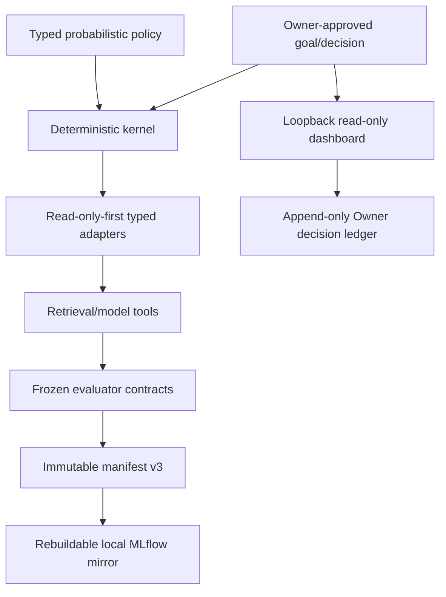

# IS1 Research V0.1 Local Harness Build Contract

Status: `IMPLEMENTATION_ACTIVE_SCIENTIFIC_RUNS_GATED`
Execution authority: `PLAN.md`, `AGENTS.md`, and `00_governance/OWNER_GATES.md`

## Harness definition

The harness is the deterministic control system around retrieval/model policy:
typed inputs, lifecycle, approvals, protected surfaces, budgets, tools, context,
metrics, statistics, manifests, logs, recovery, Owner decisions, and mirrors.

> Probabilistic components propose. Deterministic contracts decide validity,
> comparability, immutability, and reportability.

## Implemented architecture



The kernel owns schemas, lifecycle, identity, approvals, split and qrels
commitments, budget ceilings, family dedup/tie-break, metrics/statistics,
redaction, immutable artifacts, confirmation boundaries, and validation.

The policy may own only declared grounded query views, allowlisted routes,
route depth/quota, candidate budget allocation, fusion, ranking/evidence depth,
and stopping. It cannot alter evaluator code, ground truth, family mapping,
confirmation access, or executable tools outside an allowlist.

## Public contracts and modules

| Module | Implemented contract |
|---|---|
| `harness/models.py` | `GoalSpec`, `ApprovalRecord`, `ResearchVersionSpec`, `RuntimeEnvironment`, `ProviderExecution`, `ReplicationContract`, `StatisticsContract`, `ProtectedSurfaceContract`, `ExecutionIsolationContract`, `CandidatePoolReference`, `RunSpec`, events/artifacts/results |
| `harness/policy.py` | grounded `QueryViewPolicy`, route-specific `RoutePolicy`, `CandidateBudget`, `FusionContract`, `HarnessPolicy` |
| `harness/candidate_ledger.py` | deterministic family ledger and `freeze_candidate_pool` |
| `harness/metrics.py` | family Recall/nDCG and canonical strict comparison helpers |
| `harness/statistics.py` | paired delta, deterministic 10k bootstrap CI, W/L/T, rank-biserial effect, Holm support |
| `harness/benchmark.py` | explicit-ratio split compatibility, `SplitFreezeCommitment`, strict `SelectionDecision`, independent C/R comparisons and confirmation classification |
| `harness/manifest.py` | immutable no-overwrite manifest v3 and receipts |
| `harness/validation.py` | v3 validation and v2 read-only legacy validation |
| `protection.py` | protected path/key and aggregate-only boundaries |
| `providers.py` | no-fallback and matched A2/A3 validation |
| `confirmation.py` | hash-only request and aggregate-only response; no evaluator or protected-data loader |
| `ledger.py`, `dashboard/*` | immutable governance decisions, loopback security, allowlisted viewer/receipts |
| `mlflow_mirror.py` | explicit-file, validated/redacted, rebuildable local mirror |

Every external JSON/YAML/TOML input is parsed into a typed contract before use.
Legacy v2 manifests may be read and validated but are never emitted as new runs.

## State and immutable write contract

Goals advance through:

```text
DRAFT -> REVIEWED -> APPROVED -> ACTIVE -> CLOSED
                   \-> CANCELLED
```

Runs advance through:

```text
CREATED -> PREFLIGHTED -> RUNNING -> SUCCEEDED
    |          |             |----> FAILED
    |          |             |----> CANCELLED
    \----------\-------------> INVALIDATED
```

Transitions are append-only. A rerun uses a new run ID. Canonical JSON records
use no-overwrite creation. Manifest finalization occurs only after artifacts and
validation are complete; existing manifests/decisions/receipts are never edited.

## Candidate exposure kernel

`HarnessPolicy.validate()` enforces unique grounded views, supported source
fields, route IDs, route kind allowlists, positive depth/quota, quota <= depth,
total route quota within maximum retrieval budget, final K, fusion references,
family deduplication, provenance, and optional frozen-pool SHA-256.

The family ledger retains publication-level provenance while deduplicating at
family level. Stable ordering must not depend on batch order or Python mapping
iteration. Required tie-break is score descending, best component rank ascending,
then family ID ascending.

Selection is implemented by `SelectionDecision.decide()`: canonicalize scores,
accept only strict improvement, reject exact ties, and reject lower scores.

## Gate C and Gate R kernel

`CandidateExposureComparison` computes paired Gate C statistics for
`out_recall_at_100`. `FrozenPoolRankingComparison` computes Gate R statistics for
`out_ndcg_at_100` and rejects different pool hashes. Their classifications are
independent.

Confirmation classification is point-estimate aligned:

- delta <= 0: `no_observed_improvement`;
- delta > 0 with CI lower <= 0:
  `higher_measured_score_uncertain_superiority`;
- delta > 0 with CI lower > 0:
  `statistically_supported_superiority`.

MDE is not an input to this observed-result classifier. The primary comparison
has no multiplicity correction; additional preregistered comparison families use
Holm.

## Split and protected-data implementation target

`deterministic_stratified_split()` requires an explicit ratio and rejects
duplicate query IDs. `SplitFreezeCommitment` binds the prospective-sensitivity
report, seed, membership hashes, qrels snapshot, query counts, OUT-positive
availability/count, and Owner decision. Before scientific use, C0 must execute
that audit with externally held confirmation membership. Historical 60/20/20
usage is not authorization to freeze that ratio.

Confirmation must remain outside this repository. `confirmation.py` deliberately
contains no evaluator and no protected-data loader. A request contains only Git,
submission, config, and protocol hashes bound to IS1 V0.1. An aggregate package
contains only n, point estimates, deltas, CIs, effects, W/L/T, comparison-family
metadata, and hashes. `assert_aggregate_only` rejects protected keys.

## Manifest v3 and replay

Every measured `RunSpec` must bind:

- `ResearchVersionSpec` for IS1 V0.1 and protocol family;
- Owner approval and scope hash;
- Git commit/dirty state and immutable artifact hashes;
- dataset/split commitments, evaluator, kernel/policy/config/prompt/skill hashes;
- `RuntimeEnvironment`: exact Python 3.11 patch, uv version, OS/architecture,
  accelerator/CUDA, groups/extras, `uv.lock` SHA-256;
- `ProviderExecution`: requested/resolved model, provider, endpoint class,
  effort, fallback, request ID, tokens, latency, cost;
- replication, statistics, protected/editable surfaces, offline execution
  isolation, candidate pool, and budget.

`pyproject.toml + uv.lock` is the sole dependency authority. Clean replay uses
`uv sync --locked` with exact recorded groups/extras. Requirements exports are
interoperability-only.

## Dashboard and governance ledger

The dashboard is a local read-only projection of metadata/digests. Security
requirements are fail-closed:

- bind `127.0.0.1` only and reject remote or multi-user operation;
- validate Host and Origin; no CORS/CDN; `Cache-Control: no-store`;
- session and CSRF token on the only canonical mutation endpoint;
- derive authoritative actor from the backend Windows/OS account and store a
  privacy-preserving stable ID; browser labels are non-authoritative;
- no browser editing of manifests, metrics, qrels, splits, baselines, or results.

Owner decisions use preview then explicit confirmation. One immutable JSON
record under `00_governance/approvals/` stores decision ID, gate ID, status,
rationale, timestamp, actor, evidence-manifest hashes, Git commit, and prior
record hash. Corrections are new superseding records.

PDF content streams only from an exact path/hash allowlist after license/privacy
approval. The viewer rejects traversal, symlinks outside roots, hash drift, and
protected files. Each access writes a separate ignored local receipt with
receipt ID, approved file ID/hash, purpose, timestamp, authoritative actor ID,
and prior hash. This chain is tamper-evident, not tamper-proof. A periodic Owner
decision may anchor only chain-head digest and receipt range in Git. Recovery
quarantines a corrupt local ledger, preserves it for audit, starts a superseding
local chain, and records the event/anchor through an Owner decision.

## MLflow mirror

MLflow is local, serialized, searchable, idempotent, and rebuildable. Git and
validated artifacts remain authoritative. The mirror supports allowlisted files
classified as docs, results, metrics, rubrics, rules, tools, skills, or
environment, and uses separate bootstrap/catalog/scientific experiments.

It rejects directory-wide uploads, PDFs, symlinks, credentials, qrels,
confirmation fields, split membership, raw provider payloads, and protected
per-query artifacts. Bootstrap runs contain zero artifacts and zero scientific
metrics. A failure produces one append-only deferred receipt and cannot alter
canonical run validity. Rebuild quarantines the store and replays explicit mirror
specs from canonical hashes; it never auto-repairs canonical files.

## Brain, MCP, and skills

Adapters should expose `preflight`, `dry_run`, `execute`, `cancel`, and `collect`
through typed provenance envelopes. Reads are the default. Writes require narrow
authority, idempotency, and a serial writer. Brain contains readable decisions
and pointers, not evaluator output. MCP cannot decide gates or bypass the repo.
Skills contain procedures and references only; their hashes and editable paths
are recorded in measured runs.

## Model and PageIndex protocol

Implementation uses GPT-5.6 Sol High. Measured optimization starts Sol Medium,
escalates to High only after qrels-blind calibration failure, and freezes the
chosen model/provider/effort/budget identically in A2/A3. Luna is support-only or
a separate cost ablation. Third-party providers are development-only by default.
Requested and resolved model identities must match and fallback is forbidden in
measured work.

PageIndex is a separately preregistered within-document evidence pilot after
BM25/dense corpus routing. The kernel must reject any configuration that uses it
as an implicit first-stage DAPFAM retriever.

## Run bundle and authority

```text
<run-id>/
  prompt.json
  skill_manifest.json
  flow.json
  config.json
  progress.jsonl
  runtime.jsonl
  candidates.jsonl
  evidence.jsonl
  per_query_metrics.jsonl
  metrics.json
  statistics.json
  result.json
  validation_report.json
  environment.json
  manifest.json
  receipts/
```

Runtime/progress are diagnostic, candidate/evidence/per-query rows are replay
inputs, metrics/statistics are numeric artifacts, the validated manifest is the
paper-facing index, and MLflow is only a mirror. Paper generators read validated
canonical artifacts, never stdout or an MLflow UI.

## Required tests and remaining implementation gaps

Implemented focused tests cover identity, import/environment integrity, strict
selection, independent gates, point-delta classification, grounded policy and
candidate determinism, statistics/Holm, provider fallback, protected paths,
aggregate-only confirmation, manifest v2/v3, dashboard security, decision chain,
PDF path/hash receipts, and MLflow projection/rebuild.

Before scientific execution, add end-to-end tests for real baseline adapter
parity, OUT-positive power auditing, network denial during measured optimization,
split membership externalization, batch-order invariance across actual retrieval
backends, complete baseline replay on identical external confirmation IDs,
PageIndex first-stage bypass, and paper-table projection from aggregate-only
confirmation.

Acceptance commands are maintained in `00_governance/OPERATIONS.md`. Passing
offline tests proves contract behavior only; it does not prove a scientific win.
