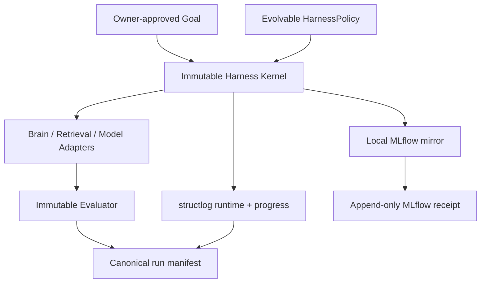

# Local Research Harness / HarnessOpt Build Plan

> สถานะ: `DECIDED_IMPLEMENTATION_ROADMAP`
> Execution authority: [`PLAN.md`](PLAN.md), [`AGENTS.md`](AGENTS.md), [`00_governance/OWNER_GATES.md`](00_governance/OWNER_GATES.md)
> Scope เปิดแล้ว: code, offline fixtures, local logs/MLflow bootstrap และ notebook
> Scope ยังปิด: paid/API/GPU/Vast.ai, scientific run และ confirmation set

## 1. เป้าหมาย

Harness ไม่ใช่เพียงตัวรัน prompt แต่เป็นระบบควบคุม research agent end-to-end: รับ goal, ตรวจ approval/split/budget, เลือก workflow, บันทึก event/metric/artifact, validate lineage และสร้างหลักฐานที่ paper ใช้ซ้ำได้

**HarnessOpt** ปรับ policy ของ workflow ภายใต้ kernel ที่แก้ไม่ได้. **SkillOpt** เป็น baseline. ไม่มีการเปลี่ยน model weights ใน HarnessOpt v1

## 2. สถาปัตยกรรมสองชั้น



### Immutable Harness Kernel

Optimizer ห้ามแก้:

- evaluator และ metric definitions
- split/query-ID guard
- approval และ held-out gate
- budget/stop enforcement
- event schema, redaction และ logging sinks
- manifest hashing/validation
- module registry/allowlist
- trial lineage และ comparison validator

### Evolvable HarnessPolicy

Optimizer แก้ได้ผ่าน typed schema เท่านั้น:

- query/context planning
- retrieval routes และ representation
- fusion/RRF strategy และ weights
- retrieval/rerank/evidence depths
- budget allocation ภายในเพดาน kernel
- fallback และ stopping policy

Policy ไม่สามารถเพิ่ม executable/tool/module ที่อยู่นอก allowlist หรืออ่าน confirmation IDs

## 3. Public contracts

อยู่ใต้ `05_code/src/myis_research/harness/`:

- `GoalSpec` — objective, track, success metric, stop conditions
- `ApprovalRecord` — approval ID/source/time/scope hash/budget tier
- `RunSpec` — arm, dataset/split/evaluator/policy/model/module/budget hashes
- `RunEvent` — structured event envelope
- `ArtifactRecord` — path, role, SHA-256, size, MIME, classification
- `RunResult` — final state, metrics, bundle path, manifest hash
- `HarnessPolicy` — optimizer-editable schema
- `LocalHarness` — immutable execution kernel

Adapter interface มี `preflight`, `dry_run`, `execute`, `cancel`, `collect`

## 4. State machines

Goal:

```text
DRAFT -> REVIEWED -> APPROVED -> ACTIVE -> CLOSED
   \          \           \          -> CANCELLED
```

Run:

```text
CREATED -> PREFLIGHTED -> RUNNING -> SUCCEEDED
    \          \            |----> FAILED
     \----------\-----------|----> CANCELLED
                              ----> INVALIDATED
```

Transition ย้อนกลับไม่ได้; rerun สร้าง run ID ใหม่เสมอ

## 5. Run bundle and authority

```text
<run-id>/
  prompt.json
  flow.json
  progress.jsonl
  result.json
  metrics.json
  runtime.jsonl
  per_query_metrics.jsonl
  validation_report.json
  manifest.json
  receipts/mlflow-*.json
```

| Artifact | Authority |
|---|---|
| console | human live view |
| `runtime.jsonl` | diagnostic event truth |
| `progress.jsonl` | semantic milestone projection |
| `metrics.json`, per-query rows | scientific numeric truth |
| MLflow | searchable mirror/index |
| validated `manifest.json` | paper-facing run truth |

`manifest.json` เขียน atomic, immutable และเป็น canonical artifact สุดท้าย. MLflow sync ภายหลังเขียน append-only receipt โดยไม่แก้ manifest

## 6. structlog contract

Pin `structlog==26.1.0`. Application emit event ครั้งเดียว แล้ว `ProcessorFormatter` กระจาย event dictionary เดียวกันไป console และ `runtime.jsonl`; milestone event ถูก project เพิ่มไป `progress.jsonl`

Required fields:

```text
schema_version, event_id, timestamp_utc, monotonic_ns, sequence,
level, event, run_id, goal_id, phase, component, status
```

Taxonomy เริ่มต้น:

```text
run.preflighted / run.started / run.succeeded / run.failed / run.interrupted
phase.started / phase.completed
approval.checked
trial.proposed / trial.started / trial.evaluated / trial.decided
tool.started / tool.completed / tool.failed
metric.recorded / artifact.hashed / budget.updated / budget.exceeded
mlflow.sync.completed / mlflow.sync.deferred
```

Redactor ต้องทำงาน recursive กับ token, API key, authorization, cookie, password, private/SSH key และข้อความ error. ห้าม log full environment, raw confidential source หรือ raw shell command

## 7. MLflow mapping

- Params: dataset/split/seed/model/evaluator/budget/config
- Tags: goal/run/trial/arm/phase/git SHA/hashes/approval/status/manifest SHA
- Metrics: explicit numeric values; ห้าม scrape log
- Artifacts: sanitized bundle และ licensed per-query rows
- Parent run: HarnessOpt study; child run: trial/arm
- Traces: reserve trace/span IDs, ปิด payload capture จนผ่าน privacy gate

SQLite ใช้ serialized writer. หาก MLflow ล่ม bundle ยัง finalize ได้เป็น `sync_deferred`; retry ต้อง idempotent และสร้าง receipt เพิ่ม

## 8. DAPFAM benchmark harness

Four arms: DAPFAM reference, fixed human harness, SkillOpt, HarnessOpt

Primary task: OUT TAC→TAC Top-100. Split query IDs แบบ stratified/deterministic 60/20/20. Historical queries เคยเปิดแล้ว จึงใช้คำว่า prospectively isolated confirmation

Win rule:

```text
HarnessOpt OUT NDCG@100 > DAPFAM and > SkillOpt
AND
HarnessOpt OUT Recall@100 > DAPFAM and > SkillOpt
```

รายงาน three-fixed-seed mean, absolute/relative deltas; IN drop ≤0.01 และ invalid query ≤1%. Four-arm validator ต้องปฏิเสธ comparison เมื่อ split, evaluator, model roles, module pool หรือ budget ต่างกัน

## 9. Failure and recovery

- Python exception/interrupt: flush JSONL, เขียน failed result/partial metrics/final manifest แล้ว re-raise
- crash/power loss: recovery scan รายงาน run ที่ไม่มี manifest; ห้ามประกาศ success
- disk full/canonical write failure: fail closed
- tampered artifact/truncated JSONL/split mismatch: validator ปฏิเสธ
- retention job รายงาน eligible items เท่านั้น ไม่ลบอัตโนมัติ

## 10. File map

```text
05_code/src/myis_research/harness/
  models.py       # public contracts and lifecycle states
  policy.py       # evolvable policy schema
  logging.py      # structlog, redaction, event projection
  runner.py       # immutable kernel and MLflow mirror
  manifest.py     # artifact hashes and atomic finalize
  validation.py   # independent bundle verifier
  benchmark.py    # split, comparability and HarnessOpt win rule
```

Related artifacts:

- `03_experiments/V01_brain_drive_agent_demo/` — executable offline notebook
- `.agents/skills/myis-run-harnessopt/` — project skill หลัง schema/tests ผ่าน
- `00_governance/config/tools.lock.yaml` — SkillOpt/Orchestra pins

## 11. Build phases

| Phase | Deliverable | Gate |
|---|---|---|
| H0 | contracts, policy, logger, manifest, validator | offline unit tests |
| H1 | Brain-drive notebook + local MLflow receipt | clean top-to-bottom execution |
| H2 | DAPFAM fixtures, split/cohort validator, four-arm dry-run | no confirmation IDs exposed |
| H3 | reproduced reference + fixed human baseline | Owner R3 |
| H4 | SkillOpt baseline integration | matched budget/evaluator |
| H5 | bounded HarnessOpt development loop | max trials/time/cost |
| H6 | frozen prospective confirmation | separate Owner R4 |
| H7 | paper tables from validated manifests | claim-evidence audit/R5 |

H0/H1 codeและ offline validation อยู่ใน implementation scope ปัจจุบัน. H3–H7 ไม่เปิดโดยเอกสารนี้

## 12. Acceptance tests

- console/runtime/progress ใช้ event ID เดียวกัน
- JSONL เป็น UTF-8 valid JSON และ sequence monotonic
- secret fixtures ไม่ปรากฏใน console, JSONL, MLflow หรือ manifest
- success/failure/interrupt/MLflow-down รักษา audit bundle
- manifest hash validator จับ tampering และ split mismatch
- MLflow deferred retry ไม่ duplicate
- optimizer ไม่มีสิทธิ์แก้ kernel/evaluator หรืออ่าน confirmation IDs
- cohort validator ตรวจ four-arm comparability
- notebook ใช้ PDF/web/history fixtures และแสดง Brain → Harness → structlog → MLflow → manifest → paper table
- paper table อ่าน validated manifests เท่านั้น

## 13. Low-dev operator commands (target CLI)

```text
doctor
goal plan
goal approve
run dry
run dev
run status
report owner
```

CLI เป็น thin wrapper เหนือ contracts เดียวกัน ไม่สร้าง second source of truth
