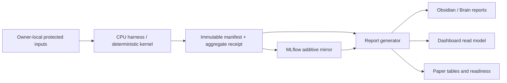

# myIS Research Plan

`01_Research` is the active control plane. Git-tracked control records,
validated manifests, aggregate receipts, and evidence hashes are canonical.
Dashboard, MLflow, Obsidian, and Paper are rebuildable projections.

## Source-of-truth matrix

| Domain | Canonical bytes | Rebuildable projections | Owner action |
|---|---|---|---|
| Program identity, phase, task, defaults | `control/program.yaml`, campaign YAML | Dashboard flow, Brain MOC, MLflow tags | none; defaults are automatic |
| Decisions | immutable D2/D3 ledger records | Dashboard inbox, reports | `D2_OPEN_FINAL`, `D3_SUBMIT_RELEASE` only |
| Run and metric facts | validated manifest + aggregate receipt | MLflow runs, read model, Paper tables | none after execution |
| Literature and evidence | `evidence/` hash/pointer records | Brain notes, citations, readiness | Owner verifies external publication state |
| Interpretation and lessons | Brain pointer notes with source hash | Obsidian backlinks | serial Brain writer |

No projection is allowed to introduce a second numeric source of truth.

## Research question

Can a patent-native, grounded AutoIndex-style representation compiler improve
family-level DAPFAM retrieval while the retriever, evaluator, and budget remain
fixed? AutoIndex is the primary methodological lineage. SkillOpt is a
conditional extension only after structure leverage and ranking headroom are
measured.

## Phase order

| Phase | Purpose | State |
|---|---|---|
| `P0_FOUNDATION` | authority, schemas, deterministic kernel, protected boundary, projections | complete |
| `P1_CPU_BASELINE` | `R0` flat BM25 and `R0-W` deterministic window/maxP CPU lane | complete with measured train/selection evidence |
| `P2_SCOPE_DEVELOPMENT` | `R1` SCOPE/AutoIndex development and one-run selection | ready; planned, not measured |
| `P3_FINAL` | one frozen final evaluation | requires `D2_OPEN_FINAL` |
| `P4_PUBLICATION` | manuscript, package, and release | requires `D3_SUBMIT_RELEASE` |

## Execution bindings

These bindings are machine-readable closeout anchors, not additional gates.

### Task P0.3 - Projection contracts and migration closure

- **Owner Decision:** none; automation validates the read model and generated reports.

### Task P1.3 - Protected owner-local CPU handoff

- **Owner Decision:** none; `P1_CPU_EXECUTION_ENVELOPE` is an execution contract, not a new Owner gate.
- **Result:** complete with measured train/selection evidence. Fresh request
  `dapfam-p1-fulltext-c058a3aa7357c782` produced one accepted aggregate receipt,
  twelve metric rows, and the exact four-slot `R0`/`R0-W` by
  `train`/`selection` manifest and validation-report matrix. Package
  `b5626b59484f429bcaa13f914ba9b7b3175a2013715d0b10d8f9c1c5638b34b3`
  passed artifact-only rigor review and was mirrored to MLflow without protected
  artifacts. P2 is ready but not started; final-872 remains closed and globally
  untouched remains non-claimable.

### Task P3.1 - Frozen final evaluation

- **Owner Decision:** `D2_OPEN_FINAL`

### Task P4.1 - Manuscript and release package

- **Owner Decision:** `D3_SUBMIT_RELEASE`

## Data flow



## Arms and defaults

- `R0`: flat family-level BM25.
- `R0-W`: deterministic passage/window BM25 with family maxP aggregation.
- `R1`: grounded SCOPE-DSL compiled by a deterministic AutoIndex-style loop.
- SkillOpt: disabled by default; no Owner micro-gates are created.
- Selection rule: keep a candidate only on a strictly greater primary score;
  ties are rejected.
- CPU first, zero paid API, no GPU, no fallback, and final split closed.

### P2 versioned budget and internal freeze

P2 uses the canonical profile `p2-r1-primary-v1` at
`control/budgets/p2-r1-primary-v1.yaml`. Every measured request must include
the profile ID and the SHA-256 of the parsed canonical profile. The profile
allows 32 candidates total: four frozen controls, eight preregistered
patent-native candidates, and at most twenty adaptive candidates across five
iterations of four candidates each. The wall-clock ceiling is 259200 seconds
and the per-candidate timeout is 10800 seconds; these are different limits and
there is no `max_cpu_seconds` default.

The P2 run has one hard internal barrier: generation and train evaluation must
finish before the deterministic shortlist is frozen. The freeze receipt binds
candidate IDs, SCOPE specs, compiler/config/retriever/evaluator hashes and the
budget profile hash. Selection can expose only that frozen shortlist once.
Any baseline, train, or freeze failure stops before selection; final-872 stays
closed. A profile change after the first measured run creates a new campaign
revision and cannot rewrite or reinterpret the previous result.

Before the first candidate train outcome, the run must create one immutable
baseline commitment. It binds the baseline candidate and arm to the
repository-safe P1 aggregate receipt by raw file SHA-256 and exact metric-array
index, then freezes the expected train/OUT primary Recall@100 metric and
tolerance. Baseline reproduction must copy that commitment and its observed
metric must equal the same candidate's train metric in the candidate ledger.

Adaptive ranking, iteration improvement, early stopping, tie rejection, and
shortlist construction use `myis.p2-train-metric.v1` objects rather than scalar
scores. For this fixed train evaluation, all comparable candidates must share
the metric identity, positive-query count `n`, denominator definition, and
dataset/config/retriever/evaluator lineage. Only candidate ID, arm, and metric
value may differ. Preregistered and adaptive candidates use `R1`; frozen
controls may use `R0`, `R0-W`, or `R1`.

### Method rationale and literature

`R0` is full-family BM25 to isolate representation effects; the DAPFAM
protocol and local P1 result are the comparator (`U011`, with the patent BM25
context in `U006`). `R0-W` uses non-overlapping 512-token windows and family
MaxP to test passage granularity while keeping the retriever/evaluator fixed;
the AutoIndex digest records this BM25+MaxP lineage (`U154`). `R1` is a
patent-native SCOPE representation-program search inspired by `U154`, measured
on DAPFAM (`U011`). No dense model, LLM, paid API, or provider is part of this
P2 measured arm, so a result is attributable to the representation surface.

## P1 legacy certification record

The owner-local adapter discovers legacy `patents.jsonl`, `queries.jsonl`,
`qrels.tsv`, domain labels, `chunks_doc`, and TAC512 passages without asking
the Owner to convert files. R0 is real Okapi BM25 over one family candidate;
R0-W is deterministic 512-token passage BM25 with family MaxP. Recall@100 is
reported with an explicit positive-query denominator and separate ALL/IN/OUT
scopes for train and selection. Indexes are immutable and stored outside Git;
reuse requires a matching source/config lineage hash. The safe receipt records
counts, values, cost, latency, and hashes only. Dataset inventory marks
`chunks_section` as reference-only and `chunks_element` as incompatible with
the four-unit DAPFAM limit. Paper A/B/D and Paper-D test-997 are historical
exposure, so final 872 cannot be described as globally untouched.

## MLflow and reporting contract

Each campaign has a parent run; each phase has an iteration run; each
candidate/execution has a child run. The child binds `campaign_id`, `phase_id`,
`task_id`, `arm`, `data_role`, `manifest_sha256`, `dataset_lineage_sha256`,
`model_lineage_sha256`, `config_sha256`, `evaluator_sha256`, and
`reproducibility_sha256`. Metrics are aggregate-only and include value, sample
count, direction, scope, cost, and evidence role. Artifacts are allowlisted
text receipts with hashes; PDFs, qrels, query IDs, and per-query outcomes are
never mirrored.

Report sync performs one read-model build, validates the schema, writes the
Research Obsidian projection, Brain generated notes (MOC, dataset registry,
and one detailed note per phase), and Paper readiness note, then `check`
compares a fresh build to the committed projection. Two consecutive sync/check
cycles must be stable. MLflow receives only safe aggregate metrics and lineage
pointers from the same receipt.

The legacy receipt at
`campaigns/scope-autoindex-v1/evidence/legacy-p1-receipt.v2.json` is retained
byte-for-byte as historical invalid evidence. Its disposition record binds the
original file SHA-256 and forbids promotion. It cannot supply run, metric,
evidence, Dashboard, Obsidian, Paper, or MLflow facts.

## Memory lifecycle

`02_Brain/memory` is pointer-only and has five folders: `decisions`,
`evidence`, `lessons`, `failed-attempts`, and `active-context`. A note must
carry a stable ID, source path/URI, source SHA-256, evidence IDs, creation and
review timestamps, and a supersedes pointer when applicable. Retrieval starts
from `memory/MOC.md`; canonical facts are read from Research manifests, not
from prose. Active context expires when its task closes; lessons remain
searchable; failed attempts remain immutable and cannot override decisions.

## Migration sequence

1. Freeze and hash legacy inputs, decisions, reports, and paper receipts under
   `archive/`; write an explicit migration manifest.
2. Activate `control/`, `campaigns/`, `schemas/`, `src/`, `evidence/`, and
   `projections/` as the only runtime paths.
3. Rewrite launchers and report generators to read the canonical read model.
4. Move unused legacy runtime modules and static reports behind archive
   pointers; do not run old and new trees in parallel.
5. Validate layout, protected-content scans, schema, literature, projections,
   MLflow doctor, and tests before commit.

## Acceptance criteria

- `pytest` passes using synthetic fixtures only.
- `validate_layout_v2.py` reports no forbidden active directory.
- `myis-report sync` followed twice by `myis-report check` reports no drift.
- MLflow bootstrap creates the six allowlisted experiments in an external
  SQLite store; doctor and read-only viewer both pass.
- Dashboard APIs expose phases, tasks, D2/D3 gates, evidence, metrics, cost,
  safe dataset inventory, MLflow pointers, and readiness without writing
  artifacts or calculating metrics.
- Dashboard Overview, boards, Results, Governance, Reports, Tools, and the
  ten-screen presentation render one shared revision; keyboard, reduced-motion,
  print, 1920/1366/1024/390 responsive, and protected-DOM checks pass.
- The Windows launcher passes health-token, malformed-port, concurrent-launch,
  duplicate-process, unknown-owner, browser-after-health, and rollback checks.
- Dashboard opens the hash-verified MLflow viewer and exact Obsidian vault note;
  the external database remains byte-identical and retired standalone launchers
  exist only under archive history.
- Obsidian provides P0-P4 Phase masters, every active Task report, Literature
  Map proxies, Research History, Advisor lifecycle, Graph links, and six Bases;
  Owner notes remain byte-identical across two syncs.
- Literature validation reports U001-U154 with unique IDs and hashes.
- No protected qrels, query IDs, membership, payloads, or secrets appear in
  Git, Brain, MLflow, Dashboard, or Paper.
- A hash-bound acceptance receipt and final append-only session capsule record
  changed/untouched files, checks, evidence class, and rollback path.

## Owner decisions

`D1_START_CAMPAIGN` is a single standing authorization recorded in
`control/decisions/D1_START_CAMPAIGN.yaml`; it is not a recurring gate. The
only writable Owner decisions are:

1. `D2_OPEN_FINAL`: expose the frozen final split once.
2. `D3_SUBMIT_RELEASE`: submit or release externally.

The current `control/execution-envelope.yaml` is standing authorization for
reversible repository-local CPU work through P1. It is not an Owner decision.

## Working commands

```powershell
uv sync --locked --all-extras
uv run --no-sync pytest -q
uv run --no-sync myis-report sync --repository-root .
uv run --no-sync myis-report check --repository-root .
uv run --no-sync python scripts/validate_layout_v2.py
uv run --no-sync python scripts/mlflow_doctor.py --repository-root . --store-root $env:MYIS_MLFLOW_STORE
uv run --no-sync python scripts/bootstrap_mlflow.py --repository-root . --store-root $env:MYIS_MLFLOW_STORE
```

Protected data, qrels, membership, query IDs, and per-query outcomes never
enter Git, Brain, MLflow, Dashboard, or Paper. This is decision support, not
legal advice.
