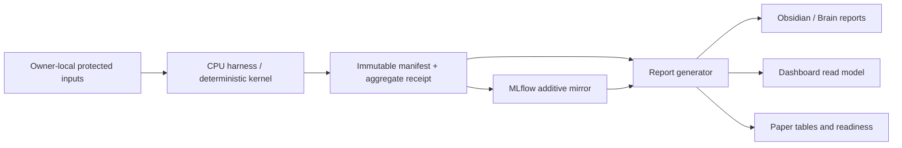

# myIS Research Plan

`01_Research` is the active control plane. Git-tracked control records,
validated manifests, aggregate receipts, and evidence hashes are canonical.
Dashboard, MLflow, Obsidian, and Paper are rebuildable projections.

## Source-of-truth matrix

| Domain | Canonical bytes | Rebuildable projections | Owner action |
|---|---|---|---|
| Program identity, phase, task, defaults | `control/program.yaml`, campaign YAML | Dashboard flow, Brain MOC, MLflow tags | none; defaults are automatic |
| Decisions | immutable D2/D3 ledger records | Dashboard inbox, reports | `D2_OPEN_FINAL`, `D3_SUBMIT_RELEASE` only |
| Run and metric facts | validated manifest + aggregate receipt | MLflow runs, read model, Paper tables | none after execution |
| Literature and evidence | `evidence/` hash/pointer records | Brain notes, citations, readiness | Owner verifies external publication state |
| Interpretation and lessons | Brain pointer notes with source hash | Obsidian backlinks | serial Brain writer |

No projection is allowed to introduce a second numeric source of truth.

## Research question

Can a patent-native, grounded AutoIndex-style representation compiler improve
family-level DAPFAM retrieval while the retriever, evaluator, and budget remain
fixed? AutoIndex is the primary methodological lineage. SkillOpt is a
conditional extension only after structure leverage and ranking headroom are
measured.

## Phase order

| Phase | Purpose | State |
|---|---|---|
| `P0_FOUNDATION` | authority, schemas, deterministic kernel, protected boundary, projections | active |
| `P1_CPU_BASELINE` | `R0` flat BM25 and `R0-W` deterministic window/maxP CPU lane | executable pending protected bundle |
| `P2_SCOPE_DEVELOPMENT` | `R1` SCOPE/AutoIndex development and selection | follows P1 |
| `P3_FINAL` | one frozen final evaluation | requires `D2_OPEN_FINAL` |
| `P4_PUBLICATION` | manuscript, package, and release | requires `D3_SUBMIT_RELEASE` |

## Execution bindings

These bindings are machine-readable closeout anchors, not additional gates.

### Task P0.3 - Projection contracts and migration closure

- **Owner Decision:** `D2_OPEN_FINAL`

### Task P1.3 - Protected owner-local CPU handoff

- **Owner Decision:** `D2_OPEN_FINAL`

### Task P3.1 - Frozen final evaluation

- **Owner Decision:** `D2_OPEN_FINAL`

### Task P4.1 - Manuscript and release package

- **Owner Decision:** `D3_SUBMIT_RELEASE`

## Data flow



## Arms and defaults

- `R0`: flat family-level BM25.
- `R0-W`: deterministic passage/window BM25 with family maxP aggregation.
- `R1`: grounded SCOPE-DSL compiled by a deterministic AutoIndex-style loop.
- SkillOpt: disabled by default; no Owner micro-gates are created.
- Selection rule: keep a candidate only on a strictly greater primary score;
  ties are rejected.
- CPU first, zero paid API, no GPU, no fallback, and final split closed.

## MLflow and reporting contract

Each campaign has a parent run; each phase has an iteration run; each
candidate/execution has a child run. The child binds `campaign_id`, `phase_id`,
`task_id`, `arm`, `data_role`, `manifest_sha256`, `dataset_lineage_sha256`,
`model_lineage_sha256`, `config_sha256`, `evaluator_sha256`, and
`reproducibility_sha256`. Metrics are aggregate-only and include value, sample
count, direction, scope, cost, and evidence role. Artifacts are allowlisted
text receipts with hashes; PDFs, qrels, query IDs, and per-query outcomes are
never mirrored.

Report sync performs one read-model build, validates the schema, writes the
Research Obsidian projection, Brain generated notes, and Paper readiness note,
then `check` compares a fresh build to the committed projection. Two
consecutive sync/check cycles must be stable.

## Memory lifecycle

`02_Brain/memory` is pointer-only and has five folders: `decisions`,
`evidence`, `lessons`, `failed-attempts`, and `active-context`. A note must
carry a stable ID, source path/URI, source SHA-256, evidence IDs, creation and
review timestamps, and a supersedes pointer when applicable. Retrieval starts
from `memory/MOC.md`; canonical facts are read from Research manifests, not
from prose. Active context expires when its task closes; lessons remain
searchable; failed attempts remain immutable and cannot override decisions.

## Migration sequence

1. Freeze and hash legacy inputs, decisions, reports, and paper receipts under
   `archive/`; write an explicit migration manifest.
2. Activate `control/`, `campaigns/`, `schemas/`, `src/`, `evidence/`, and
   `projections/` as the only runtime paths.
3. Rewrite launchers and report generators to read the canonical read model.
4. Move unused legacy runtime modules and static reports behind archive
   pointers; do not run old and new trees in parallel.
5. Validate layout, protected-content scans, schema, literature, projections,
   MLflow doctor, and tests before commit.

## Acceptance criteria

- `pytest` passes using synthetic fixtures only.
- `validate_layout_v2.py` reports no forbidden active directory.
- `myis-report sync` followed twice by `myis-report check` reports no drift.
- MLflow bootstrap creates the six allowlisted experiments in an external
  SQLite store; doctor and read-only viewer both pass.
- Dashboard APIs expose phases, tasks, D2/D3 gates, evidence, metrics, cost,
  and readiness without writing artifacts or calculating metrics.
- Literature validation reports U001-U154 with unique IDs and hashes.
- No protected qrels, query IDs, membership, payloads, or secrets appear in
  Git, Brain, MLflow, Dashboard, or Paper.

## Owner decisions

`D1_START_CAMPAIGN` is a single standing authorization recorded in
`control/decisions/D1_START_CAMPAIGN.yaml`; it is not a recurring gate. The
only writable Owner decisions are:

1. `D2_OPEN_FINAL`: expose the frozen final split once.
2. `D3_SUBMIT_RELEASE`: submit or release externally.

The current `control/execution-envelope.yaml` is standing authorization for
reversible repository-local CPU work through P1. It is not an Owner decision.

## Working commands

```powershell
uv sync --locked --all-extras
uv run --no-sync pytest -q
uv run --no-sync myis-report sync --repository-root .
uv run --no-sync myis-report check --repository-root .
uv run --no-sync python scripts/validate_layout_v2.py
uv run --no-sync python scripts/mlflow_doctor.py --repository-root . --store-root $env:MYIS_MLFLOW_STORE
uv run --no-sync python scripts/bootstrap_mlflow.py --repository-root . --store-root $env:MYIS_MLFLOW_STORE
```

Protected data, qrels, membership, query IDs, and per-query outcomes never
enter Git, Brain, MLflow, Dashboard, or Paper. This is decision support, not
legal advice.
