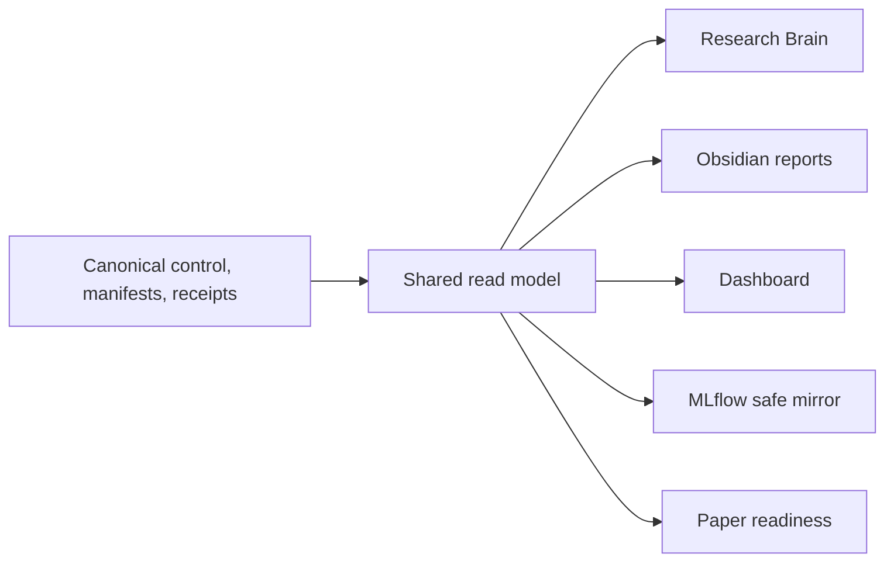

# ArmIndex Research Plan

`01_Research` is the canonical control plane for myIS Research protocol 1.0.
ArmIndex is the active campaign. The prior `scope-autoindex-v1` campaign and
its P0-P4 records are historical, hash-bound evidence and remain readable.

## Objective

ArmIndex studies whether executable representation programs should be
conditioned on the retriever and whether a deterministic multi-arm harness can
improve the quality-latency-cost frontier for structured-document retrieval.
It combines per-arm AutoIndex, cross-arm transfer analysis, complementarity
measurement, and production-constrained HarnessOpt.

## Active campaign

- Campaign: `armindex-multiretriever-v2`
- Current task: `A1.1_ADAPTER_FIXTURE_VALIDATION` (ready; synthetic/offline only)
- Current phase: `A1_BASELINES_AND_MULTI_ARM_SCREENING`
- Current evidence class: engineering scaffolding; scientific authority `false`
- ArmIndex measured runs: `0`
- Selection exposures: `0`
- Final exposures: `0`
- Migration spend: `$0`
- Owner gates: `D2_OPEN_FINAL` and `D3_SUBMIT_RELEASE` only

The canonical campaign record is
[`control/campaigns/armindex-multiretriever-v2.yaml`](control/campaigns/armindex-multiretriever-v2.yaml).
The detailed scientific plan is
[`docs/research/ARMINDEX_RESEARCH_PLAN_V02.md`](docs/research/ARMINDEX_RESEARCH_PLAN_V02.md).

## Retrieval arms

| Arm | Frozen model or engine | Role | Commercial status |
|---|---|---|---|
| `ARM-01` | `bm25s` | lexical anchor and CPU fallback | commercial-capable |
| `ARM-02` | `BAAI/bge-m3` | multilingual dense anchor | commercial-capable |
| `ARM-03` | `datalyes/patembed-large` | patent-specific research arm | research/non-commercial |
| `ARM-04` | `Snowflake/snowflake-arctic-embed-m-v2.0` | long-context dense arm | commercial-capable |
| `ARM-05` | `Qwen/Qwen3-Embedding-0.6B` | instruction-aware dense arm | commercial-capable |

Model weights remain frozen. Fine-tuning, adapters, distillation, continued
pretraining, learned prompts, and weight modification are outside the study.

## Metrics and decisions

The primary metric is OUT Recall@100. OUT nDCG@100 and OUT nDCG@10 are
secondary. Latency, throughput, charged cost, index size, RAM, and VRAM are
operational metrics. Development uses a frozen lexicographic comparison and
deterministic tie-breaks; no prose projection may become a numeric authority.

The research champion may use `ARM-03` inside its non-commercial license
boundary. A distinct commercial-capable champion excludes that arm. Production
profiles are `FAST`, `BALANCED`, and `DEEP`; all are pending measurement.

## Active phases

| Phase | Purpose | Migration state |
|---|---|---|
| `A0_MIGRATION_FOUNDATION` | authority, contracts, evidence preservation, projections, fixtures | complete |
| `A1_BASELINES_AND_MULTI_ARM_SCREENING` | baseline reproduction and five-arm common screening | ready for synthetic/offline A1.1 fixture only |
| `A2_PER_ARM_AUTOINDEX` | per-arm representation-program search | not started |
| `A3_TRANSFER_COMPLEMENTARITY_AND_HARNESSOPT` | transfer, complementarity, fixed unions, HarnessOpt | not started |
| `A4_PRODUCTION_TRANSFER_AND_SELECTION` | profiles, legal transfer, one-shot Selection | not started |
| `A5_FINAL_CONFIRMATION` | one frozen confirmation | locked by `D2_OPEN_FINAL` |
| `A6_PUBLICATION_AND_RELEASE` | paper and release | locked by `D3_SUBMIT_RELEASE` |

No Sprint, Stage, Work Package, or micro-phase is canonical.

### A0 task map

| Task | Purpose | Status |
|---|---|---|
| `A0.1` | Repository and evidence migration | complete |
| `A0.2` | Canonical authority and professional documentation | complete |
| `A0.3` | Brain, read-model, and Obsidian migration | complete |
| `A0.4` | MLflow and Dashboard migration | complete |
| `A0.5` | Phase, Research Flow, and Owner-gate migration | complete |
| `A0.6` | Scientific contracts and schemas | complete |
| `A0.7` | Model/arm declarations and license registry | complete |
| `A0.8` | Compute and storage feasibility fixtures | complete |
| `A0.9` | Validation, safety, and closeout | complete |
| `A0.10` | Legacy code harvest and phase-ready scaffolding | complete |

Task `A0.10` was a synthetic-only engineering task. It audited provenance,
built typed contracts and thin runnable scaffolding, and emitted aggregate-safe
receipts. It did not access protected benchmark state, start measured
retrieval, download model weights, use paid APIs or GPU scientific compute, or
open Selection or Final.

Task `A0.8` followed
[`control/runbooks/A0_8_COMPUTE_STORAGE_FEASIBILITY_FIXTURES.md`](control/runbooks/A0_8_COMPUTE_STORAGE_FEASIBILITY_FIXTURES.md).
It closed a CPU-only fixture scaffold for compute, Python memory, and
deterministic storage characterization. Task `A0.9` then validated the A0
controls, fixtures, projections, and safety boundary and emitted the hash-bound
phase closeout receipt. Existing App sparse indexes remain protected,
reference-only A1 assets and were not opened or used by A0.

## Historical evidence

P1 R0/R0-W measured evidence is preserved at its original paths and is not an
ArmIndex result. The SCOPE P2 fixture and runtime-resilience records remain
engineering evidence. SCOPE measured counters remain zero, Selection remains
unexposed, and Final-872 remains closed. Historical paths are never loaded as
current ArmIndex authority.

## Control and projection flow



## Safety boundary

Protected qrels, membership, query IDs, rankings, per-query outcomes, raw
provider payloads, and credentials stay Owner-local. Git and every projection
receive validated aggregates, hashes, counts, safe IDs, and pointers only.
The migration does not authorize measured retrieval, model download, GPU
scientific work, paid APIs, Selection, or Final.

## Canonical details

- Model selection: [`docs/research/MODEL_SELECTION_V02.md`](docs/research/MODEL_SELECTION_V02.md)
- AutoIndex/HarnessOpt contract: [`control/plans/ARMINDEX_AUTOINDEX_HARNESSOPT_CONTRACT.md`](control/plans/ARMINDEX_AUTOINDEX_HARNESSOPT_CONTRACT.md)
- Thai Owner runbook: [`docs/operations/OWNER_RUNBOOK_TH.md`](docs/operations/OWNER_RUNBOOK_TH.md)
- Evidence review: [`docs/research/DEEP_RESEARCH_EVIDENCE_V02.md`](docs/research/DEEP_RESEARCH_EVIDENCE_V02.md)
- Architecture: [`docs/architecture/ARCHITECTURE.md`](docs/architecture/ARCHITECTURE.md)
- Governance: [`docs/governance/DATA_AND_EVIDENCE_BOUNDARY.md`](docs/governance/DATA_AND_EVIDENCE_BOUNDARY.md)

## Next authorized action

```text
/goal Execute A1.1_ADAPTER_FIXTURE_VALIDATION from the canonical PLAN and control/campaigns/armindex-multiretriever-v2.yaml. Build and validate only synthetic/offline adapter fixtures on CPU. Do not access protected data, start measured retrieval, download model weights, use GPU or paid APIs, switch providers, open Selection, or open Final. Keep A1 measured screening closed until a separate execution contract authorizes it.
```

A1.1 may begin only as synthetic/offline adapter-fixture scaffolding. Measured
retrieval, model download, dense-arm execution, and A1.2 remain closed until a
separate A1 execution contract authorizes them.
