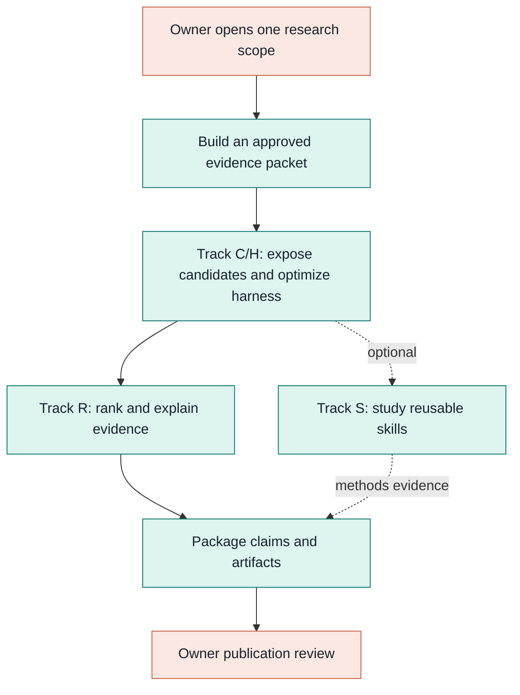
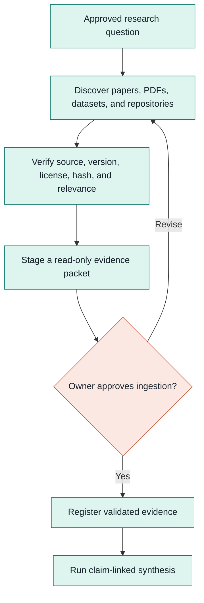
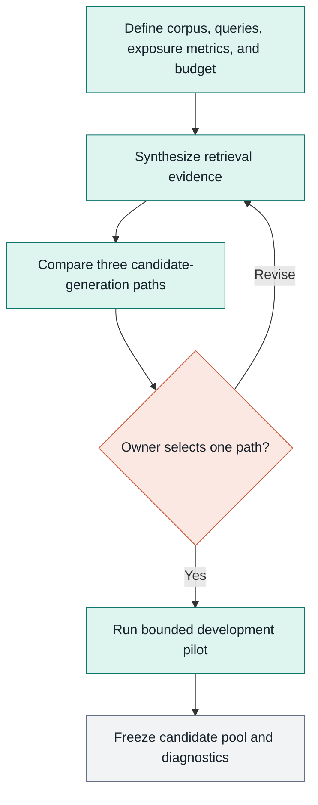
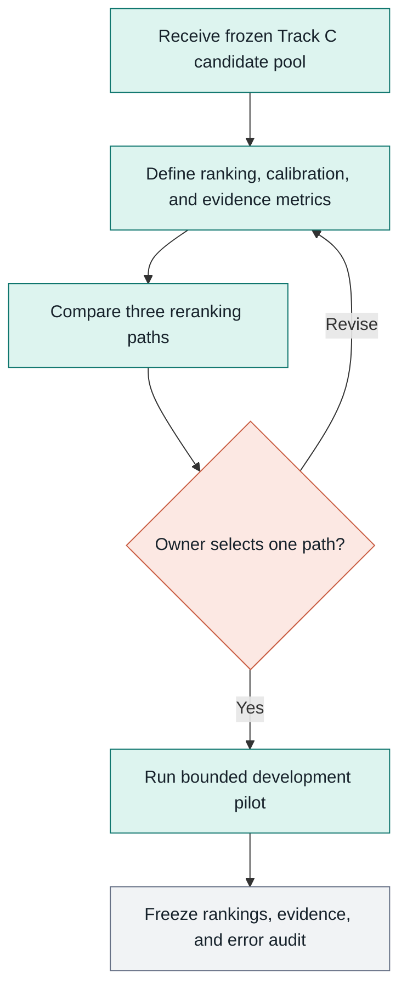
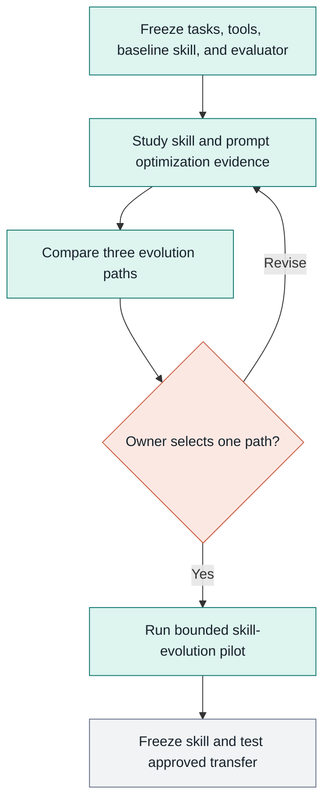
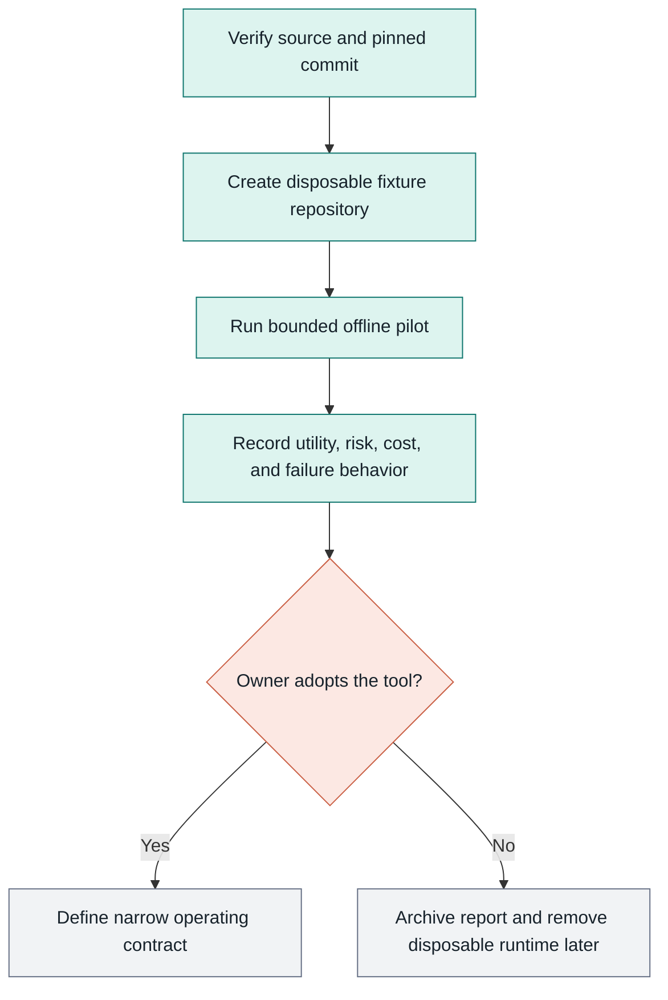

# myIS Research Execution Plan

This file is canonical execution authority. The Owner has opened restructure
closeout, full U041-U153 literature triage, offline HarnessOpt implementation,
local bootstrap checks and the notebook demo. Paid/API/GPU/Vast work,
scientific development runs, prospectively isolated confirmation access and
publication remain separate Owner gates in `00_governance/OWNER_GATES.md`.

## Program flow

Track C/H must freeze a defensible candidate pool and compare HarnessOpt against
the reproduced reference, fixed human harness and SkillOpt. Track R then ranks
the frozen pool. Track S is optional methods work and is not on the critical path.

<!-- mermaid-id: 01-01-program-flow -->

## Phase model

| Phase | Task | Output | Stop condition |
|---|---|---|---|
| 0. Scope | Declare one track, questions, budget, allowed sources, and protected splits | Signed scope and source protocol | Missing Owner approval |
| 1. Acquire | Search approved sources and register PDFs/web/history with provenance | Source inventory and immutable evidence packet | Source or license is unverified |
| 2. Synthesize | Run HyperResearch on the approved packet and map claims to sources | Evidence table, uncertainties, and gaps | Unsupported or conflicting claims |
| 3. Compare | Produce three paths with cost, risk, dependencies, and falsification tests | Ranked Top-3 path graph | Owner has not selected Top-1 |
| 4. Pilot | Implement only the selected path on permitted development data | Manifest, code, MLflow lineage, diagnostics | Any gate or ceiling fails |
| 5. Confirm | Freeze method and request one protected evaluation | Confirmatory evidence package | Held-out approval absent |
| 6. Publish | Audit claims, limitations, provenance, and reproducibility | Submission-ready artifact package | Owner publication approval absent |

## Evidence acquisition

Candidate sources include primary papers, official datasets and benchmarks,
official repositories, standards, web search, project history and high-quality
surveys used for discovery. PDFs are stored local-only in Research after hashes,
licenses, versions, aliases and relevance are recorded. Full U041-U153 triage is
open; U001-U040 imported bytes remain frozen.

<!-- mermaid-id: 01-02-evidence-acquisition -->

## Track C/H: candidate exposure and HarnessOpt

Goal: improve the recall and usefulness of the candidate pool under a fixed,
auditable budget by optimizing the governed workflow rather than model weights.
Compare reproduced DAPFAM, fixed human harness, SkillOpt v0.2.0 and HarnessOpt
with equal evaluator, split hashes, module pool, model roles and budgets.

<!-- mermaid-id: 01-03-track-c-candidate-exposure -->

Track C/H tasks: reproduce the reference, define deterministic 60/20/20 query
cohorts, implement four-arm comparability checks, optimize only HarnessPolicy on
train/selection, and freeze queries, corpus, policy and candidate IDs before one
R4 confirmation pass. HarnessOpt wins only if OUT NDCG@100 and OUT Recall@100
both exceed SkillOpt and the reproduced DAPFAM reference.

## Track R: ranking and evidence

Goal: rank only the frozen Track C pool and produce evidence that explains why
items should be reviewed. Initial questions cover cross-encoders, listwise and
late-interaction reranking, structure-aware evidence, calibration, and robust
transfer across domains.

<!-- mermaid-id: 01-04-track-r-ranking-evidence -->

Track R tasks: lock the C pool; define ranking/evidence endpoints and protected
splits; map recent reranking evidence; compare Top-3 methods; pilot one path;
freeze ranking, calibration, citations, and error taxonomy.

## Track S: skill evolution

Goal: optionally study whether a reusable procedural skill transfers across
research tasks after C/H is stable. SkillOpt is already the C/H baseline; this
track opens only for a distinct methods question and is not required before the
candidate-exposure publication.

<!-- mermaid-id: 01-05-track-s-skill-evolution -->

Track S tasks: define the S-on-C environment and leakage controls; select skill
quality, cost, stability, and transfer metrics; compare Top-3 evolution paths;
pilot one path; freeze the skill, optimizer lineage, and transfer protocol.

## Minimal tool decisions

| Capability | Decision | Reason |
|---|---|---|
| Evidence workflow | HyperResearch `v0.9.1` | One governed synthesis workflow; Claude executes it |
| Runtime events | structlog `26.1.0` | One redacted event to console and JSONL projections |
| Experiment lineage | MLflow `3.14.0` | Searchable mirror of parameters, metrics, artifacts and lineage |
| Human-readable memory | Obsidian Brain | One shared serial-writer control plane |
| Codex web search | Native `web_search = "live"` | No extra search MCP layer |
| Claude web search | `open-websearch@2.1.11` | Pinned STDIO search with DuckDuckGo/Bing only |
| Developer documentation | Context7 remote MCP | Focused current library/API documentation |
| Harness baseline | SkillOpt `v0.2.0` | Fixed baseline only; HarnessOpt must exceed it under matched controls |
| Deep research framework | Open Deep Research retired | Duplicates the selected HyperResearch workflow |
| Answer synthesis CLI | `pplx-cli` not adopted | Adds an API/service dependency without a unique role |
| Memory services | Experience Brain and `agentmemory` retired | One Brain avoids split truth and writer coordination |
| Process workflow | Loop Engineering pilot only | Evaluate in a disposable sandbox before adoption |
| Code review automation | Open Code Review pilot only | Evaluate evidence quality and overhead before adoption |

## Tool pilots

Loop Engineering `v1.6.0` and Open Code Review `v1.7.17` may be cloned at their
pinned release identities into `03_Workspaces/02_myIS-tool-pilots/`. Each pilot uses a
disposable fixture repository, no secrets, no App/Research/Brain write access,
and no network-dependent action after setup. Record setup cost, configuration
surface, output usefulness, failure behavior, and cleanup. Adoption requires an
Owner decision; the completed first pilot recommends no active adoption.

<!-- mermaid-id: 01-06-tool-pilot-gate -->

## Completion evidence

Every phase reports source versions, hashes, claim-to-source links, assumptions,
known gaps, commands, manifests, metrics, costs, and Owner decisions. Git stores
canonical text and code; MLflow stores run lineage; the Brain stores concise
status and decision pointers. No system may silently become a second source of
truth.
