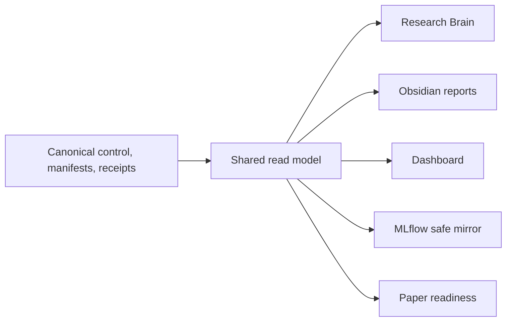

# ArmIndex Research Plan

`01_Research` is the canonical control plane for myIS Research protocol 1.0.
ArmIndex is the active campaign. The prior `scope-autoindex-v1` campaign and
its P0-P4 records are historical, hash-bound evidence and remain readable.

## Objective

ArmIndex studies whether executable representation programs should be
conditioned on the retriever and whether a deterministic multi-arm harness can
improve the quality-latency-cost frontier for structured-document retrieval.
It combines per-arm AutoIndex, cross-arm transfer analysis, complementarity
measurement, and production-constrained HarnessOpt.

## Active campaign

### Current superseding state (2026-08-19)

A2 Goal 004 is terminal: `PASS_A2_EXECUTION_CLOSEOUT` and
`PASS_A2_RESULT_INTEGRITY`. The complete frozen universe is `52 = 44 measured +
8 dormant`, with zero failures, safe return and worker reap passed, and USD
`54.52666666666665948` charged under the USD 60 hard stop. ARM-03, ARM-04, and
ARM-05 are the Owner-approved primary transfer inputs; ARM-01/02 are
diagnostic no-winner ties. ARM-03 is a presentation-precision tie to A1,
ARM-04 improves its frozen comparator, and ARM-05 is retained for transfer
analysis despite no strict A1 improvement.

The current phase `A3_TRANSFER_COMPLEMENTARITY_AND_HARNESSOPT` is terminal with
`PASS_A3_RESULT_INTEGRITY_AUDIT`. Stage `a3-goal003-20260818-028` completed the
exact 14-operation three-primary workload, including 9 transfer cells, 5 fixed
controls, complete Train-250 coverage, aggregate-safe return, and a flat
HarnessOpt boundary. The audit, safe-return, and HarnessOpt hashes are bound in
`control/armindex/a4/a4-readiness-binding-20260819.json`.

The next phase is `A4_PRODUCTION_TRANSFER_AND_SELECTION` in
`contract_only_ready` preparation. A4 measurement, Selection, and Final remain
closed pending a separate Owner-authorized goal. The Vast instance has no
remaining A3 workload; do not keep it for an unbound future run. This section supersedes historical
pre-authority/readiness narrative below, which remains provenance only.

- Campaign: `armindex-multiretriever-v2`
- Current task: `A2.1 / successor v3 pre-authority closeout` (`STOP_PREAUTHORITY_UNSAFE_REMOTE_ROOT`;
  `OFFICIAL_CODEX_BRIDGE_AND_CANDIDATE_FREEZE` is `CLOSED_PASS`, while A2
  candidate evaluation and measured execution are not started. Audit 006 passed
  fresh admission and isolated staging. IM 006 added the remote transport and
  real Owner-local manifest; IM 007 repairs the audit 007 attempt/bundle/authority
  provenance and durable per-candidate recovery blockers. AP audit 008 passed
  the final-r3 successor artifacts and created the separate measured authority
  and LO goal. LO 001 then stopped before launch on the cyclic bundle/authority
  Git equality. IM 008 adds the versioned non-cyclic provenance contract. AP
  audit 009 passed the successor bundle/adoption/transport chain and issued
  authority v2 plus the current LO goal; LO then stopped before candidate launch
  because v2 forbade the Owner-local evaluation required by the frozen reserve
  and winner lifecycle. IM 010 added the separate v3 local aggregate-evaluation
  closure; AP audit 011 created the clean successor bundle and Goal 003 for
  fresh provider admission/staging. Goal 003 then stopped before stage because
  its exact target root already existed; no measured execution occurred. Goal
  003's attempt identity and receipts remain closed lineage, but the Owner may
  authorize exact-root forensic recovery on instance `47782993` when a new
  attempt ID, new receipt chain, and new authority bind the continuation. A
  fresh Goal 004 is the recommended one-session continuation. The Owner has
  since destroyed the predecessor and supplied fresh instance `47790578`, so
  Goal 004 must use a new isolated attempt root there rather than forensic
  recovery of the predecessor root.
  The Owner approved an 84-hour total successor TTL and raised the current A2
  forward hard stop to USD 60; the USD 150 campaign ceiling, 40-hour initial
  floor, and deterministic 53,848-second reserve floor remain unchanged.)
- Current phase: `A2_PER_ARM_AUTOINDEX` (audit 003 implementation provides the
  production adapter and matched-first reserve lifecycle. The Owner chose to
  destroy instance `47411176` and provision a fresh instance. Audit 004 implementation
  completed the additive v2 provider binding, staging repairs and CPU-local deployment
  package. Audit 005 added the missing v2 envelope to the immutable bundle,
  appended the post-IM readiness successor, and made the current A2 disposition
  `FRESH_INSTANCE_REQUIRED` with reuse false. Fresh AP admission/staging now passes
  on instance `47700074`; IM 007 rebinds the final pushed-HEAD attempt and adds
  durable process identity, heartbeat, cancellation, reaping, and recovery.
  Goal 003 is now a closed pre-authority stop; measured execution remains closed
  until Goal 004 binds a new attempt, exact-root recovery or a clean replacement
  root, fresh provider evidence, and authority v3.)
- Current evidence class: pre-authority operational preparation for frozen A2;
  scientific authority `false` pending a future v3 authority
- Admissible completed ArmIndex measured runs: `1` (`r15`, `25/25`)
- Incomplete live attempts: `1` (`r13`, `24/25`; not promotable)
- Selection exposures: `0`
- Final exposures: `0`
- Recorded A1 measured charge: `$11.161632`
- Owner gates: `D2_OPEN_FINAL` and `D3_SUBMIT_RELEASE` only

The canonical campaign record is
[`control/campaigns/armindex-multiretriever-v2.yaml`](control/campaigns/armindex-multiretriever-v2.yaml).
The detailed scientific plan is
[`docs/research/ARMINDEX_RESEARCH_PLAN_V02.md`](docs/research/ARMINDEX_RESEARCH_PLAN_V02.md).

## Retrieval arms

| Arm | Frozen model or engine | Role | Commercial status |
|---|---|---|---|
| `ARM-01` | `bm25s` | lexical anchor and CPU fallback | commercial-capable |
| `ARM-02` | `BAAI/bge-m3` | multilingual dense anchor | commercial-capable |
| `ARM-03` | `datalyes/patembed-large` | patent-specific research arm | research/non-commercial |
| `ARM-04` | `Snowflake/snowflake-arctic-embed-m-v2.0` | long-context dense arm | commercial-capable |
| `ARM-05` | `Qwen/Qwen3-Embedding-0.6B` | instruction-aware dense arm | commercial-capable |

Model weights remain frozen. Fine-tuning, adapters, distillation, continued
pretraining, learned prompts, and weight modification are outside the study.

## Metrics and decisions

The primary metric is OUT Recall@100. OUT nDCG@100 and OUT nDCG@10 are
secondary. Latency, throughput, charged cost, index size, RAM, and VRAM are
operational metrics. Development uses a frozen lexicographic comparison and
deterministic tie-breaks; no prose projection may become a numeric authority.

The research champion may use `ARM-03` inside its non-commercial license
boundary. A distinct commercial-capable champion excludes that arm. Production
profiles are `FAST`, `BALANCED`, and `DEEP`; all are pending measurement.

## Active phases

There are exactly eight active phases. Progress is:

`A0 complete -> A1 complete -> A2 complete -> A3 complete -> A4 Selection closeout -> PAUSED after owner destroyed instance -> A5 -> A6 full-corpus materialization -> A7 publication`

| Phase | Purpose | Migration state |
|---|---|---|
| `A0_MIGRATION_FOUNDATION` | authority, contracts, evidence preservation, projections, fixtures | complete |
| `A1_BASELINES_AND_MULTI_ARM_SCREENING` | baseline reproduction and five-arm common screening | complete; A1.1 and A1.2 complete; r15 terminal PASS at 25/25 |
| `A2_PER_ARM_AUTOINDEX` | per-arm representation-program search | complete; Goal 004 measured closeout passed with three-primary amendment |
| `A3_TRANSFER_COMPLEMENTARITY_AND_HARNESSOPT` | transfer, complementarity, fixed unions, HarnessOpt | complete; 14/14 audited, flat HarnessOpt surface |
| `A4_PRODUCTION_TRANSFER_AND_SELECTION` | profiles, legal transfer, one-shot Selection | Selection-125 closeout PASS; safe-return complete; previous instance destroyed |
| `A5_FINAL_CONFIRMATION` | one frozen confirmation | provenance PASS and D2 preauthorized; PAUSED until fresh provider admission |
| `A6_FULL_DAPFAM_MATERIALIZATION_AND_SCALABILITY` | one A5-frozen winner over the full DAPFAM corpus; operational scalability only | pending `PASS_A5_FINAL_CONFIRMATION`; fresh A6 root required; D3 remains closed |
| `A7_PUBLICATION_AND_RELEASE` | paper and release from A0-A6 aggregate-safe evidence | locked by `D3_SUBMIT_RELEASE` |

No Sprint, Stage, Work Package, or micro-phase is canonical.

### A0 task map

| Task | Purpose | Status |
|---|---|---|
| `A0.1` | Repository and evidence migration | complete |
| `A0.2` | Canonical authority and professional documentation | complete |
| `A0.3` | Brain, read-model, and Obsidian migration | complete |
| `A0.4` | MLflow and Dashboard migration | complete |
| `A0.5` | Phase, Research Flow, and Owner-gate migration | complete |
| `A0.6` | Scientific contracts and schemas | complete |
| `A0.7` | Model/arm declarations and license registry | complete |
| `A0.8` | Compute and storage feasibility fixtures | complete |
| `A0.9` | Validation, safety, and closeout | complete |
| `A0.10` | Legacy code harvest and phase-ready scaffolding | complete |

Task `A0.10` was a synthetic-only engineering task. It audited provenance,
built typed contracts and thin runnable scaffolding, and emitted aggregate-safe
receipts. It did not access protected benchmark state, start measured
retrieval, download model weights, use paid APIs or GPU scientific compute, or
open Selection or Final.

Task `A0.8` followed
[`control/runbooks/A0_8_COMPUTE_STORAGE_FEASIBILITY_FIXTURES.md`](control/runbooks/A0_8_COMPUTE_STORAGE_FEASIBILITY_FIXTURES.md).
It closed a CPU-only fixture scaffold for compute, Python memory, and
deterministic storage characterization. Task `A0.9` then validated the A0
controls, fixtures, projections, and safety boundary and emitted the hash-bound
phase closeout receipt. Existing App sparse indexes remain protected,
reference-only A1 assets and were not opened or used by A0.

### A1 task map

| Task | Purpose | Status |
|---|---|---|
| `A1.1` | Validate five adapter declarations and run the ARM-01 synthetic CPU path | complete |
| `A1.2` | Reproduce baselines and run the common five-arm screen | complete; r15 terminal PASS at 25/25; provider disposition REUSE_ELIGIBLE |

Task `A1.1` completed the synthetic compile-index-search-evaluate path for
`ARM-01` on CPU using the repository-local Okapi BM25 fixture backend. All five
arms were declared, `ARM-02` through `ARM-05` failed closed before model or
network access, and measured, candidate, Selection, Final, GPU, paid-API, and
model-download counters remained zero. This is engineering fixture evidence;
it did not establish parity with the future locked `bm25s` measured adapter or
support a retrieval-quality claim. The subsequent A1.2 scaffold added
`bm25s==0.3.10` and validated exact synthetic CPU rank-order parity against the
repository Okapi reference. That parity receipt remains engineering fixture
evidence and is not a retrieval-quality result.

The versioned A1.2 execution envelope, hash-bound budget, five source locks,
launch checklist, two-layer shutdown plan, execution contract, receipt, and
append-only ledger are now validated. `ARM-01` is frozen for local CPU use with
exactly USD 0 GPU budget. Public revisions and critical commitments are frozen
for `ARM-02` through `ARM-05`, but all four dense arms remain
`metadata_frozen_owner_artifacts_pending` until complete Owner-local
`SHA256SUMS` manifests and adapter parity checks pass. Exact source revisions
and public commitments are documented in
[`docs/research/A1_2_MODEL_SOURCE_LOCKS.md`](docs/research/A1_2_MODEL_SOURCE_LOCKS.md).

The preserved A1.2 v1 non-authorizing planning proposal uses one 24 GiB GPU, preferably RTX
4090, RTX 3090, L4, or A10; A100/H100 is not required. The planning estimate is
8-16 GPU hours plus 2-4 local validation hours, or 10-20 hours end to end. At
USD 0.30-0.80 per GPU-hour, raw GPU compute is estimated at USD 2.40-12.80.
Hard stops remain USD 5 for parity/pilot, USD 18 for the common screen, USD 23
for A1, and USD 100 for the campaign. These values are planning assumptions,
not authorization or measured evidence. It remains historical and was not adopted.

The CPU-only Owner-local preflight runner was executed on 2026-08-06. Canonical
contract bindings passed, but the receipt is `blocked_owner_input` because the
four dense-arm `SHA256SUMS` manifests, Snowflake remote-code byte hashes, Qwen
measured maximum length, adapter parity, storage, live quote/provider identity,
and external termination/TTL evidence were not supplied in the Owner-local
staging root. The preflight and MLflow-safe projection are aggregate-only;
measured counters, GPU reservations, protected access, and charged cost remain
zero. MLflow receives only the safe projection and a hash pointer to the
canonical receipt.

The additive `a1.2-local-vast-4x3090-v2` revision now prepares one disposable
Vast SSH worker with four RTX 3090 GPUs. Codex remains the only canonical writer
on the local machine; `ARM-01` remains local CPU, while `ARM-02` through
`ARM-05` are mapped to devices 0 through 3 with one dense arm per GPU. The
offline synthetic orchestration passed four of four worker processes with no
failures. The migration receipt SHA-256 is
`869b6feac387c069f3f53ec49cc3ebf42159cf750d3e23acb0d57ead622ca600`;
the synthetic receipt self-hash is
`4c8e22e76308178bfe5909fea434b7db06f3b80f6f6615f3f5f74ccec598a6c7`.
This evidence has no retrieval-quality authority, and all measured, GPU,
charged-resource, Selection, and Final counters remain zero.

The Owner planning rate is USD 0.60 per hour for the complete four-RTX3090
instance, not per GPU. The parallel dense preflight estimate is 2-4 instance
hours, or USD 1.20-2.40 raw worker cost, plus 2-4 local hours. The unchanged
hard stops are USD 18 for the common screen, USD 23 for A1, and USD 100 for the
campaign. A current provider quote must fit the remaining limits or the live
preflight stops `BLOCKED_BUDGET`.

The aggregate-safe A1.2 v2 closeout audit passed 18 validation groups,
including 428 repository tests, 19 focused A1.2 tests, report and safety scans,
Dashboard/API checks, the repository-safe MLflow doctor, assets, layout,
session audit, Brain literature validation, scoped Ruff, PowerShell parsing,
and deterministic projection sync/check cycles. The audit self-hash is
`fe2e2b48324e18d7de1a50413831462f942222a11cfdf4bda9f53a35421a2646`.
These counts describe engineering validation only and do not change any
scientific or charged-resource counter.

The first clean post-commit v2 validation exposed a bounded engineering defect:
the v2 validator regenerated one expected input from the new `HEAD/tree`, even
though the immutable v2 input correctly retained its preparation provenance.
No v2 byte was changed. Additive revision
`a1.2-local-vast-4x3090-postcommit-v3` validates the preserved v2 bytes through
receipt self-hash `869b6feac387c069f3f53ec49cc3ebf42159cf750d3e23acb0d57ead622ca600`
and captures the clean current commit and tree only when the frozen bundle is
built. The v3 correction receipt self-hash is
`75379b2f33b85549036135cf6c7cc1b06c479b6fe5a1643c08a88501fefdc8ca`.
It keeps `launch_allowed=false`, `adopted_for_execution=false`, and all
measured and resource counters at zero.

The first report check after the projection-only closeout commit exposed a
second bounded engineering defect: runtime validator commit/tree values had
been copied into generated A1.2 state, so an evidence-neutral commit changed
the shared read-model revision. Repair commit `4b5194e` preserves the runtime
validator output but excludes those volatile values from projections. A
regression test changes both identities and confirms an unchanged read-model
revision and file hash. The additive repair audit is
`outputs/audits/rigor/a1.2-v3-projection-stability-repair-20260806.json`.

The Owner-local v5 stage then completed all four runtime-minimal dense model
trees: 48 of 48 allowlisted files passed deterministic SHA-256 validation,
with 6,119,853,855 runtime bytes staged outside Git. The Snowflake custom-code
files, Linux wheelhouse, safe jobs, transfer checksums, and return directory
also passed. These are engineering staging facts only; dense CPU load was
intentionally skipped and GPU parity, Qwen measured length, VRAM feasibility,
four-worker recovery, provider identity, and destruction/TTL proof remained
live obligations.

The direct Vast container subsequently exposed the selected linux/amd64 image
runtime with Python 3.11.11, PyTorch 2.6.0+cu118, CUDA 11.8 available, and four
RTX 3090 devices. No dense adapter check or measured retrieval began. The first
v6 verification stopped because the initial wheelhouse lacked `pydantic`; the
supplement repair then stopped because an import created `__pycache__` in the
frozen tree. Both failures are preserved. Additive v7 uses a fresh remote root,
disables Python bytecode writes, revalidates the already staged model,
wheelhouse, job, and supplement trees, and uploads only a new frozen code
bundle. Launch and adoption remain false and scientific counters remain zero.
The v7 verifier then stopped before model or GPU work because the frozen bundle
did not include a historical v1 receipt required by the transitive validation
chain. Additive v8 preserves that failed root and adds only the exact 55-file
repository-safe validation lineage. It validates commit and tree from the
self-hashed frozen bundle rather than shipping `.git`, validates archive paths
before extraction, and requires a bound PASS marker before synthetic launch.

Independent review of the v8 launch path then found unsafe lifecycle behavior:
failed children could outlive a sibling, checkpoints could precede durable
work, status relied on stale files, Qwen bypassed the frozen adapter path, and
collection/teardown were not end-to-end attempt-bound. Additive v9 preserves
v1-v8 and binds a fresh `/opt/myis/a1.2-v9` root, immutable attempt IDs,
PID/start-time identities, fresh heartbeats, sibling cancellation and reaping,
post-work checkpoints, `SentenceTransformer.encode` Qwen measurement,
same-attempt PASS export, member-hash validation, and verified guest-process
cleanup. Attempt `a12-v9-20260807-06` passed all four dense adapter checks,
measured Qwen adapter capacity at 32,768 tokens for the frozen single-RTX3090
configuration, passed checkpoint/resume and expected-failure handling, returned
a 72-member hash-validated safe export, and completed verified guest-process
teardown. Additive v10 preserves the v9 result unchanged and records the later
Owner confirmation that Vast instance `47023328` was destroyed. A sanitized
post-confirmation endpoint probe observed `connection_refused`. This closes the
provider disposition under an explicit claim boundary: no independent Vast API
or CLI destruction record was obtained. This is engineering and Owner-local
closeout evidence only and supports no retrieval-quality or publication claim.

Additive v11 preserves v1-v10 and prepares a future A1.2 scientific execution
request on local CPU only. It freezes five executable common representation
programs, five arm workloads, 25 mandatory logical program-arm results, 35
physical program-view paths, a 150-query REP-DEV commitment with 100 Train-250
queries reserved for HARNESS-DEV, an opaque scientific-transfer and safe-return
protocol, aggregate result and resource receipts, all-fee quote admission, and
fail-closed stop conditions. The repaired package passed its artifact-only rigor
review. It is not adopted, does not authorize provider contact or measured
retrieval, and leaves every scientific, Selection, Final, paid-API, model-change,
and charged-resource counter at zero.

Additive v12-r3 preserves v11 unchanged and validates the local adoption-input
interface only. Its deterministic frozen bundle binds the v13 publication
preregistration and disposition policy, while the protected handoff, transfer,
compiler, provider, budget, and admission receipts remain outside the repository
and pending Owner-local completion. V13 declares OUT Recall@100 the primary
development candidate-exposure outcome, OUT nDCG@100 and OUT nDCG@10 secondary,
and no publication claim before confirmation. The v13 instance policy currently
reports `NO_LIVE_INSTANCE` with `PENDING_LIVE_PROVIDER`; no provider was
contacted, no adoption occurred, and all measured and charged-resource counters
remain zero.

The Owner-authorized additive `P02-FIRST-CLAIM` repair preserves the original
v11 P02 definition as immutable lineage and does not infer dependency or
independence. It deterministically selects the first parsed `claims_text`
segment, passes REP-DEV availability 150/150 and corpus availability
45,336/45,336 with zero parse failures and no alternate-field fallback. A
subsequent bounded offline input-limit audit proved a separate unchanged-v11
contract defect: `ARM-03--P00-TAC-DOC` renders 971 tokens against PatEmbed's
frozen 512-token limit. The Owner then froze one additive dense-overflow
composition policy: contiguous zero-overlap physical windows, exact source-token
coverage, unchanged arm adapters, and source-token-count-weighted mean
recomposition. Aggregate inventory/composition evidence passes, with no
truncation, partial-screen promotion, provider contact, or retrieval. Additive
protected compiler v15 consumes the frozen physical-window plans, binds the
source-token-count-weighted recomposition contract, and validates all 25/25
bindings with deterministic replay, effective-limit compliance, zero silent
truncation, and linked protected handoff/transfer/compiler receipts. The clean
pushed execution bundle, pre-adoption anchor, aggregate whole-workload budget
model, synthetic watchdog/provider-destroy dry-run, and final local adoption-input
receipt now pass. Fresh provider identity, all-fee quote, live whole-workload
budget admission, provider admission, and measured execution remain pending.

All registered Phase and Task reports are generated in detailed English from
one validated read model using the canonical fifteen-section contract.
Historical reports remain at their expected paths while referenced. A report
may move to the generated archive only when it is explicitly superseded,
unreferenced, checksum-validated, and retained with a supersession pointer.
The current archive audit found zero eligible generated reports; historical
SCOPE/P1/P2 reports remain in place because the read model, validators,
generated manifest, or artifact graph still reference them.

## Historical evidence

P1 R0/R0-W measured evidence is preserved at its original paths and is not an
ArmIndex result. The SCOPE P2 fixture and runtime-resilience records remain
engineering evidence. SCOPE measured counters remain zero, Selection remains
unexposed, and Final-872 remains closed. Historical paths are never loaded as
current ArmIndex authority.

## Control and projection flow



## Safety boundary

Protected qrels, membership, query IDs, rankings, per-query outcomes, raw
provider payloads, and access material stay Owner-local. Git and every projection
receive validated aggregates, hashes, counts, safe IDs, and pointers only.
The completed A1 evidence does not authorize A2 measured retrieval by itself.
A2 must pass its own entry preflight, fresh provider admission, and execution
adoption under a new attempt. Goal 004 may use an exact root only after
Owner-authorized forensic recovery proves it is worker-free and safely cleared;
otherwise it must use a replacement root. Runtime model download, paid APIs,
unapproved provider fallback, HARNESS-DEV, Selection, and Final remain forbidden.

## Canonical details

- Model selection: [`docs/research/MODEL_SELECTION_V02.md`](docs/research/MODEL_SELECTION_V02.md)
- AutoIndex/HarnessOpt contract: [`control/plans/ARMINDEX_AUTOINDEX_HARNESSOPT_CONTRACT.md`](control/plans/ARMINDEX_AUTOINDEX_HARNESSOPT_CONTRACT.md)
- Thai Owner runbook: [`docs/operations/OWNER_RUNBOOK_TH.md`](docs/operations/OWNER_RUNBOOK_TH.md)
- Evidence review: [`docs/research/DEEP_RESEARCH_EVIDENCE_V02.md`](docs/research/DEEP_RESEARCH_EVIDENCE_V02.md)
- Architecture: [`docs/architecture/ARCHITECTURE.md`](docs/architecture/ARCHITECTURE.md)
- Governance: [`docs/governance/DATA_AND_EVIDENCE_BOUNDARY.md`](docs/governance/DATA_AND_EVIDENCE_BOUNDARY.md)

## Next authorized action

```text
LO reads `docs/goal/A2_PER_ARM_AUTOINDEX_goal_004.md` and executes the one-session
recovery, fresh binding/admission, isolated stage, v3 authority, measured A2,
safe return, evidence audit, and post-closeout publication-figure workflow.
Candidate mutation, A3, Selection, and Final remain closed.
```

The r13 audit remains historical failed-attempt evidence and cannot be combined
with r15. The current pointer binds the complete r15 terminal receipt, measured
summary, EDA package, and `REUSE_ELIGIBLE` provider continuation. The Official
Codex bridge and five-arm candidate freeze are closed `PASS`, and the independent
audit found zero findings. IM commits `4a2ba332`, `fde25fa4`, and `1eb6e8c7`
close audit 002 by binding admission to source artifacts, deriving remaining
TTL from a fresh absolute deadline, and requiring a pinned-SSH live probe of
runtime, model, data, GPU/process, root, and host-key identity before adoption.
AP reran the focused A2 suite (`44 passed`), Ruff, entry preflight, synthetic
dry-run, asset validation, report drift, and whitespace validation; all passed
with measured authority still `false`. The current-HEAD clean bundle SHA-256 is
`428f636bccfe612f1e555b8d21edca9489371404a6964d018060c7f2e723e82b` and its
receipt self-hash is
`afef74f5d808e057a2414f46e5acef76129605b7ab2b5078256c2cabedec1bfd`.
Owner approved 48 hours remaining under the unchanged USD 35 A2 forward hard
stop. At the last observed USD 0.6027777778/hour compute-plus-storage rate plus
the USD 0.30 network reserve, the projected 48-hour liability is USD 29.2333.
Owner also authorized AP to bypass IM for admission/staging. Audit 003 IM now
closes the two structural blockers with a repository-owned production adapter
for every frozen A2 program and a decision-bound matched-first reserve lifecycle.
The tracked command, Owner-local input schema, resume path, fresh reserve admission,
decision/continuation receipts, and exact-52 quartet validation are bundle-bound.
The hardened adapter also binds canonical A1 v16 incumbents, REP-DEV handoff
commitments, exact dense-model file manifests, frozen Python/PyTorch/CUDA identity,
and the four-GPU device map. The reserve checkpoint uses a concrete `reserve-admit`
command that rebuilds provider evidence from fresh source artifacts and an absolute
deadline. Focused audit validation passes 64 tests, Ruff, isolated bundle
extraction/import, A2 entry preflight, the 52-candidate synthetic dry-run, asset
validation, report drift, and whitespace checks.
AP audit 004 then assigned the old instance `DESTROY_REQUIRED`: A1 r15 remains
terminal `25/25 PASS`, live A1/A2/GPU worker counts are zero, and all required
deployment assets already have local hash-matched copies. The four model roots
validate `12/12` declared files each; the Linux wheelhouse validates `14/14`.
No further remote pull is required before the Owner destroys instance `47411176`.
The A2 entry preflight still exposes the historical A1 `REUSE_ELIGIBLE` field;
that field is not fresh A2 admission and does not override the Owner route.
Audit 004 implementation now preserves v1 history while adding a runtime-supplied
v2 binding chain through admission, live probe, stage and adoption. Remote TTL is
derived from observation time while the post-probe local clock independently
enforces the 40-hour floor with a 60-second skew bound. The CPU-local deployment
package revalidates four 12-file model manifests, the 14-file Linux wheelhouse,
A1 safe return/handoffs/runtime/frozen bundle, and the final A2 bundle while
containing metadata and hashes only. Provider admission, execution adoption,
measured A2, and protected-data access remain unstarted.
Audit 005 implementation closes the remaining canonical ambiguity. The immutable
A2 execution bundle now requires both historical v1 and current v2 readiness
envelopes plus all three append-only ledger schemas. Successor `A2EXEC-EV0005`
records `READY_FOR_AP_FRESH_INSTANCE_STAGING_MEASUREMENT_LOCKED`; A1
`REUSE_ELIGIBLE` remains lineage only, while the current A2 disposition is
`FRESH_INSTANCE_REQUIRED` and reuse is false. No provider contact, provisioning,
remote staging, measured execution, or protected-data access occurred.
Publication claims remain limited to freeze integrity, reproducibility, provider
lifecycle, and readiness until measured receipts and safe return exist.

Audit 006 then validated pushed HEAD `daf124ace981e070d012cca6d8c0feaed607d41a`,
fresh Vast instance `47700074`, the USD `27.939255` all-fee quote, complete remote
asset hashes, and isolated root `/opt/myis/a2-im-audit005-final`. Provider admission,
live probe, remote stage, watchdog, genesis checkpoint, and execution adoption all
pass with zero GPU/A2 workers and `measured_a2_started=false`; ledger successor
`A2EXEC-EV0006` records `EXTERNAL_EXECUTION_REQUESTED_NOT_LAUNCHED`. AP did not
create measured authority because the canonical `execute` path still launches a
local subprocess while CUDA/models are remote, the staged extraction has no Git
authority-provenance surface, and no real Owner-local measured input manifest exists.
The reserve checkpoint also incorrectly reuses the 40-hour initial-admission floor
after the projected 17.92-hour matched critical path; the frozen runtime projection
and six-hour reserve imply about 14.95 hours for unfinished reserve work. These
launch-critical engineering gaps route to IM without changing candidate, metric,
budget ceiling, or scientific design.

Audit 007 reviewed IM 006 at pushed HEAD `be9db975ee0b9045520eaf4f85dfe43903dda643`.
The bundle, Owner-local input manifest, and fresh non-measured transport check
are valid, but attempt IDs differ across adoption/transport/manifest, adoption
still binds the older bundle, canonical measurement-authority equality is not
enforced, and remote per-candidate process/heartbeat recovery is incomplete.
Owner approved a 60-hour total TTL for instance `47700074`; the projected
aggregate envelope remains about USD 34.85 including the existing USD 0.30
network reserve and below the unchanged USD 35 hard stop. Audit 008 passed
IM 007 final-r3, created the current measured authority and LO goal, and routes
to one explicit LO session.

After LO 001 stopped prelaunch, the Owner first expanded the successor A2
task/run hard stop from USD 35 to USD 45. The current Owner authorization
supersedes that current successor ceiling with USD 60 and an 84-hour total TTL.
This does not rewrite the historical final-r3 admission or change the USD 150
campaign ceiling, 40-hour initial floor, or deterministic 53,848-second
reserve floor.
