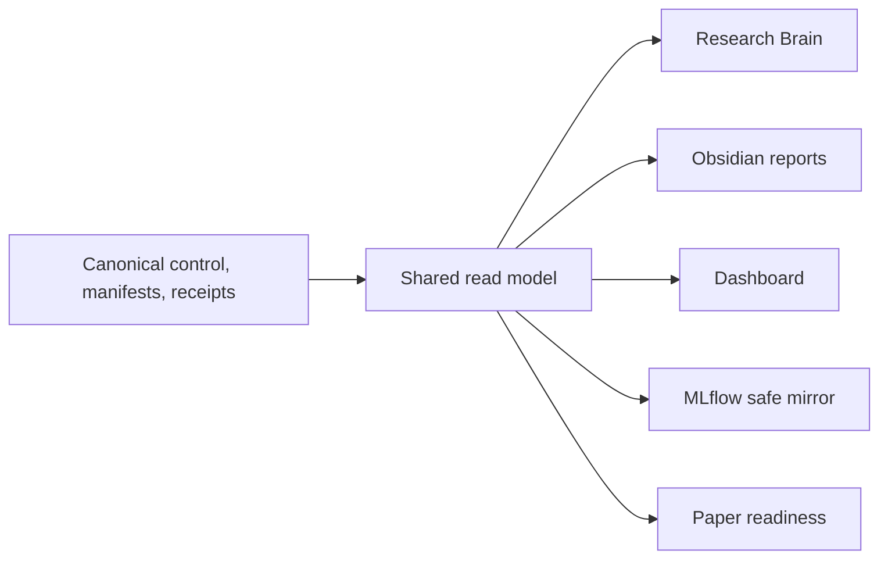

# ArmIndex Research Plan

`01_Research` is the canonical control plane for myIS Research protocol 1.0.
ArmIndex is the active campaign. The prior `scope-autoindex-v1` campaign and
its P0-P4 records are historical, hash-bound evidence and remain readable.

## Objective

ArmIndex studies whether executable representation programs should be
conditioned on the retriever and whether a deterministic multi-arm harness can
improve the quality-latency-cost frontier for structured-document retrieval.
It combines per-arm AutoIndex, cross-arm transfer analysis, complementarity
measurement, and production-constrained HarnessOpt.

## Active campaign

- Campaign: `armindex-multiretriever-v2`
- Current task: `A1.2_COMMON_MULTI_ARM_SCREENING` (additive local-orchestrated
  Vast 4xRTX3090 preflight revision prepared; live Owner preflight and
  scientific launch remain locked)
- Current phase: `A1_BASELINES_AND_MULTI_ARM_SCREENING`
- Current evidence class: engineering preflight scaffold; scientific authority `false`
- ArmIndex measured runs: `0`
- Selection exposures: `0`
- Final exposures: `0`
- Migration spend: `$0`
- Owner gates: `D2_OPEN_FINAL` and `D3_SUBMIT_RELEASE` only

The canonical campaign record is
[`control/campaigns/armindex-multiretriever-v2.yaml`](control/campaigns/armindex-multiretriever-v2.yaml).
The detailed scientific plan is
[`docs/research/ARMINDEX_RESEARCH_PLAN_V02.md`](docs/research/ARMINDEX_RESEARCH_PLAN_V02.md).

## Retrieval arms

| Arm | Frozen model or engine | Role | Commercial status |
|---|---|---|---|
| `ARM-01` | `bm25s` | lexical anchor and CPU fallback | commercial-capable |
| `ARM-02` | `BAAI/bge-m3` | multilingual dense anchor | commercial-capable |
| `ARM-03` | `datalyes/patembed-large` | patent-specific research arm | research/non-commercial |
| `ARM-04` | `Snowflake/snowflake-arctic-embed-m-v2.0` | long-context dense arm | commercial-capable |
| `ARM-05` | `Qwen/Qwen3-Embedding-0.6B` | instruction-aware dense arm | commercial-capable |

Model weights remain frozen. Fine-tuning, adapters, distillation, continued
pretraining, learned prompts, and weight modification are outside the study.

## Metrics and decisions

The primary metric is OUT Recall@100. OUT nDCG@100 and OUT nDCG@10 are
secondary. Latency, throughput, charged cost, index size, RAM, and VRAM are
operational metrics. Development uses a frozen lexicographic comparison and
deterministic tie-breaks; no prose projection may become a numeric authority.

The research champion may use `ARM-03` inside its non-commercial license
boundary. A distinct commercial-capable champion excludes that arm. Production
profiles are `FAST`, `BALANCED`, and `DEEP`; all are pending measurement.

## Active phases

| Phase | Purpose | Migration state |
|---|---|---|
| `A0_MIGRATION_FOUNDATION` | authority, contracts, evidence preservation, projections, fixtures | complete |
| `A1_BASELINES_AND_MULTI_ARM_SCREENING` | baseline reproduction and five-arm common screening | A1.1 complete; A1.2 four-GPU preflight prepared and launch-locked |
| `A2_PER_ARM_AUTOINDEX` | per-arm representation-program search | not started |
| `A3_TRANSFER_COMPLEMENTARITY_AND_HARNESSOPT` | transfer, complementarity, fixed unions, HarnessOpt | not started |
| `A4_PRODUCTION_TRANSFER_AND_SELECTION` | profiles, legal transfer, one-shot Selection | not started |
| `A5_FINAL_CONFIRMATION` | one frozen confirmation | locked by `D2_OPEN_FINAL` |
| `A6_PUBLICATION_AND_RELEASE` | paper and release | locked by `D3_SUBMIT_RELEASE` |

No Sprint, Stage, Work Package, or micro-phase is canonical.

### A0 task map

| Task | Purpose | Status |
|---|---|---|
| `A0.1` | Repository and evidence migration | complete |
| `A0.2` | Canonical authority and professional documentation | complete |
| `A0.3` | Brain, read-model, and Obsidian migration | complete |
| `A0.4` | MLflow and Dashboard migration | complete |
| `A0.5` | Phase, Research Flow, and Owner-gate migration | complete |
| `A0.6` | Scientific contracts and schemas | complete |
| `A0.7` | Model/arm declarations and license registry | complete |
| `A0.8` | Compute and storage feasibility fixtures | complete |
| `A0.9` | Validation, safety, and closeout | complete |
| `A0.10` | Legacy code harvest and phase-ready scaffolding | complete |

Task `A0.10` was a synthetic-only engineering task. It audited provenance,
built typed contracts and thin runnable scaffolding, and emitted aggregate-safe
receipts. It did not access protected benchmark state, start measured
retrieval, download model weights, use paid APIs or GPU scientific compute, or
open Selection or Final.

Task `A0.8` followed
[`control/runbooks/A0_8_COMPUTE_STORAGE_FEASIBILITY_FIXTURES.md`](control/runbooks/A0_8_COMPUTE_STORAGE_FEASIBILITY_FIXTURES.md).
It closed a CPU-only fixture scaffold for compute, Python memory, and
deterministic storage characterization. Task `A0.9` then validated the A0
controls, fixtures, projections, and safety boundary and emitted the hash-bound
phase closeout receipt. Existing App sparse indexes remain protected,
reference-only A1 assets and were not opened or used by A0.

### A1 task map

| Task | Purpose | Status |
|---|---|---|
| `A1.1` | Validate five adapter declarations and run the ARM-01 synthetic CPU path | complete |
| `A1.2` | Reproduce baselines and run the common five-arm screen | Vast 4xRTX3090 preflight prepared; live preflight and measured screen launch-locked |

Task `A1.1` completed the synthetic compile-index-search-evaluate path for
`ARM-01` on CPU using the repository-local Okapi BM25 fixture backend. All five
arms were declared, `ARM-02` through `ARM-05` failed closed before model or
network access, and measured, candidate, Selection, Final, GPU, paid-API, and
model-download counters remained zero. This is engineering fixture evidence;
it did not establish parity with the future locked `bm25s` measured adapter or
support a retrieval-quality claim. The subsequent A1.2 scaffold added
`bm25s==0.3.10` and validated exact synthetic CPU rank-order parity against the
repository Okapi reference. That parity receipt remains engineering fixture
evidence and is not a retrieval-quality result.

The versioned A1.2 execution envelope, hash-bound budget, five source locks,
launch checklist, two-layer shutdown plan, execution contract, receipt, and
append-only ledger are now validated. `ARM-01` is frozen for local CPU use with
exactly USD 0 GPU budget. Public revisions and critical commitments are frozen
for `ARM-02` through `ARM-05`, but all four dense arms remain
`metadata_frozen_owner_artifacts_pending` until complete Owner-local
`SHA256SUMS` manifests and adapter parity checks pass. Exact source revisions
and public commitments are documented in
[`docs/research/A1_2_MODEL_SOURCE_LOCKS.md`](docs/research/A1_2_MODEL_SOURCE_LOCKS.md).

The preserved A1.2 v1 non-authorizing planning proposal uses one 24 GiB GPU, preferably RTX
4090, RTX 3090, L4, or A10; A100/H100 is not required. The planning estimate is
8-16 GPU hours plus 2-4 local validation hours, or 10-20 hours end to end. At
USD 0.30-0.80 per GPU-hour, raw GPU compute is estimated at USD 2.40-12.80.
Hard stops remain USD 5 for parity/pilot, USD 18 for the common screen, USD 23
for A1, and USD 100 for the campaign. These values are planning assumptions,
not authorization or measured evidence. It remains historical and was not adopted.

The CPU-only Owner-local preflight runner was executed on 2026-08-06. Canonical
contract bindings passed, but the receipt is `blocked_owner_input` because the
four dense-arm `SHA256SUMS` manifests, Snowflake remote-code byte hashes, Qwen
measured maximum length, adapter parity, storage, live quote/provider identity,
and external termination/TTL evidence were not supplied in the Owner-local
staging root. The preflight and MLflow-safe projection are aggregate-only;
measured counters, GPU reservations, protected access, and charged cost remain
zero. MLflow receives only the safe projection and a hash pointer to the
canonical receipt.

The additive `a1.2-local-vast-4x3090-v2` revision now prepares one disposable
Vast SSH worker with four RTX 3090 GPUs. Codex remains the only canonical writer
on the local machine; `ARM-01` remains local CPU, while `ARM-02` through
`ARM-05` are mapped to devices 0 through 3 with one dense arm per GPU. The
offline synthetic orchestration passed four of four worker processes with no
failures. The migration receipt SHA-256 is
`869b6feac387c069f3f53ec49cc3ebf42159cf750d3e23acb0d57ead622ca600`;
the synthetic receipt self-hash is
`4c8e22e76308178bfe5909fea434b7db06f3b80f6f6615f3f5f74ccec598a6c7`.
This evidence has no retrieval-quality authority, and all measured, GPU,
charged-resource, Selection, and Final counters remain zero.

The Owner planning rate is USD 0.60 per hour for the complete four-RTX3090
instance, not per GPU. The parallel dense preflight estimate is 2-4 instance
hours, or USD 1.20-2.40 raw worker cost, plus 2-4 local hours. The unchanged
hard stops are USD 18 for the common screen, USD 23 for A1, and USD 100 for the
campaign. A current provider quote must fit the remaining limits or the live
preflight stops `BLOCKED_BUDGET`.

The aggregate-safe A1.2 v2 closeout audit passed 18 validation groups,
including 428 repository tests, 19 focused A1.2 tests, report and safety scans,
Dashboard/API checks, the repository-safe MLflow doctor, assets, layout,
session audit, Brain literature validation, scoped Ruff, PowerShell parsing,
and deterministic projection sync/check cycles. The audit self-hash is
`fe2e2b48324e18d7de1a50413831462f942222a11cfdf4bda9f53a35421a2646`.
These counts describe engineering validation only and do not change any
scientific or charged-resource counter.

All registered Phase and Task reports are generated in detailed English from
one validated read model using the canonical fifteen-section contract.
Historical reports remain at their expected paths while referenced. A report
may move to the generated archive only when it is explicitly superseded,
unreferenced, checksum-validated, and retained with a supersession pointer.
The current archive audit found zero eligible generated reports; historical
SCOPE/P1/P2 reports remain in place because the read model, validators,
generated manifest, or artifact graph still reference them.

## Historical evidence

P1 R0/R0-W measured evidence is preserved at its original paths and is not an
ArmIndex result. The SCOPE P2 fixture and runtime-resilience records remain
engineering evidence. SCOPE measured counters remain zero, Selection remains
unexposed, and Final-872 remains closed. Historical paths are never loaded as
current ArmIndex authority.

## Control and projection flow



## Safety boundary

Protected qrels, membership, query IDs, rankings, per-query outcomes, raw
provider payloads, and access material stay Owner-local. Git and every projection
receive validated aggregates, hashes, counts, safe IDs, and pointers only.
The migration does not authorize measured retrieval, model download, GPU
scientific work, paid APIs, Selection, or Final.

## Canonical details

- Model selection: [`docs/research/MODEL_SELECTION_V02.md`](docs/research/MODEL_SELECTION_V02.md)
- AutoIndex/HarnessOpt contract: [`control/plans/ARMINDEX_AUTOINDEX_HARNESSOPT_CONTRACT.md`](control/plans/ARMINDEX_AUTOINDEX_HARNESSOPT_CONTRACT.md)
- Thai Owner runbook: [`docs/operations/OWNER_RUNBOOK_TH.md`](docs/operations/OWNER_RUNBOOK_TH.md)
- Evidence review: [`docs/research/DEEP_RESEARCH_EVIDENCE_V02.md`](docs/research/DEEP_RESEARCH_EVIDENCE_V02.md)
- Architecture: [`docs/architecture/ARCHITECTURE.md`](docs/architecture/ARCHITECTURE.md)
- Governance: [`docs/governance/DATA_AND_EVIDENCE_BOUNDARY.md`](docs/governance/DATA_AND_EVIDENCE_BOUNDARY.md)

## Next authorized action

```text
/goal Run only the Owner-local SSH/Vast A1.2 preflight from docs/operations/A1_2_VAST_4X3090_OWNER_RUNBOOK.md on one disposable four-RTX3090 instance. Verify the unchanged v2 commit, tree, image digest, four GPU UUIDs, locked runtime and model bytes, adapter parity, Qwen maximum length, local protected-root boundary, live USD quote, heartbeat/resume, safe return path, and provider destroy/TTL path. Keep launch_allowed=false and adopted_for_execution=false; do not start measured retrieval, optimization, Selection, Final, paid API work, or weight changes.
```

The offline preparation is complete. The next action is the Owner-local live
SSH/Vast preflight only, using the exact commands in the runbook. It may verify
the disposable worker and run synthetic preflight workers, but it must not run
measured retrieval or adopt the revision. Scientific launch remains forbidden
until every checklist item passes and the Owner later adopts the unchanged
revision in a separate authorized goal.
