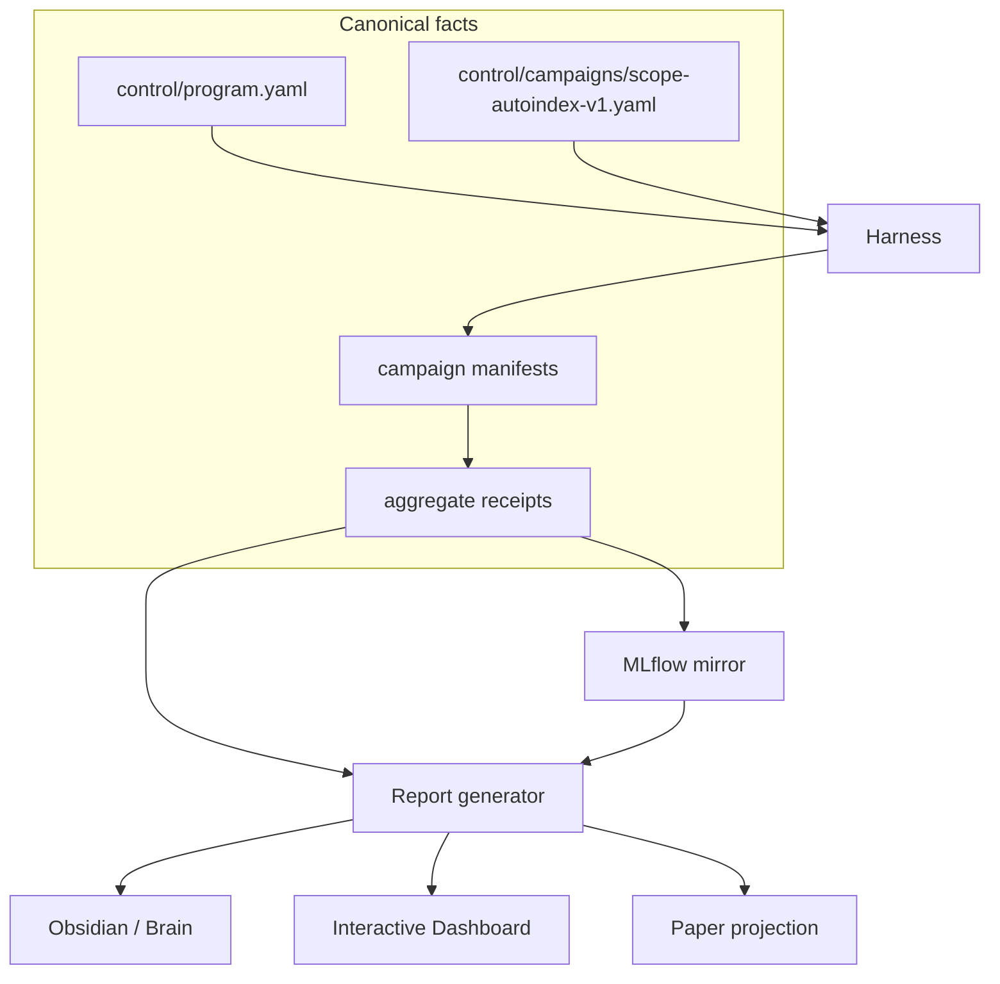
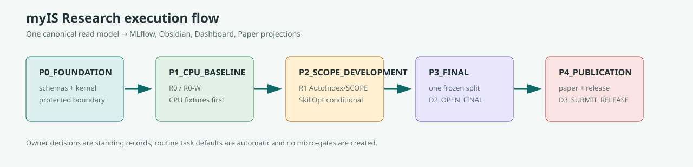

# myIS Research

`01_Research` is the Git repository and active control plane for the SCOPE /
AutoIndex campaign. The workspace is intentionally small: control, campaigns,
deterministic source, tests, evidence pointers, projections, Dashboard, and
archive.

## System at a glance



### Single source of truth

| Fact | Canonical source | Projections |
|---|---|---|
| Identity, phases, Owner decisions | `control/` | all views |
| Run, metric, cost, and artifact facts | validated manifests and receipts | MLflow, Dashboard, Brain, Paper |
| Human interpretation | `02_Brain/memory` with source pointers | Obsidian |
| Publication prose | `03_Paper` | release package |

Dashboard is presentation only. It never recalculates metrics or opens a phase.
`D1_START_CAMPAIGN` is already recorded as one standing authorization; only
`D2_OPEN_FINAL` and `D3_SUBMIT_RELEASE` can be previewed and confirmed later.



## Projection contract

```text
Owner-local harness -> manifest/aggregate receipt -> MLflow mirror
                                           \-> report generator
                                                \-> read-model.v2.json
                                                     \-> Dashboard
                                                     \-> Obsidian / Brain
                                                     \-> Paper readiness
```

The read model is rebuilt from canonical files. A changed Dashboard, MLflow
store, or Obsidian note can therefore be deleted and regenerated without
changing scientific facts.

## MLflow archive

The active v2 archive uses `myis-scope-autoindex-v1` for scientific records
and `myis-system` for maintenance records. The six `myis-research-*`
experiments are preserved as `legacy_read_only` history. Every v2 archive run
is hash-bound to its shared read-model revision, freeze bundle, metric and
schema/rule registries, manifest/receipt pointers, lifecycle state, and safe
artifacts. The SQLite/artifact store remains external to Git and the viewer is
read-only; maintenance supports local backup and a non-destructive rebuild plan.

## Target tree

```text
01_Research/
  control/       # authority, campaign, decisions, migration, assets
  campaigns/     # manifests and aggregate receipts
  src/           # deterministic kernel, SCOPE, harness, projections
  schemas/       # versioned contracts
  evidence/      # hashes, literature, known-missing receipts
  projections/   # shared read model and rebuildable compatibility projections
  dashboard/     # presentation UI and local MLflow viewer
  scripts/       # validators, report sync, MLflow bootstrap/doctor
  archive/       # immutable historical source and migration pointers
```

## Owner view

Open `dashboard/open-dashboard.cmd` for the unified interactive dashboard. The
Dashboard is the only user-facing start entry point. It separates **done**,
**next**, and **waiting for Owner**, and provides Execution, Results, Evidence,
Governance, Reports, Research Tools, and a ten-screen Presentation view.
MLflow and the canonical Obsidian reporting vault are opened from fixed
Dashboard actions. Retired standalone launcher sources are archived under
`archive/p1-recovery-20260730/legacy-launchers/` for rollback inspection only.

## Active research

- `P0_FOUNDATION`: deterministic kernel, strict SCOPE/FiNE adapters, integrity
  preflight, owner-local boundary, and projections; complete.
- `P1_CPU_BASELINE`: `P1_CPU_MEASURED_COMPLETE`. Fresh CPU request
  `dapfam-p1-fulltext-c058a3aa7357c782` produced the complete R0/R0-W by
  train/selection matrix, 12 aggregate metric rows, a validated package, and
  an artifact-only rigor review. The legacy receipt remains historical-invalid
  and is not promoted.
- `P2_SCOPE_DEVELOPMENT`: ready but not started; AutoIndex is the main lineage
  and SkillOpt remains conditional.
- `P3_FINAL`: locked until `D2_OPEN_FINAL`.
- `P4_PUBLICATION`: locked until `D3_SUBMIT_RELEASE`.

## Literature

AutoIndex (`arXiv:2607.18603`, U154, Tier A) is stored canonically under
`evidence/literature/` and referenced by Brain. The PDF is not copied into the
Brain vault. The digest routes to Candidate Exposure, Prompt and Skill
Optimization, and Document Representation and Indexing.

## Checks

For the next Owner action, read [`HANDOFF.md`](HANDOFF.md). It is the
beginner-readable closeout and does not replace canonical control records.

```powershell
uv run --no-sync pytest -q
uv run --no-sync myis-report sync --repository-root .
uv run --no-sync myis-report check --repository-root .
uv run --no-sync myis-report advisor-validate --repository-root .
uv run --no-sync python scripts/validate_layout_v2.py
uv run --no-sync python scripts/mlflow_doctor.py --repository-root . --store-root $env:MYIS_MLFLOW_STORE
uv run --no-sync pytest -q tests/test_dashboard_launcher.py tests/test_projection_launchers.py
git diff --check
```

No GPU, paid API, network model download, or final-split access was used for P1.
The measured run stayed inside the Owner-local process and projected only
validated aggregates, hashes, counts, and pointers. This system is decision
support, not legal advice.

## Certified P1 datasets

The Dashboard reads the generated dataset registry from the validated P1
package, manifests, and aggregate receipt. It shows logical identifier, representation,
classification, byte count, safe hash, and aggregate count, but never exposes
an Owner-local source path. The active roles
are `family-corpus`, `r0-candidate` (`chunks_doc`), and `r0-w-candidate`
(TAC512 passages). `chunks_section` is reference-only and `chunks_element` is
incompatible with the four-unit DAPFAM limit. Queries and relevance labels are
marked owner-local-only; no query IDs, qrels rows, membership, or per-query
outcomes are projected.

The validated P1 package is mirrored to MLflow as one parent and four child
runs without protected artifacts. Dashboard, the generated MLflow archive,
Obsidian phase/task notes, Brain reports, and Paper readiness are rebuilt from
the same `projections/read-model/read-model.v2.json` revision, so a projection
can be regenerated without changing evidence.

The active projection contract is v2. Legacy `/api/v1` read routes remain only
as tested migration aliases and return v2 data; archived v1 files are never
loaded as current facts.
