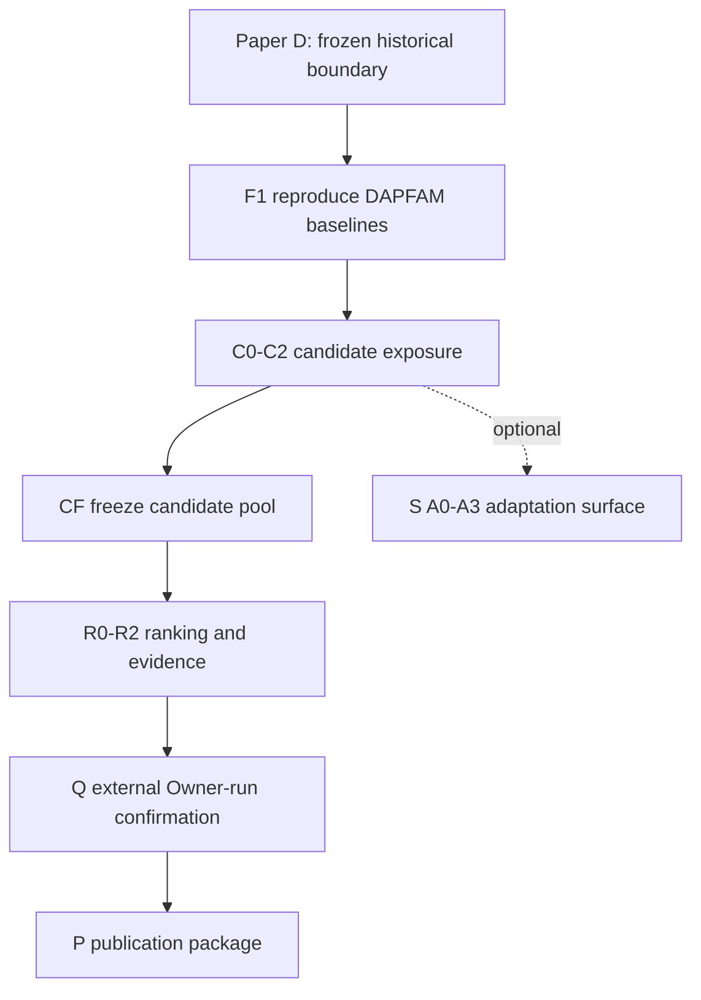

# IS1 Research V0.1

`IS1 Research V0.1` is the governed myIS research workspace for family-level
cross-domain patent retrieval. The active protocol separates candidate exposure,
candidate-pool freeze, ranking, and evidence so each claim remains falsifiable
and auditable. `Paper E` is retained only as a historical/legacy alias.

V0.2/V0.3 denote additive studies inside this architecture. A future change to
the protocol family, protected-data boundary, or causal phase order becomes V1.0
after an Owner decision.

## Start here

1. [AGENTS.md](AGENTS.md) - invariant and safety contract.
2. [PLAN.md](PLAN.md) - goal-based Phase -> Task execution authority.
3. [FULL_RESEARCH_TRACK_PLAN.md](FULL_RESEARCH_TRACK_PLAN.md) - scientific protocol.
4. [LOCAL_RESEARCH_HARNESS_BUILD_PLAN.md](LOCAL_RESEARCH_HARNESS_BUILD_PLAN.md) - code and schema contract.
5. [00_governance/OWNER_GATES.md](00_governance/OWNER_GATES.md) and
   [00_governance/OPERATIONS.md](00_governance/OPERATIONS.md) - approvals and commands.

## Research program



The primary claims are independent:

| Gate | Question | Primary metric | Comparator |
|---|---|---|---|
| C | Does CrossRoute expose more relevant OUT families? | OUT Recall@100 | one preregistered protocol-matched reproduced baseline |
| R | Does ranking improve order on the frozen pool? | OUT nDCG@100 | frozen no-rerank baseline on the identical pool hash |

During selection a candidate must score strictly above the current best; ties
are rejected. On sealed confirmation a positive point-estimate delta is an
observed improvement. The report also includes exact query count, paired delta,
95% paired-bootstrap CI, rank-biserial effect size, and W/L/T counts. CI lower
above zero supports statistically supported superiority; a positive delta with
a CI crossing zero is a higher measured score with uncertain superiority. MDE
is reported separately as prospective design sensitivity.

Published DAPFAM passage Hybrid RRF references are OUT Recall@100 `0.1653` and
OUT nDCG@100 `0.0625`. They are reproduction targets, not myIS results. DAPFAM
measures family-level retrieval relevance and is not novelty/FTO legal truth.

## Repository map

| Path | Purpose |
|---|---|
| `00_governance/` | identity, Owner Gates, operations, approvals, tool/dependency rules |
| `01_evidence/` | literature catalog, validated digests, provenance, local-only PDFs |
| `02_tracks/` | C candidate exposure, R ranking/evidence, optional S adaptation |
| `03_experiments/` | configuration, immutable manifest templates, runtime placeholders |
| `04_outputs/` | validated reports, diagrams, audits, and publication packages |
| `05_code/` | harness, metrics/statistics, confirmation contracts, dashboard, MLflow mirror, tests |
| `.agents/skills/` | project procedures bound by the same protected-surface rules |

## Implemented foundation

The current code includes `ResearchVersionSpec`, strict `SelectionDecision`,
independent `CandidateExposureComparison` and `FrozenPoolRankingComparison`,
grounded/route-budgeted `HarnessPolicy`, deterministic family candidate ledgers,
paired statistics, protected-surface checks, manifest v3, hash-only confirmation
requests, aggregate-only confirmation validation, a loopback dashboard with an
immutable Owner decision ledger and allowlisted PDF receipts, and a rebuildable
local `MLflowMirror`.

These are contracts and offline infrastructure, not evidence that F1-Q
scientific phases have run. Confirmation membership, qrels, protected payloads,
and per-query outcomes remain outside the agent workspace.

## Dependency authority

Python 3.11 is required. `pyproject.toml` and `uv.lock` are the only dependency
authority. Reproduce an environment with the exact recorded groups/extras:

```powershell
uv sync --locked --extra tracking --extra dashboard --extra test
uv run --no-sync python 05_code/scripts/validate_restructure.py
uv run --no-sync python 05_code/scripts/validate_integrity.py
uv run --no-sync python -m unittest discover -s 05_code/tests -v
```

Every measured manifest records the exact Python patch, uv version, OS and
architecture, accelerator/CUDA stack, selected groups/extras, and `uv.lock`
SHA-256. Exported hashed requirements are interoperability-only.

## Local services

- The dashboard is read-only for experiment artifacts and binds only to
  `127.0.0.1`. The only canonical Git write is a previewed, explicitly confirmed
  typed Owner Gate decision under `00_governance/approvals/`.
- PDF streaming is disabled unless an exact path/hash is allowlisted after
  license/privacy review. Each access writes a local ignored hash-chained receipt;
  only periodic chain-head anchors may enter Git through an Owner Gate record.
- MLflow mirrors allowlisted documents, results, metrics, rubrics, rules, tools,
  skills, and environments. Git and validated artifacts remain canonical; PDFs,
  qrels, split membership, confirmation outcomes, credentials, and protected
  per-query artifacts are rejected.

See [00_governance/TOOLCHAIN.md](00_governance/TOOLCHAIN.md) for the complete
authority map and [00_governance/OPERATIONS.md](00_governance/OPERATIONS.md) for
loopback startup, replay, ledger verification, and recovery procedures.
