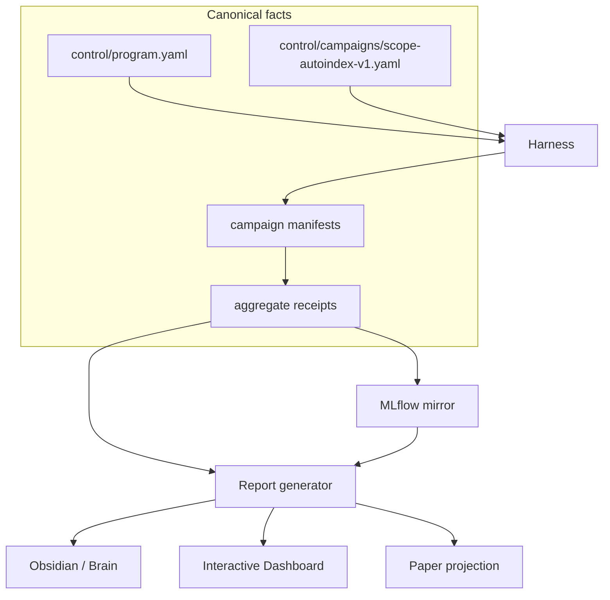

# myIS Research

`01_Research` is the Git repository and active control plane for the SCOPE /
AutoIndex campaign. The workspace is intentionally small: control, campaigns,
deterministic source, tests, evidence pointers, projections, Dashboard, and
archive.

## System at a glance



### Single source of truth

| Fact | Canonical source | Projections |
|---|---|---|
| Identity, phases, Owner decisions | `control/` | all views |
| Run, metric, cost, and artifact facts | validated manifests and receipts | MLflow, Dashboard, Brain, Paper |
| Human interpretation | `02_Brain/memory` with source pointers | Obsidian |
| Publication prose | `03_Paper` | release package |

Dashboard is presentation only. It never recalculates metrics or opens a phase.
`D1_START_CAMPAIGN` is already recorded as one standing authorization; only
`D2_OPEN_FINAL` and `D3_SUBMIT_RELEASE` can be previewed and confirmed later.


## Projection contract

```text
Owner-local harness -> manifest/aggregate receipt -> MLflow mirror
                                           \-> report generator
                                                \-> read-model.v1.json
                                                     \-> Dashboard
                                                     \-> Obsidian / Brain
                                                     \-> Paper readiness
```

The read model is rebuilt from canonical files. A changed Dashboard, MLflow
store, or Obsidian note can therefore be deleted and regenerated without
changing scientific facts.

## MLflow hierarchy

The mirror uses additive experiments with stable names:
`myis-research-bootstrap`, `myis-research-catalog`, `myis-research-track-c`,
`myis-research-track-s`, `myis-research-joint`, and
`myis-research-publication`. Runs carry parent/campaign identifiers, phase,
arm, data role, manifest/config/model/evaluator hashes, metrics, cost, and
artifact hashes. The store is external to Git and the viewer is read-only.

## Target tree

```text
01_Research/
  control/       # authority, campaign, decisions, migration, assets
  campaigns/     # manifests and aggregate receipts
  src/           # deterministic kernel, SCOPE, harness, projections
  schemas/       # versioned contracts
  evidence/      # hashes, literature, known-missing receipts
  projections/   # read model and one-click launchers
  dashboard/     # presentation UI and local MLflow viewer
  scripts/       # validators, report sync, MLflow bootstrap/doctor
  archive/       # immutable historical source and migration pointers
```

## Owner view

Open `projections/open-dashboard.cmd` for the interactive dashboard, or use the
three one-click launchers in `projections/` for Dashboard, MLflow, and Obsidian.
The dashboard separates **done**, **next**, and **waiting for Owner** and has a
Presentation tab ready for measured results.

## Active research

- `P0_FOUNDATION`: deterministic kernel, strict SCOPE/FiNE adapters, integrity
  preflight, owner-local boundary, and projections; complete.
- `P1_CPU_BASELINE`: `R0` and `R0-W` measured on train/selection only;
  current state is `P1_CPU_MEASURED_COMPLETE`.
- `P2_SCOPE_DEVELOPMENT`: waiting for review before work starts; AutoIndex is
  the main lineage and SkillOpt remains conditional.
- `P3_FINAL`: locked until `D2_OPEN_FINAL`.
- `P4_PUBLICATION`: locked until `D3_SUBMIT_RELEASE`.

## Literature

AutoIndex (`arXiv:2607.18603`, U154, Tier A) is stored canonically under
`evidence/literature/` and referenced by Brain. The PDF is not copied into the
Brain vault. The digest routes to Candidate Exposure, Prompt and Skill
Optimization, and Document Representation and Indexing.

## Checks

For the next Owner action, read [`HANDOFF.md`](HANDOFF.md). It is the
beginner-readable closeout and does not replace canonical control records.

```powershell
uv run --no-sync pytest -q
uv run --no-sync myis-report sync --repository-root .
uv run --no-sync myis-report check --repository-root .
uv run --no-sync python scripts/validate_layout_v2.py
git diff --check
```

No GPU, paid API, final split, qrels, query IDs, or per-query outcomes are
required for P0/P1. This system is decision support, not legal advice.

## Certified P1 datasets

The Dashboard reads the generated dataset registry from the canonical legacy
inventory and owner-local receipt. It shows source path, representation,
classification, byte count, safe hash, and aggregate count. The active roles
are `family-corpus`, `r0-candidate` (`chunks_doc`), and `r0-w-candidate`
(TAC512 passages). `chunks_section` is reference-only and `chunks_element` is
incompatible with the four-unit DAPFAM limit. Queries and relevance labels are
marked owner-local-only; no query IDs, qrels rows, membership, or per-query
outcomes are projected.

P1 results are mirrored to an external MLflow store as one parent run with R0
and R0-W child runs. Obsidian phase notes and the interactive presentation are
generated from the same `projections/read-model/read-model.v1.json`, so a
Dashboard or note can be regenerated without changing evidence.
