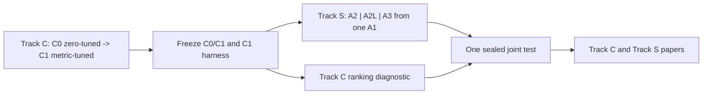

# myIS Research

`myIS Research` (`myis-research`, protocol `1.0`) is the governed workspace for
two linked studies of family-level cross-domain patent retrieval. Track C and
Track S each use research version `0.1`; package version `0.1.0` is independent.



There is no active independent ranking/evidence lane. Its historical files are
preserved under `02_tracks/99_legacy/`; evidence transfer remains separately
gated and deferred.
DAPFAM is retrieval decision support, not legal advice.

## Current readiness

The verified foundation state is `F0 = closed` and `G0 = approved`. `F1` is
`waiting_gate` and `G1` is `pending`; the only current project readiness is
`F1/G1 preparation only`. No reproduction, dataset or qrels access, scientific
metric, paid API, GPU, or confirmation activity is authorized.

The approved external MLflow runtime store is a rebuildable mirror outside Git.
Its F0 bootstrap records connectivity only, with no scientific run, dataset
access, artifacts, or scientific metrics. Do not mirror or replay governance
documents unless the Owner separately approves that action.

## Start here

1. [AGENTS.md](AGENTS.md) - identity, safety, and scientific invariants.
2. [PLAN.md](PLAN.md) - canonical Phase -> Task execution authority.
3. [Track C source plan](00_governance/IS_RESEARCH_TRACK_C_V0.1_CROSSROUTE_PLAN.md).
4. [Track S source plan](00_governance/IS_RESEARCH_TRACK_S_V0.1_SKILLOPT_HARNESSOPT_PLAN.md).
5. [Scientific protocol](FULL_RESEARCH_TRACK_PLAN.md) and
   [harness contract](LOCAL_RESEARCH_HARNESS_BUILD_PLAN.md).
6. [Owner Gates](00_governance/OWNER_GATES.md) and
   [operations](00_governance/OPERATIONS.md).

## Active protocol

Shared query IDs use seed `42` and membership `250/125/872`, but Track C and S
have separate evaluators, optimizers, budgets, manifests, artifacts, and data
firewalls. Exact split hashes and OUT-positive counts are frozen only by the
protected Owner process.

Track C compares C1 against C0 on OUT Recall@100. C0 is the locked six-route
zero-tuned recipe; C1 searches only the typed route/fusion/depth surface. Track S
compares matched-budget A2, A2L, and A3 arms that all start from the same A1.
Primary Track S comparison is A3-A2 on the untouched joint test.

## Repository map

| Path | Purpose |
|---|---|
| `00_governance/` | identity, gates, operations, Track C/S source plans, mappings |
| `01_evidence/` | protected literature catalog, digests, provenance, local PDFs |
| `02_tracks/00_C_crossroute/` | Track C documents and typed artifacts |
| `02_tracks/01_S_skillopt/` | Track S documents and typed artifacts |
| `02_tracks/99_legacy/` | protected historical track material |
| `03_experiments/` | configs and manifest templates; no results implied |
| `04_outputs/` | validated reports/audits/publication packages |
| `05_code/` | deterministic kernel, dashboard backend, mirrors, tests |
| `06_frontend/` | loopback Owner dashboard and read-only MLflow viewer |
| `.agents/skills/` | project procedures under the same firewalls |

## Gates and blockers

G0-G8 control migration, reproduction, C development/freeze, S preflight/run,
joint test, transfer, and separate publication records. Current blocking Owner
values are `C_MARGIN_VALUES_TBD_BLOCKING`, `C_SOEI_VALUE_TBD_BLOCKING`,
`S_MARGIN_VALUES_TBD_BLOCKING`, `COREWEAVE_FINAL_FREEZE_TBD_BLOCKING`, and
`CT_BUDGET_LICENSE_TBD_BLOCKING`. Silence never resolves them.

Before `F1.1` can run, the Owner must explicitly approve G1 with committed
corpus, query, qrels, family, and evaluator inputs; the field protocol and
published targets; a compute budget; exact split membership/hash and exact
OUT-positive counts from the protected Owner process; and reproduction
authorization. A draft or scaffold is not a frozen RunSpec and cannot open G1.

## Local validation

```powershell
uv sync --locked --extra tracking --extra dashboard --extra test
uv lock --check
uv run --no-sync python 05_code/scripts/validate_restructure.py
uv run --no-sync python 05_code/scripts/validate_integrity.py
uv run --no-sync python 05_code/scripts/validate_literature_corpus.py
uv run --no-sync python -m unittest discover -s 05_code/tests -v
& "C:\Program Files\Git\bin\bash.exe" "06_frontend/mlflow/mlflow.sh" doctor
git diff --check
```

The dashboard is loopback-only and exposes only approved counts, hashes, and
aggregate state. Git and validated immutable artifacts remain canonical;
Brain, Linear, dashboard, and MLflow are rebuildable projections.
