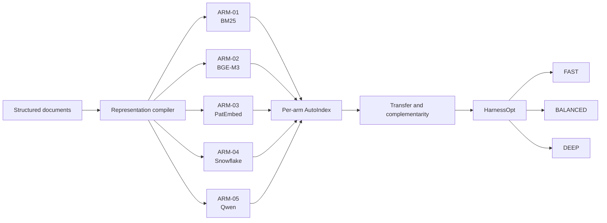

<p align="center">
  
</p>

# ArmIndex

Retriever-conditioned representation search and production-aware
multi-retriever optimization for structured document retrieval.

ArmIndex is the active research-engineering direction of the existing myIS
repository. It asks a practical question: should one document representation
serve every retriever, or should each retrieval arm receive a representation
program matched to its behavior? It then studies whether complementary arms
can be combined without paying the latency and cost of an always-on union.

## What ArmIndex does

- searches executable representation programs independently for frozen retrievers;
- measures how programs transfer across retrievers;
- identifies arms that recover complementary relevant families;
- optimizes deterministic arm selection, depth, fusion, caching, and stopping;
- freezes `FAST`, `BALANCED`, and `DEEP` production profiles.

ArmIndex does not train or modify model weights. It optimizes the representation
and deterministic retrieval harness around immutable model adapters.

## Architecture



The scientific control plane fans one validated read model out to MLflow,
the Internal Research Brain, Obsidian reports, the Dashboard, and Paper
readiness. Those systems are projections, not independent sources of truth.

## Research questions

1. Does retriever-conditioned representation search improve OUT Recall@100?
2. Which representation decisions transfer across lexical and dense arms?
3. Which arms contribute genuinely complementary family retrieval?
4. Can HarnessOpt improve the quality-latency-cost frontier over fixed unions?
5. Can a frozen commercial-capable profile transfer to legal structured retrieval?

## Retrieval arms

| Arm | Exact model or engine | Role | Declared license | Intended status |
|---|---|---|---|---|
| `ARM-01` | `bm25s` | lexical anchor, rare terminology, CPU fallback | MIT | commercial-capable |
| `ARM-02` | `BAAI/bge-m3` | multilingual dense anchor | MIT | commercial-capable |
| `ARM-03` | `datalyes/patembed-large` | patent-specific research arm | CC BY-NC-SA 4.0 | research/non-commercial |
| `ARM-04` | `Snowflake/snowflake-arctic-embed-m-v2.0` | multilingual long-context dense arm | Apache-2.0 | commercial-capable |
| `ARM-05` | `Qwen/Qwen3-Embedding-0.6B` | instruction-aware multilingual dense arm | Apache-2.0 | commercial-capable |

Every adapter requires an immutable revision, tokenizer hash, prompt/prefix,
pooling, normalization, dimension, truncation, precision, and license snapshot
before measurement. The model selection record is the authority for planned
adapter semantics. The A1.2 public revisions and critical commitments are
recorded in [`A1_2_MODEL_SOURCE_LOCKS.md`](docs/research/A1_2_MODEL_SOURCE_LOCKS.md);
the four dense arms still require complete Owner-local byte manifests and
adapter parity before launch.

## Metrics

- Primary: OUT Recall@100
- Secondary: OUT nDCG@100 and OUT nDCG@10
- Operational: p50/p95/p99 latency, throughput, cost/query, index size, RAM, VRAM, and charged USD

No ArmIndex benchmark result exists yet. The repository does not claim a win,
state of the art, or production readiness.

## Research and commercial champions

The research champion may include PatEmbed-large within its non-commercial
license boundary. The commercial-capable champion is selected separately from
BM25, BGE-M3, Snowflake, and Qwen arms. This prevents a strong research result
from being presented as a deployable commercial default.

## Use cases

- patent prior-art candidate retrieval;
- legal research RAG;
- contract and policy retrieval;
- SOP and regulatory document search;
- enterprise structured-document retrieval.

These are target domains, not claims that the current implementation has been
validated for legal decisions or production deployment.

## Repository structure

At the project-root level, `01_Research` is the canonical scientific control
plane and primary Owner surface; `02_Brain` is project memory; `03_Paper` is the
publication workspace; and `04_Owner_Stores` holds private operational,
protected, or large files. Supporting workspaces cannot override Research
evidence. Owner Store contents are accessible and mutable when a task requires
them, but only approved aggregate-safe hashes, counts, manifests, or pointers
may leave that workspace.

```text
control/                 canonical program, campaign, model, budget, and gate records
campaigns/               immutable campaign artifacts and migration state
schemas/armindex/        versioned ArmIndex contracts
src/myis_research/       stable package namespace plus the ArmIndex subsystem
tests/                   synthetic, integration, projection, and safety tests
projections/             shared read model and generated projection receipts
obsidian_report/         generated research reports; never canonical metrics
dashboard/               local read-only control and evidence interface
mlflow/                  governed external-store mirror contracts and indexes
outputs/                 canonical generated evidence, audits, fixtures, and screenshots
archive/                 preserved historical material and migration receipts
docs/                    architecture, research, product, operations, and governance
```

## Development setup

ArmIndex measured execution is not enabled during migration. These commands
exercise the current repository without downloading models or opening protected
data:

```powershell
uv sync --locked --all-extras
uv run --no-sync myis-armindex validate --repository-root .
uv run --no-sync myis-armindex fixture --repository-root .
uv run --no-sync pytest -q
uv run --no-sync myis-report check --repository-root .
uv run --no-sync python scripts/validate_layout_v2.py
```

Open the local Dashboard with `dashboard/open-dashboard.cmd`. The Dashboard
does not start MLflow automatically.

## Current status

Live phase/task and next action are authoritative in [`PLAN.md`](PLAN.md) and
the current ArmIndex controls. Use `uv run --no-sync myis-status` for a
read-only Owner status rendering; this README remains a stable research
overview and does not duplicate volatile counters.

## Reproducibility and governance

The canonical A2-A6 Owner Data Bundle is built with
`scripts/build_owner_data_bundle.py`. It stores protected payloads only in
`04_Owner_Stores` and emits hash/count/pointer receipts; preparation keeps
Selection-125 and Final-872 access counters at zero. A6 binds the pinned
45,336-row DAPFAM source manifest but remains fail-closed until A5 closeout.

Model revisions, adapters, representation programs, evaluators, split hashes,
budgets, and harnesses are frozen through canonical JSON and SHA-256 receipts.
Protected qrels and split membership stay Owner-local. Selection is exposed at
most once after a deterministic shortlist freeze; Final requires
`D2_OPEN_FINAL`. Every run consumes an append-only budget ledger.

## Production profiles

| Profile | Intended behavior | Current state |
|---|---|---|
| `FAST` | BM25 plus at most one commercial dense arm, bounded synchronous path | contract only |
| `BALANCED` | two or three commercial arms under a frozen latency budget | contract only |
| `DEEP` | full selected harness; asynchronous execution permitted | contract only |

## Security and privacy

Protected query IDs, family IDs, qrels, rankings, memberships, raw patent
payloads, credentials, and personal absolute paths are prohibited from Git and
all projections. Data and persistent MLflow stores remain Owner-local;
repository artifacts are aggregate-only and content-hash bound. See
[`SECURITY.md`](SECURITY.md) and the
[`data boundary`](docs/governance/DATA_AND_EVIDENCE_BOUNDARY.md).

## Roadmap

The eight-phase roadmap runs from A0 migration through A7 publication, with a
post-confirmatory full-DAPFAM materialization and scalability phase in A6. See
[`docs/ROADMAP.md`](docs/ROADMAP.md) and the canonical [`PLAN.md`](PLAN.md).

## Documentation

- [Architecture](docs/architecture/ARCHITECTURE.md)
- [Research protocol](docs/research/RESEARCH_PROTOCOL.md)
- [Model selection](docs/research/MODEL_SELECTION_V02.md)
- [A1.2 frozen model sources](docs/research/A1_2_MODEL_SOURCE_LOCKS.md)
- [Productization boundary](docs/product/PRODUCTIZATION.md)
- [Production profiles](docs/product/PRODUCTION_PROFILES.md)
- [Use cases](docs/product/USE_CASES.md)
- [Operations runbook](docs/operations/RUNBOOK.md)
- [Thai Owner runbook](docs/operations/OWNER_RUNBOOK_TH.md)
- [Model and license policy](docs/governance/MODEL_AND_LICENSE_POLICY.md)
- [Contributing](CONTRIBUTING.md)

## Citation

Use [`CITATION.cff`](CITATION.cff). Cite measured ArmIndex findings only after
the corresponding immutable receipt and publication record exist.

## License

Repository license decision pending. Model licenses are separate from the
repository software license and must be checked per frozen adapter. See
[`LICENSE_DECISION_REQUIRED.md`](docs/governance/LICENSE_DECISION_REQUIRED.md).

## Disclaimer

ArmIndex is research decision support. It is not legal advice and does not
determine novelty, patent validity, infringement, or freedom to operate.
