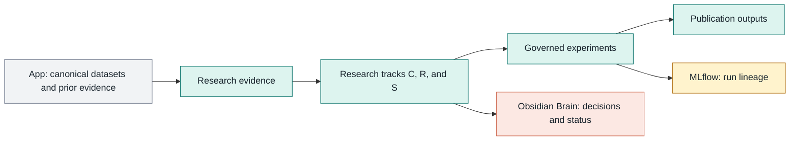

# myIS Research

This repository is the governed research workspace for the myIS publication
program. It keeps evidence, research choices, experiment definitions, outputs,
and reusable code separate from the product application and the shared Brain.

## Start here

1. Read [PLAN.md](PLAN.md) for the phased research plan and track flows.
2. Read [AGENTS.md](AGENTS.md) before changing or running anything.
3. Use [00_governance/OPERATIONS.md](00_governance/OPERATIONS.md) for routine
   commands and Owner gates.
4. Open only the numbered folder that owns the work.

## Repository map

| Path | Purpose |
|---|---|
| `00_governance/` | Authority, gates, operating rules, templates, and tool pins |
| `01_evidence/` | Validated literature and provenance; currently U001-U040 only |
| `02_tracks/` | Track C, R, and S research questions and deliverables |
| `03_experiments/` | Configurations, manifests, and local runtime placeholders |
| `04_outputs/` | Generated reports, diagrams, and approved result packages |
| `05_code/` | Validation, bootstrap, library, and tests |

Numbering is limited to managed navigation boundaries. Third-party tools,
Python packages, the App repository, and the Obsidian Brain keep their native
internal names.

<!-- mermaid-id: 00-01-project-architecture -->

## Current boundary

The restructure is active, but research execution is closed. U041, web/PDF
acquisition, model/API/GPU/Vast jobs, scientific MLflow runs, held-out access,
and publication changes require their own Owner gates. Existing U001-U040
digests and 64 import artifacts remain preserved with hash validation.

The minimal active tool stack is HyperResearch, MLflow, one Obsidian Brain,
Codex native live search, Claude Open-WebSearch, and Context7. Open Deep
Research and Experience Brain are retired from active operation. Loop
Engineering and Open Code Review are evaluation-only tools and may run only in
a disposable pilot workspace.

## Repositories

| System | Target workspace path | Role |
|---|---|---|
| App | `00_Projects/00_myIS/00_App/` | Product code and canonical historical evidence |
| Research | `00_Projects/00_myIS/01_Research/` | This repository |
| Brain | `00_Projects/00_myIS/02_Brain/` | Human-readable shared decisions and status |

See [00_governance/RESTRUCTURE_STATUS.md](00_governance/RESTRUCTURE_STATUS.md)
for temporary Windows-handle blockers and the remaining cutover steps.

## Brain-drive contract demo

`03_experiments/V01_brain_drive_agent_demo/` is a deterministic offline test of
PDF, web-pointer, and project-history registration, fixture retrieval,
synthesis, and the five-artifact local MLflow contract. It does not copy raw
sources into Brain and does not use network, API, GPU, or protected data.

The implementation is under `05_code/src/myis_research/`. External execution
remains gated: HyperResearch is Claude-only after an Owner decision, while the
Autoresearch adapter is pinned to upstream commit
`228791fb499afffb54b46200aca536f79142f117` and records hypothesis, patch,
command, metrics, artifacts, and decision.
