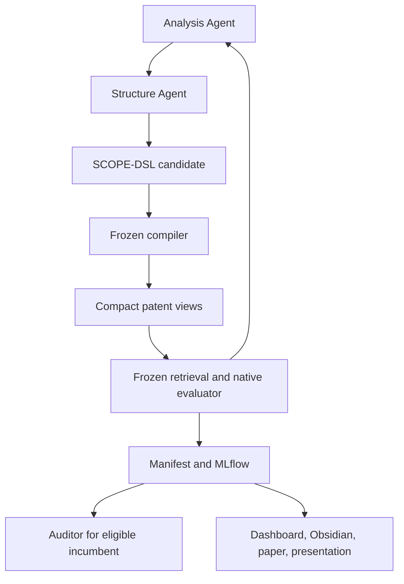

# Repository and System Architecture

## 1. Design goals

The repository should make the next valid research action obvious without turning every routine action into a gate.

The structure separates:

- durable source and contracts;
- small reproducible experiment definitions;
- large external research artifacts;
- canonical run records;
- human-facing projections;
- frozen historical evidence.

## 2. Target Git tree

```text
myIS/
├── README.md                         # Human entry point
├── PLAN.md                           # Active research protocol
├── INSTRUCTION.md                    # One-time migration/build brief
├── NAMING.md                         # IDs, metrics, and artifact names
├── AGENTS.md                         # Persistent Codex contract
├── pyproject.toml                    # Package and tool configuration
├── uv.lock                           # Dependency authority
│
├── config/
│   └── project.yaml                  # Frozen campaign policy and defaults
│
├── docs/
│   ├── ARCHITECTURE.md               # This repository and data-flow contract
│   ├── PATENT_STRUCTURE.md           # Research-backed representation design
│   ├── OPTIMIZER_DECISION.md         # AutoIndex/agent/SkillOpt boundary
│   ├── PAPER_STRATEGY.md             # Contribution and reviewer stress test
│   ├── ISAI_NLP_2026.md              # Venue scope and compliance
│   ├── RULES.md                      # Firewalls and three Owner decisions
│   └── RUBRIC.md                     # Independent auditor rubric
│
├── schemas/
│   ├── scope-dsl.schema.json
│   ├── patent-representation.schema.json
│   ├── run-manifest.schema.json
│   └── examples/                      # Tiny valid contract examples
│
├── src/myis/
│   ├── __init__.py
│   ├── cli.py
│   ├── config.py
│   │
│   ├── data/
│   │   ├── integrity.py              # Counts, hashes, schema checks
│   │   ├── snapshots.py              # Immutable data manifests
│   │   └── splits.py                 # Role-limited split access
│   │
│   ├── benchmarks/
│   │   ├── dapfam.py                 # Family-level adapter and protocol
│   │   ├── fine_patents.py           # Evidence-passage transfer adapter
│   │   └── patenteb.py               # Stretch-only task adapter
│   │
│   ├── structure/
│   │   ├── source_spans.py           # Offset-preserving text primitives
│   │   ├── claims.py                 # Claim graph and fallback parsing
│   │   ├── descriptions.py           # Section and window parsing
│   │   ├── graph.py                  # Typed evidence graph
│   │   ├── dsl.py                    # SCOPE-DSL model and parsing
│   │   ├── compiler.py               # Frozen spec-to-searchable-unit compiler
│   │   └── validation.py             # Schema and grounding checks
│   │
│   ├── retrieval/
│   │   ├── bm25.py                   # Frozen sparse baseline
│   │   ├── dense.py                  # Conditional transfer
│   │   ├── hybrid.py                 # Conditional transfer
│   │   └── aggregate.py              # Unit-to-family aggregation
│   │
│   ├── optimize/
│   │   ├── analysis_agent.py
│   │   ├── structure_agent.py
│   │   ├── auditor.py
│   │   ├── candidate_boundary.py      # JSON-only write and access policy
│   │   ├── search.py
│   │   └── journal.py
│   │
│   ├── evaluate/
│   │   ├── qrels.py                  # Role-restricted qrel access
│   │   ├── metrics.py                # Family-level metrics
│   │   ├── diagnostics.py            # Exposure and parser analysis
│   │   └── statistics.py             # Paired confidence intervals
│   │
│   ├── observe/
│   │   ├── logging.py                # Structured JSON logging
│   │   ├── manifests.py              # Immutable run/freeze records
│   │   ├── mlflow.py                 # Canonical tracking adapter
│   │   └── cost.py                   # Model/compute/storage accounting
│   │
│   └── report/
│       ├── obsidian.py               # Generated research notes
│       ├── dashboard.py              # Read-only data adapter
│       ├── figures.py                # Publication-quality figures
│       └── presentation.py           # Deck assets from canonical data
│
├── tests/
│   ├── fixtures/                     # Tiny non-protected data only
│   ├── unit/
│   └── integration/
│
├── experiments/
│   ├── configs/                      # Immutable measured-run definitions
│   ├── fixtures/                     # Small smoke-run definitions
│   ├── notebooks/                    # Exploration, never metric authority
│   └── registry/                     # Compact run/freeze manifests
│
├── evidence/
│   ├── catalog/                      # Source metadata and citation registry
│   └── literature/                   # Useful digests, not raw large PDFs
│
├── dashboard/                        # Loopback-only read-only application
│
├── reports/
│   ├── obsidian/                     # Generated Markdown projections
│   ├── manuscripts/
│   ├── figures/
│   ├── presentations/
│   └── submissions/
│       └── isai-nlp-2026/            # Anonymous review and camera-ready assets
│
└── archive/
    └── README.md                     # Index to preserved superseded material
```

Do not create all modules before they are needed. The tree is a proposed ownership model, not a constraint against a better paper-first redesign. Any replacement must preserve the contracts and explain the migration.

### Submission-first vertical slice

The first runnable path needs only:

```text
config and schemas
→ DAPFAM adapter
→ flat view and BM25
→ family evaluator
→ SCOPE-DSL validator and compiler
→ Analysis/Structure Agent loop
→ FiNE-Patents adapter
→ manifests and MLflow
→ anonymous paper tables
```

Create other modules when that path requires them. Broad archive cleanup, dashboard redesign, PatenTEB, dense/hybrid retrieval, and SkillOpt must not block the vertical slice. Existing dashboard, Obsidian, and presentation capabilities remain supported and may initially consume a compact canonical export rather than a redesigned application.

## 3. Inbox is not part of the runtime architecture

`/inbox` is a temporary handoff surface for proposed contracts and research sources.

Codex must:

- hash and inventory it;
- read `INBOX_MANIFEST.md` and `INSTRUCTION.md`;
- inspect the actual repository;
- classify each inbox source as active contract, evidence, historical material, external-store artifact, or duplicate;
- migrate with traceable moves or copies;
- leave the inbox unchanged unless the user explicitly asks for cleanup.

Do not:

- initialize the project inside `/inbox`;
- use `/inbox` as `MYIS_STORE`;
- run measured experiments there;
- overwrite existing repository roots from it;
- assume a root-like filename in the inbox is already authoritative.

## 4. External store

Use one explicit environment variable:

```text
MYIS_STORE
```

Expected layout:

```text
MYIS_STORE/
├── datasets/
│   ├── dapfam/
│   ├── fine-patents/
│   └── patenteb/
│       └── README.md                  # Stretch dataset/license pointer
├── protected/
│   ├── splits/
│   └── qrels/
├── representations/
├── indexes/
├── models/
├── runs/
├── candidates/
├── cache/
└── mlflow/
    ├── backend/
    └── artifacts/
```

Rules:

- never default `MYIS_STORE` to a home directory or repository root;
- resolve and validate the path before writing;
- refuse broad or unresolved deletion targets;
- keep an immutable manifest for every dataset and measured run;
- add only compact manifest pointers to Git;
- separate protected split material from ordinary run artifacts.

## 5. Outer workstation layout

If the existing workstation uses:

```text
My_Research/
├── 00_Projects/00_myIS/
│   ├── 00_App/
│   ├── 01_Research/
│   └── 02_Brain/
├── 01_Stores/00_myIS/
├── 02_Tools/
├── 03_Workspaces/
└── 99_Archive/00_myIS/
```

retain it:

- Git repository: `00_Projects/00_myIS/01_Research/`
- dashboard launch or application projection: `00_App/`
- Obsidian vault or linked knowledge projection: `02_Brain/`
- `MYIS_STORE`: `01_Stores/00_myIS/`
- temporary candidate-specification workspaces: `03_Workspaces/`
- cold historical material: `99_Archive/00_myIS/`

The repository tree in Section 2 lives inside `01_Research/`. Do not duplicate raw datasets inside the repository.

## 6. Runtime data flow



The agents may change only the declarative specification at `C`. The compiler, retriever, benchmark-native answer identity, and evaluator remain frozen. DAPFAM drives representation search; FiNE-Patents receives the frozen compiler as an external transfer test. PatenTEB and dense/hybrid paths are stretch extensions.

## 7. Dependency direction

Allowed dependency direction:

```text
data -> structure -> retrieval -> evaluate
                     \-> optimize orchestration
all runtime modules -> observe
observe + evaluate -> report
dashboard -> report/observe read models only
```

Prohibited:

- evaluator importing candidate-workspace artifacts other than validated compiled results;
- agents, candidate specifications, or the frozen compiler importing protected qrels or evaluator internals;
- dashboard computing canonical metrics independently;
- reports modifying run status;
- notebooks becoming production dependencies;
- data ingestion importing model-provider clients.

## 8. Canonical authority by artifact

| Question | Authority |
|---|---|
| What protocol should run? | `config/project.yaml` plus immutable experiment config |
| What is a valid representation? | JSON Schema plus semantic validator |
| What code ran? | Git commit/source-tree hash and freeze manifest |
| What data ran? | Dataset and split manifests |
| What metrics are canonical? | Evaluator output registered in MLflow |
| What files reconstruct the run? | Run manifest and artifact hashes |
| What does the Owner read? | Generated summary/dashboard/Obsidian report |
| What preserves old decisions? | Archived originals and archive index |

## 9. MLflow

Keep MLflow, but narrow its role:

- one experiment per scientific campaign;
- one run per immutable execution;
- parent runs may group a StructureOpt iteration;
- child runs represent candidates;
- tags carry protocol, split role, representation, retriever, policy, and freeze IDs;
- metrics carry canonical aggregate values;
- artifacts link to manifests and external-store records;
- failed and invalid runs remain visible.

MLflow does not replace Git, data manifests, or the protected split boundary.

## 10. Dashboard

Retain the dashboard with these constraints:

- read-only;
- loopback binding by default;
- no qrel browser for protected splits;
- no metric recalculation;
- visible protocol and freeze IDs;
- display `ALL`, `IN`, and `OUT` together;
- show cost, latency, index size, parser fallback, and provenance;
- label train, selection, transfer, and final clearly;
- never provide a button that silently starts paid or final evaluation.

## 11. Obsidian and presentation outputs

Retain generated Obsidian reports:

- run summary;
- failure analysis;
- decision log;
- evidence/source links;
- Paper A-D continuity notes;
- final research narrative.

Retain presentation outputs:

- experiment design;
- system diagram;
- scorecards;
- ablations;
- parser and efficiency diagnostics;
- limitations and negative results.

Both must derive from the same run manifest and canonical metric export. Manual annotations are allowed but must be visibly separated from generated evidence.

## 12. Migration principles

- preserve historical files before consolidating them;
- prefer a dated archive index over many active gate files;
- use one active project config;
- use one active plan;
- avoid duplicate definitions across README, plan, and agent contract;
- preserve literature metadata and valuable digests;
- do not move large artifacts into Git merely to make the tree self-contained;
- make every generated projection reproducible from canonical records.

## 13. Minimum initial implementation

The first implementation milestone needs only:

- package and CLI;
- project-config loader;
- external-store resolver;
- dataset manifest and schema inspector;
- flat representation;
- source-span primitives;
- representation and run-manifest validation;
- tiny family aggregation and metric fixtures;
- structured logging;
- MLflow smoke integration;
- generated Obsidian summary;
- read-only dashboard health check.

Claim graphs, StructureOpt agents, dense retrieval, and presentation export follow after this foundation passes.
