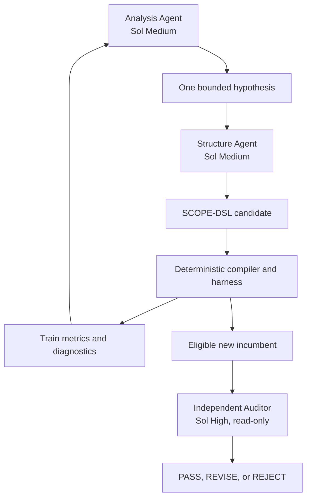

# AutoIndex, Agent Loop, and SkillOpt Decision

## 1. Decision

The primary method is a **patent-native, constrained AutoIndex loop**.

AutoIndex remains the visible methodological lineage and the main optimization idea:

> Learn what the index should expose while holding retrieval and evaluation fixed.

SCOPE contributes the patent-specific version of that idea:

> An agent searches a bounded representation language; a deterministic compiler turns each valid specification into grounded patent evidence graphs and compact searchable views.

`SCOPE-DSL` is not a replacement for AutoIndex. It is the controlled candidate surface inside the AutoIndex-style loop. It replaces unrestricted generated preprocessing code with a schema-valid, auditable specification that can be enumerated, reproduced, and transferred across patent datasets.

SkillOpt is retained as a conditional second axis. It does not enter the primary six-page paper unless the representation result is already stable and there is clear ranking headroom.

## 2. Why AutoIndex is the primary axis

The diagnosed DAPFAM problem is candidate exposure. Relevant cross-domain families may use different surface vocabulary, while patent records contain long descriptions, interdependent claims, and highly uneven structural signals. This makes the indexed representation a direct intervention point.

AutoIndex is the closest methodological precedent because it:

- keeps the retriever fixed;
- lets agents analyze retrieval behavior;
- searches over document representations;
- evaluates each candidate deterministically;
- reports Recall@100 improvements across the eight CRUMB tasks in its main experiments.

The AutoIndex paper reports an average relative Recall@100 improvement of `8.4%` with fixed BM25 across those tasks and only preliminary dense-retrieval evidence. It does not establish patent-family transfer, claim-graph structure, family aggregation, grounded source spans, or hybrid retrieval. Those omissions define the SCOPE research gap rather than a reason to hide the lineage.

Sources: [AutoIndex paper](https://arxiv.org/abs/2607.18603) and [AutoIndex implementation](https://github.com/auto-index/autoindex).

## 3. What SCOPE changes

| Surface | AutoIndex lineage | SCOPE extension |
|---|---|---|
| Candidate artifact | Executable preprocessing program | Schema-valid `SCOPE-DSL` specification |
| Corpus identity | Generic documents | Patent families or benchmark-native evidence documents |
| Structure | Task-discovered representation | Patent claim graph, description sections, fallbacks, compact views |
| Grounding | Document transformation | Source field, character span, and content hash for every indexed unit |
| Ranking unit | Document | Unit ranking followed by frozen family or passage aggregation |
| Objective | Task Recall@100 | Search objective `OUT Recall@100`; DAPFAM-primary nDCG@100 remains confirmatory |
| Search control | Baseline program search | Budget-matched random/enumerated search over the same DSL |
| Transfer | Generic tasks; preliminary dense evidence | DAPFAM-to-FiNE evidence transfer; PatenTEB and dense/hybrid as stretch |
| Safety | Generated-code execution controls | No arbitrary candidate code in the primary arm; frozen compiler and validator |

This distinction must be measured. If the patent-specific compiler, grounding constraints, and external transfer do not add evidence beyond generic representation search, the paper must narrow its novelty claim.

## 4. Agent architecture

The loop has four authorities:

| Role | May do | Must not do |
|---|---|---|
| Analysis Agent | Compare train successes, misses, regressions, parser behavior, and index cost; propose one falsifiable hypothesis | Write candidates, inspect protected splits, or choose by narrative |
| Structure Agent | Convert one hypothesis into one schema-valid DSL candidate | Change evaluator, qrels, family mapping, retriever, dependencies, or compiler |
| Protocol & Representation Auditor | Review a blinded incumbent packet for grounding, leakage, overfit, novelty of change, and reproducibility | Edit the candidate, see final qrels, optimize metrics, or silently add a hypothesis |
| Deterministic harness | Validate, compile, index, retrieve, aggregate, score, select, log, and freeze | Delegate metric authority to an LLM |

The Auditor is intentionally expensive and sparse. Invoke it only:

1. before the campaign;
2. for a new metric-eligible incumbent;
3. for the selection freeze;
4. for the final freeze.

This keeps GPT-5.6 Sol High focused on adversarial verification instead of multiplying candidate-generation cost.

## 5. The candidate boundary

The Structure Agent writes only a declarative JSON object validated by the versioned SCOPE-DSL schema. The frozen compiler owns all executable behavior.

The DSL may select:

- grounded source fields and exact repetition;
- allowlisted claim and description parser strategies;
- confidence thresholds and deterministic fallbacks;
- claim-path depth and limitation segmentation;
- compact view types;
- window size and overlap;
- fixed-vocabulary path serialization;
- maximum text per view;
- one allowlisted unit-to-record aggregation rule.

The DSL may not contain:

- arbitrary Python, shell, SQL, or template execution;
- free-form generated corpus text;
- query-specific vocabulary;
- selection/final IDs, qrels, or `IN`/`OUT` labels;
- evaluator or family-map changes;
- dependency or network operations;
- more than four searchable units per record.

This boundary makes candidates safe enough for autonomous iteration and simple enough for a fair random or enumerated control.

## 6. Primary comparison

The primary causal comparison is:

| Arm | Representation | Retriever | Search policy |
|---|---|---|---|
| `R0` | Frozen flat grounded view | Frozen BM25 | Fixed |
| `R0-W` | Train-selected deterministic windows under a declared simple-search budget | Same BM25 with fixed `maxP` | Fixed |
| `R1` | AutoIndex-style learned SCOPE-DSL representation | Same BM25 | Same fixed policy |

Both arms use the same:

- queries and target records;
- tokenizer and BM25 parameters;
- top-k and family aggregation contract;
- evaluator and qrels;
- index-size reporting;
- latency measurement;
- candidate budget where search is involved.

`R0-W` is mandatory because DAPFAM itself finds passage-level BM25 stronger than document-level BM25. It may exceed four passages per family, but its index growth and latency must be reported. Learned SCOPE candidates retain the four-unit cap; compare methods on both effectiveness and the efficiency Pareto frontier. SCOPE must demonstrate more than ordinary windowing.

The optimizer comparison is:

| Search strategy | Candidate space | Evaluation budget | Purpose |
|---|---|---:|---|
| Agent AutoIndex loop | SCOPE-DSL | `B` | Proposed search method |
| Random search | Same SCOPE-DSL | `B` | Tests whether the agent adds value |
| Enumerated/grid control | Restricted enumerable subset | At most `B` | Tests simple systematic search |

Report the best valid candidate trajectory and all failed or rejected candidates. A lucky single run is not evidence that agent search is superior.

## 7. SkillOpt admission rule

SkillOpt changes how an agent searches or ranks after the index exists. It addresses a different causal question from AutoIndex-style representation search.

Before starting SkillOpt, the deterministic harness must establish all of the following:

1. `R1` has frozen held-out representation leverage;
2. Recall@100 is materially above the ranking quality suggested by nDCG, leaving reordering headroom;
3. the policy interface can be changed without changing the candidate corpus, representation, retriever weights, evaluator, or qrels;
4. a fixed-policy baseline and a budget-matched random/grid policy search exist;
5. the iSAI-NLP core manuscript and required experiments are already safe.

If admitted, run the factorial extension:

| Arm | Representation | Policy | Question |
|---|---|---|---|
| `A0` | Flat | Fixed | Base system |
| `A1` | SCOPE | Fixed | Representation effect |
| `A2` | Flat | SkillOpt | Policy effect |
| `A3` | SCOPE | SkillOpt | Interaction after independent leverage |

Do not jointly evolve structure and policy in one candidate. Do not use SkillOpt to rescue a failed StructureOpt result.

SkillOpt reports strong held-out improvements from optimizing natural-language skill documents, but recent prompt and harness studies show substantial variance, negative runs, and weak evidence that complex evolution consistently beats simple test-time search. SCOPE therefore requires explicit headroom, protected validation, and equal-budget controls.

Sources: [SkillOpt paper](https://arxiv.org/abs/2605.23904), [SkillOpt implementation](https://github.com/microsoft/SkillOpt), [Prompt Optimization Is a Coin Flip](https://arxiv.org/abs/2604.14585), and [Rethinking Harness Evolution Evaluation](https://arxiv.org/html/2607.12227v1).

## 8. PageIndex and the skipped human tree

PageIndex remains structural inspiration for hierarchical nodes, stable identifiers, ranges, and within-document traversal. Patent standards and claim-structure research constrain the legal-document vocabulary. Neither becomes a tuned human competitor.

There is no scored human-tree arm because it would:

- make the Owner design low-level structure;
- delay the agent loop;
- confound “human patent expertise” with representation leverage;
- consume scarce paper space without testing the central claim.

The flat baseline plus equal-budget simple-search controls are the mandatory comparators.

Source: [PageIndex tree structure](https://github.com/VectifyAI/PageIndex).

## 9. Six-page paper versus extended study

### iSAI-NLP core

- AutoIndex-style agent loop and SCOPE-DSL;
- DAPFAM `R0` versus `R1`;
- random or enumerated equal-budget control;
- held-out selection and final result;
- FiNE-Patents zero-retuning evidence transfer;
- three compact mechanism ablations;
- grounding, index-size, latency, and cost diagnostics;
- the three-agent architecture as protocol support.

### Deadline-safe stretch

- one dense or hybrid transfer pair;
- selected PatenTEB task transfer;
- optimizer seed variance beyond the minimum;
- Auditor ablation.

### Extended version

- full sparse/dense/hybrid suite;
- broad PatenTEB transfer;
- the four-arm SkillOpt factorial;
- deeper optimizer-generalization analysis;
- expanded open benchmark harness.

## 10. Stop and ownership policy

Routine candidate selection, invalid-candidate rejection, parser fallback, and no-cost local implementation are automatic. The Owner is not a loop participant.

Only three planned decisions reach the Owner:

- `D1 START_CAMPAIGN`: approve one bounded paid/measured campaign;
- `D2 OPEN_FINAL`: approve once-only final evaluation;
- `D3 RELEASE`: approve submission or external release.

If the AutoIndex-style pilot is negative, the harness records the negative result and activates the predefined pivot analysis. It does not ask the Owner to choose another parser, prompt, agent, or candidate.
