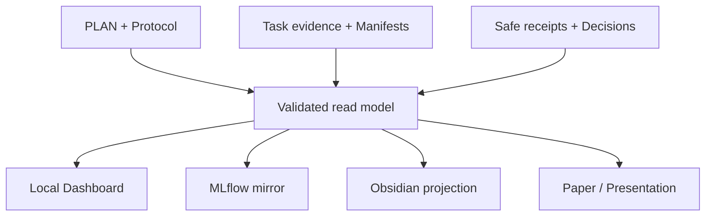
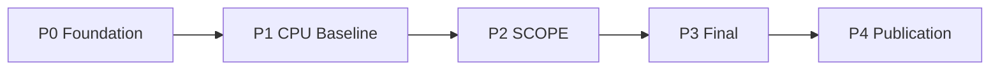
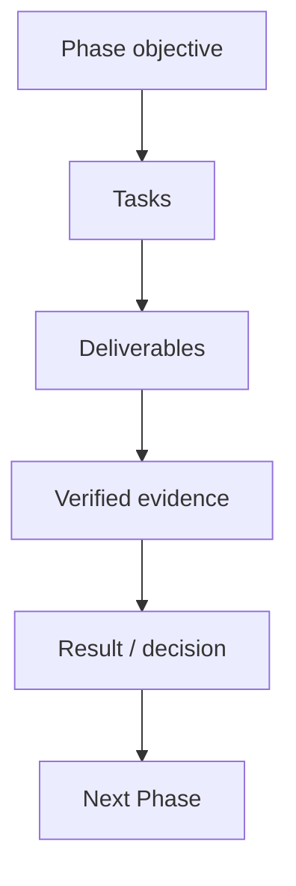
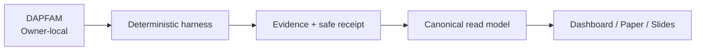

# myIS Research Command Center — Dashboard Design Specification

> Version 1.0 · Date 2026-07-30 · Thai-first · Target: local, loopback-only Owner Dashboard
>
> Visual reference: the user-provided Notion-style dashboard image
>
> Status: design authority for Dashboard UX/UI and projection contracts; it does not override `AGENTS.md`, `PLAN.md`, frozen protocols, schemas, manifests, receipts, or Owner decisions

---

## 1. Executive intent

Dashboard นี้ต้องทำหน้าที่พร้อมกัน 4 อย่าง:

1. **Owner cockpit** — ผู้ใช้ที่เป็น low-dev เปิดแล้วตอบได้ทันทีว่า “ตอนนี้อยู่ Phase ไหน ทำอะไรเสร็จแล้ว ติดอะไร และผมต้องทำอะไรต่อ”
2. **Research evidence viewer** — แสดง output, measured result, uncertainty, interpretation และ claim boundary จากหลักฐานจริง
3. **Project-management showcase** — แสดง WBS, Kanban, dependency, milestone, Stage Gate, RAID, Definition of Done, decision ledger และ resource tracking อย่างเป็นระบบ
4. **Presentation surface** — เปลี่ยนข้อมูลเดียวกันเป็น briefing สำหรับอาจารย์และเพื่อนระดับปริญญาโท โดยไม่ต้องทำสไลด์ใหม่ทุกครั้ง

Dashboard **ไม่ใช่ฐานข้อมูลผลวิจัยชุดใหม่** และไม่คำนวณ scientific result เอง แต่เป็น read-only projection จาก canonical evidence ที่ผ่านการตรวจสอบแล้ว

คำถาม 7 ข้อที่หน้าแรกต้องตอบได้ภายใน 30 วินาที:

1. งานวิจัยนี้แก้ปัญหาอะไร?
2. ตอนนี้อยู่ Phase/Task ใด?
3. อะไรเสร็จและมีหลักฐานแล้ว?
4. ผลจริงล่าสุดคืออะไร?
5. ผลนั้นแปลว่าอะไร?
6. ยังสรุปอะไรไม่ได้ และติด Gate/ความเสี่ยงใด?
7. Owner ต้องทำอะไรเป็นลำดับถัดไป?

---

## 2. Locked design decisions

| Decision | Specification |
|---|---|
| Product form | พัฒนาต่อยอด local web dashboard เดิม ไม่สร้างแอปคู่ขนาน และไม่พึ่ง Notion cloud |
| Canonical phase model | ใช้ `P0–P4` จาก active plan เท่านั้น; phase labels เก่าเป็น historical metadata |
| Default language | ภาษาไทยเป็นหลัก พร้อม English technical labels ที่จำเป็น |
| Default view | `Overview` แบบเอกสาร Notion-like พร้อม current phase, next action, phase spine และ right rail |
| Task experience | มี Simple Board `Planned → In Process → Done` และ PM Board แบบละเอียด |
| Completion authority | `Done` มาจาก acceptance evidence ที่ตรวจสอบแล้วเท่านั้น |
| Scientific truth | Git + immutable manifests/receipts/result bundles เป็น authority; Dashboard, MLflow และ Obsidian เป็น projections |
| Result policy | แสดงเฉพาะ aggregate ที่ allowlisted; ไม่เปิด raw qrels, query IDs, split membership หรือ per-query final outcomes |
| Presentation | มี `Owner`, `Advisor`, `Peer/PM` audience modes และ `Explore`, `Present`, `Print` delivery modes |
| Visual style | White document canvas, pale-grey section strips, thin dividers, minimal shadow, sparse status colors |
| Deployment | `127.0.0.1` only, same-origin assets, no CDN, no remote font, no analytics |
| Editing | Board เป็น read-only ใน MVP; Owner Gate write ใช้ preview + explicit confirm เท่านั้น |
| Live generation | ห้าม LLM สร้าง interpretation หรือ claim สดใน browser |

---

## 3. Authority and truth model

ลำดับ authority:

1. Owner instruction ใน session ปัจจุบัน
2. `AGENTS.md`
3. `PLAN.md` และ active protocol
4. Frozen schemas, manifests, task-evidence records, safe aggregate receipts และ immutable decisions
5. `DESIGN.md`
6. Dashboard/MLflow/Obsidian presentation configuration

กฎสำคัญ:

- ถ้า source ขัดกัน Dashboard ต้องแสดง `Projection conflict` และ fail closed
- ห้าม merge phase IDs หลายระบบเข้าด้วยกันแบบเงียบ ๆ
- Linear หรือ PM tracker ช่วยบอก “กำลังทำ” ได้ แต่ไม่มีสิทธิ์ประกาศ scientific completion
- Successful run ไม่เท่ากับ valid result
- Valid result ไม่เท่ากับ positive result
- Positive point estimate ไม่เท่ากับ confirmatory claim
- Gate approval ไม่เท่ากับ Task Done
- Task Done ไม่ได้เปิด final split โดยอัตโนมัติ



Frontend ต้องไม่ย้อนกลับไปแก้ source records ผ่านเส้นทางนี้

---

## 4. Users and jobs-to-be-done

### 4.1 Owner — low-dev researcher

ต้องการ:

- ข้อความสั้นและชัดว่าอยู่ตรงไหน
- ปุ่มเปิดงาน/เอกสารที่ต้องใช้ โดยไม่ต้องจำ path
- คำอธิบาย metric แบบภาษาคน
- แยก “ผลจริง”, “ผลทดลองเบื้องต้น”, “ยังไม่รัน” และ “ผลเก่า” ให้ชัด
- เห็น next action เพียง 1–3 รายการ
- เข้าใจผลกระทบก่อนอนุมัติ Gate

### 4.2 Advisor — technical and non-technical

ต้องการ:

- research question, gap, method และ contribution ที่ defend ได้
- สถานะ protocol และ split boundary
- result พร้อม uncertainty, controls และ limitations
- สิ่งที่กล่าวได้/กล่าวไม่ได้
- evidence link สำหรับตรวจสอบเพิ่มเติม

### 4.3 Peer / Project manager

ต้องการ:

- WBS: Phase → Task → Deliverable → Evidence
- Kanban และ WIP
- dependency และ critical path
- Stage Gate, decision log และ change control
- RAID: Risks, Assumptions, Issues, Dependencies
- Definition of Ready/Done
- resource/cost visibility
- traceability ตั้งแต่ Task ไปถึง output และ result

### 4.4 Agent / Developer

ต้องการ:

- typed read-model contract
- deterministic status rules
- explicit empty/error states
- acceptance criteria และ test cases
- ไม่ต้องตีความ scientific truth จาก DOM หรือข้อความอิสระ

---

## 5. Product principles

### 5.1 Evidence before decoration

ทุกตัวเลขและข้อสรุปต้องย้อนกลับไปยัง evidence record ได้ หากไม่มีหลักฐาน ให้แสดง `Not measured` แทนกราฟ placeholder

### 5.2 Progressive disclosure

หน้าแรกใช้ภาษาง่าย รายละเอียดเทคนิค เช่น SHA-256, protocol hash, model revision และ statistical table อยู่ใน expandable audit detail

### 5.3 Negative results are first-class results

สีเขียวหมายถึง “หลักฐาน valid/verified” ไม่ได้หมายถึง “metric ดีขึ้น” ผลลบที่ถูกต้องต้องแสดงเป็น verified finding ได้

### 5.4 One source, many views

Overview, Board, Result, Presentation, MLflow และ Paper ต้องอ่าน projection จาก evidence ชุดเดียวกัน

### 5.5 No fake precision

- ถ้าไม่มี target date ให้แสดง `ยังไม่กำหนดวัน` ไม่สร้างวันเอง
- ถ้าไม่มี cost receipt ให้แสดง `ยังไม่มีข้อมูลค่าใช้จ่าย`
- ถ้าไม่ได้กำหนด task weight ให้แสดง `6/10 tasks evidence-complete` ก่อนแสดง `60%`
- ห้ามใช้ confidence, risk score หรือ health score ที่ไม่มีนิยาม

### 5.6 Thai first, technical truth retained

ใช้ชื่อที่ Owner เข้าใจ และเก็บ identifier จริงไว้เป็นรอง เช่น:

```text
P1 — CPU Baseline
สร้างเส้นฐาน BM25 ที่ยุติธรรม
Technical ID: P1
```

---

## 6. Canonical phase story

Dashboard ต้องอ่าน phase registry จาก active plan แต่ UX หลักใช้ story ต่อไปนี้:

| Phase | Owner-facing purpose | Core outputs | Exit state / Gate |
|---|---|---|---|
| `P0 Foundation` | ทำให้ห้องทดลองน่าเชื่อถือและพร้อมรับข้อมูลจริง | schemas, deterministic kernel, preflight, owner-local runner, safe projections, tests | `P0_CLOSED` |
| `P1 CPU Baseline` | สร้างเส้นฐาน R0/R0-W และวัด candidate exposure อย่างถูกต้อง | BM25 indexes, run manifests, aggregate receipts, ALL/IN/OUT metrics | `P1_CPU_EXECUTABLE`, `P1_CPU_MEASURED_COMPLETE` หรือ `P1_BLOCKED_WITH_EVIDENCE` |
| `P2 SCOPE Development` | พัฒนาและเลือก structured patent representation โดยใช้ train/selection ตาม protocol | compiler/config, shortlist, selection receipt, ablations, robustness, cost/latency | shortlist/config freeze; optional paid-compute checkpoint แยก |
| `P3 Final Confirmation` | ทดสอบ final split ครั้งเดียวหลัง freeze | freeze audit, one-shot final results, paired CI, immutable evidence | `D2_OPEN_FINAL` ก่อนรัน |
| `P4 Publication` | เปลี่ยนหลักฐานเป็น paper, appendix, figures, presentation และ release | manuscript, tables, figures, reproducibility pack | `D3_SUBMIT_RELEASE` ก่อนส่งหรือเผยแพร่ |

กฎ migration:

- Phase identifiers เก่า เช่น `F0`, `F1`, `C0`, `R1`, `Paper A/B/D phase` ห้ามปรากฏใน current Kanban
- นำของเก่าไปไว้หน้า `Research History` และติด badge `Historical / exposed`
- ถ้า parser พบ current phase registry มากกว่าหนึ่งชุด ให้แสดง blocker และไม่คำนวณ overall progress

---

## 7. Information architecture

Sidebar ใช้หมวดแบบภาพอ้างอิง: heading strip สีเทาอ่อนและรายการเรียบง่าย

### NOW

- **Overview** — ภาพรวมและ Owner inbox
- **My Next Actions** — งานที่ Owner ต้องทำ 1–3 รายการ

### WORK

- **Board** — Notion-like Kanban
- **Phases** — Phase detail และ exit criteria
- **Timeline** — milestone/dependency/calendar

### RESEARCH

- **System Map** — ภาพรวมระบบและ data flow
- **Outputs & Results** — สิ่งที่สร้าง ผลจริง และการแปลผล
- **Evidence** — manifests, receipts, figures, reports
- **Data & Methods** — benchmark, split, metrics, experimental arms
- **Research History** — Paper A/B/D และบทเรียนที่ส่งต่อ

### GOVERNANCE

- **Gates & Decisions** — D2, D3 และ resource checkpoints
- **RAID Log** — risks, assumptions, issues, dependencies
- **Resources** — CPU/GPU/API/time/cost

### SHARE

- **Presentation** — Owner/Advisor/Peer modes

### REFERENCE

- **Glossary**
- **Notes / Obsidian**

MVP อาจซ่อนหน้ารองไว้ใต้ `More` แต่ route และ data contract ต้องรองรับตั้งแต่ต้น

---

## 8. Visual system

### 8.1 Visual direction

ถอดภาษาภาพจากไฟล์อ้างอิง:

- พื้นหลักสีขาวเหมือนหน้าเอกสาร
- sidebar เทาเกือบขาว
- section heading เป็นแถบเทาอ่อน
- เส้นคั่น 1 px
- card ใช้ border มากกว่า shadow
- พื้นที่ว่างมากพอให้อ่านง่าย
- สีสถานะเป็นจุด/badge ขนาดเล็ก ไม่ย้อมทั้งหน้า
- ไม่มี gradient, glassmorphism, neon หรือ dashboard gauge แบบ corporate template

คำที่ใช้อธิบาย theme:

> **Notion-like research notebook with evidence-grade project controls**

### 8.2 Design tokens

```css
:root {
  --canvas: #ffffff;
  --sidebar: #f7f7f5;
  --surface: #ffffff;
  --surface-subtle: #f8f9f8;
  --section-strip: #eef0f1;
  --ink: #2f3437;
  --ink-strong: #202124;
  --muted: #787774;
  --faint: #a3a3a0;
  --line: #e6e6e4;
  --line-strong: #d3d3d0;

  --accent: #356b68;
  --accent-soft: #e7f0ef;
  --info: #2f6fad;
  --info-soft: #eaf2fb;
  --success: #2f7a4f;
  --success-soft: #e7f3e9;
  --warning: #a46a13;
  --warning-soft: #fff4d6;
  --danger: #b23a3a;
  --danger-soft: #fdeaea;
  --purple: #7656a8;
  --purple-soft: #f0ebf8;

  --radius-sm: 4px;
  --radius-md: 7px;
  --shadow-float: 0 8px 24px rgb(15 23 42 / 8%);

  --sidebar-width: 228px;
  --right-rail-width: 320px;
  --content-max: 1520px;
}
```

### 8.3 Typography

ใช้ system fonts เท่านั้น:

```css
--font-body: "Segoe UI Variable Text", "Leelawadee UI", Tahoma, sans-serif;
--font-display: "Segoe UI Variable Display", "Leelawadee UI", Tahoma, sans-serif;
--font-mono: "Cascadia Mono", Consolas, monospace;
```

| Usage | Size | Weight |
|---|---:|---:|
| Page title | 32–36 px | 650–700 |
| Section title | 18–22 px | 600 |
| Card title | 14–16 px | 600 |
| Body | 14–16 px | 400 |
| Metadata | 12–13 px | 400–500 |
| Technical ID/hash | 11–12 px | mono |

Thai body line-height ต้องไม่น้อยกว่า `1.55`

### 8.4 Status color semantics

| Meaning | Color | Rule |
|---|---|---|
| Verified / Done | Green | ใช้เมื่อ evidence ผ่านเท่านั้น |
| Active / In Process | Blue | งานกำลังดำเนินการ |
| Waiting / Caution | Amber | รอ dependency, Gate หรือ review |
| Blocked / Invalid | Red | มี blocker หรือ evidence invalid |
| Historical / Superseded | Purple or grey | ไม่ใช่ current result |
| Planned / Not run | Neutral grey | ยังไม่มี measured evidence |

ห้ามใช้สีเขียวเพื่อสื่อว่าผล metric เป็นบวกโดยลำพัง

### 8.5 Iconography

- ใช้ local SVG line icons หรือ Unicode ที่ผ่าน accessibility review
- icon ต้องมี text label เสมอใน navigation
- หลีกเลี่ยง emoji เป็น icon หลัก เพื่อให้เหมาะกับการนำเสนอทางวิชาการ

---

## 9. Global shell and layout

### 9.1 Desktop ≥ 1280 px

| Zone | Width | Content |
|---|---:|---|
| Sidebar | 228 px fixed | grouped navigation, local-only indicator |
| Main | flexible | page title, phase spine, content |
| Right rail | 300–320 px | Today, Owner action, upcoming gate, latest evidence |

Overview ใช้สามคอลัมน์ตามภาพอ้างอิง ส่วนหน้าที่ต้องใช้พื้นที่ เช่น Board, Results และ Presentation สามารถซ่อน right rail

### 9.2 Compact desktop/tablet 768–1279 px

- sidebar ย่อเป็น icon rail หรือ drawer
- right rail ย้ายลงใต้ main content
- Kanban scroll แนวนอน
- tables มี sticky first column

### 9.3 Mobile < 768 px

- navigation เป็น drawer
- phase spine เปลี่ยนเป็น vertical list
- Simple Board เปลี่ยนเป็น status tabs
- result table แปลงเป็น cards
- Presentation แสดง preview พร้อมแนะนำ landscape/fullscreen

### 9.4 Top bar

ต้องมี:

- breadcrumb: `myIS / P1 / R0-W`
- page title
- `Last refreshed`
- projection health badge
- search
- `Present` shortcut
- refresh button

ไม่ควรมี global “Edit” เพราะ Dashboard ไม่ใช่ plan editor

---

## 10. Page specification

## 10.1 Overview — “Dashboard”

เป้าหมาย: เปิดหน้าเดียวแล้วเข้าใจสถานะ overall

### Above the fold

1. **Project title and thesis sentence**
2. **Current Phase card**
   - phase name
   - plain-language goal
   - state
   - evidence-complete tasks `x/y`
   - current Task
3. **Owner next action**
   - action verb
   - why it matters
   - expected output
   - button to open instruction/artifact
4. **Protocol boundary**
   - final sealed/open
   - paid compute allowed/not allowed
   - protected data state
   - current Git projection health

### Phase spine

แสดง P0–P4 ในแถวเดียว:



แต่ละ node แสดง:

- state dot
- completed/total Task
- exit state
- Gate badge
- click ไป Phase detail

### Main content grid

| Block | Purpose |
|---|---|
| Work in progress | Task ที่กำลังทำ สูงสุด 3 ใบ |
| Latest verified output | artifact ล่าสุดที่ตรวจแล้ว |
| Latest valid result | measured finding ล่าสุด หรือ `Not measured` |
| Interpretation | “แปลว่าอะไร” 2–4 บรรทัด |
| Blockers and risks | blocker ที่มี owner/action |
| Recent decisions | decision ledger ล่าสุด |
| Project health | Evidence, Scope, Schedule, Cost แยกกัน; ไม่รวมเป็นคะแนนลึกลับ |

### Right rail

เลียนแบบ `Today` และ `Agenda` จากภาพอ้างอิง:

- **Today**
  - Owner action
  - review due
  - launcher ที่เกี่ยวข้อง
- **Upcoming**
  - next milestone
  - Gate readiness
  - target date หรือ `Not scheduled`
- **Latest evidence**
  - friendly evidence name
  - validated time
  - detail link

---

## 10.2 My Next Actions

แสดงเฉพาะงานที่ Owner ต้องทำ ไม่ปะปนงานของ Agent

แต่ละ action ต้องมี:

- `Action`
- `Why now`
- `Input needed`
- `Safe instruction`
- `What will remain locked`
- `Estimated time`
- `Open launcher / Open guide`

เรียง priority:

1. safety/protocol blocker
2. Gate decision ที่พร้อมแล้ว
3. missing Owner-local input
4. review/approval
5. optional enhancement

ถ้า Owner ไม่ต้องทำอะไร ให้แสดง:

> Agent สามารถดำเนินงานถัดไปได้โดยไม่ต้องตัดสินใจจาก Owner

---

## 10.3 Board — Notion-like Phase/Task tracking

### Default: Simple Board

สามคอลัมน์ตามที่ Owner ต้องการ:

| Column | Contains | Card sub-status |
|---|---|---|
| `Planned` | งานยังไม่เริ่ม งานพร้อมเริ่ม หรืองานรอ dependency/Gate | Not ready, Ready, Waiting |
| `In Process` | งานกำลังทำหรือรอตรวจ evidence | Active, Verification |
| `Done` | งานที่ acceptance evidence ผ่าน | Evidence complete |

Blocked card คงอยู่ใน lifecycle column ที่เกี่ยวข้อง แต่มี red blocker ribbon และถูก pin ไว้บนสุด

### PM Board

เปิด toggle `Simple / PM Detail`

PM Detail มี 6 lanes:

1. `Not Ready`
2. `Ready`
3. `In Progress`
4. `Verification`
5. `Waiting / Blocked`
6. `Done`

Deterministic mapping:

| Canonical state | PM Detail lane |
|---|---|
| `waiting_dependency` | Not Ready |
| `ready` | Ready |
| `in_progress` | In Progress |
| `verification_needed` | Verification |
| `waiting_gate` | Waiting / Blocked |
| `blocked_gate` | Waiting / Blocked |
| `blocked` | Waiting / Blocked |
| `complete` | Done |

### Grouping and views

รองรับ:

- group by Phase
- group by Status
- group by Workstream
- filter by Owner/Agent, Gate, blocker, evidence role, compute profile
- Board / List / Timeline
- search by Task ID, title และ output

### Task card

แสดงบน card:

- Task ID + short title
- Phase
- one-line goal
- owner role
- priority
- dependency count
- Gate badge
- compute badge: CPU / GPU / API
- output count
- evidence state
- target date หากมี
- blocker หากมี

เปิด card เป็น side drawer ซึ่งมี:

- Goal
- Inputs
- Work steps
- Expected outputs
- Definition of Ready
- Definition of Done
- Acceptance checks
- Dependencies
- Risk / rollback / stop rule
- Evidence and result links
- Activity timeline
- Owner-friendly next action

### No drag-to-Done rule

MVP ไม่ให้ลาก card เพื่อเปลี่ยน canonical state

เหตุผล:

- ทำให้ tracking status กลายเป็น scientific truth โดยไม่ตั้งใจ
- bypass acceptance checks
- เสี่ยงให้ Gate approval และ Task completion สับสน

Future option อาจให้ drag เปลี่ยน `planning_status` ระหว่าง Planned/Ready/In Progress แต่:

- ต้องไม่เปลี่ยน `evidence_state`
- ต้องไม่ทำให้ `Done`
- ต้องบันทึกใน planning annotation แยกจาก canonical evidence
- UI ต้องแสดงว่าเป็น `PM tracking only`

---

## 10.4 Phase detail

แต่ละ Phase เป็นหน้าอ่านแบบ project charter ขนาดย่อม

### Header

- Phase name, purpose, current status
- evidence-complete tasks
- exit criterion
- Gate or checkpoint
- compute policy

### Sections

1. Why this Phase exists
2. Task list
3. Deliverables
4. Dependencies
5. Exit criteria
6. Current outputs
7. Results and interpretation
8. Risks and stop rules
9. Decision history
10. Presentation summary

### Phase output map



Phase `P3` ต้องแสดง confirmation boundary เด่นชัดและไม่มีปุ่มเปิด final หาก D2 ยังไม่ approved

---

## 10.5 Timeline

แสดง project milestones ไม่ใช่ activity log ทุกเหตุการณ์

Views:

- Milestone timeline
- Dependency timeline
- Calendar month

Milestones ขั้นต่ำ:

- P0 closed
- P1 executable
- P1 measured complete หรือ blocked
- P2 shortlist freeze
- P2 selection opened/closed
- P3 freeze audit
- D2 final approval
- final run
- manuscript freeze
- D3 submission approval

กฎ:

- ถ้าไม่มีวันที่ ห้ามเดา
- target date กับ actual date ต้องแยก
- schedule slip ต้องมี reason และ impact
- final split event ใช้สี/รูปแบบเฉพาะ

---

## 10.6 System Map

เป้าหมาย: อธิบาย overall system ให้คนไม่เห็น code ก็เข้าใจ

ต้องมี 3 levels:

1. **Executive map** — Data → Harness → Evidence → Dashboard/Paper
2. **Research pipeline** — R0, R0-W, R1/SCOPE, evaluator, receipts
3. **Technical audit map** — schemas, hashes, manifests, MLflow mirror, Owner-local boundary

Executive map:



ห้ามแสดง raw identifiers หรือ local absolute path ใน public/presentation mode

---

## 10.7 Outputs & Results

หน้านี้เป็นหัวใจของ Dashboard และต้องแยก 3 คำ:

| Term | Meaning | Example |
|---|---|---|
| **Output** | สิ่งที่สร้างหรือส่งมอบ | code, schema, index, manifest, figure, report |
| **Result** | ค่าหรือข้อค้นพบจาก measured run | Recall@100, delta, CI, stop verdict |
| **Interpretation** | ข้อความที่หลักฐานรองรับ | “candidate exposure ยังเป็นข้อจำกัด” |

### Result maturity filter

- `NOT_RUN`
- `FIXTURE_ONLY`
- `DEVELOPMENT`
- `SELECTION`
- `CONFIRMATION`
- `HISTORICAL_EXPOSED`
- `EXTERNAL_REFERENCE`
- `INVALID`
- `BLOCKED`

### Result page sections

1. **Key finding**
2. **Comparison table**
3. **ALL / IN / OUT**
4. **Effect and uncertainty**
5. **Controls**
6. **Exposure and headroom**
7. **Cost and latency**
8. **Failure taxonomy**
9. **Interpretation ledger**
10. **Evidence provenance**

### Standard result card

ทุก result card ต้องมี:

- result title
- benchmark and protocol
- split role
- run status and validity
- baseline
- method/arm
- primary metric
- delta
- confidence interval
- sample size
- statistical correction
- controls
- compute/cost
- plain-language interpretation
- `What this supports`
- `What this does not support`
- evidence label and audit detail

### Standard interpretation block

ใช้โครงสร้าง 4 ช่อง:

| Block | Required content |
|---|---|
| เกิดอะไรขึ้น | รายงานค่าที่สังเกตได้ ไม่ใส่เหตุผลเกินหลักฐาน |
| แปลว่าอะไร | conclusion ที่ protocol อนุญาต |
| ยังห้ามสรุปอะไร | overclaim guardrail |
| ทำอะไรต่อ | decision/next experiment ตาม gate และ stop rule |

### Scientific chart rules

ใช้ chart เมื่อช่วยสื่อสารความสัมพันธ์จริง:

- forest plot: delta + confidence interval
- grouped bars: ALL / IN / OUT
- exposure/headroom bars
- cost–accuracy Pareto
- phase output timeline

ไม่ใช้:

- speedometer gauge
- 3D chart
- pie chart สำหรับ metric comparison
- chart placeholder ที่ดูเหมือน measured result
- truncated axis ที่ขยาย gain เล็กเกินจริง

publication figure ควรถูกสร้างจาก plotting pipeline เดียวกับ paper และลงทะเบียน SHA-256; Dashboard แสดง artifact เดิม ไม่วาดผลใหม่จากสูตรใน browser

---

## 10.8 Research History

หน้านี้เก็บ story ของ Paper A/B/D และเหตุผลที่เปลี่ยนมาสู่ SCOPE โดยไม่ปะปนกับ current progress

แนะนำ timeline:

| Study | Tested surface | Evidence-level takeaway | Handoff |
|---|---|---|---|
| Paper A | Query rewriting | query-side leverage ต่ำภายใต้ setup ที่วัด | ต้องตรวจ headroom ก่อน optimize |
| Paper B | Prompted reranking | low sensitivity / control behavior ทำให้ STOP | อย่าตีความ point estimate เป็น leverage |
| Paper D | Fixed-pool scalar reranking | instruction optimization ไม่ให้ confirmatory gain; pool/exposure สำคัญ | ย้าย focus ไป candidate acquisition |
| Current SCOPE | Structured candidate representation | `NOT_RUN` จนกว่าจะมี measured evidence | ทดสอบ R0/R0-W ก่อน R1 |

ข้อกำหนด:

- actual metrics ต้องอ่านจาก verified historical bundles
- ติด badge `Historical / exposed`
- แยก “lesson inherited” จาก “current result”
- ห้ามนำ historical test exposure มาอ้างว่า current final split globally untouched

---

## 10.9 Evidence

แสดง evidence ด้วยชื่อที่คนอ่านเข้าใจ ก่อนแสดง technical ID

Filters:

- Phase
- Task
- evidence role
- status
- artifact type
- current/superseded

Evidence card:

- friendly name
- task/phase
- role: fixture, development, selection, confirmation, historical
- status: verified, stale, superseded, invalid
- produced at
- git commit
- manifest hash
- safe summary
- source/output links
- used by results/presentation

Technical detail อยู่ใน `<details>`:

- exact schema version
- exact SHA-256
- lineage parents
- validation checks
- supersession chain

ห้ามสร้าง generic filesystem browser

---

## 10.10 Data & Methods

แบ่งเป็น tabs:

1. Dataset
2. Split
3. Retrieval arms
4. Metrics
5. Statistical plan
6. Leakage controls
7. Compute profiles

### Dataset panel

แสดง aggregate metadata:

- 45,336 patent families
- 1,247 queries
- 49,869 relation rows
- fields available
- family-level evaluation
- license/provenance status

ตัวเลขต้องอ่านจาก certified dataset receipt ไม่ hard-code ใน frontend

### Split panel

แสดง counts เท่านั้น:

- train 250
- selection 125
- final 872

และข้อความ:

> Raw IDs and split membership remain sealed in the Owner-local store.

### Metric glossary

ใช้ plain-language card:

- Recall@100 — ใน 100 อันดับแรก ระบบดึง relevant families กลับมาได้มากเพียงใด
- nDCG — relevant families อยู่สูงใน ranking เพียงใด
- CI — ช่วงความไม่แน่นอนของผลต่าง
- OUT — กรณีข้ามกลุ่มเทคโนโลยี ซึ่งเป็นข้อท้าทายหลัก

ระบุทุกครั้งว่า retrieval metric ไม่ใช่ legal correctness

---

## 10.11 Gates & Decisions

แสดง Stage Gate แบบ PM แต่คง scientific boundary

### Gate types

| Type | Example | Meaning |
|---|---|---|
| Scientific | `D2_OPEN_FINAL` | อนุมัติเปิด final หลัง freeze |
| Release | `D3_SUBMIT_RELEASE` | อนุมัติส่งหรือเผยแพร่ |
| Resource checkpoint | GPU/API/data egress | อนุมัติงบหรือการใช้ทรัพยากร; ไม่เปลี่ยนผลวิจัย |

Gate detail:

- decision question
- scope
- prerequisites
- evidence package
- what approval unlocks
- what remains locked
- budget
- risks
- preview sentence
- immutable decision history

Gate write flow:


ไม่มี quick approve และไม่มี bulk approve

---

## 10.12 RAID Log

RAID ย่อมาจาก:

- **Risk** — เหตุการณ์ที่อาจเกิด
- **Assumption** — สิ่งที่แผนกำลังสมมติ
- **Issue** — ปัญหาที่เกิดแล้ว
- **Dependency** — สิ่งที่ต้องพึ่งพา

แต่ละรายการ:

- ID
- type
- concise statement
- probability/impact เฉพาะเมื่อมี rubric
- owner
- affected Phase/Task
- response/mitigation
- trigger
- due date หากมี
- current status
- evidence/decision link

Dashboard ห้ามคำนวณ overall “risk score” หาก rubric ยังไม่ถูก freeze

รายการที่ควรเห็นเป็นตัวอย่าง:

- legacy DAPFAM lineage ยังไม่ certified
- historical exposure ของ Paper A/B/D
- protected split boundary
- CPU runtime/capacity
- optional GPU/API budget
- final split one-shot risk
- publication claim overreach

---

## 10.13 Resources

แสดง:

- CPU hours
- GPU hours approved/used/remaining
- API cost approved/used/remaining
- storage
- run latency
- cache reuse
- failed/retried runs

แยก:

- planned budget
- approved budget
- actual receipt
- forecast

ถ้าไม่มี receipt ห้ามนับ estimate เป็น actual

---

## 10.14 Presentation

### Audience modes

| Mode | Focus |
|---|---|
| Owner | สถานะ, next action, risk, budget |
| Advisor | gap, method, validity, result, limitation |
| Peer / PM | WBS, Kanban, gates, RAID, evidence traceability, lessons |

### Delivery modes

- `Explore` — scroll และเปิด detail ได้
- `Present` — 16:9, one message per screen, arrow-key navigation
- `Print` — print stylesheet สำหรับ PDF/handout

### Recommended 10-screen story

1. **Title and thesis question**
2. **Why patent prior-art retrieval is difficult**
3. **Dataset and evaluation boundary**
4. **Research history: A → B → D → SCOPE**
5. **Overall system architecture**
6. **Project plan P0–P4**
7. **What has been delivered**
8. **Latest valid results**
9. **Interpretation, limitations and governance**
10. **Current state, next action and decision request**

### Advisor mode additions

- protocol and split
- baseline comparability
- ALL/IN/OUT
- confidence interval and controls
- claim ledger

### Peer / PM mode additions

- WBS and phase board
- Definition of Done
- Stage Gate
- RAID
- change/decision ledger
- resource control
- retrospective: why STOP can be successful governance

### Presentation safety

- current snapshot timestamp visible
- evidence label in footer
- no raw query IDs or local paths
- `NOT_RUN` must be visually explicit
- historical result badge
- claims must come from reviewed interpretation fields
- presenter mode must not expose technical hashes unless user opens audit detail

### Controls

- fullscreen
- previous/next
- progress `3 / 10`
- audience selector before entering Present
- optional speaker notes in presenter-only panel
- print/export

---

## 11. Task and status model

### 11.1 Canonical task states

| State | Meaning |
|---|---|
| `waiting_dependency` | dependency ยังไม่ complete |
| `waiting_gate` | รอ Gate ที่เกี่ยวข้อง |
| `ready` | prerequisites ผ่านและเริ่มได้ |
| `in_progress` | tracking source ระบุว่ากำลังทำ |
| `verification_needed` | output มีแล้วแต่ evidence/acceptance ยังไม่ครบ หรือ tracker บอก Done แต่หลักฐานไม่ผ่าน |
| `blocked_gate` | Gate rejected/deferred/conflict |
| `blocked` | blocker อื่นที่มี evidence |
| `complete` | acceptance evidence ผ่านตาม canonical contract |

### 11.2 Simple Board mapping

| Canonical state | Simple lane |
|---|---|
| `waiting_dependency` | Planned |
| `waiting_gate` | Planned |
| `ready` | Planned |
| `in_progress` | In Process |
| `verification_needed` | In Process |
| `blocked_gate` | Planned + Blocked ribbon |
| `blocked` | ใช้ `last_nonblocked_state`: In Process หากเคยเริ่มแล้ว มิฉะนั้น Planned; ถ้า field หายให้ Planned และแสดง projection warning |
| `complete` | Done |

### 11.3 Done criteria

Task แสดง `Done` ได้เมื่อ:

1. required outputs มีอยู่จริง
2. output paths อยู่ใน allowlist
3. acceptance checks ผ่านทั้งหมด
4. task-evidence record ถูก validate
5. plan hash และ git commit binding ถูกต้อง
6. evidence manifest chain ถูกต้อง
7. projection ไม่มี conflict/stale state

`Linear = Done` โดยไม่มี evidence ต้องแสดง `Verification needed`

### 11.4 Phase states

| State | Rule |
|---|---|
| `locked` | dependency/Gate ยังไม่อนุญาต |
| `ready` | เริ่ม Phase ได้ |
| `active` | มี Task in progress |
| `verifying` | งานหลักเสร็จแต่ exit evidence ยังไม่ครบ |
| `blocked` | มี Phase-level blocker |
| `closed` | exit evidence ผ่าน |
| `closed_waiting_gate` | work complete แต่รอ Gate ถัดไป |

---

## 12. PM model

### 12.1 Work Breakdown Structure

```text
Program
  Phase
    Work package / Task
      Deliverable
        Evidence
          Result / Decision
```

Dashboard ต้องรักษา traceability นี้ทั้งสองทิศ:

- จาก Task ไป output/result
- จาก result ย้อนกลับไป Task, run และ evidence

### 12.2 Definition of Ready

Task พร้อมเริ่มเมื่อ:

- dependencies ผ่าน
- inputs พร้อม
- protocol/version ชัด
- compute/data permission พร้อม
- stop rule ชัด
- output/evidence contract ชัด

### 12.3 Definition of Done

ไม่ใช่ “code รันได้” แต่ต้อง:

- output ครบ
- tests ผ่าน
- evidence immutable
- safe projection refreshed
- limitations/blockers documented
- next state derived

### 12.4 WIP

- default WIP limit: 3 active Tasks
- ถ้าเกิน ให้เตือน `WIP limit exceeded`
- WIP limit เป็น PM advisory ไม่ใช่ scientific blocker

### 12.5 Dependencies and critical path

- solid edge = blocking dependency
- dotted edge = informative relationship
- optional branch ต้องไม่อยู่บน critical path ของ paper หลัก
- SkillOpt/GPU/dense extensions ต้องแสดงเป็น conditional branch

### 12.6 Change control

แสดง:

- protocol version changes
- scope changes
- superseded evidence
- Owner decisions
- reason and impact

ห้ามแก้ historical record เดิม; ใช้ supersession chain

---

## 13. Result and interpretation contract

### 13.1 Result validity

แยก 3 แกน:

| Axis | Values |
|---|---|
| Run status | valid, invalid, blocked, exploratory |
| Split role | fixture, train/development, selection, confirmation, historical_exposed |
| Claim level | none, descriptive, exploratory, confirmatory, publication_ready |

### 13.2 Minimal result record

```json
{
  "schema_version": "myis.dashboard-result.v2",
  "result_id": "P1-R0W-SELECTION-001",
  "phase_id": "P1",
  "task_id": "P1.3",
  "title_th": "ผล R0-W บน selection",
  "run_id": "immutable-run-id",
  "run_status": "valid",
  "split_role": "selection",
  "claim_level": "descriptive",
  "benchmark": "DAPFAM",
  "protocol_sha256": "64-hex",
  "metrics": [
    {
      "name": "Recall@100",
      "slice": "OUT",
      "value": 0.0,
      "display_precision": 4
    }
  ],
  "comparison": {
    "baseline_result_id": "P1-R0-SELECTION-001",
    "delta": 0.0,
    "ci_low": 0.0,
    "ci_high": 0.0,
    "correction": "none"
  },
  "interpretation": {
    "observed_th": "ข้อความที่ผ่าน review",
    "means_th": "ข้อความที่ protocol รองรับ",
    "does_not_mean_th": "ข้อกล่าวอ้างที่ยังไม่รองรับ",
    "next_th": "การตัดสินใจถัดไป"
  },
  "evidence_manifest_sha256": "64-hex"
}
```

ค่าตัวเลขในตัวอย่างเป็น schema placeholder เท่านั้น ห้ามใช้เป็น scientific result

### 13.3 Interpretation authoring

- interpretation เป็น versioned, reviewed content
- ต้องมี evidence link
- live browser ห้ามเรียก LLM มาเขียนใหม่
- ถ้า result ถูก supersede interpretation ต้องถูก supersede ด้วย
- Dashboard สามารถสลับ Thai/English copy ที่ review แล้ว

### 13.4 Claim ledger

ทุก study/result group ต้องมี:

| Supported now | Not supported yet |
|---|---|
| statements ที่ evidence รองรับ | overclaim ที่ห้ามใช้ |

Presentation ใช้ ledger เดียวกัน

---

## 14. Output and artifact contract

Minimal output record:

```json
{
  "artifact_id": "artifact-p1-r0w-manifest",
  "phase_id": "P1",
  "task_id": "P1.3",
  "title_th": "R0-W run manifest",
  "artifact_type": "manifest",
  "role": "selection",
  "status": "verified",
  "relative_path": "allowlisted/relative/path.json",
  "sha256": "64-hex",
  "produced_at": "ISO-8601",
  "git_commit": "commit-or-external-bundle-pointer",
  "safe_to_present": false
}
```

Rules:

- ใช้ relative allowlisted path
- ไม่แสดง absolute Owner-local paths
- large artifact ใช้ pointer ไม่ copy เข้า Git
- verified figure/PDF เปิดได้ผ่าน hash-bound endpoint
- unsupported extension ไม่เปิดใน browser

---

## 15. Dashboard read model

### 15.1 Single read model

Backend ควรสร้าง `dashboard_snapshot.v2.json` แบบ deterministic จาก canonical inputs

Top-level shape:

```json
{
  "schema_version": "myis.dashboard-snapshot.v2",
  "generated_at": "ISO-8601",
  "project": {},
  "projection_health": {},
  "owner_inbox": [],
  "progress": {},
  "phases": [],
  "tasks": [],
  "milestones": [],
  "outputs": [],
  "results": [],
  "interpretations": [],
  "gates": [],
  "decisions": [],
  "raid": [],
  "resources": {},
  "presentation": {}
}
```

Frontend:

- render เท่านั้น
- ไม่คำนวณ scientific metrics
- คำนวณ layout/filter/sort ได้
- progress count ต้องมาจาก validated task state

### 15.2 Source bindings

| Read-model section | Canonical source |
|---|---|
| phases/tasks | active `PLAN.md` + typed phase registry |
| completion | task-evidence records |
| tracking | Linear/local PM projection; advisory only |
| outputs | artifact/evidence catalog |
| results | immutable result bundles + safe aggregate receipts |
| interpretation | reviewed interpretation registry |
| gates/decisions | Owner gate authority + immutable ledger |
| cost/resources | run receipts and approved budget records |
| presentation | allowlisted topic/story registry |
| notes | curated Obsidian projection |

### 15.3 API evolution

รักษา existing `/api/v1/*` ระหว่าง migration และเพิ่ม:

| Endpoint | Purpose |
|---|---|
| `GET /api/v2/snapshot` | complete validated read model |
| `GET /api/v2/overview` | small landing projection |
| `GET /api/v2/board` | tasks and status mappings |
| `GET /api/v2/phases/{phase_id}` | phase detail |
| `GET /api/v2/results` | safe aggregate result records |
| `GET /api/v2/presentation/{audience}` | presentation-safe story |
| `GET /api/v2/raid` | safe PM log |

API ทุกตัว same-origin และ read-only ยกเว้น existing typed Gate preview/confirm flow

---

## 16. Interaction specification

### 16.1 Search

ค้นได้จาก:

- phase/task ID
- title
- output
- evidence label
- result
- glossary term

ไม่ค้น raw protected data

### 16.2 Filters

Filter state ต้องอยู่ใน URL เพื่อแชร์/กลับมาเปิดซ้ำได้ เช่น:

```text
#/board?phase=P1&status=in_progress
#/results?role=selection&slice=OUT
```

### 16.3 Task drawer

- เปิดโดย click หรือ Enter
- focus trap
- Escape ปิด
- deep link ได้
- back button คืน filter state

### 16.4 Refresh

- auto refresh ทุก 60 วินาทีเมื่อ tab visible
- แสดง `Generated at` และ `Data age`
- ถ้า refresh fail ให้คง snapshot เดิมพร้อม stale warning
- ห้ามซ่อน stale state

### 16.5 Empty states

| Situation | Copy |
|---|---|
| no measured result | `ยังไม่มีผลการทดลองที่ตรวจสอบแล้วใน Phase นี้` |
| no next Owner action | `ขณะนี้ Agent ดำเนินงานต่อได้โดยไม่ต้องตัดสินใจจาก Owner` |
| no schedule | `ยังไม่กำหนด target date` |
| phase locked | `Phase นี้ยังล็อกตาม protocol` |
| blocked | แสดง blocker, impact, owner และ recovery action |

---

## 17. Presentation content model

Presentation screen record:

```json
{
  "screen_id": "advisor-08-latest-results",
  "audience": ["advisor"],
  "order": 8,
  "title_th": "ผลที่ตรวจสอบแล้วล่าสุด",
  "message_th": "หนึ่งข้อสรุปหลักต่อหนึ่งจอ",
  "visual_artifact_id": "figure-id-or-null",
  "evidence_ids": ["evidence-id"],
  "speaker_notes_th": "คำอธิบายเพิ่มเติม",
  "safe_to_present": true
}
```

กฎ:

- one screen, one message
- body ไม่เกินประมาณ 60–90 คำใน Present mode
- chart ต้องมี takeaway caption
- evidence footer อ่านได้แต่ไม่รบกวนสายตา
- speaker notes ไม่แสดงบนจอหลัก
- screen ที่ใช้ result ต้อง inherit maturity/claim badges

---

## 18. Security and privacy

### 18.1 Network boundary

- bind เฉพาะ `127.0.0.1`
- no remote bind option
- no CDN, remote font, analytics, telemetry
- same-origin API/assets
- strict Content Security Policy

### 18.2 Protected data denylist

Dashboard และ logs ห้ามแสดง:

- raw qrels
- query IDs
- split membership
- per-query final outcomes
- final rankings
- protected prompts/content ที่ไม่ allowlist
- secrets, tokens, API keys
- absolute Owner-local paths
- unapproved model inputs/outputs

### 18.3 Artifact access

- allowlist path
- reject symlink traversal
- verify SHA-256 before serving
- explicit MIME allowlist
- sanitize Markdown/HTML
- no arbitrary filesystem browse

### 18.4 Presentation-safe projection

Presentation API ใช้ projection แยกที่:

- ตัด technical paths
- ตัด hidden metadata
- ตัด protected counts หาก policy ไม่อนุญาต
- แสดง friendly evidence labels
- เก็บ claim and maturity badges

### 18.5 Fail-closed cases

- plan hash mismatch
- schema validation failure
- evidence chain conflict
- mixed phase authority
- final boundary ambiguity
- result without manifest
- unsafe path
- stale/superseded result marked current

---

## 19. Accessibility

ขั้นต่ำ:

- WCAG 2.2 AA contrast
- keyboard navigation ทุก action
- visible focus
- skip link
- semantic landmarks, headings, tables, dialogs
- status ไม่สื่อด้วยสีเพียงอย่างเดียว
- chart มี data table หรือ text alternative
- reduced motion
- Thai screen-reader labels
- touch target อย่างน้อย 40 × 40 px
- board ใช้ list view ได้สำหรับ screen reader

Presentation:

- font body ไม่น้อยกว่า 24 px ใน 16:9
- chart label อ่านได้ที่ 1366 × 768
- captions ไม่พึ่งสี

---

## 20. Performance and reliability

- initial local load target < 2 seconds บน Owner Core i5 สำหรับ cached snapshot
- overview payload target < 300 KB
- full snapshot target < 2 MB; artifact bytes แยก endpoint
- no raw large JSON in DOM
- cache static assets by content hash
- do not cache scientific snapshot indefinitely
- graceful stale mode
- projection builder deterministic

---

## 21. Implementation plan

## Milestone M0 — Design and authority freeze

- approve `DESIGN.md`
- confirm P0–P4 phase registry
- confirm status mapping
- confirm protected-field denylist
- confirm interpretation owner/reviewer

Exit: no unresolved conflict between Plan, Dashboard and evidence model

## Milestone M1 — Read model v2

- define schemas
- build deterministic snapshot
- import task/evidence state
- add output/result/interpretation registries
- add security validation
- retain v1 compatibility tests

Exit: fixture snapshot and one safe historical bundle round-trip

## Milestone M2 — Notion-like shell and Overview

- replace visual tokens with neutral theme
- implement grouped sidebar
- implement three-column Overview
- add P0–P4 phase spine
- add right rail
- implement projection health and empty states

Exit: Owner answers seven key questions from Overview

## Milestone M3 — Board, Phase and PM views

- Simple Board
- PM Detail Board
- task drawer
- phase detail
- timeline
- RAID
- WIP and dependency visualization

Exit: every Task traces to output/evidence and Done cannot be spoofed

## Milestone M4 — Outputs, Results and Interpretation

- result maturity filters
- standard result card
- ALL/IN/OUT comparison
- CI/control display
- claim ledger
- historical A/B/D migration

Exit: latest valid result and limitations render from canonical evidence only

## Milestone M5 — Presentation

- audience modes
- Explore/Present/Print
- 10-screen story
- safe projection
- keyboard controls and print CSS

Exit: advisor and peer presentation can run offline without manual copy/paste

## Milestone M6 — Verification and handoff

- security tests
- schema and lineage tests
- UI and accessibility tests
- responsive visual QA
- launcher update
- user guide
- screenshot/reference pack

Exit: production-ready local dashboard with reproducible build and closeout evidence

---

## 22. Repository change map

พัฒนาต่อยอดโครงสร้างเดิม:

| Area | Expected change |
|---|---|
| `06_frontend/dashboard/index.html` | grouped navigation, new page containers, presentation shell |
| `06_frontend/dashboard/assets/tokens.css` | neutral Notion-like tokens |
| `06_frontend/dashboard/assets/dashboard.css` | layout, board, results, print/present styles |
| `06_frontend/dashboard/assets/dashboard.js` | view routing, filtering, drawers, present controls |
| `05_code/src/myis_research/dashboard/` | snapshot v2, result/RAID projections, safe endpoints |
| `00_governance/config/` | active phase, output, interpretation, presentation registries |
| `00_governance/schemas/` | typed v2 schemas |
| `04_outputs/artifacts/` | immutable task/result evidence only |
| `06_frontend/dashboard/README.md` | low-dev launch/use guide |

ห้าม:

- สร้าง second dashboard app โดยไม่จำเป็น
- เปลี่ยน scientific plan ผ่าน frontend
- copy protected dataset เข้า Git
- hard-code current metrics ใน JavaScript/HTML

---

## 23. Test strategy

### 23.1 Contract tests

- phase parser accepts only active P0–P4 registry
- mixed legacy/current phase IDs fail closed
- task state mapping deterministic
- Done requires valid evidence
- result record requires manifest hash
- superseded result cannot be current
- interpretation must reference evidence

### 23.2 Scientific-boundary tests

- no raw qrels
- no query IDs
- no split membership
- no per-query final outcomes
- no final result before D2
- `NOT_RUN` never renders as measured chart
- historical exposure badge always visible

### 23.3 PM tests

- Simple and PM Board contain identical Task set
- filters do not change state
- WIP count correct
- blocking dependency visible
- Gate approval and Done remain separate
- unknown date renders `Not scheduled`

### 23.4 UI tests

- desktop 1920 × 1080
- compact 1366 × 768
- tablet 1024 × 768
- mobile 390 × 844
- keyboard-only flow
- screen-reader landmarks
- reduced motion
- print and 16:9 present mode

### 23.5 Security tests

- remote bind rejected
- path traversal rejected
- symlink artifact rejected
- hash mismatch rejected
- unsafe MIME rejected
- inline/remote scripts and styles rejected
- stale snapshot warning visible

### 23.6 Visual regression checklist

- no accidental horizontal scroll outside Board/table
- Thai text not clipped
- status readable without color
- right rail aligns with main page
- 16:9 screen has no vertical overflow
- result chart labels remain legible

---

## 24. Acceptance criteria

Dashboard v1.0 ถือว่าสำเร็จเมื่อ:

1. หน้าแรกแสดง current Phase/Task จาก canonical state
2. Owner เห็น next action ไม่เกิน 3 รายการ
3. P0–P4 phase spine แสดง dependency และ Gate ถูกต้อง
4. Simple Board แสดง `Planned → In Process → Done`
5. PM Board แสดง detailed states, WIP, dependency และ blockers
6. Task จะเป็น Done ได้เฉพาะเมื่อ evidence ผ่าน
7. output, result และ interpretation แยกจากกัน
8. latest valid result แสดง metric, uncertainty, controls และ claim boundary
9. `NOT_RUN`, fixture, development, selection, confirmation และ historical แยกได้ทันที
10. historical Paper A/B/D ไม่ปะปนกับ current progress
11. presentation มี Owner/Advisor/Peer modes
12. Presentation ใช้ evidence เดียวกับ Result page
13. ไม่มี protected field รั่วใน API, DOM, logs หรือ print output
14. Dashboard เปิด local ผ่าน one-click launcher
15. validation suite ผ่านและมี immutable closeout evidence

---

## 25. MVP and deferred features

### MVP — implement first

- Overview
- phase spine
- Owner inbox/right rail
- Simple + PM Board
- Task drawer
- Phase detail
- Outputs & Results
- Evidence
- Gates & Decisions
- Presentation Explore/Present/Print
- security/accessibility baseline

### V1.1

- Timeline/calendar
- RAID page
- resource/cost page
- historical study timeline
- richer chart gallery
- saved local filters

### Deferred

- editable PM planning layer
- drag-and-drop planning status
- multi-user collaboration
- cloud deployment
- automatic email/calendar integration
- live LLM-generated summaries
- dark mode

---

## 26. Suggested Thai UI copy

| Technical label | Owner-facing Thai |
|---|---|
| Overview | ภาพรวม |
| Planned | ยังไม่เริ่ม |
| In Process | กำลังดำเนินการ |
| Verification | รอตรวจหลักฐาน |
| Blocked | ติดข้อจำกัด |
| Done | เสร็จพร้อมหลักฐาน |
| Gate | จุดตัดสินใจ |
| Evidence | หลักฐาน |
| Output | สิ่งที่ส่งมอบ |
| Result | ผลที่วัดได้ |
| Interpretation | การแปลผล |
| Claim boundary | ขอบเขตข้อสรุป |
| Not run | ยังไม่รัน |
| Historical exposed | ผลเก่าที่เคยเปิดดูแล้ว |
| Confirmation | ผลยืนยันหลัง freeze |
| Owner action | สิ่งที่ Owner ต้องทำ |
| Projection health | ความพร้อมของหน้าสรุป |
| Not scheduled | ยังไม่กำหนดวัน |

ตัวอย่าง current-state sentence:

> ตอนนี้โครงการอยู่ที่ **P1 — CPU Baseline** งานโครงสร้างพร้อมแล้ว แต่ผล measured จะแสดงต่อเมื่อ receipt ผ่านการตรวจสอบ

ตัวอย่าง negative-result sentence:

> ผลนี้เป็นหลักฐานที่ valid แต่ไม่พบการปรับปรุงตามเกณฑ์ที่กำหนด จึงใช้ตัดสินใจหยุดหรือเปลี่ยนจุดพัฒนา ไม่ใช่สรุปว่าวิธีดังกล่าวใช้ไม่ได้ในทุกบริบท

---

## 27. Non-goals

Dashboard นี้ไม่ทำหน้าที่:

- เป็น legal opinion system
- ตัดสิน novelty, infringement, validity หรือ FTO
- เปิด protected data
- แทน MLflow artifact store
- แทน Git หรือ immutable result bundles
- แก้ Plan ผ่าน drag-and-drop
- สร้างผลวิจัยหรือ interpretation ด้วย LLM แบบสด
- เปลี่ยน Gate โดยไม่มี explicit confirmation
- อ้าง SOTA จาก external number ที่ protocol เทียบไม่ได้

---

## 28. Implementation handoff for Codex

ก่อนเริ่ม implement:

1. อ่าน `AGENTS.md`, active `PLAN.md`, Owner Gate authority, operations และ Dashboard README
2. ตรวจ Git status และรักษา unrelated user changes
3. ยืนยันว่า active phase registry คือ P0–P4 เพียงชุดเดียว
4. inventory existing Dashboard v1 และ reuse backend/security behavior
5. สร้าง schema/read-model tests ก่อนแก้ UI
6. implement ทีละ milestone M1–M6
7. ห้ามเปิด protected data, final split, GPU หรือ paid API เพื่อทำ Dashboard
8. ห้าม hard-code scientific results
9. ใช้ fixture/safe aggregate receipts สำหรับ tests
10. หยุดเมื่อพบ authority conflict และรายงาน exact blocker

Closeout report ต้องระบุ:

- changed files
- screenshots by viewport
- tests run and results
- security/leakage checks
- source bindings
- known limitations
- current Phase/Task projection
- one concrete next action for Owner

---

## 29. Final design statement

Dashboard ที่ดีสำหรับโครงการนี้ไม่ควรเป็นเพียงหน้าแสดงกราฟ แต่ต้องทำให้เห็นว่า:

> **งานใดถูกวางแผน งานใดกำลังทำ งานใดเสร็จพร้อมหลักฐาน ผลที่วัดได้บอกอะไร และเหตุใดการตัดสินใจแต่ละครั้งจึงน่าเชื่อถือ**

Visual style แบบ Notion ทำให้เข้าถึงง่าย ส่วน evidence contract, Stage Gate และ traceability ทำให้เหมาะกับทั้งงานวิจัยและการนำเสนอทักษะ Project Management
