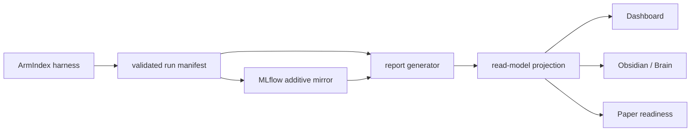

# myIS Research Dashboard

The Dashboard is a loopback-only presentation and owner console. It reads the
canonical `projections/read-model/read-model.v2.json` contract through the
Research API and never becomes a source of metrics, evidence, or approval.

## Views

- Overview: current phase/task, up to three next actions, projection health,
  A0-A6 ArmIndex phase spine, five arms, cost, readiness, and Owner inbox.
- Execution: Simple and PM boards, task detail, dependencies, WIP, phase
  detail, milestone timeline, and RAID state.
- Results: separate Output, Result, and Interpretation registries with evidence
  maturity filters and explicit empty states.
- Evidence: manifest, experiment, metric, receipt, artifact, and safe dataset
  pointers.
- Governance: D2/D3 gates, risks, assumptions, issues, dependencies, resources,
  and immutable decision history.
- Reports: hash-verified Obsidian notes with allowlisted filters and exact-note
  open actions.
- Research Tools: fixed actions for the read-only MLflow archive and the
  canonical Obsidian reporting vault.
- Presentation: ten read-model-derived screens with Owner, Advisor, and Peer
  audiences plus Explore, Present, and Print modes.

## Data boundary

The Dashboard is read-only for artifacts and research results. Decision
endpoints only create an explicit preview and append an immutable D2/D3 record
after confirmation. Tool actions accept fixed IDs only; they cannot choose an
arbitrary path, command, or URI.

## Launch

Use `dashboard/open-dashboard.cmd` for a one-click local start. It reuses a
healthy existing instance, refuses an unknown process on the configured port,
and rolls back a child process that fails health validation. The app binds to
`127.0.0.1` and uses the repository's locked `uv` environment.

This is the only user-facing start launcher. Start/open MLflow and Obsidian
from **Research Tools** or from a hash-verified report. The MLflow viewer starts
only on demand and never writes its external SQLite database.

The launcher reuses a listener only when `/healthz` advertises the current
`myis.dashboard-api.v2` contract. An older same-project Dashboard is treated as
an unknown listener instead of being reused with an incompatible frontend.

The `/api/v1` read routes are compatibility aliases. The v2 shared read model
contains one versioned `armindex` fragment while retaining historical SCOPE/P1
records. `/api/v2/armindex` exposes only the active ArmIndex state.
