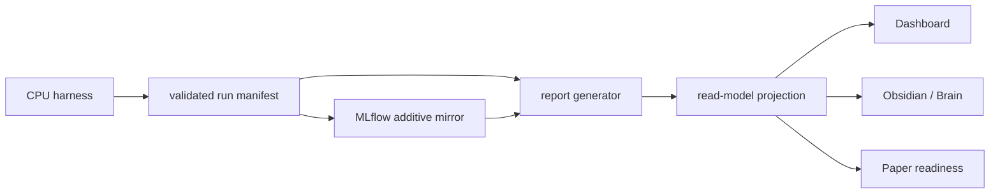

# myIS Research Dashboard

The Dashboard is a loopback-only presentation and owner console. It reads the
canonical `projections/read-model/read-model.v1.json` contract through the
Research API and never becomes a source of metrics, evidence, or approval.

## Views

- Overview: current phase, validated run count, cost, publication readiness,
  and Owner inbox.
- Phase / Task: P0-P4 execution flow with task status and the only two active
  decisions, `D2_OPEN_FINAL` and `D3_SUBMIT_RELEASE`.
- Evidence: manifest, experiment, metric, receipt, and artifact pointers.
- Presentation: a clean briefing view for project review.

## Data boundary

The Dashboard is read-only for artifacts. Decision endpoints only create an
explicit preview and append an immutable D2/D3 record after confirmation.

## Launch

Use `projections/open-dashboard.cmd` for a one-click local start. The app binds
to `127.0.0.1` and uses the repository's locked `uv` environment.
