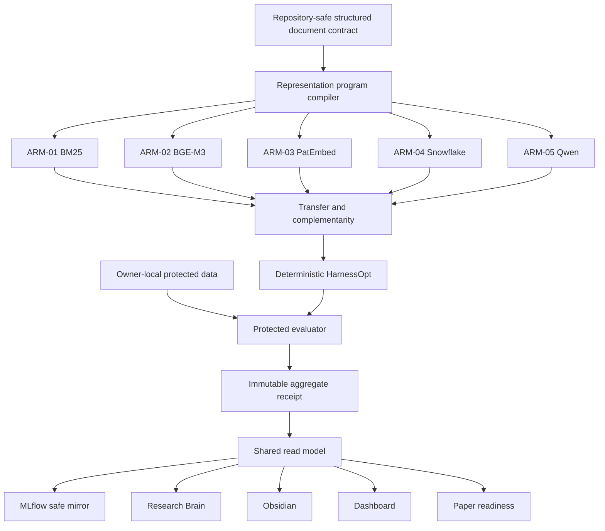

# ArmIndex Architecture

ArmIndex is an active subsystem of the existing `myis_research` package. The
stable package name and historical SCOPE modules remain unchanged so prior
manifests, imports, receipts, and evidence hashes keep their original meaning.

The representation compiler may change source fields, order, labels,
unitization, packing, normalization, duplicate handling, and aggregation. It
cannot change the retriever adapter, evaluator, split, model weights, or metric
definition. HarnessOpt operates only on frozen arms and programs.

Historical SCOPE code remains behind explicit compatibility imports and is not
read as active ArmIndex authority. The migration manifest records every
preserved, superseded, or newly introduced path.

## Trust boundaries

1. Owner-local protected data and credentials never enter Git.
2. Canonical repository records store aggregate-safe facts and content hashes.
3. MLflow, Brain, Obsidian, Dashboard, and Paper are reproducible projections.
4. Owner decisions are restricted to D2 and D3.
5. Selection and Final are fail-closed until their frozen prerequisites pass.
