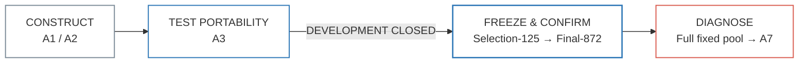
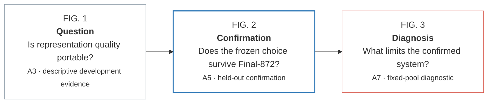

# Modern, Minimal, High-Impact Scientific Figures for an IEEE-Style IR/NLP Paper

## Executive summary

The strongest direction for this paper is **not to make the figures more decorative**. The survey of recent IR/NLP papers points to a different recipe: one visual question per figure, strong semantic contrast, direct labels, compact multi-panel composition, restrained colour, and an immediately visible “takeaway geometry”. Recent influential papers use very different rendering styles—compact architecture schematics in the ColBERT lineage, horizontal pipelines in HyDE, example-plus-quantitative layouts in Dense X Retrieval, hierarchical structures in RAPTOR, concrete data-instance diagrams in FreshStack, and more illustrative side-by-side comparisons in 2026 work such as Q2EI—but their effective figures make the reader understand the *relationship* before reading the caption. citeturn20view0turn13view0turn13view1turn21search5turn19view1turn19view2

For your paper, I recommend a **modern/minimal “editorial scientific” visual system**, not the more colourful infographic style. IEEE recommends consistent type across figures, approximately 9–10 pt at final size, one-column graphics around 3.5 in and two-column graphics around 7.16 in, and explicitly advises that colour should not be the only distinguishing channel; direct labelling and differences in shape/line style are encouraged. Vector output is preferred, while non-vector colour/grayscale graphics should exceed 300 dpi. citeturn23view2turn23view3

The key redesign I recommend is:

| Figure | Recommended visual question | Recommended geometry | Why |
|---|---|---|---|
| **Fig. 1 — A3 transfer** | “How much does the representation source matter, and does that depend on the consuming retriever?” | **Two-level magnitude view:** absolute target bands + deltas relative to the matched source | More honest and more informative than the bump chart; it shows both large between-target separation and tiny, target-dependent within-target differences |
| **Fig. 2 — A5 confirmation** | “Did the frozen selected system survive held-out confirmation?” | Dumbbells + paired CIs + 100% W/T/L strip | The current conceptual design is already strong; polish rather than reinvent |
| **Fig. 3 — A7 diagnosis** | “Where is the remaining failure coming from?” | 100% exposure bar + observed→bound interval | Turns `78.3% absent` into the visual climax and keeps the analytical bound distinct from an experiment |
| **Overview** | “What is the evidence lifecycle?” | Editorial evidence ribbon with a hard **DEVELOPMENT CLOSED** boundary | Makes the confirmation logic understandable before readers enter the details |

The central Fig. 1 recommendation differs slightly from the last iteration. I would **not** return to three almost-empty absolute-scale facets alone, because the within-target changes become visually indistinguishable. I would also **not** use ordinal bump ranks as the main evidence, because moving from rank 1 to rank 3 visually magnifies differences that are only `0.000838–0.003911`. Instead, show **absolute level and local transfer magnitude as two explicitly different panels**. That gives Fig. 1 a genuine reveal without overstating A3.

For implementation, **Altair remains the best production stack for Fig. 1–3**. Altair 6.2.2 is a declarative Python interface to Vega-Lite, and Vega-Lite directly supports layering, faceting, concatenation, independent/shared scale resolution, and normalised stacked bars—the exact primitives these figures need. Altair can save SVG, PDF and PNG via `vl-convert-python`. citeturn23view1turn26view1turn26view2turn26view3turn26view0

For the overview, **D2 is useful for rapid structural prototypes**, and its official tooling exports SVG/PNG; however, I would use a **small deterministic custom SVG generator for the final evidence ribbon**. Your previous D2 drafts looked like architecture diagrams because automatic graph layout naturally emphasises nodes and edges. The final overview needs editorial composition—milestones, evidence-state boundary, and visual hierarchy—rather than graph topology. D2 remains excellent for experimentation and reproducibility. citeturn26view5turn23view0

FigureLabs can remain an optional concept/polish tool. Its official site describes generation, editing, exporting and vectorisation of scientific illustrations, but the public Developer API page is presently client-rendered in a way that did not expose a stable endpoint/schema through the accessible documentation crawl. I therefore would **not make the audited quantitative figures dependent on that API** until Codex can inspect its current authentication and request schema directly. citeturn16search1turn27view0

### Recommended paper-level story arc



The emotional progression should therefore be:

> **Fig. 1 asks a question → Fig. 2 establishes the answer → Fig. 3 explains what still limits the answer.**

That is a stronger source of visual impact than additional colours, icons, shadows or decorative panels.

## What recent IR/NLP papers actually do

A useful lesson from 2020–2026 is that there is **no single fashionable figure style**. High-performing scientific figures use whichever geometry makes their methodological relationship obvious. The commonality is hierarchy, not ornament.

| Paper / venue | Visual pattern worth studying | Transferable lesson for your paper |
|---|---|---|
| **ColBERT, SIGIR 2020 / ColBERTv2, NAACL 2022** | Compact encoder → interaction architecture; the ColBERTv2 paper explicitly presents the late-interaction schematic as Fig. 1. citeturn21search0turn20view0 | A figure can be visually plain and still memorable when every mark corresponds to the core mechanism. Avoid decoration not tied to evidence. |
| **BEIR, NeurIPS 2021** | Benchmark overview plus analytical multi-view figures, including a task/dataset overview and a heatmap/network-style analytical display. citeturn13view2turn13view3 | A full-width figure can successfully combine complementary views if each answers a different sub-question. |
| **HyDE, ACL 2023** | Clear left-to-right pipeline from query through generation/embedding to retrieval, with semantic colour separating stages. citeturn21search2turn13view0 | Horizontal flow works especially well when there is a single causal/methodological sequence. Use colour for stage semantics, not decoration. |
| **Dense X Retrieval, EMNLP 2024** | Concrete retrieval-unit examples and compact quantitative comparisons; workflow diagrams make alternative granularities immediately legible. citeturn21search3turn13view1 | Pairing a conceptual view with quantitative evidence can communicate both *what changes* and *how much it matters*. |
| **RAPTOR, ICLR 2024** | Tree construction itself becomes the figure geometry: chunks → clusters → summaries → hierarchical retrieval. citeturn17search1turn21search5 | Choose geometry that mirrors the scientific object; do not force everything into generic boxes and arrows. |
| **FreshStack, NeurIPS 2025** | Early-page figure uses a concrete Stack Overflow example and visually traces generation, retrieval and judgement; the framework figure then decomposes the benchmark pipeline into five stages. citeturn19view1turn20view1turn20view2 | Concrete evidence is often more attention-grabbing than abstract decoration. The reader can inspect an instance while understanding the pipeline. |
| **Q2EI, Findings of ACL 2026** | Three side-by-side retrieval strategies, using soft semantic colour and pictorial cues to contrast failure versus proposed behaviour. citeturn19view2turn18view2 | Comparison panels become memorable when the contrast is encoded structurally. But its heavier illustration style is more colourful than I would use for your quantitative paper. |
| **ToolQP, Findings of ACL 2026** | A multi-stage decomposition → query generation → retrieval → aggregation architecture with grouped backgrounds. citeturn19view3turn18view3 | Grouping works for a genuinely complex process, but this density is unnecessary for your four-stage evidence map. |

### The design pattern underneath these examples

Across these examples, four recurring strategies stand out. This is a synthesis rather than a formal result.

**First, the dominant visual object carries the claim.** RAPTOR uses a tree because hierarchy is the scientific idea; HyDE uses a horizontal pipeline because transformation is the idea; Dense X combines examples and metrics because granularity is the idea. citeturn21search5turn13view0turn13view1

**Second, effective multi-panel figures assign one question per panel rather than repeating the same chart form.** That supports your A5 figure especially well: absolute performance, paired effect, and per-query outcomes are related but logically distinct evidence views.

**Third, modern figures often label the evidence directly rather than require repeated legend lookup.** This also aligns with IEEE accessibility guidance, which explicitly recommends connecting labels to their lines instead of relying only on colour keys, and using shape or line style as redundant visual channels. citeturn23view2

**Fourth, “high impact” does not require saturated colour.** FreshStack and HyDE attract attention through flow and concrete content; the BEIR analytical figure uses structural contrast; Q2EI is a useful counterexample showing that stronger pictorial colour is possible, but it is not necessary for a quantitative result figure. citeturn19view1turn13view0turn13view3turn19view2

This is why your recent drafts felt either too plain or too presentation-like: the problem was not primarily palette. The figure geometry was not always aligned with the scientific tension.

## Reference galleries and evidence-map exemplars

### Quantitative figure galleries worth giving Codex

The following are primary-source galleries or documentation. I would let Codex inspect these examples, but keep **Altair as the single production grammar** rather than mixing Altair, Matplotlib and D3 within the final paper.

| Reference | Particularly relevant examples | Role |
|---|---|---|
| [Altair Example Gallery](https://altair-viz.github.io/gallery/) | grouped bars + error bars, CI error bars, slope graphs, bump charts, ranged dot plots, stacked bars, direct labels | **Primary implementation reference**. Altair’s gallery explicitly demonstrates that complex charts are composed from simple declarative building blocks. citeturn26view4 |
| [Vega-Lite multi-view composition](https://vega.github.io/vega-lite/docs/composition.html) | facet, layer, `hconcat`, `vconcat`, repeat | Fig. 1–3 panel construction. citeturn26view1 |
| [Vega-Lite scale/guide resolution](https://vega.github.io/vega-lite/docs/resolve.html) | shared vs independent scales/axes/legends | Critical for preventing the category-sharing artefact you saw in the earlier Fig. 2. citeturn26view2 |
| [Vega-Lite bar documentation](https://vega.github.io/vega-lite/docs/bar.html) | stacked and normalised stacked bars, ranged bars | Fig. 2 W/T/L and Fig. 3 exposure anatomy. citeturn26view3 |
| [Altair bump chart example](https://altair-viz.github.io/gallery/bump_chart.html) | ordinal trajectory | Useful as a **negative reference for A3**: technically elegant, but rank height would over-emphasise tiny score differences in your evidence. citeturn26view4 |
| [Altair grouped bars with error bars](https://altair-viz.github.io/gallery/grouped_bar_chart_with_error_bars.html) | layering point/bar/error geometry | Useful pattern for CI composition, although I recommend points/rules rather than bars for A5. citeturn5search4 |
| [Matplotlib gallery](https://matplotlib.org/stable/gallery/) | publication-standard primitives | Good source for geometry ideas when Altair examples are insufficient. citeturn5search14 |
| [Matplotlib error-bar examples](https://matplotlib.org/stable/gallery/statistics/errorbar.html) | error bars and intervals | CI visual-reference library. citeturn5search29 |
| [Matplotlib stacked-bar example](https://matplotlib.org/stable/gallery/lines_bars_and_markers/bar_stacked.html) | composition bars | Alternative reference for W/T/L and exposure proportions. citeturn5search8 |
| [Matplotlib bar-label example](https://matplotlib.org/stable/gallery/lines_bars_and_markers/bar_label_demo.html) | direct values on bars | Useful for placing counts without a legend. citeturn5search5 |
| [Seaborn uncertainty tutorial](https://seaborn.pydata.org/tutorial/error_bars.html) | conceptual distinction between interval types | Useful visual reference for uncertainty, even though the final A5 interval should remain your audited percentile CI rather than be recomputed by Seaborn. citeturn5search6 |
| [D3 official examples](https://d3js.org/) | low-level custom layouts | Only worth using when Vega-Lite cannot express the geometry; D3 is intentionally lower-level and adds unnecessary code for your three quantitative figures. citeturn1search2turn1search6 |
| [FigureLabs](https://figurelabs.ai/) | AI-generated/vectorised scientific illustrations | Worth exploring for conceptual illustration ideas, not as the source of audited coordinates or numerical marks. citeturn16search1 |
| [FigureLabs Help Centre](https://figurelabs.ai/help-center) | current product documentation | Check here before automating an API workflow because current product behaviour may change. citeturn16search5 |

### Flowchart and evidence-map references

| Example | What to inspect | Relevance |
|---|---|---|
| **HyDE Fig. 1** | short horizontal causal pipeline, direct semantic stages | Best paper-level reference for a compact overview ribbon. citeturn13view0turn21search2 |
| **RAPTOR Fig. 1** | diagram geometry follows scientific hierarchy rather than generic flow boxes | Good lesson in matching topology to concept. citeturn21search5 |
| **FreshStack Figs. 1–2** | concrete example followed by a formal multi-stage framework | Strong evidence that overview figures can be information-dense without decorative framing. citeturn19view1turn20view2 |
| **Q2EI Fig. 1** | three-column schematic comparison and semantic colour | Useful “bold” reference; probably more illustrative than your final paper needs. citeturn19view2 |
| **ToolQP Fig. 1** | architecture with stage grouping | Useful example of what to avoid when your logical structure is only four milestones. citeturn19view3 |
| [D2 Playground](https://play.d2lang.com/) | Dagre/ELK layouts; SVG/PNG export | Fast prototype environment; ideal for testing flow before committing to a final SVG. citeturn26view5 |
| [Mermaid flowcharts](https://mermaid.js.org/syntax/flowchart.html) | text-defined nodes, edges, subgraphs | Best for README/report previews and Codex planning; less deterministic than custom SVG for final editorial placement. citeturn26view6 |
| Mermaid swimlane / theming documentation | stage separation and lightweight evidence lanes | Good conceptual inspiration if development/protected/post-confirmatory states need stronger grouping. Mermaid’s current documentation exposes theming and newer layout constructs. citeturn11search9turn11search11 |

### Tool choice after the survey

| Tool | Strength | Weakness for this paper | Code complexity | Recommendation |
|---|---|---|---:|---|
| **Altair/Vega-Lite** | Declarative, layered, faceted, reproducible, vector export | Exact editorial layout can require some manual concatenation | Low–medium | **Use for Fig. 1–3** |
| **Matplotlib** | Maximum control; mature publication ecosystem | More imperative layout code; easier for separate scripts to drift stylistically | Medium | Backup only |
| **Seaborn** | Convenient statistical plotting | Can recompute summaries/intervals implicitly; less appropriate for your frozen audited numbers | Low | Inspiration only |
| **D3** | Near-unlimited SVG control | Much more implementation overhead than needed | High | Do not use |
| **D2** | Excellent text-to-diagram workflow; automatic layouts | Tends to look like an architecture graph unless carefully constrained | Low | Prototype overview |
| **Mermaid** | Excellent Markdown-native preview | Final rendering/layout control is weaker | Very low | Report/README preview |
| **Custom SVG** | Deterministic geometry, tiny dependency surface, exact editorial layout | More manual coordinates | Medium | **Final overview map** |
| **FigureLabs** | Fast conceptual scientific illustration/vector workflow | Quantitative geometry should remain explicitly data-bound; public API schema was not inspectable in the retrieved page | Low interactively / unknown API | Optional concept/polish pass |

## Design rules for IEEE-scale figures

### Physical size and export

IEEE’s current author guidance says most graphics are prepared at either **3.5 in one-column width** or **7.16 in two-column width**. Recommended figure fonts include Helvetica and Arial, and type should appear approximately **9–10 pt at final size**. IEEE accepts PS, EPS, PDF, PNG and TIFF; SVG is useful as an editable intermediate but is not in IEEE’s listed submission formats. IEEE prefers vector artwork and specifies more than 300 dpi for raster colour/grayscale and more than 600 dpi for black-and-white line art. citeturn23view2turn23view3

For this paper, all four visual elements are better as **two-column figures** because the logic depends on horizontal comparison. The overview can be physically short.

| Artifact | Recommended final width | Recommended height | 300-dpi reference | 360-dpi fallback | Primary final format |
|---|---:|---:|---:|---:|---|
| Fig. 1 | 7.16 in | 2.6–3.0 in | 2148 × 780–900 px | 2578 × 936–1080 px | PDF + editable SVG |
| Fig. 2 | 7.16 in | 2.1–2.4 in | 2148 × 630–720 px | 2578 × 756–864 px | PDF + editable SVG |
| Fig. 3 | 7.16 in | 1.8–2.1 in | 2148 × 540–630 px | 2578 × 648–756 px | PDF + editable SVG |
| Evidence map | 7.16 in | 1.05–1.3 in | 2148 × 315–390 px | 2578 × 378–468 px | PDF/SVG |

The 300-dpi pixel counts above are dimensional references; because IEEE’s current wording is **greater than** 300 dpi, use vector PDF whenever possible or use 360/600 dpi for the final raster fallback. citeturn23view3

Altair’s image exporter supports a `ppi` argument for PNG and uses `vl-convert-python` for image output. SVG and PDF avoid the raster-resolution problem entirely. citeturn26view0

### Typography hierarchy

Use **Arial** across every figure on the Windows project. It is on IEEE’s recommended list and is a reliable local choice. citeturn23view2

I recommend this hierarchy at final print size:

| Element | Size | Weight | Rule |
|---|---:|---|---|
| Panel letter `A`, `B`, `C` | 11–11.5 pt | 700 | Same x/y offset everywhere |
| Panel title | 10.5–11 pt | 600–700 | Prefer 2–4 words |
| Axis / category text | 9–9.5 pt | 400 | Never below ~8.5 pt |
| Direct data annotation | 9–9.5 pt | 500 | Focal values can be 600 |
| Secondary note | 8.5–9 pt | 400 | Use slate rather than tiny text |
| Caption | Controlled by LaTeX | — | Put methodological disclaimers here, not inside chart |

Do **not** place `A Absolute performance` at 14–16 pt simply because the PNG is initially large. The key question is how it looks after `\includegraphics[width=\textwidth]`.

### Palette

The final paper should use four semantic roles, not four unrelated “brand colours”.

#### Recommended theme — modern/minimal

| Role | Hex | Meaning |
|---|---|---|
| Ink | `#172B4D` | text, boundaries, matched outline |
| Focal blue | `#2F78B7` | selected, confirmed, nominal best |
| Slate | `#8A99A6` | comparator, neutral observations, ties |
| Diagnostic coral | `#D95D51` | absence, loss, structural limitation |
| Optional bound amber | `#D6A12A` | analytical bound only |
| Grid | `#E5EBF0` | very light reference lines |
| Background | `#FFFFFF` | always white |

Colour must be redundant with geometry: nominal best is **blue fill**, matched source-target is a **dark outline**; selected A5 points are blue but comparator points are also positioned and directly labelled; A7 “absent” is coral *and* is the overwhelmingly largest segment. This follows IEEE’s recommendation not to rely solely on colour. citeturn23view2

#### Alternative theme — bold/contrast

| Role | Hex |
|---|---|
| Ink | `#0B1F33` |
| Focal blue | `#0067C5` |
| Secondary cyan | `#008F95` |
| Diagnostic orange | `#E08022` |
| Loss red | `#C9473D` |
| Neutral | `#87939D` |

The bold theme is closer to the visual energy of colourful recent schematic papers such as Q2EI, but it creates more competing semantic colours. citeturn19view2

**Recommendation: use modern/minimal.** Your paper already has a strong narrative; the figures need to reveal it, not visually dramatise it.

### Geometry grammar

Use a deliberately tiny vocabulary:

| Scientific quantity | Primitive |
|---|---|
| Absolute metric | point + connecting rule |
| Paired effect | point + CI rule |
| Very small transfer difference | point relative to explicit zero/matched baseline |
| Composition | one 100% stacked bar |
| Analytical upper bound | observed point → bound point |
| Evidence stage | milestone on a horizontal ribbon |
| Matched pair | outline/ring |
| Focal result | filled blue |
| Structural limitation | coral segment/direct label |

This repeated grammar is what will finally make Fig. 1–3 feel like the same paper.

### Annotation hierarchy

The visual should answer a question before it shows all exact decimals.

For **Fig. 1**, retain six decimals where exact A3 scores are shown because its within-target ranges are below `0.004`; rounding the source scores to three decimals can erase relevant ordering. For a delta panel, four to six decimals remain appropriate.

For **Fig. 2**, the graphic can display `0.331 → 0.442`, `0.279 → 0.366`, `+0.111`, `+0.086`, while the caption/text keeps the audited six-decimal values and exact 95% CIs.

For **Fig. 3**, use `15.3%`, `6.4%`, `78.3%` plus raw counts; the interval can show `0.188 → 0.260` and `+0.072`, with exact six-decimal values in the caption.

This avoids the common mistake of treating numerical audit precision as a requirement to print six decimals on every mark.

### Spacing and legends

For a full-width ~516-point design canvas, start with **12–16 pt between panels**, 4–6 pt between direct label and mark, and substantially more whitespace *between conceptual panels* than *inside a panel*. Vega-Lite supports explicit horizontal/vertical concatenation and separate scale resolution, so these relationships can be deterministic. citeturn26view1turn26view2

Prefer direct labels over legends whenever there are only two or three semantic states. IEEE explicitly recommends attaching labels to lines rather than relying exclusively on a colour key. citeturn23view2

## Unified visual system for this paper

### Figure 1 — make magnitude itself the story

The bump chart solved one problem—it showed source-order reversal—but created a more important one: a line travelling from rank 1 to rank 3 looked large even when the underlying difference was a few thousandths. A common-scale three-facet plot solved scientific honesty but became visually inert because the local point distances were nearly sub-pixel at paper scale.

The best compromise is a **two-level magnitude figure**.

#### Panel A: absolute target score bands

One row per consuming retriever:

```text
PatEmbed target   0.418436 ─ 0.419274         Δ 0.000838
Qwen3 target      0.359497 ───── 0.362570     Δ 0.003073
Arctic target     0.337430 ────── 0.341341    Δ 0.003911
```

All three rows share the **same absolute x-axis**, roughly `0.33–0.425`.

Its instant message is:

> target-system separation is much larger than within-target source variation.

#### Panel B: transfer relative to matched source

Now show the exact local differences on an honest **common delta axis**, with `0` meaning matched representation:

| Target | Source | Δ relative to matched |
|---|---|---:|
| PatEmbed | PatEmbed-derived | `0` |
| PatEmbed | Arctic-derived | `+0.000279` |
| PatEmbed | Qwen3-derived | `+0.000838` |
| Arctic | PatEmbed-derived | `-0.003911` |
| Arctic | Arctic-derived | `0` |
| Arctic | Qwen3-derived | `-0.003073` |
| Qwen3 | PatEmbed-derived | `+0.001955` |
| Qwen3 | Arctic-derived | `-0.001118` |
| Qwen3 | Qwen3-derived | `0` |

Use a common x-domain such as `[-0.0042, +0.0022]`. Now the reader gets a genuine local comparison without treating nominal rank distance as effect magnitude.

The strongest takeaway becomes:

> **Source effects are small but target-dependent; matching is not universally optimal.**

Keep the words “descriptive development evidence” in the caption rather than occupying figure real estate.

### Figure 2 — confirmation should look decisive

Keep the current A/B/C concept.

```text
A ABSOLUTE                  B PAIRED EFFECT                 C QUERY OUTCOMES

Recall    ●────────●        Recall      ├────●────┤         ████████████▓▓▒
         .331     .442                  +.111              619 W  158 T  95 L

nDCG      ●──────●          nDCG         ├──●──┤
         .279   .366                     +.086
```

The **strongest mark in the entire figure should be `+0.111`**, not a title or legend. Its CI should visually avoid zero.

The W/T/L strip should contain all 872 queries and should have direct labels. Vega-Lite natively supports stacked and normalised stacked bars. citeturn26view3

Do not use a separate red “loss” legend: the segment already has position, extent and text.

### Figure 3 — turn missing exposure into the climax

Panel A should remain a single composition bar:

```text
| 15.3% | 6.4% |                     78.3%                     |
                 4,065 / 5,193 absent from Top-200
```

The `4,065 / 5,193` annotation should be visually stronger than the panel title.

Panel B should reuse Fig. 2’s rule-and-point grammar:

```text
Observed                                           Analytical bound
0.188  ●──────────────────────────────────────────────●  0.260
                         +0.072 headroom
```

Amber can be used only for the analytical bound, which gives it a stable meaning across the paper: **“counterfactual/analytical ceiling”**, not “good”.

The caption must continue to say this is a **fixed-pool analytical ordering bound, not a reranker experiment**.

### Evidence map — the boundary is the figure

The current four-icon version is visually clean but still reads like a product roadmap. The redesign should make **evidence status** the dominant geometry.

```text
        DEVELOPMENT                            PROTECTED / POST-CONFIRMATORY
                                              │
   01                    02                    │       03                   04
   ●─────────────────────●─────────────────────│───────●────────────────────●
 CONSTRUCT          TEST PORTABILITY           │  FREEZE & CONFIRM        DIAGNOSE
 A1 / A2                   A3                  │ Selection → Final-872   Full pool → A7
                                              │
                                      DEVELOPMENT CLOSED
```

This line is not simply “workflow”; it represents a change in what kinds of claims are allowed. That is why the boundary deserves more visual weight than any icon.

### Storyboard across the paper



That gives the paper a genuine visual arc without making any individual chart flamboyant.

## Ready-to-run implementation specification

### Environment

Altair’s current official installation documentation provides both a full install and a save-focused install. For this project, the save-focused variant is sufficient because the primary needs are Python plotting plus SVG/PDF/PNG output. citeturn23view1turn26view0

From PowerShell in the paper project:

```powershell
cd "C:\Users\Siripon Sri\Desktop\My_Research\00_Projects\00_myIS\01_Research\docs\paper"

python -m venv .venv
.\.venv\Scripts\Activate.ps1

python -m pip install --upgrade pip
python -m pip install "altair[save]" pandas

python -c "import altair as alt; print(alt.__version__)"
```

The explicit alternative from Altair’s documentation is:

```powershell
python -m pip install "altair[all]"
```

`vl-convert-python` is the package Altair currently uses for image saving and has no external runtime dependency according to the Altair documentation. citeturn26view0

```powershell
python -m pip install vl-convert-python
```

For D2 on Windows, the project’s official installation material lists native community-managed packages through Scoop and Chocolatey, while the main documentation also offers precompiled releases and asks users to verify installation with `d2 version`. citeturn23view0turn25search2

```powershell
# Choose ONE if already installed on your machine:

scoop install main/d2

# OR
choco install d2

d2 version
```

D2 itself can then export by output extension:

```powershell
d2 overview_evidence_map.d2 overview_evidence_map.svg
d2 overview_evidence_map.d2 overview_evidence_map.png
```

The D2 Playground also supports SVG and PNG export and offers Dagre/ELK layout engines. citeturn26view5

### Recommended file structure

```text
docs/paper/
├── figures/
│   ├── src/
│   │   ├── paper_style.py
│   │   ├── fig1_a3_transfer.py
│   │   ├── fig2_a5_confirmation.py
│   │   ├── fig3_a7_diagnosis.py
│   │   └── overview_evidence_map.py
│   │
│   ├── fig1_a3_transfer.svg
│   ├── fig1_a3_transfer.pdf
│   ├── fig1_a3_transfer.png
│   ├── fig2_a5_confirmation.svg
│   ├── fig2_a5_confirmation.pdf
│   ├── fig2_a5_confirmation.png
│   ├── fig3_a7_diagnosis.svg
│   ├── fig3_a7_diagnosis.pdf
│   ├── fig3_a7_diagnosis.png
│   ├── overview_evidence_map.svg
│   └── overview_evidence_map.png
```

Keep SVG as the editable/review artefact, PDF as the preferred LaTeX/IEEE vector artefact, and PNG for quick preview/regression inspection. IEEE explicitly lists PDF and PNG among accepted graphics formats and recommends vector artwork where possible. citeturn23view2turn23view3

### Shared Altair style

`figures/src/paper_style.py`

```python
from __future__ import annotations

from pathlib import Path
import altair as alt

# Modern/minimal theme
INK = "#172B4D"
BLUE = "#2F78B7"
SLATE = "#8A99A6"
CORAL = "#D95D51"
AMBER = "#D6A12A"
GRID = "#E5EBF0"
WHITE = "#FFFFFF"

FONT = "Arial"

# Roughly 7.16 in × 72 pt/in.
# Treat this as a design canvas; verify the final exported bounding box
# because axes/labels add outer dimensions.
FULL_WIDTH = 516


def paper_style(chart: alt.TopLevelMixin) -> alt.TopLevelMixin:
    """Apply one visual system to every quantitative figure."""
    return (
        chart
        .configure(background=WHITE, font=FONT)
        .configure_view(stroke=None)
        .configure_axis(
            domain=False,
            gridColor=GRID,
            gridOpacity=1,
            gridWidth=0.7,
            tickColor=SLATE,
            tickSize=3,
            labelColor=INK,
            labelFont=FONT,
            labelFontSize=9,
            labelPadding=4,
            titleColor=INK,
            titleFont=FONT,
            titleFontSize=10,
            titleFontWeight="normal",
            titlePadding=8,
        )
        .configure_title(
            font=FONT,
            fontSize=11,
            fontWeight="bold",
            color=INK,
            anchor="start",
        )
        .configure_legend(
            labelFont=FONT,
            labelFontSize=9,
            labelColor=INK,
            titleFont=FONT,
            titleFontSize=9,
            titleColor=INK,
            symbolSize=60,
        )
    )


def export_chart(
    chart: alt.TopLevelMixin,
    stem: Path,
    png_ppi: int = 360,
) -> None:
    """Export review, editable and final vector versions."""
    stem.parent.mkdir(parents=True, exist_ok=True)

    chart.save(stem.with_suffix(".svg"))
    chart.save(stem.with_suffix(".pdf"))
    chart.save(stem.with_suffix(".png"), ppi=png_ppi)
```

Altair currently supports saving these formats via `chart.save`, and `ppi` controls PNG resolution while preserving physical size. citeturn26view0

### Figure 1 Altair specification

`figures/src/fig1_a3_transfer.py`

```python
from __future__ import annotations

from pathlib import Path

import altair as alt
import pandas as pd

from paper_style import (
    AMBER,
    BLUE,
    INK,
    SLATE,
    paper_style,
    export_chart,
)

OUT = Path(__file__).resolve().parents[1] / "fig1_a3_transfer"

# Audited A3 values. In production, Codex should replace this constructor
# with the canonical CSV loader and assert equality against these values.
rows = [
    ("PatEmbed", "PatEmbed-derived", 0.418436, True),
    ("PatEmbed", "Arctic-derived",   0.418715, False),
    ("PatEmbed", "Qwen3-derived",    0.419274, False),

    ("Arctic",   "PatEmbed-derived", 0.337430, False),
    ("Arctic",   "Arctic-derived",   0.341341, True),
    ("Arctic",   "Qwen3-derived",    0.338268, False),

    ("Qwen3",    "PatEmbed-derived", 0.362570, False),
    ("Qwen3",    "Arctic-derived",   0.359497, False),
    ("Qwen3",    "Qwen3-derived",    0.360615, True),
]

df = pd.DataFrame(rows, columns=["target", "source", "score", "matched"])

TARGET_ORDER = ["PatEmbed", "Qwen3", "Arctic"]
SOURCE_ORDER = ["PatEmbed-derived", "Arctic-derived", "Qwen3-derived"]

# Derive nominal best deterministically.
best_idx = df.groupby("target")["score"].idxmax()
df["best"] = False
df.loc[best_idx, "best"] = True

matched_score = (
    df.loc[df["matched"], ["target", "score"]]
    .rename(columns={"score": "matched_score"})
)
df = df.merge(matched_score, on="target", how="left", validate="many_to_one")
df["delta_from_matched"] = df["score"] - df["matched_score"]

bands = (
    df.groupby("target", as_index=False)
    .agg(
        min_score=("score", "min"),
        max_score=("score", "max"),
    )
)
bands["range"] = bands["max_score"] - bands["min_score"]
bands["range_label"] = bands["range"].map(lambda x: f"Δ {x:.6f}")

# -------------------------------
# A. Honest common-scale overview
# -------------------------------
base_a = alt.Chart(bands).encode(
    y=alt.Y(
        "target:N",
        sort=TARGET_ORDER,
        title=None,
        axis=alt.Axis(labelFontWeight="bold"),
    )
)

band_rule = base_a.mark_rule(
    stroke=SLATE,
    strokeWidth=4,
    strokeCap="round",
).encode(
    x=alt.X(
        "min_score:Q",
        scale=alt.Scale(domain=[0.33, 0.425], nice=False),
        axis=alt.Axis(
            title="A3 score",
            values=[0.34, 0.36, 0.38, 0.40, 0.42],
            format=".2f",
        ),
    ),
    x2="max_score:Q",
)

# The points genuinely cluster. Do not artificially separate them.
points_a = alt.Chart(df).mark_point(
    filled=True,
    size=70,
    opacity=0.92,
).encode(
    x=alt.X(
        "score:Q",
        scale=alt.Scale(domain=[0.33, 0.425], nice=False),
    ),
    y=alt.Y("target:N", sort=TARGET_ORDER),
    color=alt.condition(
        "datum.best",
        alt.value(BLUE),
        alt.value(SLATE),
    ),
)

matched_ring_a = (
    alt.Chart(df)
    .transform_filter("datum.matched")
    .mark_point(
        filled=False,
        size=135,
        stroke=INK,
        strokeWidth=1.8,
    )
    .encode(
        x="score:Q",
        y=alt.Y("target:N", sort=TARGET_ORDER),
    )
)

range_text = base_a.mark_text(
    align="left",
    dx=7,
    color=SLATE,
    fontSize=9,
).encode(
    x="max_score:Q",
    text="range_label:N",
)

panel_a = (
    band_rule
    + points_a
    + matched_ring_a
    + range_text
).properties(
    width=470,
    height=88,
    title="A  Absolute target score bands",
)

# ---------------------------------------
# B. Local magnitude relative to matching
# ---------------------------------------
zero = (
    alt.Chart(pd.DataFrame({"zero": [0]}))
    .mark_rule(color=INK, strokeWidth=1)
    .encode(x="zero:Q")
)

dot_b = alt.Chart(df).mark_point(
    filled=True,
    size=72,
).encode(
    x=alt.X(
        "delta_from_matched:Q",
        scale=alt.Scale(domain=[-0.0042, 0.0022], nice=False),
        axis=alt.Axis(
            title="Score difference from matched representation",
            format="+.3f",
            values=[-0.004, -0.002, 0, 0.002],
        ),
    ),
    y=alt.Y(
        "source:N",
        sort=SOURCE_ORDER,
        title=None,
        axis=alt.Axis(labelLimit=120),
    ),
    color=alt.condition(
        "datum.best",
        alt.value(BLUE),
        alt.value(SLATE),
    ),
)

ring_b = (
    alt.Chart(df)
    .transform_filter("datum.matched")
    .mark_point(
        filled=False,
        size=135,
        stroke=INK,
        strokeWidth=1.8,
    )
    .encode(
        x="delta_from_matched:Q",
        y=alt.Y("source:N", sort=SOURCE_ORDER),
    )
)

value_b = alt.Chart(df).mark_text(
    align="left",
    dx=6,
    fontSize=8.5,
    color=INK,
).encode(
    x="delta_from_matched:Q",
    y=alt.Y("source:N", sort=SOURCE_ORDER),
    text=alt.Text("delta_from_matched:Q", format="+.6f"),
)

facet_b = (
    (zero + dot_b + ring_b + value_b)
    .properties(width=145, height=72)
    .facet(
        column=alt.Column(
            "target:N",
            sort=TARGET_ORDER,
            title=None,
            header=alt.Header(
                labelFontSize=10,
                labelFontWeight="bold",
                labelColor=INK,
            ),
        )
    )
    .resolve_scale(x="shared", y="shared")
    .properties(title="B  Transfer relative to the matched representation")
)

figure = alt.vconcat(
    panel_a,
    facet_b,
    spacing=14,
)

figure = paper_style(figure)

export_chart(figure, OUT)
```

Vega-Lite supports this layering/faceting composition directly, and shared versus independent scale resolution can be declared rather than left implicit. citeturn26view1turn26view2

### Figure 2 Altair specification

`figures/src/fig2_a5_confirmation.py`

```python
from __future__ import annotations

from pathlib import Path

import altair as alt
import pandas as pd

from paper_style import (
    BLUE,
    CORAL,
    INK,
    SLATE,
    paper_style,
    export_chart,
)

OUT = Path(__file__).resolve().parents[1] / "fig2_a5_confirmation"

metrics = pd.DataFrame(
    [
        {
            "metric": "Recall@100",
            "comparator": 0.331097,
            "selected": 0.442476,
            "diff": 0.111379,
            "lo": 0.102294,
            "hi": 0.120438,
        },
        {
            "metric": "nDCG@100",
            "comparator": 0.279253,
            "selected": 0.365595,
            "diff": 0.086342,
            "lo": 0.078673,
            "hi": 0.094077,
        },
    ]
)

METRIC_ORDER = ["Recall@100", "nDCG@100"]

# ----------------
# A. Absolute
# ----------------
absolute_rule = alt.Chart(metrics).mark_rule(
    stroke=SLATE,
    strokeWidth=3,
).encode(
    y=alt.Y("metric:N", sort=METRIC_ORDER, title=None),
    x=alt.X(
        "comparator:Q",
        scale=alt.Scale(domain=[0.25, 0.46], nice=False),
        axis=None,
    ),
    x2="selected:Q",
)

cmp_points = alt.Chart(metrics).mark_point(
    filled=True,
    size=80,
    color=SLATE,
).encode(
    x="comparator:Q",
    y=alt.Y("metric:N", sort=METRIC_ORDER),
)

sel_points = alt.Chart(metrics).mark_point(
    filled=True,
    size=95,
    color=BLUE,
).encode(
    x="selected:Q",
    y=alt.Y("metric:N", sort=METRIC_ORDER),
)

cmp_text = alt.Chart(metrics).mark_text(
    dy=-13,
    color=SLATE,
    fontSize=9,
).encode(
    x="comparator:Q",
    y=alt.Y("metric:N", sort=METRIC_ORDER),
    text=alt.Text("comparator:Q", format=".3f"),
)

sel_text = alt.Chart(metrics).mark_text(
    dy=-13,
    color=BLUE,
    fontWeight="bold",
    fontSize=9,
).encode(
    x="selected:Q",
    y=alt.Y("metric:N", sort=METRIC_ORDER),
    text=alt.Text("selected:Q", format=".3f"),
)

panel_a = (
    absolute_rule + cmp_points + sel_points + cmp_text + sel_text
).properties(
    width=125,
    height=110,
    title="A  Absolute",
)

# ----------------
# B. Paired CIs
# ----------------
zero = (
    alt.Chart(pd.DataFrame({"x": [0]}))
    .mark_rule(color=INK, strokeWidth=1)
    .encode(x="x:Q")
)

ci = alt.Chart(metrics).mark_rule(
    color=BLUE,
    strokeWidth=3,
).encode(
    y=alt.Y("metric:N", sort=METRIC_ORDER, title=None),
    x=alt.X(
        "lo:Q",
        scale=alt.Scale(domain=[0, 0.13], nice=False),
        axis=alt.Axis(
            title="Selected − comparator",
            format=".2f",
        ),
    ),
    x2="hi:Q",
)

# CI caps
lo_cap = alt.Chart(metrics).mark_tick(
    color=BLUE,
    thickness=2,
    size=16,
).encode(
    x="lo:Q",
    y=alt.Y("metric:N", sort=METRIC_ORDER),
)

hi_cap = alt.Chart(metrics).mark_tick(
    color=BLUE,
    thickness=2,
    size=16,
).encode(
    x="hi:Q",
    y=alt.Y("metric:N", sort=METRIC_ORDER),
)

effect_point = alt.Chart(metrics).mark_point(
    filled=True,
    size=105,
    color=BLUE,
).encode(
    x="diff:Q",
    y=alt.Y("metric:N", sort=METRIC_ORDER),
)

effect_text = alt.Chart(metrics).mark_text(
    dy=-15,
    color=INK,
    fontWeight="bold",
    fontSize=9,
).encode(
    x="diff:Q",
    y=alt.Y("metric:N", sort=METRIC_ORDER),
    text=alt.Text("diff:Q", format="+.3f"),
)

panel_b = (
    zero + ci + lo_cap + hi_cap + effect_point + effect_text
).properties(
    width=170,
    height=110,
    title="B  Paired effect + 95% CI",
)

# ----------------
# C. Query W/T/L
# ----------------
outcomes = pd.DataFrame(
    [
        ("Win", 619, BLUE),
        ("Tie", 158, SLATE),
        ("Loss", 95, CORAL),
    ],
    columns=["outcome", "count", "colour"],
)

outcomes["x0"] = outcomes["count"].cumsum().shift(fill_value=0)
outcomes["x1"] = outcomes["count"].cumsum()
outcomes["mid"] = (outcomes["x0"] + outcomes["x1"]) / 2
outcomes["label"] = (
    outcomes["outcome"]
    + " "
    + outcomes["count"].astype(str)
)

strip = alt.Chart(outcomes).mark_rect(height=34).encode(
    x=alt.X(
        "x0:Q",
        scale=alt.Scale(domain=[0, 872], nice=False),
        axis=None,
    ),
    x2="x1:Q",
    color=alt.Color(
        "outcome:N",
        scale=alt.Scale(
            domain=["Win", "Tie", "Loss"],
            range=[BLUE, SLATE, CORAL],
        ),
        legend=None,
    ),
)

strip_text = alt.Chart(outcomes).mark_text(
    color="white",
    fontWeight="bold",
    fontSize=9,
).encode(
    x="mid:Q",
    text="label:N",
)

panel_c = (
    strip + strip_text
).properties(
    width=170,
    height=110,
    title="C  Recall@100 outcomes  (n=872)",
)

figure = alt.hconcat(
    panel_a,
    panel_b,
    panel_c,
    spacing=18,
).resolve_scale(
    x="independent",
    y="independent",
)

figure = paper_style(figure)

export_chart(figure, OUT)
```

The explicit `resolve_scale(x="independent", y="independent")` is important. Vega-Lite otherwise decides how domains are combined in multi-view specifications; using explicit independent resolution prevents the kind of mixed-category artefact seen in the previous draft. citeturn26view2

### Figure 3 Altair specification

`figures/src/fig3_a7_diagnosis.py`

```python
from __future__ import annotations

from pathlib import Path

import altair as alt
import pandas as pd

from paper_style import (
    AMBER,
    BLUE,
    CORAL,
    INK,
    SLATE,
    paper_style,
    export_chart,
)

OUT = Path(__file__).resolve().parents[1] / "fig3_a7_diagnosis"

TOTAL = 5193

exposure = pd.DataFrame(
    [
        ("By rank 100", 796, BLUE),
        ("First at 101–200", 332, SLATE),
        ("Absent from Top-200", 4065, CORAL),
    ],
    columns=["state", "count", "colour"],
)

exposure["fraction"] = exposure["count"] / TOTAL
exposure["x0"] = exposure["fraction"].cumsum().shift(fill_value=0)
exposure["x1"] = exposure["fraction"].cumsum()
exposure["mid"] = (exposure["x0"] + exposure["x1"]) / 2
exposure["pct"] = exposure["fraction"].map(lambda x: f"{x:.1%}")

# ----------------
# A. Exposure
# ----------------
bar = alt.Chart(exposure).mark_rect(height=42).encode(
    x=alt.X(
        "x0:Q",
        scale=alt.Scale(domain=[0, 1], nice=False),
        axis=None,
    ),
    x2="x1:Q",
    color=alt.Color(
        "state:N",
        scale=alt.Scale(
            domain=[
                "By rank 100",
                "First at 101–200",
                "Absent from Top-200",
            ],
            range=[BLUE, SLATE, CORAL],
        ),
        legend=None,
    ),
)

pct = alt.Chart(exposure).mark_text(
    color="white",
    fontWeight="bold",
    fontSize=10,
).encode(
    x="mid:Q",
    text="pct:N",
)

absent_note_df = pd.DataFrame(
    {
        "x": [0.61],
        "text": ["4,065 / 5,193 absent from Top-200"],
    }
)

absent_note = alt.Chart(absent_note_df).mark_text(
    align="center",
    dy=36,
    color=CORAL,
    fontWeight="bold",
    fontSize=10,
).encode(
    x=alt.X("x:Q", scale=alt.Scale(domain=[0, 1])),
    text="text:N",
)

panel_a = (
    bar + pct + absent_note
).properties(
    width=260,
    height=95,
    title="A  Exposure anatomy",
)

# ----------------
# B. Ordering bound
# ----------------
bound = pd.DataFrame(
    [
        {
            "observed": 0.188450,
            "bound": 0.260167,
            "headroom": 0.071717,
        }
    ]
)

interval = alt.Chart(bound).mark_rule(
    stroke=SLATE,
    strokeWidth=3,
).encode(
    x=alt.X(
        "observed:Q",
        scale=alt.Scale(domain=[0.17, 0.275], nice=False),
        axis=None,
    ),
    x2="bound:Q",
    y=alt.value(48),
)

observed = alt.Chart(bound).mark_point(
    filled=True,
    color=BLUE,
    size=105,
).encode(
    x="observed:Q",
    y=alt.value(48),
)

upper = alt.Chart(bound).mark_point(
    filled=True,
    color=AMBER,
    size=105,
).encode(
    x="bound:Q",
    y=alt.value(48),
)

observed_label = alt.Chart(bound).mark_text(
    align="center",
    dy=-23,
    color=INK,
    fontSize=9,
).encode(
    x="observed:Q",
    y=alt.value(48),
    text=alt.value("Observed  0.188"),
)

bound_label = alt.Chart(bound).mark_text(
    align="center",
    dy=-23,
    color=INK,
    fontSize=9,
).encode(
    x="bound:Q",
    y=alt.value(48),
    text=alt.value("Perfect-ordering bound  0.260"),
)

headroom = alt.Chart(bound).mark_text(
    align="center",
    dy=24,
    color=AMBER,
    fontWeight="bold",
    fontSize=10,
).encode(
    x=alt.X(
        "mid:Q",
        scale=alt.Scale(domain=[0.17, 0.275], nice=False),
    ),
    y=alt.value(48),
    text=alt.value("+0.072 headroom"),
).transform_calculate(
    mid="(datum.observed + datum.bound) / 2"
)

panel_b = (
    interval
    + observed
    + upper
    + observed_label
    + bound_label
    + headroom
).properties(
    width=225,
    height=95,
    title="B  Within-pool ordering bound",
)

figure = alt.hconcat(
    panel_a,
    panel_b,
    spacing=22,
).resolve_scale(
    x="independent",
)

figure = paper_style(figure)

export_chart(figure, OUT)
```

The exposure panel uses a single composition bar because the scientific quantity is a partition of the same `5,193` relevant-family incidences. The bound panel deliberately does **not** use a bar because it represents an observed value and an analytical upper bound, not two categories of mass.

### Final overview as deterministic SVG

I recommend keeping D2 installed for quick experiments but generating the final overview with explicit SVG coordinates. That prevents automatic graph layout from turning the evidence lifecycle back into a software-architecture figure.

`figures/src/overview_evidence_map.py`

```python
from __future__ import annotations

from pathlib import Path

OUT = Path(__file__).resolve().parents[1] / "overview_evidence_map.svg"

INK = "#172B4D"
BLUE = "#2F78B7"
SLATE = "#8A99A6"
CORAL = "#D95D51"
GRID = "#D7E0E7"
WHITE = "#FFFFFF"

WIDTH = 1032
HEIGHT = 180

milestones = [
    # x, number, heading, detail, stroke
    (110, "01", "CONSTRUCT", "Representations · A1/A2", SLATE),
    (350, "02", "TEST PORTABILITY", "A3 cross-retriever transfer", BLUE),
    (690, "03", "FREEZE & CONFIRM", "Selection-125 → Final-872", BLUE),
    (930, "04", "DIAGNOSE", "Full fixed pool → A7", CORAL),
]

boundary_x = 520
baseline_y = 92

def esc(s: str) -> str:
    return (
        s.replace("&", "&amp;")
         .replace("<", "&lt;")
         .replace(">", "&gt;")
    )

svg = [
    f'<svg xmlns="http://www.w3.org/2000/svg" '
    f'viewBox="0 0 {WIDTH} {HEIGHT}" '
    f'width="{WIDTH}" height="{HEIGHT}">',
    f'<rect width="100%" height="100%" fill="{WHITE}"/>',

    # Semantic headers
    (
        f'<text x="{boundary_x - 18}" y="22" text-anchor="end" '
        f'font-family="Arial" font-size="13" font-weight="700" '
        f'fill="{SLATE}">DEVELOPMENT</text>'
    ),
    (
        f'<text x="{boundary_x + 18}" y="22" text-anchor="start" '
        f'font-family="Arial" font-size="13" font-weight="700" '
        f'fill="{INK}">PROTECTED / POST-CONFIRMATORY</text>'
    ),

    # Main baseline
    (
        f'<line x1="65" y1="{baseline_y}" '
        f'x2="970" y2="{baseline_y}" '
        f'stroke="{GRID}" stroke-width="3"/>'
    ),

    # Evidence boundary
    (
        f'<line x1="{boundary_x}" y1="34" '
        f'x2="{boundary_x}" y2="155" '
        f'stroke="{INK}" stroke-width="1.8"/>'
    ),
    (
        f'<text x="{boundary_x}" y="169" text-anchor="middle" '
        f'font-family="Arial" font-size="11" font-weight="700" '
        f'fill="{INK}">DEVELOPMENT CLOSED</text>'
    ),
]

for x, n, heading, detail, stroke in milestones:
    svg.extend(
        [
            (
                f'<circle cx="{x}" cy="{baseline_y}" r="19" '
                f'fill="{WHITE}" stroke="{stroke}" stroke-width="3"/>'
            ),
            (
                f'<text x="{x}" y="{baseline_y + 4}" text-anchor="middle" '
                f'font-family="Arial" font-size="11" font-weight="700" '
                f'fill="{stroke}">{n}</text>'
            ),
            (
                f'<text x="{x}" y="58" text-anchor="middle" '
                f'font-family="Arial" font-size="12" font-weight="700" '
                f'fill="{INK}">{esc(heading)}</text>'
            ),
            (
                f'<text x="{x}" y="131" text-anchor="middle" '
                f'font-family="Arial" font-size="10.5" '
                f'fill="{SLATE}">{esc(detail)}</text>'
            ),
        ]
    )

svg.append("</svg>")

OUT.write_text("\n".join(svg), encoding="utf-8")
print(f"Wrote {OUT}")
```

This is intentionally just circles, a line, one boundary, and text. The story—not icons—is the visual content.

A D2 prototype can remain extremely simple:

```d2
direction: right

construct: "01\nCONSTRUCT\nA1/A2" {
  style.fill: "#FFFFFF"
  style.stroke: "#8A99A6"
  style.stroke-width: 2
}

transfer: "02\nTEST PORTABILITY\nA3" {
  style.fill: "#FFFFFF"
  style.stroke: "#2F78B7"
  style.stroke-width: 2
}

confirm: "03\nFREEZE & CONFIRM\nSelection-125 → Final-872" {
  style.fill: "#FFFFFF"
  style.stroke: "#2F78B7"
  style.stroke-width: 2
}

diagnose: "04\nDIAGNOSE\nFull pool → A7" {
  style.fill: "#FFFFFF"
  style.stroke: "#D95D51"
  style.stroke-width: 2
}

construct -> transfer -> confirm -> diagnose: {
  style.stroke: "#8A99A6"
  style.stroke-width: 2
}
```

D2 can export this directly to SVG/PNG; I would treat it as a structural sanity check rather than the final artwork. citeturn26view5

### Export and validation commands

```powershell
# Activate environment
.\.venv\Scripts\Activate.ps1

# Generate all quantitative figures
python .\figures\src\fig1_a3_transfer.py
python .\figures\src\fig2_a5_confirmation.py
python .\figures\src\fig3_a7_diagnosis.py

# Generate overview SVG
python .\figures\src\overview_evidence_map.py
```

Then validate the artifacts **at final paper width**, not just full-screen.

A minimal generation QA should test:

```python
assert 619 + 158 + 95 == 872
assert 796 + 332 + 4065 == 5193

assert round(0.442476 - 0.331097, 6) == 0.111379
assert round(0.365595 - 0.279253, 6) == 0.086342
assert round(0.260167 - 0.188450, 6) == 0.071717

assert round(0.419274 - 0.418436, 6) == 0.000838
assert round(0.341341 - 0.337430, 6) == 0.003911
assert round(0.362570 - 0.359497, 6) == 0.003073
```

The scripts should ideally load the canonical audited CSVs first and assert those derived values before plotting. That makes a later accidental CSV/edit mismatch fail loudly rather than silently change a paper figure.

## Codex implementation checklist

This is the concise implementation brief I would now give Codex:

- [ ] **Freeze scientific content.** Do not modify `main.tex`, claims, captions, canonical CSV values or experiments during the figure-generation pass.
- [ ] Create one shared `paper_style.py`; **no figure-specific palette definitions** unless scientifically required.
- [ ] Use **Arial**, approximately 9–10 pt equivalent at final size; white background; no shadows, gradients, rounded “cards”, pastel containers or decorative icons. IEEE asks for consistent typography and roughly 9–10 pt final text. citeturn23view2
- [ ] Use **blue = focal/selected**, slate = neutral/comparator, coral = missing/limitation, amber = analytical bound only.
- [ ] Encode important states redundantly with **shape/outline/position as well as colour**, and use direct labels where practical. citeturn23view2
- [ ] **Fig. 1:** replace ordinal bump as the primary evidence with absolute common-scale target bands plus a common-scale `score − matched` transfer panel. Keep A3 explicitly descriptive.
- [ ] **Fig. 2:** preserve dumbbell + paired CI + W/T/L composition. Make `+0.111` the visual focal point. Set concatenated panel scales/categories explicitly independent where required. Vega-Lite supports explicit scale resolution for this purpose. citeturn26view2
- [ ] **Fig. 3:** keep one 100% exposure bar and observed→analytical-bound interval. Make `4,065 / 5,193 absent` the strongest annotation.
- [ ] **Overview:** finalise as a milestone ribbon with a prominent **DEVELOPMENT CLOSED** boundary; no pictorial icon set.
- [ ] Export **SVG + PDF + 360-dpi PNG**. Preserve SVG for review/editing; prefer vector PDF for LaTeX/IEEE. IEEE recommends vector artwork and accepts PDF/PNG among its graphics formats. citeturn23view2turn23view3
- [ ] Render a test PDF at actual IEEE two-column size and inspect at **100% zoom and greyscale** before approving. IEEE specifically recommends checking whether graphs remain interpretable in greyscale. citeturn23view2
- [ ] Confirm that all text remains legible after resizing to `7.16 in`, and ensure the overview stays roughly `1.05–1.3 in` high.
- [ ] Run hard numerical assertions **before export** and fail generation if any audited value changes.
- [ ] Do not integrate figures into `main.tex` until all four final SVG/PDF previews have passed visual review.
- [ ] Treat FigureLabs as optional exploration only until its current Developer API schema/authentication can be verified from live documentation; do not make audited quantitative outputs depend on an undocumented request flow. citeturn27view0turn16search1

The recommended final identity is therefore **modern/minimal rather than bold/contrast**: one strong focal blue, one neutral, one diagnostic colour, repeated geometric grammar, direct annotations, and deliberately different visual “beats” across the three result figures. The paper’s excitement should come from the sequence **small and target-dependent A3 transfer → decisive protected A5 confirmation → unexpectedly large A7 exposure deficit**, not from making every panel visually loud.