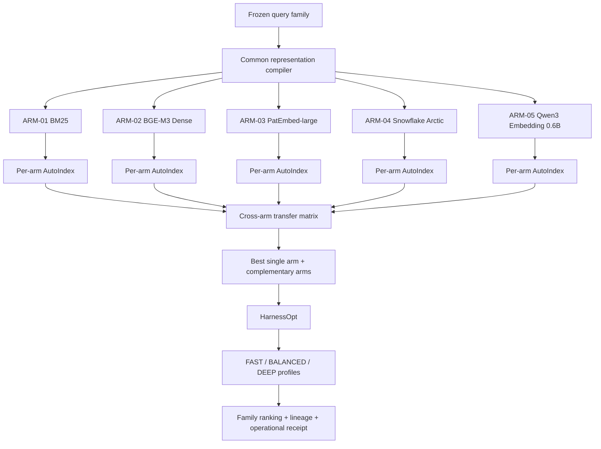

# PLAN V02 NEW — ArmIndex Multi-Arm AutoIndex and Harness Optimization

**Working title:** *ArmIndex: Retriever-Conditioned Representation Program Search and Production-Constrained Harness Optimization for Cross-Domain Patent Retrieval*

**Repository:** `siriponsri/myIS`

**Primary benchmark:** DAPFAM family-level patent retrieval

**Primary metric:** OUT-domain Recall@100

**Key secondary metrics:** OUT-domain nDCG@100 and OUT-domain nDCG@10

**Operational metrics:** p50/p95 latency, throughput, index size, peak memory, GPU time, and charged USD

**Model policy:** frozen inference only; no fine-tuning, LoRA, adapters, distillation, continued pretraining, preference optimization, or model-weight updates

**Compute policy:** cumulative Vast.ai spending must never exceed USD 100

**Plan status:** proposed additive replacement scientific plan; historical P1/P2/SCOPE evidence remains immutable and is not overwritten

---

## 1. Executive decision

The research program will pivot from a single-retriever SCOPE/BM25 representation search and from the proposed CrossFAM pipeline to a two-level frozen-retriever optimization framework:

1. **Retriever-conditioned AutoIndex:** learn executable document-representation programs separately for five fixed retrieval arms.
2. **Cross-arm transfer analysis:** test whether a representation learned for one retriever transfers to other retrievers.
3. **Complementarity-aware arm selection:** retain the strongest individual arm and the arms that recover relevant families missed by the strongest arm.
4. **HarnessOpt:** optimize how frozen arms are invoked, ordered, fused, deepened, cached, and stopped under explicit quality, latency, and cost constraints.
5. **Production profiling:** freeze `FAST`, `BALANCED`, and `DEEP` serving profiles on the measured quality–latency–cost frontier.
6. **External structured-retrieval diagnostic:** evaluate the frozen commercial-capable harness on a legal retrieval benchmark without retuning.

The flagship contribution is not a model leaderboard and not a broad Cartesian sweep. It is:

> **A two-level agentic system-engineering method that first learns retriever-conditioned representation programs and then learns a production-constrained harness over complementary frozen retrieval arms.**

The development-time optimizer may use an agent to diagnose aggregate failures and propose constrained representation or harness configurations. The deployed retrieval path remains deterministic, versioned, testable, and reproducible. No LLM agent is required in the synchronous production request path.

---

## 2. Why this is a stronger publication and benchmark strategy

### 2.1 Evidence from the literature

**AutoIndex.** AutoIndex treats document representation as an optimization target. With BM25 fixed, it searches executable programs that slice, enrich, normalize, reweight, or reorganize documents. Its reported average gains across eight heterogeneous tasks are approximately `+8.4% Recall@100` and `+8.3% nDCG@10`, showing that representation search can create substantial retrieval gains without changing model weights [R1].

**DAPFAM.** DAPFAM evaluates family-level retrieval with explicit IN/OUT domain partitions and reports a large OUT-domain performance gap despite document/passage representations, lexical/dense retrieval, aggregation variants, and hybrid fusion. It evaluates both Recall@100 and nDCG@100, making it appropriate for studying exposure and ranking under domain shift [R2].

**Patent embedding heterogeneity.** PatenTEB reports strong external DAPFAM performance for `datalyes/patembed-large`, while a 22-model patent embedding study finds that model scale, corpus view, prompting, and sparse–dense fusion interact non-trivially; all models still suffer large OUT-domain drops [R3, R4]. This supports studying the interaction between retrieval backbone and representation rather than assuming one universal document view.

**Multiple expert retrievers.** RouterRetriever shows that routing over multiple expert embedding models can outperform a single general retriever without retraining every expert, motivating complementarity-aware arm selection and query-dependent routing [R5].

**Harness optimization.** Meta-Harness and later harness-optimization work argue that system behavior depends on the surrounding code, tools, state, and workflow—not only model weights or prompts. The new plan constrains this idea to retrieval-specific harness surfaces with direct retrieval metrics and production budgets [R6, R7].

**Automated RAG configuration.** AutoRAG and AutoRAGTuner show the value of declarative, configuration-driven optimization across RAG modules. This plan narrows the search to a preregistered retrieval grammar, immutable model adapters, and auditable family-level metrics to avoid uncontrolled pipeline search [R8, R9].

**Production caution.** Production-style studies show that extra fusion can improve raw recall but may lose value after reranking, truncation, or latency constraints. Therefore, the research must jointly report retrieval quality, latency, cost, and context-budget implications rather than optimize recall in isolation [R10].

**Legal transfer.** LegalBench-RAG was created specifically to evaluate legal retrieval and emphasizes precise supporting snippets because large imprecise chunks increase latency, cost, and hallucination risk. It provides a credible frozen-transfer diagnostic for the production claim [R11].

### 2.2 Scientific gap

The strongest defensible gap is:

> Existing representation-search work generally holds one retriever fixed, while multi-retriever systems commonly use hand-designed views and fusion. It remains unclear whether optimal representation programs are retriever-specific, whether they transfer across lexical, generic dense, and domain-specific dense backbones, and whether an automatically optimized multi-arm harness can improve cross-domain Recall@100 while remaining deployable under latency and cost constraints.

### 2.3 Intended contributions

1. **Representation contribution:** a common executable representation grammar evaluated under five frozen retrieval backbones.
2. **Interaction contribution:** a cross-arm transfer matrix that reveals which representation decisions are universal and which are retriever-conditioned.
3. **System contribution:** HarnessOpt, a constrained agentic optimizer over arm subset, invocation order, depth, fusion, caching, and early stopping.
4. **Evaluation contribution:** OUT Recall@100 as the primary objective, with nDCG@100, nDCG@10, complementarity, latency, and cost reported jointly.
5. **Production contribution:** separate research and commercial-capable champions plus `FAST`, `BALANCED`, and `DEEP` serving profiles.
6. **Transfer contribution:** frozen zero-shot evaluation on legal structured retrieval without patent-specific retuning.
7. **Boundary contribution:** every arm and deeper branch is a Research Flow with a valid `STOP_WITH_EVIDENCE` outcome; no hidden optional experiment or model-weight branch exists.

---

## 3. Research questions and hypotheses

| ID | Research question | Preregistered expectation |
|---|---|---|
| RQ1 | Does representation-program optimization improve each frozen retriever over its strongest static representation? | At least one arm gains practically useful OUT Recall@100 without unacceptable nDCG regression. |
| RQ2 | Are optimal representation programs retriever-conditioned? | The cross-arm transfer matrix shows significant rank changes and at least one arm-specific winner. |
| RQ3 | Which arms contribute unique relevant families under OUT-domain shift? | Lexical, patent-specific dense, and generic dense arms exhibit non-zero unique-hit complementarity. |
| RQ4 | Does HarnessOpt outperform the best single optimized arm? | The frozen harness improves OUT Recall@100 or preserves it with materially better latency/cost. |
| RQ5 | Can agentic development produce a deterministic production harness? | The optimizer proposes configurations, while the frozen runtime remains reproducible and label-free. |
| RQ6 | Do learned representation principles transfer to legal structured retrieval? | At least one commercial-capable program/harness improves a static legal retrieval baseline zero-shot. |

### Primary hypothesis

**H1:** The frozen HarnessOpt champion improves OUT Recall@100 over the strongest valid single-arm AutoIndex champion under an identical DAPFAM family-level protocol.

### Key secondary hypotheses

- **H2:** Per-arm AutoIndex improves at least three of five arms over their static anchors.
- **H3:** The best representation from one arm is not universally optimal across all arms.
- **H4:** A production-constrained harness lies on a better quality–latency–cost frontier than an always-on all-arm union.
- **H5:** A commercial-capable harness retains useful transfer on legal structured retrieval.

---

## 4. Scope

### 4.1 In scope

- DAPFAM family-level retrieval over the canonical corpus and frozen query protocol.
- Existing `Train-250`, `Selection-125`, and campaign-held-out `Final-872`.
- Deterministic subdivision of `Train-250` into representation-search and harness-development roles.
- Five frozen retrieval arms:
  - BM25;
  - BGE-M3 dense;
  - PatEmbed-large;
  - Snowflake Arctic Embed M v2.0;
  - Qwen3-Embedding-0.6B.
- Executable representation programs.
- Per-arm AutoIndex search.
- Cross-arm transfer analysis.
- Complementarity and unique-hit analysis.
- Fixed and adaptive multi-arm harnesses.
- Production serving profiles.
- Frozen legal retrieval transfer diagnostic.
- Cost, latency, reliability, and lineage measurement.

### 4.2 Explicitly excluded

No research phase, branch, or appendix will investigate fine-tuning or any model-weight modification. This includes LoRA, QLoRA, adapters, learned prefixes, distillation, continued pretraining, reinforcement learning, preference optimization, and domain-adaptive weight updates.

Also excluded:

- broad 20+ model sweeps;
- proprietary embedding APIs in confirmatory comparisons;
- query rewriting or HyDE as a flagship path;
- LLM reranking as a required component;
- automatic changes to evaluator, qrels, split, metric, family mapping, or model adapter;
- IPC/CPC overlap as a runtime feature for the OUT claim;
- legal novelty, validity, infringement, or freedom-to-operate conclusions.

---

## 5. Frozen data and evaluation contract

### 5.1 Data roles

| Role | Size | Permitted use | Prohibited use |
|---|---:|---|---|
| `REP-DEV` | deterministic stratified subset of Train-250, target size 150 | static screening, per-arm AutoIndex, representation ablations | harness tuning, Selection claims |
| `HARNESS-DEV` | remaining deterministic stratified subset of Train-250, target size 100 | transfer matrix, arm complementarity, HarnessOpt, production profiles | representation mutation after freeze |
| `Selection-125` | 125 | one atomic evaluation of at most four frozen finalists | any post-exposure tuning |
| `Final-872` | 872 | one frozen confirmation after `D2_OPEN_FINAL` | any feedback into system design |
| Legal transfer split | benchmark-defined | frozen external diagnostic | retuning patent campaign from legal labels |

The exact `REP-DEV/HARNESS-DEV` memberships are created once with seed `42`, stratified where possible by IN/OUT role and relevance-count distribution, and stored only through protected membership plus repository-safe hashes and counts. Exact counts may differ from 150/100 only if required to preserve immutable grouping constraints; any deviation must be recorded before measured work.

### 5.2 Protected boundaries

- Query text is available only to representation compilers and retrievers.
- REP-DEV qrels are available only to the evaluator and deterministic feedback builder.
- HARNESS-DEV qrels are available only to harness evaluation and aggregate feedback.
- Selection qrels are opened once after all finalists freeze.
- Final qrels remain inaccessible until `D2_OPEN_FINAL`.
- Optimizer agents receive aggregate metrics, failure categories, configuration lineage, and redacted diagnostics only.
- No optimizer receives query IDs, family IDs, qrels rows, split membership, rankings, or per-query outcomes.
- Repository artifacts contain hashes, counts, safe identifiers, aggregate metrics, and claim boundaries only.

### 5.3 Metrics

**Primary:** OUT Recall@100.

**Key secondary:** OUT nDCG@100; OUT nDCG@10.

**Exposure diagnostics:** Recall@100/500/1,000/2,000; oracle Recall@100 and oracle nDCG@100 inside frozen pools; unique relevant family-query pairs contributed per arm; pairwise overlap; judged-query coverage.

**Guardrails:** ALL and IN Recall/nDCG; exact tie rate; failure rate; ranking determinism.

**Operational:** p50/p95/p99 latency; throughput; cold/warm start; CPU/GPU time; charged USD; RAM/VRAM; index size; cost per 1,000 queries.

### 5.4 Lexicographic development objective

1. maximize OUT Recall@100;
2. when absolute Recall difference is below `0.005`, prefer higher OUT nDCG@100;
3. when nDCG@100 difference is below `0.002`, prefer higher OUT nDCG@10;
4. when quality remains effectively tied, prefer lower p95 latency;
5. then lower charged cost and smaller index footprint;
6. exact ties prefer the simpler configuration.

The tolerances are development rules, not claims of statistical equivalence.

### 5.5 Primary comparison

```text
Frozen HarnessOpt champion
versus
strongest valid single-arm AutoIndex champion
```

Both must share query membership, corpus, family mapping, evaluator, top-k, tie policy, software lock, environment class, and protected-data rules.

### 5.6 Statistics

- paired per-query differences;
- 10,000 paired bootstrap resamples for Selection and Final;
- mean delta, 95% CI, win/tie/loss, effect distribution;
- correction for the small preregistered confirmatory family;
- p-values as supporting evidence only;
- unplanned analyses labelled exploratory.

---

## 6. System architecture



### 6.1 Two optimization levels

**Level 1 — AutoIndex**

- mutable: representation program only;
- fixed: retriever arm and model adapter;
- data: REP-DEV;
- output: one frozen winning program per promoted arm.

**Level 2 — HarnessOpt**

- mutable: arm composition and execution harness only;
- fixed: frozen programs and adapters;
- data: HARNESS-DEV;
- output: research champion plus production profiles.

### 6.2 Agentic system-engineering boundary

The agent may diagnose aggregate failures, propose schema-valid programs/configurations, explain trade-offs, rank updates, and generate matched ablations.

The agent may not inspect protected payloads, produce a metric, change weights, mutate model prompts/pooling, change evaluator/split/metric, edit accepted outcomes, or deploy free-form code. Proposals are compiled from constrained DSLs, independently validated, hash-locked, and executed deterministically.

---

## 7. Retrieval arms

### 7.1 Shared static controls

| Program | Logical representation |
|---|---|
| `P00-TAC-DOC` | title + abstract + claims as one ordered family document |
| `P01-TA-DOC` | title + abstract |
| `P02-CLAIM1` | first independent claim |
| `P03-PASSAGE` | model-valid fixed passages with family MaxP |
| `P04-SECTION-MULTIVIEW` | separately labelled title, abstract, claims with family aggregation |

Adapters may enforce valid tokenizer windows but may not silently change logical fields/unitization.

### 7.2 ARM-01 — BM25

- implementation: `bm25s`, exact version frozen;
- `k1=1.2`, `b=0.75`;
- role: lexical anchor, rare terminology, CPU fallback, lowest-latency arm;
- document/passage indexes separate;
- MaxP and `avg_top3` allowed;
- commercial-capable.

### 7.3 ARM-02 — BGE-M3 Dense

- repository: `BAAI/bge-m3`;
- dense-only core;
- dimension 1,024;
- declared maximum 8,192 tokens;
- MIT;
- no query instruction in core adapter;
- pooling/normalization frozen from official implementation;
- multilingual, long-context, commercial-capable;
- sparse/multi-vector handled by a separate Research Flow.

### 7.4 ARM-03 — PatEmbed-large

- repository: `datalyes/patembed-large`;
- approximately 344M parameters;
- dimension 1,024;
- current plan uses 512-token passages pending immutable Phase 0 verification;
- query prefix: `encode query for different document retrieval:`;
- document prefix: `encode document for different retrieval:`;
- mean pooling, L2, cosine;
- CC BY-NC-SA 4.0;
- research/non-commercial champion only.

### 7.5 ARM-04 — Snowflake Arctic Embed M v2.0

- repository: `Snowflake/snowflake-arctic-embed-m-v2.0`;
- approximately 305M total / 113M non-embedding;
- dimension 768;
- 8,192 context;
- query prefix exactly `query: `;
- no document prefix;
- CLS pooling, L2;
- Apache-2.0;
- DAPFAM-aligned and commercial-capable.

### 7.6 ARM-05 — Qwen3 Embedding 0.6B

- repository: `Qwen/Qwen3-Embedding-0.6B`;
- 0.6B, 28 layers;
- 32K declared context, measured cap frozen after pilot;
- dimension 1,024;
- query format `Instruct: {task}\nQuery:{query}`;
- frozen task: `Retrieve patent families containing technical information relevant to prior-art search for the query patent family.`
- last-token pooling, left padding, L2;
- Apache-2.0;
- instruction-aware, multilingual, commercial-capable.

---

## 8. Representation program grammar

```yaml
source_fields:
  - title_en
  - abstract_en
  - claims_text
field_order: [...]
field_labels: none | compact | explicit
unitization: document | section | claim | passage | multiview
independent_claim_policy: none | first | all_detected
passage:
  logical_size_class: short | medium | long
  overlap_ratio: 0.0 | 0.125 | 0.25
  boundary_policy: token | sentence | section_aware
packing: none | sequential | section_preserving
normalization:
  unicode: NFC
  whitespace: canonical
  lowercase: true | false
  punctuation: preserve | normalize
duplicate_policy: preserve_best_span | collapse_exact
family_aggregation: maxP | avg_top3 | top2_mean | view_RRF
```

Immutable adapter fields include model/tokenizer SHAs, prompts, pooling, normalization, dimension, precision, similarity, ANN, maximum length, evaluator, family mapping, query view, top-k, split, and tie policy.

Compiler requirements:

- deterministic under reversed input order;
- explicit source offsets/hashes;
- no silent truncation;
- family/publication identity preservation;
- content-addressed units;
- byte-stable manifests;
- schema and semantic validation;
- pre-run unit/storage/cost estimate.

---

## 9. Research Flows

No deeper branch is called optional. Each flow runs minimum diagnostics and closes with a valid receipt.

### RF-A — Protocol Integrity

Minimum: evaluator/family audit, P1 import, adapter fixtures, split/counters, determinism.

Outcomes: `PASS_PROTOCOL_INTEGRITY` or `BLOCKED_PROTOCOL_MISMATCH`.

### RF-B — Common Multi-Arm Screening

Run `P00–P04` for all five arms on REP-DEV; collect quality, unique hits, latency, storage, failures.

Promote up to three arms using Recall, unique contribution, frontier, and representation sensitivity.

Outcomes: `PROMOTE_ARM`, `STOP_WITH_EVIDENCE_DOMINATED_ARM`, `BLOCKED_INVALID_ADAPTER`.

BM25 remains reported/fallback even when dominated.

### RF-C — Per-Arm AutoIndex

Each promoted arm runs at least two four-candidate batches:

1. exploit;
2. matched ablation;
3. orthogonal hypothesis;
4. diversity program.

A third batch runs automatically only after strict improvement, remaining hypotheses, and budget admission.

Outcomes: `FREEZE_ARM_PROGRAM`, `STOP_WITH_EVIDENCE_FLAT_REPRESENTATION_SURFACE`, `BLOCKED_NONDETERMINISTIC_PROGRAM`.

### RF-D — BGE-M3 Functionality Expansion

Run a small dense-vs-sparse-vs-multi-vector diagnostic on a fixed REP-DEV subset. Continue fully only with unique hits or frontier value.

Outcomes: `FREEZE_BGE_DENSE_ONLY`, `FREEZE_BGE_MULTIFUNCTION_ARM`, `STOP_WITH_EVIDENCE_NO_MODE_LEVERAGE`.

### RF-E — Cross-Arm Transfer

Compile each frozen promoted-arm program for all valid arms and measure within-arm gain, transfer gain/loss, rank stability, field/unitization interaction, truncation, and cost.

Outcomes: `EVIDENCE_RETRIEVER_CONDITIONED`, `EVIDENCE_UNIVERSAL_PROGRAM`, `EVIDENCE_MIXED_TRANSFER`.

### RF-F — Complementarity and Candidate Exposure

On HARNESS-DEV compare best single, pairs, all promoted, commercial subset, and research subset.

HarnessOpt proceeds when at least one holds:

- union OUT Recall@1,000 exceeds best same-depth arm by `>=0.015`;
- a non-best arm contributes unique relevant family-query pairs to `>=5%` of eligible OUT queries;
- fixed union improves Recall@100 at an acceptable frontier point.

Outcomes: `PROMOTE_MULTI_ARM_HARNESS`, `FREEZE_BEST_SINGLE_ARM`, `STOP_WITH_EVIDENCE_NO_COMPLEMENTARITY`.

### RF-G — HarnessOpt

Mutable: arm subset, order, parallel/sequential, depth, fusion, label-free early stops, cache, latency profile.

Forbidden: representation, model adapter/weight, query text, evaluator/qrels/split, post-Selection mutation.

Candidate budget: four controls; two four-candidate batches; third batch only after strict frontier gain.

Outcomes: `FREEZE_HARNESSOPT_CHAMPION`, `FREEZE_FIXED_UNION`, `FREEZE_BEST_SINGLE_ARM`, `STOP_WITH_EVIDENCE_HARNESS_NO_GAIN`.

### RF-H — Production Profiles

Always evaluate:

- `FAST`: BM25 + one commercial dense arm, bounded synchronous;
- `BALANCED`: best two/three commercial arms, synchronous when p95 passes;
- `DEEP`: full selected harness, asynchronous permitted.

Retain only non-dominated profiles.

### RF-I — Legal Structured-Retrieval Transfer

Minimum:

- static BM25 and one commercial dense arm on LegalBench-RAG-mini;
- frozen winning logical representation mapped to legal fields;
- unsupported mappings explicit.

Full benchmark continues only with valid mini diagnostic and budget. No legal feedback changes the patent campaign.

Outcomes: `TRANSFER_SUPPORTED`, `TRANSFER_MIXED`, `STOP_WITH_EVIDENCE_NO_TRANSFER`, `BLOCKED_INCOMPATIBLE_SCHEMA`.

---

## 10. Candidate and champion rules

### 10.1 Arm promotion

At most three core arms continue to full AutoIndex based on Recall, unique hits, frontier, mechanism diversity, and commercial capability.

PatEmbed may be research-only.

### 10.2 Selection finalists

At most four:

1. strongest static/common-program baseline;
2. strongest single-arm AutoIndex champion;
3. HarnessOpt research champion if promoted;
4. commercial-capable production champion if distinct.

Unused slots remain empty.

### 10.3 Selection rule

1. highest Selection OUT Recall@100;
2. within `0.005`, higher OUT nDCG@100;
3. within `0.002`, higher OUT nDCG@10;
4. lower p95 latency;
5. lower cost/query;
6. simpler system.

Research and commercial champions may differ.

### 10.4 Aspirational targets

```text
OUT Recall@100 >= 0.20
OUT nDCG@100 >= 0.075
```

These are ambitions, not automatic pass thresholds.

---

## 11. Budget contract

| Work | Maximum charged USD |
|---|---:|
| Model resolution, parity, throughput pilots | 5 |
| Common five-arm screening | 18 |
| Per-arm AutoIndex | 25 |
| BGE diagnostic and transfer matrix | 8 |
| Complementarity and HarnessOpt | 17 |
| Production benchmarking | 7 |
| Legal transfer | 5 |
| Final-872 | 8 |
| Infrastructure reserve | 7 |
| **Total** | **100** |

Rules: actual charges authoritative; pre-run estimate mandatory; no launch if remaining balance is insufficient; reserve cannot fund new hypotheses; batch-size-only OOM recovery; mandatory auto-shutdown.

---

## 12. Owner gates

One start invocation authorizes REP-DEV, HARNESS-DEV, one Selection exposure, automatic flows, and up to USD 100. Final remains closed.

Only:

- `D2_OPEN_FINAL`
- `D3_SUBMIT_RELEASE`

No micro-decision for arms, programs, BGE modes, HarnessOpt, thresholds, fusion, GPU, failures, or negative results.

Owner input only for missing protected roots, unavailable provider, irreconcilable hashes, budget increase, Final, or release.

---

## 13. Phase plan

Each Phase is one `/goal`. Canonical levels are Phase and Task only.

### Phase 0 — Create and freeze ArmIndex

```text
/goal Execute Phase 0 of PLAN_V02_NEW.md only. Create the additive armindex-multiretriever-v2 campaign, preserve all historical evidence, freeze the evaluation, model, representation, budget, and protected-data contracts, run compute-feasibility fixtures, and stop with a Phase 0 completion card. Do not run measured retrieval, Selection, or Final.
```

| Task | Work | Output | Completion |
|---|---|---|---|
| P0.1 | inventory P1/SCOPE/CrossFAM/code/indexes | migration matrix | all classified |
| P0.2 | create additive campaign/source-of-truth | controls | history unchanged |
| P0.3 | freeze REP-DEV/HARNESS-DEV | split commitment | invariants validate |
| P0.4 | freeze evaluator/family/metrics/ties | evaluation lock | complete |
| P0.5 | resolve five arms and licenses | model lock | full SHAs |
| P0.6 | freeze representation DSL/compiler | schemas/fixtures | deterministic |
| P0.7 | freeze HarnessOpt DSL/boundary | contract | forbidden changes fail |
| P0.8 | run cost/storage/throughput pilot | feasibility report | total <=100 |
| P0.9 | validate journal/resume/reports/shutdown | receipt | no measured access |

### Phase 1 — Repair and reproduce protocol baselines

```text
/goal Execute Phase 1 of PLAN_V02_NEW.md only. Reproduce the canonical family-level BM25 baseline and validate every frozen arm adapter on fixtures and REP-DEV. Resolve protocol or lineage failures before continuing and stop with a comparable-baseline report. Do not use HARNESS-DEV, Selection, or Final for optimization.
```

Tasks: import P1 historical card; BM25 document/passage anchors; BGE parity; PatEmbed prompted/unprompted diagnostic; Snowflake prefix/CLS diagnostic; Qwen instruction diagnostic; comparability matrix.

### Phase 2 — Common multi-arm screening

```text
/goal Execute Phase 2 of PLAN_V02_NEW.md only. Compile the five frozen common representation programs, run them across all five retrieval arms on REP-DEV, measure quality, complementarity, latency, storage, and failure behavior, and automatically promote at most three arms to per-arm AutoIndex. Do not use HARNESS-DEV, Selection, or Final.
```

Tasks: compile P00–P04; build/reuse indexes; run screen; unique-hit/frontier analysis; BGE mode diagnostic; arm freeze.

### Phase 3 — Per-arm AutoIndex

```text
/goal Execute Phase 3 of PLAN_V02_NEW.md only. Run constrained AutoIndex representation-program search independently for each promoted frozen retriever arm on REP-DEV, using immutable four-candidate batches and aggregate-safe feedback. Freeze one program per promoted arm and stop before HARNESS-DEV.
```

Tasks: register incumbents/budgets; two required batches; gated third batch; reproduce winners; freeze programs; close flat/failed arms.

### Phase 4 — Cross-arm transfer and complementarity

```text
/goal Execute Phase 4 of PLAN_V02_NEW.md only. Evaluate frozen winning representation programs across valid retrieval arms, build the cross-arm transfer matrix, measure same-depth complementarity on HARNESS-DEV, and freeze the best single arm plus the eligible complementary arm set. Do not optimize the harness or access Selection/Final.
```

Tasks: compile transfers; evaluate matrix; interaction analysis; equal-depth unions; complementarity gate; research/commercial arm sets.

### Phase 5 — HarnessOpt

```text
/goal Execute Phase 5 of PLAN_V02_NEW.md only. Optimize the deterministic multi-arm retrieval harness on HARNESS-DEV over the frozen programs and eligible arms. Search only arm subset, order, depth, fusion, caching, and label-free early-stop surfaces. Freeze the best single, fixed-union, and HarnessOpt configurations. Do not access Selection or Final.
```

Tasks: controls; feedback schema; two batches; gated third; leakage tests; freeze research/commercial harnesses.

### Phase 6 — Production profiles

```text
/goal Execute Phase 6 of PLAN_V02_NEW.md only. Benchmark the frozen single-arm and harness finalists under production-style latency, throughput, cache, failure, and cost conditions. Freeze FAST, BALANCED, and DEEP profiles only when non-dominated. Do not use Selection or Final.
```

Tasks: serving fixture; p50/p95/p99; CPU fallback/failure; index/storage/cost; Pareto freeze; deployment manifests.

### Phase 7 — Transfer, shortlist, Selection

```text
/goal Execute Phase 7 of PLAN_V02_NEW.md only. Run the frozen legal structured-retrieval Research Flow without patent retuning, freeze at most four DAPFAM finalists, expose Selection-125 exactly once, select research and commercial champions by the preregistered rule, and stop before Final.
```

Tasks: LegalBench-RAG integrity; mini/full automatic flow; shortlist; atomic Selection; research champion; commercial champion; Final-ready bundle.

### Phase 8 — Final-872

Requires `D2_OPEN_FINAL`.

```text
/goal Execute Phase 8 of PLAN_V02_NEW.md only after D2_OPEN_FINAL is recorded. Verify the frozen bundle, run the preregistered strongest comparator and exactly one research champion on Final-872 once, compute paired statistics and operational metrics, seal all evidence, and prohibit feedback into the system.
```

### Phase 9 — Paper/artifact

```text
/goal Execute Phase 9 of PLAN_V02_NEW.md only. Write the six-page paper from frozen evidence, create the anonymous reproducibility package, audit claims, statistics, licenses, latency, and protected boundaries, and stop before submission unless D3_SUBMIT_RELEASE is recorded.
```

---

## 14. Publication design

Main story:

1. no retriever is uniformly dominant under OUT shift;
2. representation is optimizable and potentially retriever-conditioned;
3. ArmIndex searches programs per lexical/general/patent arm;
4. transfer matrix isolates universal vs conditioned effects;
5. HarnessOpt composes only complementary arms under production constraints;
6. final system targets Recall@100 while preserving ranking/latency/cost;
7. frozen legal transfer tests broader structured retrieval.

Figures: architecture; program compilation; transfer heatmap; quality–latency–cost frontier.

Tables: arm adapters/static baselines; AutoIndex gains; transfer/complementarity; HarnessOpt/Final and profiles.

Positive claim:

> Under a frozen family-level protocol, retriever-conditioned representation search and complementarity-aware harness optimization improved OUT-domain Recall@100 over the strongest single optimized retriever while preserving auditable latency, cost, and ranking-quality boundaries.

Negative publishable claim:

> Representation optimization improved individual retrieval arms, but cross-arm composition did not reliably exceed the best single optimized retriever under production constraints, revealing that representation–retriever interaction was stronger than multi-arm fusion on this benchmark.

---

## 15. Migration

- P1 R0/R0-W remain historical measured evidence.
- `scope-autoindex-v1` remains historical/unmeasured; reusable infrastructure must validate.
- blocked P2 preflight remains engineering evidence; old campaign need not be repaired merely to run it.
- CrossFAM V02 remains a preserved proposed direction.
- additive campaign ID: `armindex-multiretriever-v2`.
- no historical file/result/decision is deleted or reclassified.
- protected splits, family normalization, evaluator framework, MLflow, Dashboard, Obsidian, session, and artifact registries are extended.

---

## 16. Manifest requirements

Every run records campaign/phase/task/flow, run/parent/status, Git commit/tree, dataset/query/qrels/split/family hashes, evaluator/metric/tie/cutoff, arm/model/tokenizer/adapter/prompt/pooling/dimension/dtype, program and compiled hashes, fields/windows/aggregation, index/depth, harness subset/order/fusion/stop/cache, aggregate metrics/statistics, unique-hit/overlap, latency/resources/USD, protected pointers, failures/recovery.

---

## 17. Definition of done

- campaign and locks validate;
- every arm has screen result or terminal receipt;
- promoted arms have frozen programs;
- transfer matrix complete;
- equal-depth complementarity measured;
- HarnessOpt winner or truthful stop;
- production profiles frozen;
- Selection <=1;
- Final only after D2;
- all metrics from immutable manifests;
- all negative/stopped flows retained;
- research/commercial champions distinguished;
- no weight changes;
- cost <= USD100;
- no protected/private leakage;
- clean synchronized main after closeout.

---

## 18. Primary references

- [R1] AutoIndex: https://arxiv.org/abs/2607.18603
- [R2] DAPFAM: https://arxiv.org/abs/2506.22141
- [R3] PatenTEB: https://arxiv.org/abs/2510.22264
- [R4] Benchmarking Patent Embeddings: https://arxiv.org/abs/2605.24297
- [R5] RouterRetriever: https://arxiv.org/abs/2409.02685
- [R6] Meta-Harness: https://arxiv.org/abs/2603.28052
- [R7] Retrospective Harness Optimization: https://arxiv.org/abs/2606.05922
- [R8] AutoRAG: https://arxiv.org/abs/2410.20878
- [R9] AutoRAGTuner: https://arxiv.org/abs/2605.02967
- [R10] Production RAG Fusion: https://arxiv.org/abs/2603.02153
- [R11] LegalBench-RAG: https://arxiv.org/abs/2408.10343
- [R12] BGE-M3: https://arxiv.org/abs/2402.03216
- [R13] Qwen3 Embedding: https://arxiv.org/abs/2506.05176
- [R14] Arctic Embed 2.0: https://arxiv.org/abs/2412.04506

---

## 19. Final freeze statement

- flagship: retriever-conditioned representation program search;
- second level: production-constrained HarnessOpt;
- arms: BM25, BGE-M3 dense, PatEmbed-large, Snowflake Arctic M v2.0, Qwen3-Embedding-0.6B;
- primary: OUT Recall@100;
- secondary: OUT nDCG@100 and nDCG@10;
- no weight modification;
- one Selection;
- one Final after D2;
- USD100 ceiling;
- Owner gates D2/D3 only;
- research/commercial champions separate;
- every weak branch closes through a Research Flow receipt.
