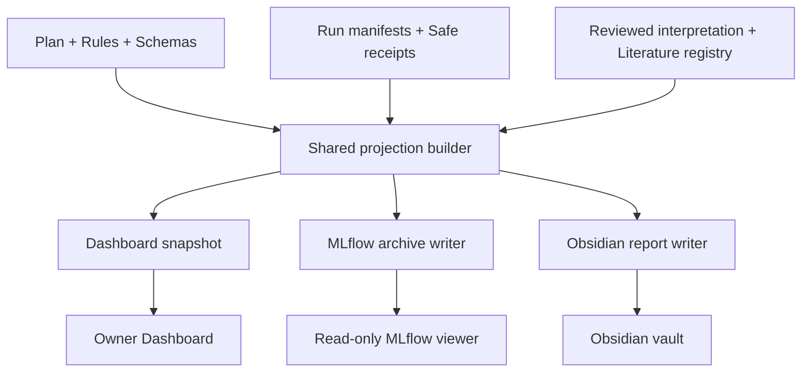

# myIS MLflow Evidence Archive — Design Specification

> Version 2.0 · Date 2026-07-30 · Thai-first · Local and loopback-only
>
> Target location in repository: `mlflow/MLFLOW_DESIGN.md`
>
> Status: implementation contract for the MLflow archive, read-only viewer, Dashboard integration, and migration from the earlier MLflow design
>
> This document does not override `AGENTS.md`, the active `PLAN.md`, frozen protocols, schemas, immutable run bundles, Owner decisions, or protected-data rules.

---

## 1. Executive decision

MLflow ในโครงการ myIS ต้องเป็น **แหล่งเปิดดูและย้อนประวัติการทดลองที่ครบที่สุดสำหรับมนุษย์** โดยเก็บสิ่งต่อไปนี้แบบค้นหาและเปรียบเทียบได้:

- artifacts ที่อนุญาตให้แสดง;
- rules/protocol snapshots ที่ใช้กับแต่ละ run;
- metric definitions และค่าที่วัดได้;
- schema snapshots;
- parameters, environment และ lineage;
- checks, failures และเหตุผลที่หยุด;
- outputs, results, interpretation และ claim boundary;
- ความสัมพันธ์ระหว่าง Phase → Task → Run → Evidence → Report.

อย่างไรก็ตาม MLflow **ไม่ใช่หน้าที่ใช้แก้กฎหรือกรอกผลด้วยมือ** และไม่ใช่ authority ที่สร้าง scientific truth ใหม่

กฎที่ต้องจำ:

> Git และ immutable run bundle เป็นที่ออกกฎและสร้างหลักฐาน<br>
> MLflow เป็นตู้เก็บ snapshot ที่ค้นหา ย้อนดู และเปรียบเทียบหลักฐานเหล่านั้น<br>
> Dashboard และ Obsidian อ่านหลักฐานชุดเดียวกัน

ดังนั้นคำว่า “MLflow เป็นแหล่งเก็บทั้งหมด” ในเอกสารนี้หมายถึง:

1. เป็น **default historical evidence browser** ของ Owner;
2. เก็บสำเนา safe snapshot ของสิ่งที่ถูกใช้จริงในแต่ละ run;
3. ทุก record ต้องย้อนกลับไปยัง canonical source และ SHA-256 ได้;
4. การลบหรือเสียหายของ MLflow ต้องไม่เปลี่ยนผลวิจัย และต้อง rebuild ได้.

---

## 2. สิ่งที่เปลี่ยนจาก MLflow Design ฉบับเดิม

| หัวข้อ | ฉบับเดิม | ฉบับนี้ |
|---|---|---|
| หน้าที่หลัก | Searchable mirror | Evidence archive + searchable registry ที่ยัง rebuild ได้ |
| Experiment hierarchy | หก experiment แยก bootstrap/catalog/Track C/Track S/joint/publication | หนึ่ง campaign experiment เป็นค่าเริ่มต้น และ system experiment แยกเฉพาะงานระบบ |
| Phase view | สร้าง `by-phase/` tree อีกชุด | Dashboard/Obsidian ใช้ shared read model; ไม่สร้างสถานะซ้ำใน MLflow |
| Rules/metrics/schemas | เก็บเป็น artifact ทั่วไป | มี typed `Freeze Bundle` ผูกทุก run |
| History | latest/selected | เพิ่ม valid/current/superseded และ correction chain |
| Viewer | launcher แยก | Dashboard เริ่มและเปิด read-only viewer แบบ on-demand |
| Launcher | Dashboard และ MLflow แยกกัน | เหลือ user-facing launcher ของ Dashboard เพียงตัวเดียว |
| Beginner UX | โฟลเดอร์หกชนิด | หน้า “อ่าน run นี้อย่างไร” + ชื่อไทย + evidence maturity |
| Projection sync | MLflow สร้าง view ของตนเอง | สร้าง shared read model ครั้งเดียว แล้ว fan-out ไป MLflow/Dashboard/Obsidian |

ห้ามลบ experiment หรือ artifact เดิมทันทีระหว่าง migration ให้เก็บเป็น `legacy_read_only` จนกว่าจะผ่าน reconciliation และ backup

---

## 3. Mental model สำหรับ Owner แบบ low-dev

ให้คิดว่า MLflow เป็นตู้เอกสาร 5 ลิ้นชัก:

| ลิ้นชัก | คำถามที่ตอบ |
|---|---|
| Fixed Before Run | ก่อนรัน เราล็อกกฎ metric schema และ protocol อะไร |
| What Ran | รัน Task ใด ใช้วิธี รุ่น config และทรัพยากรอะไร |
| What Came Out | ได้ artifact, metric และ result อะไร |
| What It Means | ผลแปลว่าอะไร และยังห้ามสรุปอะไร |
| Can We Trust It | checks ผ่านไหม เป็น fixture/dev/selection/final และถูก supersede หรือยัง |

Owner ไม่ควรต้องอ่าน SHA-256 เพื่อเข้าใจหน้าแรก แต่ต้องสามารถกด `Audit details` เพื่อดู SHA-256, commit, evaluator version และ source bindings ได้

### 3.1 คำศัพท์พื้นฐาน

| คำ | ความหมายแบบง่าย |
|---|---|
| Artifact | ไฟล์หรือสิ่งที่ได้จากการทำงาน เช่น summary, table, figure หรือ manifest |
| Rule | กติกาที่ต้องกำหนดก่อนรัน เช่น วิธีเลือก candidate หรือเงื่อนไขหยุด |
| Metric | สูตรที่ใช้วัดผล เช่น Recall@100 |
| Schema | แบบฟอร์มบังคับว่าไฟล์หนึ่งต้องมีช่องอะไรและชนิดข้อมูลใด |
| Freeze | การล็อก rule/metric/schema/protocol ชุดหนึ่งไม่ให้เปลี่ยนกลางการทดลอง |
| Lineage | ประวัติว่า run มาจาก code, data, model, config และ environment ใด |
| Receipt | หลักฐานสรุปที่ผูกผลกับไฟล์ต้นทางและ hashes |
| Superseded | ของเก่าที่ยังเก็บไว้ แต่มี record ใหม่แทนและห้ามใช้เป็น current |

---

## 4. Authority and truth model

### 4.1 Authority matrix

| Record type | Authoring authority | MLflow responsibility |
|---|---|---|
| Phase/Task definitions | Active Plan + typed registry | เก็บ tag และ snapshot reference |
| Rules/protocol | Versioned Git control files + Owner decisions | เก็บ immutable freeze snapshot |
| Metric definitions | Frozen metric registry + evaluator contract | เก็บ exact definition/hash และ scalar projection |
| Schemas | Versioned schema files | เก็บ exact schema/hash ที่ run ใช้ |
| Measured values | Owner-local evaluator + immutable aggregate receipt | เก็บ verified copy; ห้ามแก้ด้วย UI |
| Raw/protected outputs | External protected store | เก็บ pointer, role, count และ hash เท่านั้น |
| Safe small artifacts | Canonical artifact bundle | เก็บ approved copy |
| Interpretation | Reviewed interpretation registry | เก็บ reviewed version; ห้าม generate สด |
| Gate decisions | Owner decision ledger | เก็บ pointer/hash; ไม่มีสิทธิ์ approve |
| Presentation/report | Shared projection snapshot | เก็บ report pointer/hash |

### 4.2 Invariants

- ตัวเลขหนึ่งค่าต้องมี `metric_definition_hash`, `evaluator_hash`, `manifest_hash` และ `receipt_hash`
- successful process ไม่เท่ากับ valid scientific run
- valid run ไม่เท่ากับ positive result
- latest run ไม่เท่ากับ selected run
- selected run ไม่เท่ากับ confirmatory run
- ถ้า source conflict ให้ `BLOCKED_PROJECTION_CONFLICT`
- ห้ามแก้ canonical value ผ่าน MLflow UI, SQLite editor หรือ Dashboard
- correction ต้องสร้าง record ใหม่และชี้ `supersedes_run_id`; ห้าม overwrite ประวัติ

---

## 5. Shared system architecture



Critical rule:

> Build the shared read model once per sync and pass the same in-memory revision to every writer.

ห้ามให้ Dashboard, MLflow และ Obsidian สร้าง current phase หรือ metric independently

ทุก projection ต้องบันทึก:

```text
read_model_revision
read_model_sha256
source_commit
projection_schema_version
generated_at_utc
```

---

## 6. Scope and non-goals

### 6.1 In scope

- local SQLite backend;
- local artifact store;
- serialized writer;
- read-only Owner viewer;
- campaign/phase/task/run registry;
- Freeze Bundles;
- safe aggregate metrics;
- small safe artifacts;
- protected artifact pointers;
- lineage, checks, failures, cost and latency;
- backups, quarantine and deterministic rebuild;
- Dashboard-controlled start/open workflow;
- migration of old experiments without deleting history.

### 6.2 Non-goals

- remote/public MLflow;
- cloud object storage;
- multi-user authentication;
- model deployment or serving;
- Model Registry unless a future measured need is approved;
- editing protocol/rules/metrics from the UI;
- uploading raw DAPFAM, qrels, queries, rankings or per-query outcomes;
- storing embeddings, indexes, model weights or source-paper PDFs;
- starting GPU or paid API work;
- opening D2/D3;
- replacing Git or immutable run bundles;
- keeping a second Phase/Task truth inside `by-phase/`.

---

## 7. Storage topology

### 7.1 Repository side

Repository stores only design, code, schemas, safe configs and pointers:

```text
mlflow/
├─ MLFLOW_DESIGN.md
├─ README.md
├─ config/
│  ├─ archive.yaml
│  ├─ artifact-policy.yaml
│  └─ viewer.yaml
└─ schemas/
   ├─ freeze-bundle.schema.json
   ├─ metric-definition.schema.json
   ├─ run-evidence.schema.json
   ├─ result.schema.json
   ├─ artifact-index.schema.json
   └─ sync-receipt.schema.json
```

Agent ต้อง map path ให้เข้ากับ active repository structure จริงก่อน implement ห้ามสร้าง duplicate tree ถ้ามี schema/config ที่มีหน้าที่เดียวกันอยู่แล้ว

### 7.2 External persistent store

ค่าเริ่มต้น:

```text
MYIS_MLFLOW_STORE
```

ตัวอย่าง Windows:

```text
C:\Users\Siripon Sri\Desktop\My_Research\01_Stores\00_myIS\mlflow
```

External tree:

```text
mlflow/
├─ database/
│  └─ mlflow.db
├─ artifacts/
│  └─ <managed-by-mlflow>
├─ receipts/
├─ backups/
├─ quarantine/
├─ runtime/
│  ├─ viewer-state.json
│  ├─ writer.lock
│  └─ service.log
└─ store.json
```

Rules:

- database และ artifacts ต้องอยู่นอก Git worktree;
- `store.json` ระบุ schema version, artifact root, creation time และ repository identity;
- SQLite writer มีได้หนึ่ง process;
- viewer ต้องเปิด database แบบ read-only;
- Dashboard ห้าม bootstrap หรือ migrate store โดยอัตโนมัติจากการกด `Open MLflow`;
- port, path และ resolved command ต้องผ่าน validation;
- ห้ามตาม symlink/reparse point ออกจาก approved roots.

MLflow official documentation separates backend metadata from the artifact store and supports a local SQLite backend. Implementation must use the project’s locked MLflow version and explicit URIs rather than relying on the current working directory: [MLflow Tracking](https://mlflow.org/docs/latest/ml/tracking/), [Backend Stores](https://mlflow.org/docs/latest/self-hosting/architecture/backend-store/), [Artifact Stores](https://mlflow.org/docs/latest/self-hosting/architecture/artifact-store/).

---

## 8. Experiment and run organization

### 8.1 Default experiment model

Use:

```text
myis-scope-autoindex-v1
```

สำหรับ scientific, development, final และ publication records ของ campaign เดียวกัน

Optional system-only experiment:

```text
myis-system
```

ใช้เฉพาะ:

- bootstrap;
- doctor;
- backup;
- rebuild;
- projection sync;
- migration audit.

เหตุผลที่ไม่แยก experiment ตาม model หรือ Track:

- Owner เปรียบเทียบ Phase/Task/arm ได้ง่ายกว่า;
- ลด experiment ที่มีชื่อคล้ายกัน;
- Track, phase, task, arm และ evidence role อยู่ใน tags;
- query/filter เดียวเห็นเส้นทางตั้งแต่ P0 ถึง P4.

ถ้า active Plan มี `campaign_id` อื่น ให้ derive experiment name จาก typed campaign registry ห้าม hard-code ชื่อด้านบนโดยไม่ตรวจ source

Owner-facing hierarchy remains:

```text
Campaign
└─ Phase
   └─ Task
      └─ Run
```

MLflow stores Phase/Task as typed tags rather than generating another editable `by-phase/` filesystem tree. The read-only viewer and Dashboard must provide:

- filter by Phase;
- filter by Task;
- filter by arm, evidence maturity and validity;
- breadcrumb `Campaign → Phase → Task → Run`;
- deep link from Dashboard Task/Result to the exact MLflow run.

### 8.2 Legacy experiments

ชื่อเดิม เช่น:

```text
myis-research-bootstrap
myis-research-catalog
myis-research-track-c
myis-research-track-s
myis-research-joint
myis-research-publication
```

ให้:

1. เก็บ read-only;
2. tag หรือ catalog ว่า `legacy_read_only`;
3. สร้าง reconciliation mapping;
4. ห้าม copy metric โดยไม่มี receipt/hash;
5. ห้าม delete ก่อน backup และ Owner review.

### 8.3 Run kinds

```text
freeze_snapshot
execution
comparison
projection_sync
phase_closeout
publication_package
system_check
```

### 8.4 Run name

รูปแบบ:

```text
<Task ID> <Short title> | <short run ID>
```

ตัวอย่าง:

```text
P1-R0 Flat BM25 | run-0001
P1-R0W Window BM25 | run-0001
P2 SCOPE Candidate | cand-003
P3 Final Confirmation | final-001
P4 Paper Package | pack-001
Freeze P1 Selection | freeze-003
```

ชื่อยาว, full hash, full timestamp, machine name และ raw dataset path ต้องอยู่ใน metadata ไม่ใช่ชื่อที่ Owner เห็น

### 8.5 Run identity

หนึ่ง execution identity ต้อง bind:

```text
campaign_id
phase_id
task_id
run_id
run_kind
manifest_sha256
freeze_id
freeze_sha256
```

Writer ต้อง reject:

- same `run_id` + different manifest hash;
- same mirror key + different bytes;
- missing Phase/Task for scientific run;
- final evidence without D2-bound decision record;
- publication release without D3-bound decision record.

---

## 9. Freeze Bundle — rules, metrics and schemas fixed together

### 9.1 Purpose

Freeze Bundle คือคำตอบที่ชัดเจนของคำถาม:

> “Run นี้ใช้กฎ metric schema evaluator และ protocol เวอร์ชันใดแน่?”

ทุก measured run ต้องอ้าง Freeze Bundle หนึ่งชุด

### 9.2 Bundle content

```text
freeze/
├─ bundle.json
├─ rules/
│  ├─ rules-index.json
│  └─ <approved-small-snapshots>
├─ metrics/
│  ├─ metric-registry.json
│  └─ evaluator-contract.json
├─ schemas/
│  ├─ schema-registry.json
│  └─ <exact-json-schemas>
├─ protocol/
│  ├─ protocol.json
│  ├─ selection-rule.json
│  └─ stop-rules.json
└─ environment/
   ├─ dependencies.json
   └─ deterministic-settings.json
```

### 9.3 Minimal bundle record

```json
{
  "schema_version": "myis.freeze-bundle.v2",
  "freeze_id": "freeze-p1-selection-003",
  "campaign_id": "scope-autoindex-v1",
  "phase_id": "P1",
  "scope": "selection",
  "status": "frozen",
  "created_at_utc": "2026-07-30T00:00:00Z",
  "source_commit": "<git-commit>",
  "rules_sha256": "<sha256>",
  "metric_registry_sha256": "<sha256>",
  "schema_registry_sha256": "<sha256>",
  "evaluator_sha256": "<sha256>",
  "protocol_sha256": "<sha256>",
  "environment_lock_sha256": "<sha256>",
  "bundle_sha256": "<sha256>",
  "owner_decision_id": null,
  "supersedes_freeze_id": null
}
```

### 9.4 Freeze states

```text
draft
reviewed
frozen_development
frozen_selection
frozen_confirmation
publication_snapshot
superseded
invalid
```

MLflow UI ไม่มีสิทธิ์เปลี่ยน state เหล่านี้ Writer อ่าน state จาก canonical freeze record เท่านั้น

### 9.5 Freeze rules

- freeze content is immutable;
- เปลี่ยนหนึ่ง byte ต้องสร้าง `freeze_id` ใหม่;
- final run ต้องใช้ `frozen_confirmation`;
- bundle ต้องรวม evaluator hash และ metric denominator rules;
- `publication_snapshot` อ้าง measured runs เดิมและห้ามคำนวณ scientific metric ใหม่;
- old bundle remains visible after supersession.

---

## 10. Standard artifact layout

### 10.1 Execution run

```text
artifacts/
├─ about/
│  ├─ README.md
│  └─ run.json
├─ freeze/
│  └─ bundle-ref.json
├─ metrics/
│  ├─ metrics.json
│  ├─ metrics.csv
│  └─ statistics.json
├─ results/
│  ├─ result.json
│  ├─ interpretation.json
│  └─ claim-boundary.json
├─ outputs/
│  ├─ artifact-index.json
│  ├─ summary.md
│  └─ <safe-small-files>
├─ checks/
│  ├─ checks.json
│  └─ failure.json
└─ lineage/
   ├─ hashes.json
   ├─ source-bindings.json
   └─ environment.json
```

### 10.2 Beginner meaning

| Folder | ความหมาย |
|---|---|
| `about` | Run นี้คืออะไร |
| `freeze` | ก่อนรันล็อกอะไรไว้ |
| `metrics` | วัดได้เท่าไร |
| `results` | เกิดอะไรขึ้นและแปลว่าอะไร |
| `outputs` | ได้ไฟล์หรือ deliverable อะไร |
| `checks` | เชื่อถือได้หรือไม่ ติดอะไร |
| `lineage` | มาจาก code/data/model/config ใด |

### 10.3 `about/README.md`

ทุก run ต้องมีสรุปภาษาไทยสั้น ๆ:

```markdown
# P1-R0W Window BM25

- Phase: P1 — CPU Baseline
- Task: P1-R0W
- Evidence: Measured selection
- Status: Valid
- Main result: ดู `results/result.json`
- Meaning: ดู `results/interpretation.json`
- Fixed bundle: `freeze-p1-selection-003`
- Safe to present: Yes
```

ห้าม hard-code measured value ใน template; generator เติมจาก validated receipt เท่านั้น

---

## 11. Metric registry

### 11.1 Why scalar values are not enough

ค่า `0.1234` ไม่มีความหมายถ้าไม่รู้:

- metric อะไร;
- numerator/denominator อะไร;
- วัด family หรือ document;
- cutoff เท่าไร;
- slice ALL/IN/OUT;
- query ใดเข้า denominator;
- empty relevance case จัดการอย่างไร;
- evaluator เวอร์ชันใด.

### 11.2 Metric definition schema

```json
{
  "schema_version": "myis.metric-definition.v2",
  "metric_id": "recall_at_100/out",
  "display_name_th": "Recall@100 — OUT",
  "display_name_en": "Recall@100 — OUT",
  "mlflow_key": "recall_100_out",
  "evaluation_unit": "patent_family",
  "cutoff": 100,
  "slice": "OUT",
  "aggregation": "macro_mean_over_eligible_queries",
  "numerator": "relevant families retrieved in top 100",
  "denominator": "all relevant families for each eligible OUT query",
  "empty_case": "defined_by_frozen_evaluator",
  "direction": "higher_is_better",
  "valid_range": [0.0, 1.0],
  "display_precision": 4,
  "evaluator_id": "myis-family-retrieval-evaluator",
  "evaluator_version": "<version>",
  "evaluator_sha256": "<sha256>",
  "definition_sha256": "<sha256>"
}
```

### 11.3 Required rules

- `Recall@100` must not be hit-rate under another name;
- ALL, IN and OUT are separate metric records;
- sample count is mandatory;
- direction and valid range are mandatory;
- CI/effect size must identify statistical method and comparison;
- `NOT_RUN` is not zero;
- missing is not zero;
- invalid run values never become current;
- display rounding does not change stored precision;
- metric aliases require an explicit mapping table.

### 11.4 Common scalar keys

Scientific:

```text
recall_100_all
recall_100_in
recall_100_out
ndcg_100_all
ndcg_100_in
ndcg_100_out
delta_primary
ci_low
ci_high
effect_size
p_value
```

Operational:

```text
n_queries
n_families
n_candidates
runtime_s
cpu_hours
gpu_hours
cost_usd
peak_ram_gb
```

Checks must use structured status artifacts/tags, not fake numeric metrics such as `schema_pass=1`

---

## 12. Schema registry

Every run must identify every schema it consumed or produced:

```json
{
  "schema_version": "myis.schema-registry.v2",
  "items": [
    {
      "schema_id": "myis.run-manifest",
      "version": "2.0",
      "sha256": "<sha256>",
      "role": "input",
      "authority_path": "<safe-relative-path>",
      "compatibility": "exact"
    }
  ],
  "registry_sha256": "<sha256>"
}
```

Rules:

- schema path is repository-relative or typed external pointer;
- no absolute Owner path;
- exact measured run must use exact schema hash;
- schema migration requires a round-trip test;
- unknown schema version blocks mirror ingestion;
- MLflow stores a snapshot for historical reading but does not become schema authoring authority.

---

## 13. Rule and protocol registry

Rule record:

```json
{
  "schema_version": "myis.rule.v2",
  "rule_id": "P2-selection-strict-improvement",
  "rule_type": "selection",
  "version": "1.0",
  "status": "frozen",
  "plain_th": "ผู้สมัครต้องดีกว่า baseline บน primary metric อย่างเคร่งครัด; tie ไม่ผ่าน",
  "machine_enforcement": "selection.strict_primary_delta_gt_zero",
  "source_path": "<safe-relative-path>",
  "source_sha256": "<sha256>",
  "owner_decision_id": null
}
```

Required rule types:

```text
integrity
split_boundary
artifact_policy
metric
selection
stopping
budget
provider
confirmation
publication
```

หน้า MLflow ต้องช่วยตอบว่า:

- rule นี้ active ใน run ใด;
- ถูกแทนที่ด้วย rule ใด;
- rule change เกิดก่อนหรือหลัง run;
- change มีผลกับ comparability หรือไม่.

---

## 14. Artifact policy

### 14.1 Classification

| Class | Example | MLflow action |
|---|---|---|
| `safe_small` | aggregate JSON, small CSV, reviewed Markdown, safe PNG/SVG | Copy after validation |
| `safe_large` | generated package too large for duplication | Pointer + hash |
| `protected` | qrels, query IDs, split membership, per-query rows, rankings | Pointer/hash only; often no row detail |
| `secret` | token, credential, private endpoint payload | Reject completely |
| `source_literature` | paper PDFs | Do not copy; link digest/provenance |
| `model_or_index` | weights, embeddings, FAISS/BM25 index | External pointer + hash |

### 14.2 Denylist

MLflow, logs, Dashboard and Obsidian must not contain:

- raw qrels;
- query IDs;
- split membership;
- per-query outcomes;
- final rankings;
- raw patent text;
- raw provider payloads;
- credentials and secrets;
- embeddings and indexes;
- model weights;
- source-paper PDFs;
- absolute personal paths;
- unapproved confirmation artifacts.

### 14.3 Pointer record

```json
{
  "artifact_id": "p1-r0w-protected-ranking",
  "class": "protected",
  "role": "ranking",
  "store_uri": "owner-local://runs/<opaque-id>",
  "sha256": "<sha256>",
  "size_bytes": null,
  "row_count": null,
  "schema_id": "<schema-id>",
  "copied_to_mlflow": false
}
```

Counts must be included only when policy says they are safe

---

## 15. Required tags and parameters

### 15.1 Identity

```text
program_id
campaign_id
phase_id
task_id
run_id
run_kind
parent_run_id
```

### 15.2 Scientific meaning

```text
arm
study_track
data_role
evidence_maturity
run_validity
claim_level
selected
safe_to_present
```

### 15.3 Freeze and lineage

```text
freeze_id
freeze_sha256
git_commit
dirty_state_sha256
manifest_sha256
receipt_sha256
dataset_lineage_sha256
model_lineage_sha256
config_sha256
evaluator_sha256
environment_sha256
```

### 15.4 Projection binding

```text
read_model_revision
read_model_sha256
dashboard_snapshot_sha256
obsidian_manifest_sha256
interpretation_revision
```

### 15.5 Lifecycle

```text
current_state
supersedes_run_id
superseded_by_run_id
failure_category
blocked_reason
```

### 15.6 Allowed evidence maturity

```text
non_scientific
fixture
dry_run
measured_development
measured_selection
confirmatory
publication
historical_exposed
```

### 15.7 Allowed validity

```text
planned
running
valid
invalid
blocked
failed
cancelled
superseded
```

---

## 16. Result and interpretation contract

### 16.1 `results/result.json`

```json
{
  "schema_version": "myis.result.v2",
  "run_id": "run-0001",
  "phase_id": "P1",
  "task_id": "P1-R0W",
  "run_validity": "valid",
  "evidence_maturity": "measured_selection",
  "outcome": "baseline_recorded",
  "primary_metric_id": "recall_at_100/out",
  "primary_metric_value": null,
  "sample_count": null,
  "example_only": true,
  "selected": false,
  "safe_to_present": true,
  "manifest_sha256": "<sha256>",
  "receipt_sha256": "<sha256>",
  "freeze_sha256": "<sha256>"
}
```

ค่าตัวเลขด้านบนเป็น schema placeholder เท่านั้น

### 16.2 `results/interpretation.json`

```json
{
  "schema_version": "myis.interpretation.v2",
  "interpretation_id": "interp-p1-r0w-001",
  "result_run_id": "run-0001",
  "review_status": "reviewed",
  "observed_th": "<what was measured>",
  "means_th": "<what evidence supports>",
  "does_not_mean_th": "<what must not be claimed>",
  "next_th": "<next decision>",
  "claim_level": "descriptive",
  "source_result_sha256": "<sha256>"
}
```

Interpretation:

- ต้องผ่าน review;
- ต้องผูก result hash;
- ห้ามเขียนสดด้วย LLM ใน UI;
- correction สร้าง revision ใหม่;
- negative result สามารถเป็น valid finding;
- legal/FTO conclusions remain out of scope.

---

## 17. Checks and failure record

### 17.1 `checks/checks.json`

```json
{
  "schema_version": "myis.checks.v2",
  "overall": "PASS",
  "items": {
    "schema": "PASS",
    "hash_binding": "PASS",
    "freeze_binding": "PASS",
    "split_boundary": "PASS",
    "protected_scan": "PASS",
    "metric_definition": "PASS",
    "receipt_roundtrip": "PASS",
    "determinism": "PASS"
  },
  "warnings": []
}
```

Allowed:

```text
PASS
WARN
BLOCKED
FAIL
NOT_RUN
```

`WARN` ต้องมี explicit policy ว่ายังใช้เป็น evidence ได้หรือไม่

### 17.2 Failure taxonomy

```text
source_or_parser
identifier_or_family_mapping
split_or_temporal_leakage
candidate_exposure
metric_or_evaluator
schema_or_contract
provider_or_model_drift
timeout_or_resource
cost_budget
projection_conflict
protected_content
user_cancelled
```

Failed attempts ต้องเก็บเพื่อป้องกันการลองซ้ำโดยไม่เรียนรู้ แต่ไม่ถูกนับเป็น valid result

---

## 18. Current, latest, selected and superseded

Dashboard และ MLflow ต้องแยก:

| Term | Meaning |
|---|---|
| Latest | run ที่สร้างล่าสุด |
| Latest valid | valid run ล่าสุด |
| Selected | run ที่ชนะตาม frozen selection rule |
| Current evidence | run ที่ authority registry ระบุให้ใช้ปัจจุบัน |
| Confirmation | one-shot final run ที่ผ่าน D2/freeze |
| Superseded | record เก่าที่ยังเก็บไว้แต่ห้ามใช้เป็น current |

ห้ามใช้ชื่อไฟล์/ชื่อ run:

```text
final-final
best-latest
new-result
use-this-one
```

ใช้ typed pointers และ supersession chain

---

## 19. Sync and write behavior

### 19.1 One serialized writer

- writer process เดียว;
- acquire lock with owner PID/start time;
- validate every source before starting MLflow run;
- write artifacts to a temporary staging area;
- compute hashes;
- commit run metadata only after validation;
- emit immutable sync receipt;
- release lock;
- idempotent retry returns `already_synced`.

### 19.2 Sync order

1. resolve active authority;
2. build shared read model once;
3. validate schema and protected-content boundary;
4. resolve or create Freeze Bundle snapshot;
5. create/update append-only MLflow mirror run;
6. write safe artifacts;
7. verify artifact hashes from the store;
8. write Dashboard and Obsidian projections from the same revision;
9. emit cross-projection receipt;
10. run drift check.

### 19.3 Cross-projection receipt

```json
{
  "schema_version": "myis.projection-sync-receipt.v2",
  "read_model_revision": "<revision>",
  "read_model_sha256": "<sha256>",
  "mlflow_run_id": "<run-id>",
  "mlflow_archive_sha256": "<sha256>",
  "dashboard_snapshot_sha256": "<sha256>",
  "obsidian_manifest_sha256": "<sha256>",
  "status": "PASS"
}
```

ถ้า writer ใดล้มเหลว ห้ามอ้างว่า sync สำเร็จทั้งระบบ

---

## 20. Dashboard integration and single-launcher policy

### 20.1 User-facing launcher

หลัง migration สำเร็จ ให้เหลือ user-facing launcher เพียง:

```text
projections/open-dashboard.cmd
```

หรือ path canonical ที่ active repository ใช้อยู่จริง

ไม่ให้ Owner ต้องเปิด:

```text
open-mlflow.cmd
open-obsidian-report.cmd
mlflow.sh start
obsidian-report.sh start
```

Internal maintenance CLI อาจคงอยู่เพื่อ tests/doctor/recovery แต่ต้องไม่เป็น launcher ที่ Owner ต้องใช้

### 20.2 Dashboard tool card

หน้า Dashboard มี `Research Tools`:

| Tool | Status | Primary action |
|---|---|---|
| MLflow | Stopped / Starting / Ready / Failed | `Start & Open` หรือ `Open` |
| Obsidian Report | Ready / Missing vault / App unavailable | `Open Vault` |

MLflow behavior:

1. click `Start & Open`;
2. Dashboard backend validates store, port, locked environment and viewer command;
3. start read-only viewer only if no owned healthy process exists;
4. poll real `/health`;
5. return loopback URL;
6. browser opens a new tab;
7. repeated click reuses service and never starts duplicates.

Dashboard startup itself should not start MLflow automatically

### 20.3 Allowed service endpoints

```text
GET  /api/v2/tools
POST /api/v2/tools/mlflow/start
POST /api/v2/tools/mlflow/stop
POST /api/v2/tools/mlflow/restart
POST /api/v2/tools/obsidian/open
```

Default UI may hide stop/restart under `Advanced`

### 20.4 Security

- bind Dashboard and MLflow to `127.0.0.1`;
- exact Host/Origin checks;
- same-origin POST only;
- CSRF token or same-site session nonce;
- no CORS;
- no GET side effects;
- fixed allowlisted action IDs;
- browser cannot send command strings, paths, ports or arguments;
- no shell interpolation from request data;
- validate executable and working directory from repository-owned config;
- verify PID ownership before reuse/stop;
- detect port conflicts and do not terminate unknown processes;
- viewer opens SQLite read-only and must not change DB hash;
- Dashboard cannot trigger bootstrap, migration, scientific run, D2 or D3.

### 20.5 Safe launcher removal

Do not delete the three old launchers first

Migration sequence:

1. implement Dashboard tool controller;
2. add health/status UI;
3. prove start/open/reuse/failure behavior;
4. test clean Windows launch;
5. mark standalone launchers deprecated;
6. update docs/tests;
7. remove standalone user launchers;
8. retain rollback commit/history.

---

## 21. Read-only viewer

Viewer requirements:

- loopback only;
- no write/log/create/update/delete endpoints;
- no artifact upload;
- no experiment creation;
- no model/gateway/jobs endpoints;
- allowlisted safe artifact reads;
- protected-path/content rejection;
- hash verified on startup;
- SQLite opened read-only;
- initialization must not mutate database;
- clear `Read-only evidence archive` banner;
- show store age, last sync and projection revision;
- fail closed on unknown MLflow route/version drift.

The standard MLflow Tracking UI is designed to inspect runs, parameters, metrics and artifacts. The project may wrap or filter it to guarantee a read-only Owner surface: [MLflow Tracking](https://mlflow.org/docs/latest/ml/tracking/), [Tracking Server](https://mlflow.org/docs/latest/self-hosting/architecture/tracking-server/).

---

## 22. Backup, quarantine and recovery

### 22.1 Backup points

- phase closeout;
- before final freeze;
- before D2;
- after final confirmation;
- before D3/release;
- before MLflow/schema upgrade;
- before legacy migration.

Backup includes:

```text
database/
artifacts/
receipts/
store.json
backup.json
checksums.sha256
```

### 22.2 Recovery

1. stop writer and viewer;
2. copy damaged store into `quarantine/`;
3. do not edit SQLite manually;
4. validate latest backup;
5. rebuild into a new temporary store from canonical fixtures/evidence;
6. run database, lineage and artifact checks;
7. compare run/freeze/metric counts and hashes;
8. switch configured store only after PASS;
9. retain damaged store until review.

### 22.3 Doctor must inspect reality

Doctor must:

- open SQLite;
- validate header and required tables;
- verify store is outside Git;
- verify artifact root;
- inspect expected experiment/run lineage;
- verify read-only open does not change hash;
- validate freeze and metric registry links;
- run protected-content scan;
- report actionable exact failure.

Checking only that a file or constant exists is not PASS

---

## 23. Migration from the current implementation

### M0 — Read-only inventory

- inspect active Plan and repository layout;
- inspect Git status;
- identify existing database/artifact roots;
- list experiments and run counts;
- identify existing mirror receipts;
- inventory standalone launchers;
- do not open protected data.

### M1 — Contract reconciliation

- freeze P0–P4 vocabulary;
- define shared projection schema;
- map old stage/track tags to new tags;
- define Freeze Bundle, metric, schema and result contracts;
- add legacy mapping table.

### M2 — Store and writer

- implement real SQLite store validation;
- serialized writer;
- artifact policy;
- idempotency;
- append-only correction/supersession;
- temporary-store rebuild test.

### M3 — Historical archive

- import only validated safe historical records;
- keep source experiment/run IDs;
- record migration receipt;
- mark unknown/unsupported records as `legacy_unverified`;
- do not reinterpret or recompute old metrics.

### M4 — Dashboard integration

- tool status API;
- on-demand MLflow start/open;
- health polling;
- process ownership;
- beginner-friendly link from Result/Task to MLflow run.

### M5 — Launcher consolidation

- pass Windows acceptance tests;
- remove standalone Owner launchers;
- update README;
- keep maintenance CLI non-user-facing;
- record migration closeout.

---

## 24. Test strategy

### 24.1 Contract tests

- every measured run binds Freeze Bundle;
- every metric resolves one definition and evaluator hash;
- schema registry round-trips;
- same run ID with different manifest is rejected;
- correction creates supersession chain;
- latest is not silently selected.

### 24.2 Scientific-boundary tests

- qrels rejected;
- query IDs rejected;
- split membership rejected;
- per-query rows rejected;
- final rankings rejected;
- source PDFs rejected;
- embeddings/indexes/weights rejected;
- final run before D2 rejected;
- publication release before D3 rejected;
- `NOT_RUN` does not become zero.

### 24.3 Store tests

- real temporary SQLite store;
- serialized writer lock;
- read-only viewer does not mutate database;
- artifact hash round-trip;
- backup/restore;
- quarantine/rebuild;
- store-inside-Git rejected;
- symlink/reparse escape rejected.

### 24.4 Projection tests

- Dashboard, MLflow and Obsidian share one read-model revision;
- rerun is idempotent;
- drift check passes two cycles;
- stale/superseded result is not current;
- safe interpretation matches result hash.

### 24.5 Launcher tests

- one Dashboard launcher works from Windows Explorer;
- Dashboard starts without starting MLflow;
- MLflow starts from button and becomes healthy;
- second click does not duplicate process;
- unknown port owner is not killed;
- missing store returns a beginner-readable error;
- failed start does not open a broken tab;
- standalone Owner launchers are absent after migration.

---

## 25. Acceptance criteria

Implementation is complete only when:

- [ ] external SQLite and artifact store are outside Git;
- [ ] one serialized writer is enforced;
- [ ] read-only viewer cannot mutate the store;
- [ ] one campaign experiment is the default active scientific view;
- [ ] legacy experiments remain preserved and mapped;
- [ ] every measured run has campaign/phase/task/run identity;
- [ ] every measured run references one valid Freeze Bundle;
- [ ] rules, metric definitions and schemas are hash-bound snapshots;
- [ ] every metric includes sample count and definition/evaluator hashes;
- [ ] every result separates value, outcome and reviewed interpretation;
- [ ] current/latest/selected/confirmation/superseded are distinct;
- [ ] safe artifacts copy only through allowlist and validation;
- [ ] protected/large artifacts use typed pointers;
- [ ] protected-content tests pass;
- [ ] real doctor inspects SQLite and artifact lineage;
- [ ] temporary store rebuild reproduces expected hashes;
- [ ] Dashboard, MLflow and Obsidian use one read-model revision;
- [ ] Dashboard starts and opens MLflow on demand;
- [ ] duplicate viewer processes are prevented;
- [ ] only Dashboard remains as user-facing start launcher;
- [ ] Windows low-dev instructions are tested;
- [ ] full repository tests, layout checks and drift checks pass;
- [ ] migration closeout records changed/untouched files and rollback path.

---

## 26. Beginner operating guide

Owner normally does only this:

1. double-click `open-dashboard.cmd`;
2. open `Research Tools`;
3. click `Start & Open` under MLflow;
4. choose a Phase or Task;
5. open a run;
6. read folders in this order:

```text
about → freeze → metrics → results → checks → lineage
```

How to interpret badges:

| Badge | Meaning |
|---|---|
| Fixture | ทดสอบระบบ ไม่ใช่ผลวิจัยจริง |
| Development | ใช้พัฒนา ยังไม่ใช่ final claim |
| Selection | ใช้เลือกตาม protocol |
| Confirmation | final run หลัง freeze และ D2 |
| Valid | หลักฐานผ่าน contract |
| Superseded | เก็บไว้เป็นประวัติ แต่ไม่ใช้ปัจจุบัน |
| Blocked | ยังไม่มีหลักฐานที่ใช้สรุปได้ |

Owner should never:

- edit SQLite;
- change metrics in MLflow UI;
- delete runs to make results look cleaner;
- copy raw protected files into artifacts;
- call latest run “best” without the selection record.

---

## 27. Implementation handoff for the Agent

```text
Implement MLFLOW_DESIGN.md v2 as one coordinated projection task with the
Dashboard redesign and OBSIDIAN_DESIGN.md.

First inspect AGENTS.md, the active PLAN.md, source-of-truth registry, current
MLflow store/config/code/viewer, Dashboard service, report builder, launchers,
schemas, tests, Git status, and existing user changes.

Requirements:
1. Keep Git control files and immutable run bundles as scientific authority.
2. Make MLflow the default searchable historical evidence archive by storing
   safe hash-bound snapshots of artifacts, rules, metric definitions, schemas,
   checks, lineage, outputs, reviewed interpretation, and failure records.
3. Implement typed Freeze Bundles and require one for every measured run.
4. Use one campaign experiment by default; keep a separate system experiment
   only when needed. Preserve and map legacy experiments read-only.
5. Keep the persistent SQLite/artifact store outside Git; enforce one writer
   and a genuinely read-only viewer.
6. Never mirror qrels, query IDs, split membership, per-query outcomes, final
   rankings, raw patent text, secrets, provider payloads, source PDFs,
   embeddings, indexes, or model weights.
7. Build the shared read model once and bind MLflow, Dashboard, and Obsidian to
   the same revision and hashes.
8. Integrate MLflow start/status/open into the Dashboard with fixed allowlisted
   loopback-only actions. Browser input must never become a shell command.
9. Do not start MLflow automatically when Dashboard starts.
10. Remove standalone user-facing MLflow/Obsidian launchers only after unified
    Dashboard launch passes Windows, health, duplicate-process, failure, and
    rollback tests. Leave one user-facing Dashboard launcher.
11. Use synthetic/safe fixtures only for implementation tests. Do not open
    protected data, D2/D3, GPU, or paid API.
12. Migrate append-only. Do not delete legacy stores/runs until backup,
    reconciliation, Owner review, and acceptance evidence pass.

Closeout must report:
- starting/ending commit and worktree state;
- changed, migrated, deprecated, removed, and deliberately untouched files;
- experiment/run/freeze migration counts;
- database/viewer/backup/rebuild tests;
- protected-content checks;
- cross-projection revision and drift result;
- launcher behavior on Windows;
- exact blockers and rollback path.
```

---

## 28. References

- [MLflow Tracking](https://mlflow.org/docs/latest/ml/tracking/)
- [MLflow Tracking Server Architecture](https://mlflow.org/docs/latest/self-hosting/architecture/tracking-server/)
- [MLflow Backend Stores](https://mlflow.org/docs/latest/self-hosting/architecture/backend-store/)
- [MLflow Artifact Stores](https://mlflow.org/docs/latest/self-hosting/architecture/artifact-store/)
- [MLflow Local Database Tutorial](https://mlflow.org/docs/latest/ml/tracking/tutorials/local-database/)

Use the project’s dependency lock as implementation authority; do not upgrade MLflow merely because the documentation shows a newer release

---

## 29. Final design statement

MLflow ใน myIS ต้องทำให้ Owner ตอบได้ว่า:

> “ตอนนั้นเราล็อกอะไร รันอะไร ได้ผลเท่าไร เชื่อถือได้แค่ไหน แปลว่าอะไร และหลักฐานทั้งหมดมาจากไหน”

คำตอบต้องหาได้ในหน้าเดียวโดยไม่เปิด raw protected data และต้องย้อนกลับไปยัง exact manifest, receipt, rule, metric definition, schema, evaluator และ commit ได้เสมอ
