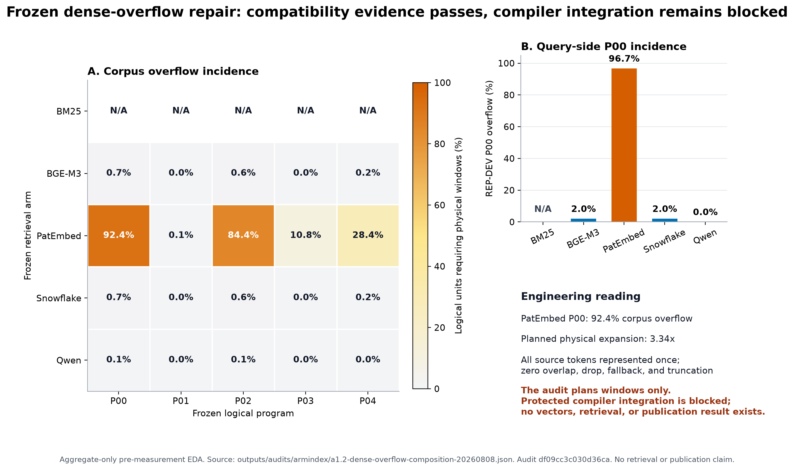

# A1.2 Dense-Overflow Repair and Protected Compiler Integration

## Objective

Freeze the Owner-authorized additive dense-overflow composition policy, integrate it with the protected compiler, and record aggregate-safe validation evidence before any provider admission.

## Starting State

The unchanged v11/v12-r3/v13 contracts contain 25 logical program-arm cells. The previous protected compiler accepted one rendered logical input and failed closed on overlength inputs; no retrieval or provider work was performed.

## Inputs and Frozen Bindings

- Repair contract: `control/armindex/a1.2/dense-overflow-adapter-repair.v14.json` (`a16294fa92e1b7a7bf3b4e571869751ea20e03a32580abea92819418d2e770eb`)
- Raw inventory: `outputs/audits/armindex/a1.2-dense-overflow-inventory-20260808.json` (`d9a75f605995f0d8b29fb93b7401e1c54d7b700e5309424b86f647dc613b1634`)
- Composition audit: `outputs/audits/armindex/a1.2-dense-overflow-composition-20260808.json` (`df09cc3c030d36ca13010aa00adb2cf78937717bf3d0ea9a3bcc6355d082d653`)
- Composition: `source_token_count_weighted_mean`; contiguous source-order windows; overlap `0`; no truncation or fallback.

## Work Performed

Validated contract self-hashes, immutable v11/v12-r3/v13/P02 lineage, implementation source hashes, raw inventory bindings, aggregate-only composition receipt, and EDA assets. The additive v15 compiler then materialized Owner-local protected inputs, validated handoff and transfer receipts, compiled the complete topology, and replayed deterministic compilation without executing encoder vectors or retrieval.

## Artifacts Produced

- PNG EDA: `outputs/figures/armindex/a1.2-dense-overflow-eda-v1.png` (`30d806fb200d0f38fd233c6078c769c3482c8b7d2d752ecab66df6117057154b`)
- SVG EDA: `outputs/figures/armindex/a1.2-dense-overflow-eda-v1.svg` (`a6760da763265de8a6caf1cbb256fbb8fe33f4eb0eb75b4d44eb87875abcbac8`)
- Protected compiler integration: `control/armindex/a1.2/protected-compiler-integration.v15.json` (`742b38916b194950515ffcb911c9f6b9f44f458b962c376db6a187c8b971a2e6`)
- Aggregate-safe compiler audit: `outputs/audits/armindex/a1.2-protected-compiler-integration-20260809-v15.json` (`de405e69168cfaab8adb6742bfec6eaa1fa3544eadbd69a13bc6cd853118f151`)

- Whole-workload budget model: `control/armindex/a1.2/whole-workload-budget-model.v15.json` (`5ad7e5255ef20bd428e8490275892c05f85252dfb65518a532b7a7405eb3eb3b`)
- Final local adoption receipt: `campaigns/armindex-multiretriever-v2/evidence/a1.2-scientific-execution-adoption-inputs.receipt.v15.json` (`None`)

## Metrics

| Arm | Program | Corpus overflow | REP-DEV query overflow | Physical windows | Max physical tokens |
|---|---|---:|---:|---:|---:|
| `ARM-02` | `P00` | 0.664% | 2.000% | 45,810 | 8,192 |
| `ARM-02` | `P01` | 0.000% | 2.000% | 45,336 | 2,382 |
| `ARM-02` | `P02` | 0.600% | 2.000% | 45,768 | 8,192 |
| `ARM-02` | `P03` | 0.008% | 2.000% | 180,322 | 8,192 |
| `ARM-02` | `P04` | 0.209% | 2.000% | 136,460 | 8,192 |
| `ARM-03` | `P00` | 92.432% | 96.667% | 151,294 | 512 |
| `ARM-03` | `P01` | 0.099% | 96.667% | 45,391 | 512 |
| `ARM-03` | `P02` | 84.397% | 96.667% | 136,033 | 512 |
| `ARM-03` | `P03` | 10.782% | 96.667% | 202,481 | 512 |
| `ARM-03` | `P04` | 28.442% | 96.667% | 228,331 | 512 |
| `ARM-04` | `P00` | 0.664% | 2.000% | 45,810 | 8,192 |
| `ARM-04` | `P01` | 0.000% | 2.000% | 45,336 | 2,382 |
| `ARM-04` | `P02` | 0.600% | 2.000% | 45,768 | 8,192 |
| `ARM-04` | `P03` | 0.008% | 2.000% | 180,322 | 8,192 |
| `ARM-04` | `P04` | 0.209% | 2.000% | 136,460 | 8,192 |
| `ARM-05` | `P00` | 0.055% | 0.000% | 45,371 | 32,768 |
| `ARM-05` | `P01` | 0.000% | 0.000% | 45,336 | 2,029 |
| `ARM-05` | `P02` | 0.053% | 0.000% | 45,370 | 32,768 |
| `ARM-05` | `P03` | 0.001% | 0.000% | 180,301 | 32,768 |
| `ARM-05` | `P04` | 0.018% | 0.000% | 136,043 | 32,768 |

Requirements: 25/25 compatible `True`; REP-DEV coverage `1.0`; corpus coverage `1.0`; zero drop `True`; zero truncation `True`. Compiler bindings `25/25`; compiler replay `True`; protected boundary `PASS`; raw overflow logical inputs `140907`; clean bundle `PENDING`; watchdog dry-run `PENDING`.

## Result

The additive repair and protected v15 compiler integration **PASS**. All 25 bindings, the protected handoff, transfer manifest, deterministic replay, effective-limit checks, and zero-silent-truncation evidence are materialized Owner-local.

## Interpretation

PatEmbed is the high-incidence engineering case: P00 has 92.432% corpus overflow and 96.667% REP-DEV query overflow, with approximately 3.34 physical windows per logical P00 corpus unit. This describes planned physical composition only; it is not a retrieval or quality result.

## Supported Claims

The frozen policy preserves logical program/unit identity, uses longest contiguous zero-overlap windows, represents each source token once, and now has deterministic protected compiler evidence within every frozen effective limit.

## Unsupported Claims

No vector, encoder-parity, latency, cost, retrieval-quality, interaction, complementarity, or publication claim is authorized. PatEmbed P00 must be disclosed as a whole-document composed embedding if execution later proceeds.

## Failures and Recovery

The historical v12 compiler lacked the physical-window composition path and therefore failed closed. Additive v15 preserves v12-r3 unchanged, binds the frozen v14 policy, validates the Owner-local source/receipt chain, emits 25/25 bindings, and keeps encoder/retrieval execution disabled.

## Governance and Safety

`final_accessed=False` `historical_v11_v12_r3_v13_changed=False` `model_or_weight_changed=False` `paid_api_used=False` `provider_contacted=False` `retrieval_results_inspected=False` `retrieval_started=False` `selection_accessed=False`. Historical v11/v12-r3/v13 and original P02 lineage remain unchanged; no provider was contacted and no measured retrieval started.

## Decision

`repair frozen, compiler integration PASS`. `COMPILED_BINDINGS_25_OF_25=PASS`, `PROTECTED_HANDOFF=PASS`, `TRANSFER_RECEIPT=PASS`, and `ZERO_TRUNCATION_CHECK=PASS`. Continue only with the clean-tree bundle/final local receipt gates; live-provider admission remains pending.

## Next Action

Build and validate the additive clean pushed execution bundle, whole-workload budget model, watchdog/provider-destroy synthetic dry-runs, and final local adoption receipt while all live-provider inputs remain pending.

## Evidence Links

- Contract: `control/armindex/a1.2/dense-overflow-adapter-repair.v14.json`
- Inventory: `outputs/audits/armindex/a1.2-dense-overflow-inventory-20260808.json`
- Composition: `outputs/audits/armindex/a1.2-dense-overflow-composition-20260808.json`
- Binding set: `8f15cf6a2069f37fbab59ff8b945afd9349a2760fc8cbdc6e512a0889f986bba`
- Compiler receipt: `288b1c7e9642c95c64664d43fbc785337da7ffd284cce1232c3ab12161deb08c`
- Figure: 
