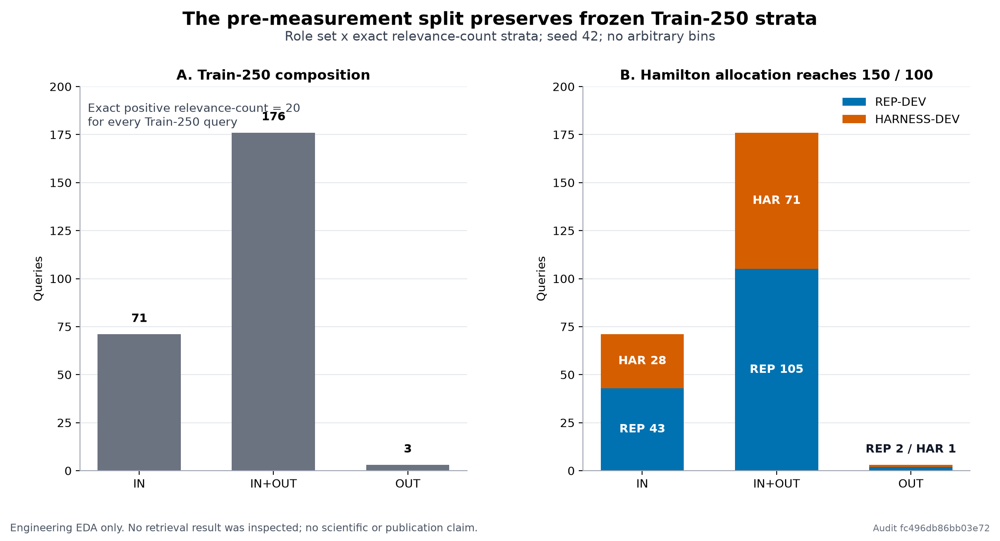

# A1.2 REP-DEV / HARNESS-DEV Split and Structured-Claim Audit

## Objective

บันทึกการแบ่งย่อย Train-250 ก่อน measurement และตรวจว่า source/parser ปัจจุบันรองรับ structured independent claim ที่ P02 ต้องการจริงหรือไม่

## Starting State

ใช้ parent Train-250 ที่ถูก freeze แล้ว (`seed=42`) โดยคง v11, v12-r3 และ v13 contracts เดิมทุกไบต์ที่อยู่นอกงานนี้ การตรวจเป็น local-only และยังไม่มี measured retrieval

## Inputs and Frozen Bindings

- Parent split commitment: `33a1818ff3c00775d43951182fdf769255c8ebfc591de183df4fbfdd3b039dc6`; file commitment `f56ad94e2a8d821ab8da556b39fcb60c30a970b9274dda4a40ddfc8f4364195c`
- Algorithm: `hamilton-role-set-exact-relevance-sha256-order-v1`; source `9eb29a55ff5ce39a80de053741da14860db62a48e9d6e68153a4d3dc0c316118`; seed `42`
- Strata: canonical IN/OUT role set x exact positive relevant-family count; no arbitrary bins
- Grouping policy: preserve prior frozen constraints; audit found an empty constraint set

## Work Performed

คำนวณ Hamilton largest-remainder allocation ไปยังเป้าหมาย 150/100 แล้วจัดลำดับภายในแต่ละ stratum ด้วย SHA256(`42:` + canonical query ID) และ lexical tie-break จากนั้น replay ซ้ำด้วย input relation order ที่กลับด้าน และ audit candidate parser แบบ aggregate-only สองรอบ

## Artifacts Produced

- Safe composite audit: `outputs/audits/armindex/a1.2-rep-harness-claim-audit-20260808.json` (`54014ef2f99f1fa38bc3fa754ecee4ea852f1a4bdc38097734f0e87fcd78169c`)
- Owner-local protected receipt: `owner-local/a1.2-v12-r3/protected/splits/A1_2_REP_HARNESS_SPLIT_RECEIPT_V1.json` (`f5d658f43b8d71e0ec34e08fee6eaf0af18d3649ad5609dffdf3dc2629e2f0f3`)
- Aggregate-safe EDA: `outputs/figures/armindex/a1.2-rep-harness-split-eda-v1.png` (`659d4631cc8ae850dc4c57e0cc726a001cc9296b1082cf4cf4f66cafa63b09ed`) and `outputs/figures/armindex/a1.2-rep-harness-split-eda-v1.svg` (`0365e61e7117cab0112568ffd26815cbebc7829a6478084d289d9b80145480c3`)

## Metrics

| Stratum | Exact relevance-count | Parent | REP-DEV | HARNESS-DEV |
|---|---:|---:|---:|---:|
| `IN` | 20 | 71 | 43 | 28 |
| `IN+OUT` | 20 | 176 | 105 | 71 |
| `OUT` | 20 | 3 | 2 | 1 |

Totals: parent `250`, REP-DEV `150`, HARNESS-DEV `100`. Exact relevance-count is 20 in every stratum. These are split counts, not retrieval metrics.

## Result

Split status **PASS**. Forward replay = `True`; reversed-relation replay = `True`; grouping constraint count = `0`.

## Interpretation

การ split นี้เป็น deterministic engineering commitment สำหรับการพัฒนาเท่านั้น ไม่ใช่การเลือกจากผล retrieval และไม่เปิดสิทธิ์ provider หรือ measured execution

## Supported Claims

รองรับเฉพาะการกล่าวว่า subdivision ครบ 250 และได้เป้าหมาย 150/100 ตาม algorithm ที่ bind ไว้ และ parser audit สามารถ replay ได้

## Unsupported Claims

ยังห้ามอ้างคุณภาพ retrieval, ranking improvement, causality, legal meaning, publication result หรือความถูกต้องของ independent-claim labels

## Failures and Recovery

Audit พบ blocker ที่ P02 เพราะ active DAPFAM มี raw claims source แต่ไม่มี canonical structured fields และ parser candidate ใช้ regex inference; จึงไม่ promote parser และไม่แก้ P02 ในงานนี้

## Governance and Safety

ไม่มี retrieval result ถูกอ่าน, ไม่มี provider contact, ไม่มี paid API, ไม่มี model/program/evaluator/split-definition mutation และ exact membership อยู่ Owner-local เท่านั้น

## Decision

`ADDITIVE_PRE_MEASUREMENT_P02_FIRST_CLAIM_REPAIR`. Protected compiler preflight remains blocked until Owner-approved additive P02-FIRST-CLAIM repair provides trustworthy structured independence

## Next Action

Owner review additive P02-FIRST-CLAIM repair. หลังจากนั้นค่อย rerun protected compiler preflight; measured retrieval และ live-provider admission ยัง pending ตาม v12-r3/v13

## Evidence Links

- Composite audit: `outputs/audits/armindex/a1.2-rep-harness-claim-audit-20260808.json`
- Parser audit: `outputs/audits/rigor/a1.2-claim-parser-audit-20260808.json` (`a84d8f724e67e8b945a6560e07e9651647b5a11e66630cb1f51db7efed72ccf6`)
- EDA figure: 
- Publication v13 remains additive and unchanged by this split/audit task.
