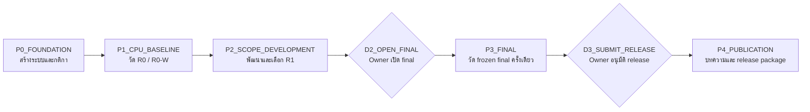

# Project Map: P0 → P4

> คู่มือนี้เขียนสำหรับ Owner ที่เพิ่งเข้ามาดู project
>
> อ่านจากบนลงล่าง: P0 สร้างระบบ → P1 วัด baseline → P2 ทดลองวิธีหลัก → P3 วัด final → P4 เขียนและปล่อยงาน

ไฟล์นี้เป็น **แผนที่สำหรับอ่านต่อ** ไม่ใช่แหล่งตัวเลขหลัก ตัวเลขและสถานะจริงต้องย้อนกลับไปดูไฟล์ canonical ที่ลิงก์ไว้เสมอ พื้นที่ `80_Owner_Notes` ถูกสงวนไว้ไม่ให้ `myis-report sync` เขียนทับ จึงสามารถเพิ่มบันทึกต่อท้ายได้

> ลิงก์ phase/task เป็นลิงก์ภายใน Obsidian ส่วนลิงก์ canonical/evidence ใช้ `file:///` และผูกกับ path ของเครื่อง Windows นี้ เพื่อให้คลิกเปิดไฟล์จริงที่อยู่นอก vault ได้ ชื่อ link ยังคงแสดง repository-relative path สำหรับตรวจสอบตำแหน่ง

## ภาพรวมแบบ node และ edge

ในภาพนี้ **node** คือ phase หรือประตูตัดสินใจ และ **edge** คือความสัมพันธ์ว่าอะไรต้องเสร็จก่อนอะไร



เส้นทางปัจจุบันหยุดอยู่ที่ P1 ที่มีผลวัดจริงแล้ว P2 พร้อมสำหรับการเตรียม แต่ยังไม่เริ่ม R1 และ D2/D3 ยังไม่เปิด

## Quick links: เปิดจากตรงนี้ได้เลย

| ส่วน | รายงานใน Obsidian | ต้นทาง canonical ที่ควรรู้จัก |
|---|---|---|
| P0 | [P0 master report](../01_Phases/P0_FOUNDATION/P0_FOUNDATION_MASTER_REPORT.md) | [`control/program.yaml`](<file:///C:/Users/Siripon%20Sri/Desktop/My_Research/00_Projects/00_myIS/01_Research/control/program.yaml>), [`schemas/`](<file:///C:/Users/Siripon%20Sri/Desktop/My_Research/00_Projects/00_myIS/01_Research/schemas/>) |
| P1 | [P1 master report](../01_Phases/P1_CPU_BASELINE/P1_CPU_BASELINE_MASTER_REPORT.md) | [`control/campaigns/scope-autoindex-v1.yaml`](<file:///C:/Users/Siripon%20Sri/Desktop/My_Research/00_Projects/00_myIS/01_Research/control/campaigns/scope-autoindex-v1.yaml>) |
| P1 evidence | [P1.3 task](../01_Phases/P1_CPU_BASELINE/Tasks/P1.3.md) | [`campaigns/scope-autoindex-v1/packages/`](<file:///C:/Users/Siripon%20Sri/Desktop/My_Research/00_Projects/00_myIS/01_Research/campaigns/scope-autoindex-v1/packages/>) |
| P2 | [P2 master report](../01_Phases/P2_SCOPE_DEVELOPMENT/P2_SCOPE_DEVELOPMENT_MASTER_REPORT.md) | [`src/myis_research/scope/`](<file:///C:/Users/Siripon%20Sri/Desktop/My_Research/00_Projects/00_myIS/01_Research/src/myis_research/scope/>) |
| P3 | [P3 master report](../01_Phases/P3_FINAL/P3_FINAL_MASTER_REPORT.md) | [`control/decisions/`](<file:///C:/Users/Siripon%20Sri/Desktop/My_Research/00_Projects/00_myIS/01_Research/control/decisions/>) |
| P4 | [P4 master report](../01_Phases/P4_PUBLICATION/P4_PUBLICATION_MASTER_REPORT.md) | [`control/source-of-truth.yaml`](<file:///C:/Users/Siripon%20Sri/Desktop/My_Research/00_Projects/00_myIS/01_Research/control/source-of-truth.yaml>); publication path ยังไม่ถูกสร้าง |

## P0 — Foundation: สร้างสนามและกติกา

### P0 คืออะไร?

P0 ไม่ใช่การทดลอง retrieval แต่คือการสร้าง “สนามทดลอง” ให้ทุกคนใช้กติกาเดียวกันและตรวจสอบย้อนหลังได้

### ทำอะไรไปแล้ว?

- กำหนด research question, phase, task และ Owner gates
- สร้าง schema และ deterministic kernel
- กำหนด canonical JSON และ SHA-256 hash เพื่อผูกไฟล์เข้าด้วยกัน
- แยกข้อมูล public/aggregate ออกจากข้อมูล protected ที่อยู่ใน Owner-local store
- สร้าง read model และ projection ไปยัง Dashboard, Brain, Obsidian และ Paper
- archive ระบบเก่าและกำหนด reusable assets ที่อนุญาตให้ใช้

### Output/result อยู่ที่ไหน?

- Program identity: [`control/program.yaml`](<file:///C:/Users/Siripon%20Sri/Desktop/My_Research/00_Projects/00_myIS/01_Research/control/program.yaml>)
- Campaign protocol: [`control/campaigns/scope-autoindex-v1.yaml`](<file:///C:/Users/Siripon%20Sri/Desktop/My_Research/00_Projects/00_myIS/01_Research/control/campaigns/scope-autoindex-v1.yaml>)
- Execution boundary: [`control/execution-envelope.yaml`](<file:///C:/Users/Siripon%20Sri/Desktop/My_Research/00_Projects/00_myIS/01_Research/control/execution-envelope.yaml>)
- Source-of-truth rules: [`control/source-of-truth.yaml`](<file:///C:/Users/Siripon%20Sri/Desktop/My_Research/00_Projects/00_myIS/01_Research/control/source-of-truth.yaml>)
- Schemas: [`schemas/`](<file:///C:/Users/Siripon%20Sri/Desktop/My_Research/00_Projects/00_myIS/01_Research/schemas/>)
- Deterministic kernel: [`src/myis_research/kernel/`](<file:///C:/Users/Siripon%20Sri/Desktop/My_Research/00_Projects/00_myIS/01_Research/src/myis_research/kernel/>)
- Shared read model: [`projections/read-model/read-model.v2.json`](<file:///C:/Users/Siripon%20Sri/Desktop/My_Research/00_Projects/00_myIS/01_Research/projections/read-model/read-model.v2.json>)

**P0 result แบบสั้น:** ได้ระบบควบคุมและกติกาที่พร้อมรองรับการทดลอง แต่ยังไม่มี retrieval score เพราะ P0 ยังไม่ใช่ช่วงวัดผล

## P1 — CPU baseline: รู้จุดเริ่มต้นก่อนพัฒนาวิธีใหม่

### P1 คืออะไร?

P1 ทำ baseline ที่เรียบง่ายก่อน เพื่อให้เรารู้ว่า “วิธีพื้นฐานทำได้เท่าไร” แล้วจึงค่อยตัดสินว่าวิธีใหม่ดีขึ้นจริงหรือไม่

การทดลองใช้ CPU เท่านั้น ค่าใช้จ่าย `$0` และวัดเฉพาะ train/selection; final 872 ยังปิด

### R0 คืออะไร?

`R0: BM25 แบบใช้เอกสารเต็มหนึ่งรายการต่อ patent family`

นึกภาพว่า patent family หนึ่งชุดถูกย่อให้เป็นเอกสารค้นหา 1 ชิ้น โดยรวม Title + Abstract + Claims แล้วใช้ BM25 จัดอันดับ

```text
หนึ่ง patent family
        ↓
หนึ่ง full TAC document
        ↓
BM25
        ↓
อันดับ top-100 families
```

### R0-W คืออะไร?

`R0-W: แบ่งเอกสารเป็นหน้าต่าง 512 tokens แล้วรวมคะแนนระดับ family ด้วย MaxP`

นึกภาพว่าเอกสารยาวถูกตัดเป็นชิ้นเล็ก ๆ ที่ไม่ซ้อนกัน จากนั้นค้นทุกชิ้น แล้วใช้คะแนนที่ดีที่สุดของชิ้นใดชิ้นหนึ่งเป็นคะแนนของ family นั้น

```text
หนึ่ง patent family
        ↓
window 1 | window 2 | window 3 | ... (512 tokens)
        ↓
BM25 ทุก window
        ↓
MaxP = เลือกคะแนน window ที่ดีที่สุดของ family
        ↓
อันดับ top-100 families
```


[เปิดไฟล์ SVG สำหรับนำเสนอ](R0_R0W_BASELINE_EXPLAINER.svg)

### ทำอะไรไปแล้ว?

- สร้างและรัน R0 กับ R0-W ครบทั้ง train และ selection
- ตรวจ 45,336 patent families
- R0 มี 45,336 full documents
- R0-W มี 127,019 windows
- เก็บ manifest 4 รายการ, validation report 4 รายการ และ aggregate receipt 1 รายการ

### ผลลัพธ์ที่สำคัญ

| Arm | Train OUT Recall@100 | Selection OUT Recall@100 |
|---|---:|---:|
| R0 | 0.076057 | 0.062393 |
| R0-W | 0.085847 | 0.074661 |
| R0-W minus R0 | +0.009790 | +0.012269 |

ผลนี้เป็น **descriptive development evidence** หมายถึงใช้ดูทิศทางเพื่อวาง P2 เท่านั้น ยังไม่ใช่ final result, statistical superiority หรือข้อสรุปทางกฎหมาย

### หลักฐาน P1 อยู่ที่ไหน?

- Phase report: [P1 master report](../01_Phases/P1_CPU_BASELINE/P1_CPU_BASELINE_MASTER_REPORT.md)
- P1.1: [R0 task](../01_Phases/P1_CPU_BASELINE/Tasks/P1.1.md)
- P1.2: [R0-W task](../01_Phases/P1_CPU_BASELINE/Tasks/P1.2.md)
- P1.3: [evidence import task](../01_Phases/P1_CPU_BASELINE/Tasks/P1.3.md)
- Package: [`campaigns/scope-autoindex-v1/packages/dapfam-p1-fulltext-c058a3aa7357c782.package.json`](<file:///C:/Users/Siripon%20Sri/Desktop/My_Research/00_Projects/00_myIS/01_Research/campaigns/scope-autoindex-v1/packages/dapfam-p1-fulltext-c058a3aa7357c782.package.json>)
- Receipt: [`campaigns/scope-autoindex-v1/evidence/dapfam-p1-fulltext-c058a3aa7357c782.receipt.json`](<file:///C:/Users/Siripon%20Sri/Desktop/My_Research/00_Projects/00_myIS/01_Research/campaigns/scope-autoindex-v1/evidence/dapfam-p1-fulltext-c058a3aa7357c782.receipt.json>)
- Validation reports: [`campaigns/scope-autoindex-v1/validation-reports/`](<file:///C:/Users/Siripon%20Sri/Desktop/My_Research/00_Projects/00_myIS/01_Research/campaigns/scope-autoindex-v1/validation-reports/>)
- Rigor review: [`outputs/audits/rigor/dapfam-p1-fulltext-c058a3aa7357c782/rigor_review.json`](<file:///C:/Users/Siripon%20Sri/Desktop/My_Research/00_Projects/00_myIS/01_Research/outputs/audits/rigor/dapfam-p1-fulltext-c058a3aa7357c782/rigor_review.json>)

## P2 — SCOPE development: ทดลองวิธีหลักของงานวิจัย

### P2 คืออะไร?

P2 จะสร้าง representation ของ patent แบบมีโครงสร้างและมีแหล่งที่มาชัดเจน แล้วทดสอบว่า representation นี้ช่วยให้ retrieval ดีขึ้นหรือไม่ โดยพยายามคง retriever, evaluator, top-k, budget และ split protocol ให้เหมือน P1

วิธีหลักเรียกว่า `R1` หรือ `SCOPE/AutoIndex`

### ตอนนี้มีอะไรแล้ว?

- Campaign ระบุ R1 เป็น primary method
- มี SCOPE DSL v1 parser และ deterministic compiler
- มี DAPFAM adapter ที่จำกัดไม่เกิน 4 searchable units ต่อ family
- มี tests สำหรับ determinism, provenance และ unit limit
- มี baseline R0/R0-W สำหรับเทียบ
- มี AutoIndex paper U154 เป็น literature pointer: [`evidence/literature/digests/U154_autoindex_learning_representation_programs_for_retrieval_digest.md`](<file:///C:/Users/Siripon%20Sri/Desktop/My_Research/00_Projects/00_myIS/01_Research/evidence/literature/digests/U154_autoindex_learning_representation_programs_for_retrieval_digest.md>)
- มี protection policy ระบุว่าพื้นที่ใดแก้ได้และพื้นที่ใดห้ามแตะ: [`src/myis_research/protection.py`](<file:///C:/Users/Siripon%20Sri/Desktop/My_Research/00_Projects/00_myIS/01_Research/src/myis_research/protection.py>)

### ยังไม่มีอะไร?

ยังไม่มี R1 measured run, candidate manifests, validation reports, selection receipt หรือ R1 metric จริง ดังนั้น P2 ตอนนี้คือ **พร้อมเตรียม แต่ยังไม่ใช่ผลทดลอง**

### P2 ต้องสร้างอะไรต่อ?

1. กำหนด SCOPE spec และ hypothesis
2. สร้าง candidate representations แบบ grounded
3. ประเมินทุก candidate บน train/selection ด้วย evaluator เดิม
4. บันทึก candidate exposure, failed paths, cost และ latency
5. เก็บ candidate เฉพาะเมื่อ OUT Recall@100 สูงขึ้นแบบ strictly greater; tie ให้ reject
6. สร้าง shortlist, selection receipt, manifests และ validation reports
7. freeze candidate ที่เลือกก่อนคิดเรื่อง P3 final

### ทรัพยากร P2

| ทรัพยากร | ค่าเริ่มต้นของแผน |
|---|---|
| CPU | ใช้เป็นหลักและเพียงพอสำหรับ P2 |
| GPU | ไม่จำเป็นสำหรับ P2 ปัจจุบัน |
| Paid API | ไม่ใช้ |
| Network model download | ไม่ใช้ |
| Provider fallback | ไม่อนุญาต |
| Protected data | อยู่ Owner-local; note นี้เก็บเฉพาะ aggregate/hash/pointer |

ข้อจำกัดเชิงปฏิบัติตอนนี้: [`control/execution-envelope.yaml`](<file:///C:/Users/Siripon%20Sri/Desktop/My_Research/00_Projects/00_myIS/01_Research/control/execution-envelope.yaml>) ยังอนุญาตเฉพาะ P0/P1 และ R1-fixture จึงต้องเตรียม P2 envelope แยกก่อนวัด R1 จริง

## เหตุผลที่เลือกแต่ละวิธีและแต่ละ model

ก่อนอ่านตารางนี้ ให้แยกคำ 3 คำออกจากกัน:

- **Arm:** วิธีทดลองทั้งชุด เช่น R0, R0-W, R1
- **Retriever:** กลไกค้นหาและจัดอันดับ เช่น BM25
- **Representation:** รูปแบบข้อมูลที่ส่งให้ retriever เช่น full document หรือ 512-token windows

| สิ่งที่เลือก | เป็นอะไร | เหตุผลที่เลือก | อ้างอิง | สถานะใน myIS |
|---|---|---|---|---|
| DAPFAM | Dataset/evaluator | วัด retrieval ระดับ patent family และแยก IN/OUT domain ได้ จึงตรงกับโจทย์ cross-domain patent retrieval | [U011 DAPFAM](../04_Literature_Map/Papers/U011.md) | ใช้จริงใน P1; final ยังปิด |
| BM25 | Lexical retriever | ทำงานบน CPU, deterministic, ไม่มี training cost และเป็น baseline ที่แข็งแรงเมื่อ domain เปลี่ยน จึงเหมาะเป็นตัวคงที่เพื่อดูผลของ representation | [U011](../04_Literature_Map/Papers/U011.md), [U035 BEIR](../04_Literature_Map/Papers/U035.md), [U006 patent BM25](../04_Literature_Map/Papers/U006.md) | ใช้จริงใน R0/R0-W; ตั้งใจคงไว้ใน R1 รอบแรก |
| R0 full TAC | Baseline arm + representation | เป็นจุดเริ่มที่ง่ายที่สุด: 1 family = 1 searchable document ทำให้รู้คะแนนพื้นฐานก่อนเพิ่ม passage/window logic | [U011](../04_Literature_Map/Papers/U011.md) ศึกษา document/passage granularity บน DAPFAM | วัดจริงแล้ว |
| R0-W 512-token windows | Control arm + representation | ทดสอบว่าการแบ่งเอกสารยาวช่วย candidate exposure หรือไม่ โดยเปลี่ยนเฉพาะ representation และคง BM25/evaluator เดิม | [U011](../04_Literature_Map/Papers/U011.md) รายงาน passage-level advantage; [U154](../04_Literature_Map/Papers/U154.md) ใช้ representation units กับ fixed retriever | วัดจริงแล้ว; 512 tokens เป็น project control choice ไม่ใช่ค่าที่ paper พิสูจน์ว่า optimal |
| MaxP | Family aggregation | เมื่อ family มีหลาย windows ต้องคืนคะแนน family เดียว MaxP เลือก window ที่มีคะแนนสูงสุด ทำให้ window ที่ตรงที่สุดเป็นตัวแทน family | [U011](../04_Literature_Map/Papers/U011.md), [U154](../04_Literature_Map/Papers/U154.md) | ใช้จริงใน R0-W |
| Recall@100 / OUT | Primary development metric | Recall@100 ถามว่า relevant family เข้า candidate pool 100 อันดับแรกหรือไม่ ส่วน OUT เน้นกรณีข้าม domain จึงตรงกับ candidate-exposure question | [U011](../04_Literature_Map/Papers/U011.md) ให้ทั้ง Recall@100 และ IN/OUT protocol | ใช้จริงใน train/selection; ไม่ใช่ final |
| R1 SCOPE/AutoIndex | Primary method arm | เปลี่ยน preprocessing ให้เป็นโปรแกรม representation ที่ค้นหาและตรวจได้ ขณะที่ retriever/evaluator คงเดิม จึงช่วยระบุได้ว่าผลต่างมาจาก representation | [U154 AutoIndex](../04_Literature_Map/Papers/U154.md) และ [local PDF](<file:///C:/Users/Siripon%20Sri/Desktop/My_Research/00_Projects/00_myIS/01_Research/evidence/literature/source/U154_autoindex_learning_representation_programs_for_retrieval.pdf>) | มี parser/compiler/tests แล้ว แต่ยังไม่มี measured run |
| Dense/embedding model | Optional extension | ยังไม่ใส่ใน P1/P2 รอบแรก เพราะจะเปลี่ยนทั้ง representation และ retriever พร้อมกัน ทำให้หาสาเหตุของผลต่างยากขึ้น และเพิ่ม compute/model-download dependency | [U011](../04_Literature_Map/Papers/U011.md) และ [U035](../04_Literature_Map/Papers/U035.md) แสดงว่าพฤติกรรม dense กับ BM25 เปลี่ยนตาม domain/benchmark | ยังไม่เลือกและยังไม่รัน |
| Generative coding/LLM model สำหรับ AutoIndex loop | Optimizer component | Paper U154 ใช้ coding model ใน loop แต่ myIS ยังไม่ควรคัดลอก model นั้นอัตโนมัติ ต้องวัด structure leverage ก่อน และต้อง pin provider/model/version/budget หากจะใช้จริง | [U154](../04_Literature_Map/Papers/U154.md) | **ยังไม่เลือก model และยังไม่อนุญาต API ใน P2 envelope ปัจจุบัน** |

### ข้อควรระวังในการอ้าง paper

- U011 สนับสนุนการเลือก DAPFAM, family-level protocol, IN/OUT analysis, passage granularity และ MaxP แต่ค่าของ myIS ต้องอ้างจาก myIS manifests/receipt ไม่คัดลอกค่าจาก paper
- U035 เป็น general-domain benchmark ใช้รองรับเหตุผลว่า BM25 เป็น baseline ที่ควรมี ไม่ใช่หลักฐานว่า BM25 จะดีที่สุดบน DAPFAM
- U006 เป็น patent-search evidence ที่ใช้ BM25 แต่เป็น slide artifact และคนละ dataset จึงใช้เป็น background เท่านั้น
- U154 เป็น methodological lineage ของ R1 แต่ผลบน CRUMB ไม่ใช่ผลบน DAPFAM และไม่รับรองว่า R1 ของ myIS จะดีขึ้น
- Citation relevance ของ DAPFAM เป็น retrieval evidence ไม่ใช่คำตัดสิน novelty, infringement, validity หรือ freedom to operate

## Ref papers ที่ใช้ใน note นี้

1. **U011 — Ayaou, Cavallucci, and Chibane (2025), _DAPFAM: A Domain-Aware Family-level Dataset to Benchmark Cross-Domain Patent Retrieval_.** [Obsidian paper note](../04_Literature_Map/Papers/U011.md), arXiv `2506.22141`.
2. **U035 — Thakur et al. (2021), _BEIR: A Heterogeneous Benchmark for Zero-shot Evaluation of Information Retrieval Models_.** [Obsidian paper note](../04_Literature_Map/Papers/U035.md).
3. **U006 — Stamatis et al. (2022), _A Combination of BERT and BM25 for Patent Search_.** [Obsidian paper note](../04_Literature_Map/Papers/U006.md). ใช้เป็น background; artifact เป็น slide deck.
4. **U154 — O'Nuallain et al. (2026), _AutoIndex: Learning Representation Programs for Retrieval_.** [Obsidian paper note](../04_Literature_Map/Papers/U154.md), [PDF](<file:///C:/Users/Siripon%20Sri/Desktop/My_Research/00_Projects/00_myIS/01_Research/evidence/literature/source/U154_autoindex_learning_representation_programs_for_retrieval.pdf>), arXiv `2607.18603v1`.

## Codex provider กับความน่าเชื่อถือของงานวิจัย

คำตอบสั้น: **เปลี่ยนไปใช้ official Codex ไม่ได้ทำให้ผลวิจัยน่าเชื่อถือขึ้นโดยอัตโนมัติ** แต่ official Codex ทำให้ตรวจ provenance ของ authentication, model selection, workspace policy และ support ได้ชัดกว่า custom provider

เอกสารทางการระบุว่า Codex ใช้ได้ทั้ง OpenAI authentication/API key และ custom model provider แต่ไม่ได้รับรอง provider ชื่อ MaxPlus โดยเฉพาะ จึงยังยืนยันไม่ได้ว่า MaxPlus ส่งคำขอไป model ใด, มี fallback หรือไม่, เก็บข้อมูลอย่างไร หรือใช้ model revision เดิมทุกครั้ง

คำแนะนำสำหรับ project นี้:

1. งานเขียน note, อธิบาย code หรือร่างเอกสาร สามารถใช้ MaxPlus ต่อได้ หากไม่ส่ง protected data
2. canonical code change ที่สำคัญควรบันทึก provider, model ID, model revision ถ้ามี, reasoning/effort, prompt/skill hash และ Git commit
3. หาก P2 ใช้ LLM ใน AutoIndex loop ให้เลือก provider/model หนึ่งชุดและ freeze ก่อน measured comparison; ห้าม silent fallback
4. Official Codex เหมาะเป็นตัวเลือกหลักสำหรับ canonical implementation เมื่อ Owner ต้องการ provenance/support ที่ชัดกว่า แต่ metric ต้องมาจาก deterministic harness ไม่ใช่คำตอบของ Codex
5. P1 ที่วัดแล้วไม่ขึ้นกับ MaxPlus หรือ official Codex เพราะ measured method คือ CPU BM25 และ deterministic evaluator
6. P2 ปัจจุบันยังไม่มี LLM/model/API ที่ได้รับเลือก จึงยังไม่จำเป็นต้องสลับ provider เพื่อเริ่มเตรียมงาน

Official references: [Codex authentication](https://learn.chatgpt.com/docs/auth.md), [Codex model selection](https://learn.chatgpt.com/docs/models.md), [custom model providers](https://learn.chatgpt.com/docs/config-file/config-advanced#custom-model-providers).

### ถ้าจะใช้ official Codex และ MaxPlus แยกกัน

**ใช่ครับ แยก `CODEX_HOME` เป็นคนละโฟลเดอร์แล้วสลับเป็นรายครั้งได้** แนวทางของ Owner จึงเป็นแบบนี้:

```text
C:\Users\Siripon Sri\
├── .codex-official\
└── .codex-maxplus\
```

แต่ไม่ควรสร้างหรือ copy `auth.json` เอง ให้ตั้ง `CODEX_HOME` ก่อนเรียก Codex แล้วรัน `codex login` แยกหนึ่งครั้งต่อ home

```powershell
function codex-official {
  $old = $env:CODEX_HOME
  try { $env:CODEX_HOME = "$env:USERPROFILE\.codex-official"; & codex @args }
  finally { if ($null -eq $old) { Remove-Item Env:CODEX_HOME -ErrorAction SilentlyContinue } else { $env:CODEX_HOME = $old } }
}

function codex-maxplus {
  $old = $env:CODEX_HOME
  try { $env:CODEX_HOME = "$env:USERPROFILE\.codex-maxplus"; & codex @args }
  finally { if ($null -eq $old) { Remove-Item Env:CODEX_HOME -ErrorAction SilentlyContinue } else { $env:CODEX_HOME = $old } }
}
```

ข้อควรระวังเรื่อง credential:

- `cli_auth_credentials_store = "file"` จะเก็บ token ใน `auth.json` ใต้ `CODEX_HOME` นั้นจริง จึงแยกได้ชัด แต่ไฟล์นี้เปรียบเสมือนรหัสผ่าน ห้าม commit หรือส่งต่อ
- `keyring` หรือ `auto` อาจเก็บ token ใน Windows credential store แทน `auth.json` ดังนั้นการแยกโฟลเดอร์อาจไม่ได้แปลว่า credential แยกทางกายภาพเสมอไป
- MaxPlus ควรรับ key ผ่าน environment variable ที่ provider ระบุ (`env_key`) ไม่ควรฝังคีย์ไว้ใน `config.toml`
- ค่า `model_provider` และ `model_providers` ควรอยู่ใน `config.toml` ระดับ user ใต้แต่ละ `CODEX_HOME`; อย่าวางไว้ใน project `.codex/config.toml` แล้วคาดว่าจะสลับ provider ได้ เพราะ Codex อาจละเว้นค่านี้
- ไม่ต้องสร้างโฟลเดอร์ `sessions` หรือไฟล์ state เอง ปล่อยให้ Codex สร้างและจัดการภายใต้ `CODEX_HOME`

**คำแนะนำสำหรับตอนนี้:** ยังไม่ต้องสลับ provider เพื่อเริ่ม P2 เพราะ P2 ที่กำหนดไว้เริ่มจาก R1 CPU-only และยังไม่มี LLM/API ที่ถูกเลือก งานวัดผลต้องใช้ deterministic harness ไม่ใช่คำตอบจาก Codex หากภายหลัง AutoIndex loop ต้องใช้ LLM ให้เลือก provider/model ชุดเดียว freeze ก่อนวัดจริง และบันทึก provider, model ID/revision, effort, prompt/skill hash และ Git commit ทุกครั้ง

## P3 — Final confirmation: วัดครั้งเดียวบน final split

P3 จะนำ candidate ที่ freeze แล้วไปวัดบน final split ที่ยังไม่เปิด ใช้ `D2_OPEN_FINAL` ซึ่งเป็น Owner decision เท่านั้น

ผลลัพธ์ที่ต้องได้:

- final manifest และ receipt
- per-query result อยู่ใน protected store
- aggregate final metric สำหรับรายงาน
- comparison ที่มี scope และ confidence ครบ

ตอนนี้ P3 ยัง locked และยังไม่ควรเปิด final split

อ่านต่อ: [P3 master report](../01_Phases/P3_FINAL/P3_FINAL_MASTER_REPORT.md) และ [P3.1](../01_Phases/P3_FINAL/Tasks/P3.1.md)

## P4 — Publication: เขียนบทความและ release package

P4 คือการนำผลที่ผ่าน P3 ไปเขียน manuscript, tables, figures และ release package โดยตัวเลขทุกตัวต้องย้อนกลับไปยัง canonical run facts

ใช้ `D3_SUBMIT_RELEASE` ซึ่งเป็น Owner decision อีกขั้นหนึ่ง

ตอนนี้ P4 ยัง locked และ publication readiness ยัง blocked ตามปกติ เพราะ P3 ยังไม่เกิด

อ่านต่อ: [P4 master report](../01_Phases/P4_PUBLICATION/P4_PUBLICATION_MASTER_REPORT.md) และ [P4.1](../01_Phases/P4_PUBLICATION/Tasks/P4.1.md)

## วิธีตามงานครั้งต่อไป

1. เปิด note นี้เพื่อดูภาพรวม
2. คลิก phase master report เพื่อดูสถานะของ phase
3. คลิก task report เพื่อดูสิ่งที่ทำใน task นั้น
4. ถ้าต้องการตัวเลขจริง ให้เปิด package/receipt/manifest ที่ลิงก์ไว้
5. ถ้าต้องการรู้ว่าอะไรทำได้หรือห้ามทำ ให้เปิด campaign และ execution envelope
6. เพิ่มเหตุการณ์ใหม่ในส่วน append log ด้านล่าง โดยไม่ลบประวัติเก่า

## Append log

### 2026-08-01 — สร้าง project map ฉบับแรก

- สถานะ: P1 measured complete; P2 ready but not started
- สิ่งที่ทำ: เพิ่มแผนที่ P0-P4, Obsidian/file links, ภาพ R0/R0-W และเหตุผลพร้อม ref paper ของแต่ละวิธี/model
- หลักฐาน: P1 four-slot package, receipt, manifests และ validation reports
- ขอบเขต: ไม่แตะ final split, qrels, query IDs, membership, per-query outcomes หรือ credentials
- งานถัดไป: เตรียม P2 execution envelope และ R1 request แบบ CPU-only/reversible

### 2026-08-01 — ตอบคำถามการสลับ Codex provider

- สถานะ: P2 ยัง ready แต่ยังไม่เริ่ม measured run
- ข้อสรุป: official Codex ไม่ได้ทำให้ผลวิจัยน่าเชื่อถือขึ้นโดยอัตโนมัติ; ความน่าเชื่อถือมาจากการ freeze code/config/model/evaluator และเก็บหลักฐานที่ตรวจซ้ำได้
- คำแนะนำ: เริ่ม P2 แบบ CPU-only โดยไม่ใช้ provider; หากต้องใช้สอง provider ให้แยก `CODEX_HOME` และ login แยก ไม่ copy `auth.json`
- หลักฐานอ้างอิง: Codex manual ส่วน Configuration, Authentication and Models และเอกสาร official links ด้านบน
- protected surfaces ที่ยังไม่แตะ: final split, qrels, query IDs, membership, per-query outcomes, credentials และ raw provider payloads
- งานถัดไป: เตรียม P2 execution envelope และ R1 request แบบ CPU-only/reversible

### Template สำหรับ append ครั้งถัดไป

```text
### YYYY-MM-DD — Phase / Task

- สถานะ:
- สิ่งที่ทำ:
- ผลลัพธ์หรือ evidence:
- ไฟล์ที่เปลี่ยน:
- protected surfaces ที่ยังไม่แตะ:
- งานถัดไป:
```

## คำศัพท์สั้น ๆ

- **Phase:** ช่วงใหญ่ของงานวิจัย
- **Task:** งานย่อยที่ทำให้ phase เดินหน้า
- **Baseline:** วิธีพื้นฐานที่ใช้เป็นจุดเทียบ
- **Representation:** วิธีจัดรูปข้อมูลก่อนนำไปค้นหา
- **Manifest:** ใบรับรองว่า run ใช้ข้อมูล/config/code อะไร
- **Receipt:** สรุปผล aggregate พร้อม hash และต้นทุน/เวลา
- **Selection:** ชุดข้อมูลสำหรับพัฒนาและเลือกวิธี
- **Final split:** ชุดข้อมูลปิดสำหรับยืนยันผลครั้งสุดท้าย
- **MaxP:** ใช้คะแนนที่ดีที่สุดของ window ใด window หนึ่งแทนคะแนนของ family
