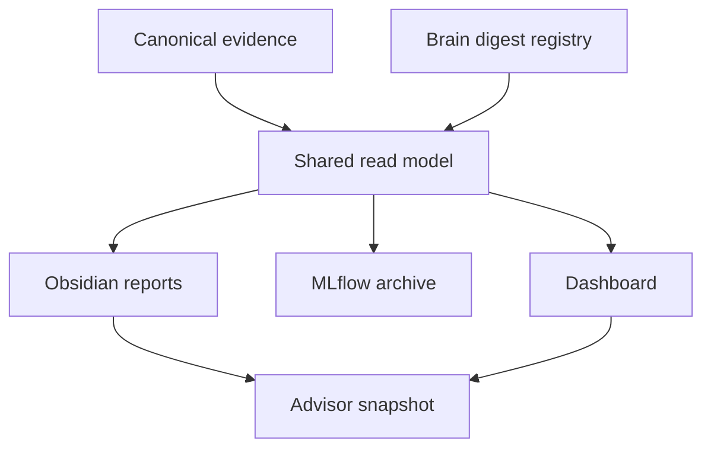

# myIS Obsidian Research Report Vault — Design Specification

> Version 1.0 · Date 2026-07-30 · Thai-first · Local Obsidian vault
>
> Target location: `obsidian_report/OBSIDIAN_DESIGN.md`
>
> Status: implementation contract for the Phase/Task reporting vault, Literature Map, Advisor Updates, Dashboard Reports tab, and single-launcher integration
>
> This document does not override `AGENTS.md`, the active `PLAN.md`, frozen protocols, schemas, immutable run bundles, Owner decisions, or protected-data rules.

---

## 1. Executive intent

`obsidian_report` ต้องเป็น **Research Reporting Vault** ที่ช่วย Owner ซึ่งเป็น low-dev:

1. เปิดแล้วเห็นทันทีว่าโครงการอยู่ Phase ใด;
2. อ่านรายงานใหญ่ระดับ Phase และเจาะรายงานย่อยระดับ Task;
3. เห็นสิ่งที่ทำเสร็จ Output ที่สร้าง Result ที่วัดได้ และ Interpretation;
4. เตรียมรายงานความก้าวหน้าให้อาจารย์โดยไม่ต้องรวบรวมใหม่ทุกครั้ง;
5. เห็นว่า Literature/Brain ถูก digest จัดหมวด สังเคราะห์ และนำมาใช้กับ Task ใด;
6. ใช้ Graph View อธิบายความสัมพันธ์ระหว่าง Research Question → Phase → Task → Result → Literature → Decision;
7. เปิดรายงานเดียวกันจาก Dashboard Reports tab;
8. เปิด Obsidian จาก Dashboard โดยไม่ใช้ launcher แยก.

Obsidian เป็น **reporting and knowledge projection** ไม่ใช่ scientific calculator, experiment runner, gate authority หรือแหล่งตัวเลขอีกชุดหนึ่ง

กฎหลัก:

> Metrics และ decision facts มาจาก validated shared read model
>
> Generated reports ห้ามแก้ตัวเลขด้วยมือ
>
> Owner notes แยกพื้นที่และ generator ห้ามเขียนทับ

---

## 2. Role in the three-surface system

| Surface | Main job | Typical question |
|---|---|---|
| Dashboard | Current command center and single entry point | ตอนนี้อยู่ไหน ทำอะไรต่อ |
| MLflow | Run/freeze/artifact history and audit | รันนี้ใช้อะไร ได้ค่าอะไร เชื่อถือได้ไหม |
| Obsidian | Narrative report and knowledge graph | ทำไมทำงานนี้ ผลแปลว่าอะไร Literature รองรับอย่างไร |



ทั้งสาม surface ต้องใช้:

```text
read_model_revision
read_model_sha256
source_commit
projection_schema_version
```

เดียวกันในรอบ sync หนึ่ง

---

## 3. Users and jobs-to-be-done

### 3.1 Owner — low-dev researcher

ต้องการ:

- ภาษาไทยที่อ่านง่าย;
- next action ไม่เกิน 1–3 รายการ;
- report ที่แยก Output/Result/Interpretation;
- metric glossary แบบภาษาคน;
- กดเปิด Phase, Task, MLflow run และ literature ได้;
- note ส่วนตัวที่ระบบไม่เขียนทับ;
- สร้าง Advisor Update จากหลักฐานล่าสุดได้ในคำสั่งเดียว.

### 3.2 Advisor

ต้องการ:

- research question/gap/method/contribution;
- status และ Gate;
- measured result พร้อม limitation;
- สิ่งที่กล่าวได้/ยังกล่าวไม่ได้;
- evidence IDs และ literature basis;
- Q&A และ presentation flow.

### 3.3 Peer / Project manager

ต้องการ:

- Phase → Task → Deliverable → Evidence traceability;
- Planned/In Process/Done;
- Definition of Ready/Done;
- dependencies, WIP, RAID, decisions;
- milestone และ change history.

### 3.4 Agent / Developer

ต้องการ:

- exact folder/property/schema contracts;
- generated/owner boundary;
- deterministic sync;
- link validation;
- safe Dashboard API;
- no need to infer truth from prose.

---

## 4. Design principles

### 4.1 One source, many reports

Phase report, Task report, Dashboard card, MLflow run summary และ Advisor Update ต้องไม่คัดลอกตัวเลขจากกันด้วยมือ

### 4.2 Output, Result and Interpretation are different

ตัวอย่าง:

- Output: สร้าง R0-W index สำเร็จ
- Result: Recall@100 OUT จาก validated receipt
- Interpretation: candidate exposure ดีขึ้น/ไม่ดีขึ้นภายใต้ protocol ใด

### 4.3 Generated and authored notes never collide

- generated file: ระบบสร้างและเขียนทับได้แบบ atomic;
- owner file: Owner เขียนเองและระบบห้ามแก้;
- advisor snapshot: immutable หลัง mark ว่านำเสนอแล้ว;
- correction: สร้าง snapshot ใหม่ ไม่แก้ประวัติย้อนหลัง.

### 4.4 Evidence before narrative

ถ้าไม่มี validated result ให้เขียน `ยังไม่มีผลที่ตรวจสอบแล้ว` ไม่สร้างกราฟหรือคำสรุป placeholder

### 4.5 Thai first, technical detail on demand

หน้าแรกอ่านง่าย ส่วน hash/schema/evaluator อยู่ใน `Audit Details`

### 4.6 Negative and blocked results are first-class

STOP, blocked gate, flat surface และ null result ต้องเล่าเป็น evidence ได้ โดยไม่ใช้สีแดงเหมือนระบบเสียเมื่อ run นั้น valid

### 4.7 Core Obsidian first

ใช้ Markdown, Properties, internal links, Graph View และ Bases ก่อน หลีกเลี่ยง community plugin ใน MVP

Obsidian Bases เป็น core plugin ที่สร้าง table/list/card views จาก Properties ใน Markdown และบันทึก view เป็น `.base`: [Introduction to Bases](https://obsidian.md/help/bases), [Bases syntax](https://obsidian.md/help/bases/syntax).

---

## 5. Vault root and folder structure

```text
obsidian_report/
├─ HOME.md
├─ README.md
├─ OBSIDIAN_DESIGN.md
│
├─ 00_Project/
│  ├─ Project_Map.md
│  ├─ P0-P4_Roadmap.md
│  ├─ Research_Questions.md
│  ├─ System_Map.md
│  └─ Glossary.md
│
├─ 01_Phases/
│  ├─ P0_Foundation/
│  │  ├─ P0_MASTER_REPORT.md
│  │  ├─ Tasks/
│  │  └─ Owner_Notes/
│  ├─ P1_CPU_Baseline/
│  │  ├─ P1_MASTER_REPORT.md
│  │  ├─ Tasks/
│  │  └─ Owner_Notes/
│  ├─ P2_SCOPE_Development/
│  │  ├─ P2_MASTER_REPORT.md
│  │  ├─ Tasks/
│  │  └─ Owner_Notes/
│  ├─ P3_Final_Confirmation/
│  │  ├─ P3_MASTER_REPORT.md
│  │  ├─ Tasks/
│  │  └─ Owner_Notes/
│  └─ P4_Publication/
│     ├─ P4_MASTER_REPORT.md
│     ├─ Tasks/
│     └─ Owner_Notes/
│
├─ 02_Advisor_Updates/
│  ├─ INDEX.md
│  ├─ Drafts/
│  └─ Snapshots/
│
├─ 03_Results/
│  ├─ INDEX.md
│  ├─ Current/
│  └─ Historical/
│
├─ 04_Literature_Map/
│  ├─ INDEX.md
│  ├─ Themes/
│  ├─ Papers/
│  └─ Gaps/
│
├─ 05_Research_History/
│  ├─ INDEX.md
│  ├─ Paper_A.md
│  ├─ Paper_B.md
│  ├─ Paper_C.md
│  └─ Paper_D.md
│
├─ 06_Decisions_Risks/
│  ├─ Decisions.md
│  ├─ RAID.md
│  ├─ Failed_Attempts.md
│  └─ Change_Log.md
│
├─ 07_Presentation/
│  ├─ Advisor_Brief.md
│  ├─ Peer_PM_Brief.md
│  └─ One_Minute_Update.md
│
├─ 80_Owner_Notes/
│  ├─ Inbox.md
│  └─ Meeting_Notes/
│
├─ 90_Templates/
│  ├─ Phase_Report.md
│  ├─ Task_Report.md
│  ├─ Advisor_Update.md
│  ├─ Literature_Proxy.md
│  ├─ Decision.md
│  └─ Risk.md
│
├─ 99_System/
│  ├─ bases/
│  │  ├─ phases.base
│  │  ├─ tasks.base
│  │  ├─ results.base
│  │  ├─ literature.base
│  │  ├─ advisor-updates.base
│  │  └─ decisions-risks.base
│  ├─ schemas/
│  ├─ catalogs/
│  ├─ report_read_model.json
│  ├─ generated-manifest.json
│  └─ sync-receipt.json
│
└─ Attachments/
   ├─ figures/
   └─ diagrams/
```

Agent ต้องตรวจ active repository layout ก่อนใช้ path นี้ ถ้ามี canonical `08_apps/obsidian-report/` หรือชื่ออื่นที่ Plan ล็อกไว้ ให้ reconcile path เดียว ห้ามสร้าง vault ซ้ำ

---

## 6. Generated versus Owner-authored boundary

### 6.1 Generated files

Examples:

- `HOME.md`
- `00_Project/*`
- `01_Phases/*/*_MASTER_REPORT.md`
- `01_Phases/*/Tasks/*.md`
- `03_Results/*`
- `04_Literature_Map/Papers/*.md`
- `07_Presentation/*`
- `99_System/*`

Frontmatter:

```yaml
managed_by: myis-report
edit_policy: generated_do_not_edit
```

Generated file ต้องมี banner:

> Generated from validated evidence. Manual edits may be replaced. Add personal comments in the linked Owner Note.

### 6.2 Owner-authored files

Examples:

- `80_Owner_Notes/*`
- `01_Phases/*/Owner_Notes/*`
- `02_Advisor_Updates/Drafts/*` ก่อน freeze

Frontmatter:

```yaml
managed_by: owner
edit_policy: preserve
```

Generator:

- ห้ามเขียนทับ;
- ห้าม rename;
- ห้ามย้าย;
- ห้ามแก้ frontmatter;
- ตรวจเฉพาะ security/schema ที่จำเป็นและแจ้ง warning โดยไม่ทำลาย note.

### 6.3 Immutable snapshots

หลัง Advisor Update ถูก mark:

```yaml
snapshot_status: presented
presented_at: "2026-08-15"
```

file ต้อง immutable ใน workflow

Correction:

```text
2026-08-15_ADVISOR_UPDATE_01.md
2026-08-16_ADVISOR_UPDATE_01_CORRECTION.md
```

และ correction ต้องชี้ `corrects_snapshot_id`

---

## 7. Common Properties contract

ทุก generated note ใช้ YAML frontmatter

```yaml
---
schema_version: myis.obsidian-note.v2
note_id: P1-MASTER
note_type: phase_report
title_th: "P1 — CPU Baseline"
phase_id: P1
task_id:
workflow_status: in_progress
evidence_maturity: measured_selection
claim_level: descriptive
safe_to_present: true
managed_by: myis-report
edit_policy: generated_do_not_edit
read_model_revision: "<revision>"
read_model_sha256: "<sha256>"
source_commit: "<git-commit>"
source_run_ids: []
source_manifest_sha256: []
related_literature_ids: []
related_decision_ids: []
created_at: "2026-07-30T00:00:00Z"
updated_at: "2026-07-30T00:00:00Z"
tags:
  - myis
  - phase-report
---
```

### 7.1 Allowed `note_type`

```text
home
project_map
phase_report
task_report
result_report
advisor_update
literature_proxy
literature_synthesis
history_report
decision
risk
failed_attempt
presentation
glossary
owner_note
```

### 7.2 Workflow status

Canonical detailed states:

```text
waiting_dependency
ready
in_progress
verification_needed
waiting_gate
blocked
complete
```

Owner view:

| Detailed state | Simple status |
|---|---|
| waiting_dependency, ready, waiting_gate | Planned |
| in_progress, verification_needed, blocked | In Process |
| complete | Done |

`complete` ต้องมาจาก acceptance evidence ไม่ใช่การแก้ Property ด้วยมือ

### 7.3 Evidence maturity

```text
non_scientific
fixture
dry_run
measured_development
measured_selection
confirmatory
publication
historical_exposed
```

### 7.4 Claim level

```text
none
descriptive
exploratory
confirmatory
publication_ready
```

---

## 8. HOME.md specification

หน้าแรกต้องตอบภายใน 30 วินาที:

1. โครงการนี้ทำอะไร;
2. อยู่ Phase/Task ใด;
3. อะไรเสร็จพร้อมหลักฐาน;
4. ผล valid ล่าสุดคืออะไร;
5. ผลแปลว่าอะไร;
6. ยังสรุปอะไรไม่ได้;
7. Owner ต้องทำอะไรต่อ.

Layout:

```text
Project thesis sentence
Current Phase / Current Task
Owner Next Actions
P0–P4 Progress
Latest Verified Output
Latest Valid Result
Interpretation
What We Can / Cannot Say
Latest Advisor Update
Recent Literature Synthesis
Risks / Gates
Open Dashboard / Open MLflow links
Generated revision and freshness
```

`HOME.md` ห้ามแสดง protected paths หรือ raw identifiers

---

## 9. Phase Master Report

### 9.1 Purpose

หนึ่ง Phase มีรายงานใหญ่หนึ่งฉบับ:

```text
P0_MASTER_REPORT.md
P1_MASTER_REPORT.md
P2_MASTER_REPORT.md
P3_MASTER_REPORT.md
P4_MASTER_REPORT.md
```

รายงานอัปเดตต่อเนื่องจาก shared read model

### 9.2 Required sections

1. **สรุปสำหรับ Ownerใน 1 นาที**
2. **Phase นี้ตอบคำถามอะไร**
3. **Why this Phase exists**
4. **Current status and Gate**
5. **Task board**
6. **Outputs**
7. **Measured results**
8. **Interpretation**
9. **What we can say**
10. **What we must not say yet**
11. **Literature basis**
12. **Decisions and change history**
13. **RAID**
14. **Owner next actions**
15. **Advisor Q&A**
16. **Suggested presentation flow**
17. **Evidence and audit details**

### 9.3 Task summary table

| Task | Goal | Status | Output | Result | Evidence |
|---|---|---|---|---|---|
| Derived from registry | Plain Thai | Canonical mapping | Verified links | Valid/Not measured | Manifest/run links |

ห้ามคำนวณ `% complete` ถ้า task weights ไม่ได้กำหนด ให้ใช้:

```text
Evidence-complete tasks: 3/7
```

### 9.4 Phase report freshness

แสดง:

```text
Generated at
Read-model revision
Source commit
Latest evidence time
Stale / current
```

ถ้า stale ให้มี warning เด่น

---

## 10. Task Report

### 10.1 One task, one atomic note

ชื่อ:

```text
P1-R0_Flat_BM25.md
P1-R0W_Window_BM25.md
P2-SCOPE-Candidate-003.md
```

ใช้ ID จริงจาก task registry

### 10.2 Required sections

1. Objective / hypothesis
2. Why it matters
3. Status
4. Definition of Ready
5. Definition of Done
6. Inputs and protocol boundary
7. Work performed
8. Output
9. Result
10. Interpretation
11. What this does not prove
12. Checks / blockers / failures
13. Evidence and MLflow links
14. Related literature
15. Dependencies
16. Next action
17. Owner notes link

### 10.3 Result rendering rules

- no measured evidence → `ยังไม่มีผลที่ตรวจสอบแล้ว`;
- fixture must display `Fixture — ไม่ใช่ผลวิจัย`;
- historical result displays `Historical / exposed`;
- invalid run displays reason and cannot feed interpretation;
- selection result identifies frozen selection rule;
- confirmation result shows D2 and freeze references;
- no manual metric in note body without source binding.

---

## 11. Advisor Updates

### 11.1 Purpose

Advisor Update เป็น snapshot ของ “สิ่งที่เรารู้ ณ วันนำเสนอ” ไม่ใช่ live page

Filename:

```text
YYYY-MM-DD_ADVISOR_UPDATE_NN.md
```

### 11.2 Required sections

1. One-paragraph summary
2. Plain-language primer
3. Progress since last update
4. Current Phase/Task
5. Evidence ledger
6. Main outputs
7. Measured result
8. Interpretation
9. Gate/decision
10. What we can say
11. What we must not say
12. Risks and blockers
13. Questions for advisor
14. Recommended next action
15. Advisor Q&A preparation
16. Suggested visual story
17. Evidence IDs and literature used

รูปแบบนี้ตั้งใจรักษาจุดแข็งจากรายงาน Paper A/B/C:

- Executive Summary;
- evidence ledger;
- method step-by-step;
- what can/cannot say;
- limitations;
- Advisor Q&A;
- presentation flow;
- one-slide/one-minute takeaway.

### 11.3 Freeze workflow

```text
Draft → Validate → Preview → Presented → Immutable
```

ก่อน Presented:

- validate all evidence links;
- verify numbers against shared read model;
- protected scan;
- render preview;
- record read-model revision and commit.

---

## 12. Results layer

### 12.1 Current vs Historical

```text
03_Results/
├─ Current/
└─ Historical/
```

Current:

- active valid evidence only;
- selected/confirmation state explicit;
- superseded result excluded.

Historical:

- Paper A/B/C/D;
- legacy Phase IDs;
- exposed test history;
- superseded or corrected result;
- negative and stopped experiments.

### 12.2 Result note sections

- Metric card;
- comparison;
- uncertainty;
- controls;
- evidence maturity;
- observed;
- means;
- does not mean;
- next decision;
- claim ledger;
- MLflow audit link.

### 12.3 No duplicated number rule

Result note body may display a value, but value must be generated from:

```text
result_id → run_id → receipt_hash → metric_definition_hash
```

Generator must fail if chain is incomplete

---

## 13. Literature Map and Brain integration

### 13.1 Boundary

Brain/Literature repository remains owner of full digests and synthesis artifacts

`obsidian_report` stores:

- proxy nodes;
- safe metadata;
- brief reviewed takeaway;
- classification;
- links to Phase/Task/Hypothesis/Result;
- canonical digest path/commit/hash;
- citation readiness.

Do not copy the full Brain vault or source PDFs into this vault

### 13.2 Literature flow

```text
queued → extracted → validated → digested → synthesized → cited
```

If Brain uses another status vocabulary, create an explicit mapping; do not silently rename states

### 13.3 Theme folders

Recommended:

```text
Benchmark_and_Dataset
Patent_Retrieval
Candidate_Expansion_and_Fusion
Claim_and_Novelty
Prompt_Optimization_and_Harness
Evaluation_Statistics_and_Governance
Long_Document_RAG_and_Evidence
Pharma_Chemistry_and_Domain_Use
```

### 13.4 Literature proxy Properties

```yaml
---
schema_version: myis.obsidian-note.v2
note_id: LIT-U011
note_type: literature_proxy
paper_id: U011
title: "DAPFAM"
year: 2025
literature_status: digested
evidence_tier: A
themes:
  - Benchmark_and_Dataset
  - Patent_Retrieval
supports:
  - P1-R0
challenges: []
canonical_digest_path: "<safe-relative-path>"
canonical_digest_sha256: "<sha256>"
canonical_commit: "<git-commit>"
source_pdf_in_vault: false
safe_to_present: true
managed_by: myis-report
---
```

### 13.5 Proxy note body

```markdown
# Paper title

## Why it matters to myIS

## Key takeaway

## Supports / challenges

## Used in

## Citation status

## Canonical digest
```

### 13.6 Literature synthesis

Theme note must answer:

1. consensus;
2. disagreement;
3. method families;
4. benchmark/protocol differences;
5. evidence quality;
6. direct implication for myIS;
7. unresolved gap;
8. Tasks and claims affected.

### 13.7 Graph links

Required relation pattern:

```text
Research Question
  ↔ Phase
  ↔ Task
  ↔ Result
  ↔ Literature Proxy / Synthesis
  ↔ Decision / Risk
```

ใช้ wikilinks ใน body และ stable IDs ใน Properties

---

## 14. Research History

Paper A/B/C/D ต้องอยู่ใน `05_Research_History` เพื่อเล่า:

- original question;
- method;
- result;
- limitation;
- exposure status;
- lesson;
- why the current P0–P4 plan changed;
- reusable artifacts;
- what must not be imported into current claims.

Historical reports must carry:

```yaml
evidence_maturity: historical_exposed
current_scientific_authority: false
```

ห้ามนำ legacy Phase IDs ไปปะปนกับ current Board

---

## 15. Decisions, risks and failed attempts

### 15.1 Decision record

```yaml
note_type: decision
decision_id: D2_OPEN_FINAL
decision_status: pending
authority: owner
effective_at:
source_decision_sha256: "<sha256-or-empty>"
```

Obsidian แสดง decision แต่ไม่มีสิทธิ์ approve

### 15.2 RAID

Required fields:

```text
raid_id
type: risk | assumption | issue | dependency
status
impact
owner
trigger
mitigation
linked_phase
linked_task
evidence
```

### 15.3 Failed attempts

Failed attempt note:

- what was tried;
- why;
- exact failure category;
- evidence;
- what was learned;
- whether retry is allowed;
- what must change before retry.

ห้ามลบ failure เพื่อทำให้ timeline ดูสวย

---

## 16. Obsidian Bases

Create:

### `phases.base`

Views:

- P0–P4 overview;
- current phase;
- blocked phases.

### `tasks.base`

Views:

- Simple Board: Planned / In Process / Done;
- PM Detail;
- by Phase;
- blocked;
- verification needed;
- Owner actions.

### `results.base`

Views:

- current valid;
- selection;
- confirmation;
- negative/null;
- historical exposed;
- publication ready.

### `literature.base`

Views:

- by theme;
- by status;
- cited/not cited;
- supports/challenges;
- missing synthesis.

### `advisor-updates.base`

Views:

- latest;
- drafts;
- presented snapshots;
- corrections.

### `decisions-risks.base`

Views:

- pending decisions;
- active risks;
- blocked dependencies;
- closed items.

Bases can be embedded in `HOME.md` with `![[tasks.base#Owner Actions]]`. Official Obsidian documentation supports multiple views, filters, sorting and grouping: [Bases Views](https://obsidian.md/help/bases/views), [Create a Base](https://obsidian.md/help/bases/create-base).

---

## 17. Visual and reading design

Match the Dashboard’s Notion-like language:

- white document canvas;
- pale-grey callout strips;
- thin dividers;
- limited status colors;
- no decorative gradients;
- Thai-friendly line height;
- one main message per callout;
- consistent icons;
- no dark mode requirement in MVP.

Recommended callouts:

```markdown
> [!summary] สรุปสำหรับ Owner
> ...

> [!success] ผ่านพร้อมหลักฐาน
> ...

> [!warning] ยังห้ามสรุป
> ...

> [!question] คำถามสำหรับอาจารย์
> ...
```

Add a local CSS snippet only if needed; do not require a third-party theme

---

## 18. Dashboard Reports tab

### 18.1 Main sections

1. Latest Advisor Update
2. Phase Reports P0–P4
3. Task Reports
4. Results and Interpretation
5. Literature Map
6. Research History
7. Decisions and RAID

### 18.2 Report list card

Show:

- title;
- type;
- Phase/Task;
- status;
- evidence maturity;
- updated time;
- stale/current;
- safe-to-present;
- `Read in Dashboard`;
- `Open in Obsidian`;
- `Open MLflow evidence`.

### 18.3 Safe API

```text
GET /api/v2/reports
GET /api/v2/reports/{note_id}
GET /api/v2/literature
GET /api/v2/literature/{paper_id}
GET /api/v2/advisor-updates
POST /api/v2/tools/obsidian/open
```

Rules:

- API receives stable IDs, not paths;
- allowlisted vault root only;
- reject traversal and symlink escape;
- sanitize Markdown/HTML;
- no arbitrary filesystem browser;
- no protected fields;
- report hash checked before rendering;
- preserve stale warning.

### 18.4 Open in Obsidian

Use a validated Obsidian URI:

```text
obsidian://open?vault=<vault-name>&file=<encoded-note-path>
```

Obsidian officially supports `obsidian://open` for opening a vault/note: [Obsidian URI](https://obsidian.md/help/uri).

Dashboard backend may invoke the registered URI handler after validating the fixed vault and note ID

Browser input must not provide an arbitrary URI or path

---

## 19. Single-launcher integration

### 19.1 Final Owner workflow

1. double-click Dashboard launcher;
2. Dashboard opens;
3. click `Reports`;
4. read report in browser or click `Open Vault`;
5. click `MLflow Evidence` when audit detail is needed.

Only one user-facing start launcher remains:

```text
open-dashboard.cmd
```

### 19.2 Obsidian tool behavior

Dashboard `Open Vault`:

1. validate configured vault root;
2. validate `HOME.md` and generated manifest;
3. validate Obsidian URI handler/app availability;
4. open exact vault or note;
5. return status to Dashboard.

If unavailable:

```text
Obsidian is not installed or its URI handler is unavailable.
Open the obsidian_report folder manually as a vault.
```

Dashboard must not install Obsidian automatically

### 19.3 No separate launcher

Remove standalone:

```text
open-obsidian-report.cmd
open-obsidian-report.sh
```

only after Dashboard open-vault workflow passes

Maintenance commands may remain for sync/check, but not as Owner start launchers

---

## 20. Report generation and sync

### 20.1 Build once

```text
Canonical sources
   ↓
Shared in-memory read model
   ↓
Dashboard + MLflow + Obsidian writers
```

Do not rebuild the read model separately for each writer

### 20.2 Atomic generation

1. build into temporary directory;
2. validate Properties;
3. validate wikilinks and IDs;
4. validate evidence bindings;
5. protected-content scan;
6. verify Owner-authored files are untouched;
7. compare generated manifest;
8. atomically replace generated files only;
9. write sync receipt last.

### 20.3 Generated manifest

```json
{
  "schema_version": "myis.obsidian-generated-manifest.v2",
  "vault_id": "myis-obsidian-report",
  "read_model_revision": "<revision>",
  "read_model_sha256": "<sha256>",
  "source_commit": "<commit>",
  "files": [
    {
      "note_id": "P1-MASTER",
      "relative_path": "01_Phases/P1_CPU_Baseline/P1_MASTER_REPORT.md",
      "sha256": "<sha256>",
      "managed_by": "myis-report"
    }
  ],
  "manifest_sha256": "<sha256>"
}
```

### 20.4 Drift check

`report check` must rebuild into temporary location and compare:

- schema;
- source revision;
- file list;
- content hashes;
- link graph;
- protected scan;
- Owner file preservation.

Two consecutive sync/check cycles must produce no drift

---

## 21. Security and privacy

Vault and Dashboard projection must not contain:

- qrels;
- query IDs;
- split membership;
- per-query outcomes;
- final rankings;
- raw patent text;
- raw provider payloads;
- credentials;
- absolute personal paths;
- protected prompts;
- source-paper PDFs;
- unapproved confirmation data.

Additional rules:

- use safe relative source paths or opaque artifact IDs;
- no executable HTML, script, iframe or remote embed;
- no remote image hotlinks in generated reports;
- attachments must be allowlisted and hash-bound;
- external links display domain;
- do not treat literature prose as run fact;
- Brain memory cannot override manifests/receipts;
- no legal novelty/FTO opinion.

---

## 22. Vault configuration

### 22.1 Minimal core plugins

Recommended:

- File explorer;
- Search;
- Backlinks;
- Graph view;
- Properties;
- Bases;
- Templates;
- Outline;
- Canvas optional.

Community plugins are not required for MVP

### 22.2 `.obsidian/` policy

Commit only portable minimal settings if the repository policy permits

Do not commit:

- workspace state;
- cache;
- device-specific paths;
- plugin secrets;
- recent-file history;
- large generated indexes.

### 22.3 Vault name

Recommended:

```text
myIS Research Report
```

Keep stable after Dashboard URI links are released

---

## 23. Migration from legacy notes and attached reports

### 23.1 Legacy `07_obsidian_note`

If present:

- inventory first;
- preserve Owner notes;
- map generated legacy notes into Research History;
- tag F0/F1/G0–G8 vocabulary as historical;
- rebuild current P0–P4 reports from active authority;
- do not copy stale metrics as current;
- keep migration receipt.

### 23.2 Report sources

Recommended mapping:

| Source | Destination |
|---|---|
| Patent database report | Literature Map → Benchmark and Dataset |
| Paper A report | Research History → Paper A |
| Paper B report | Research History → Paper B |
| Paper C/P1 report | Research History → Paper C |
| Paper D plan/result | Research History → Paper D |
| DAPFAM/PatenTEB/embedding papers | Literature Map → Benchmark/Retrieval |
| Fine-grained novelty paper | Literature Map → Claim and Novelty |
| GEPA/AIPO/Coin Flip | Literature Map → Prompt Optimization |
| Prompt metrics/deep-research rubric | Literature Map → Evaluation/Governance |

Import as historical/report evidence, not new scientific measurements

### 23.3 Migration safety

- no bulk overwrite;
- preserve source hash;
- preserve original date;
- record exposure status;
- do not invent missing evidence;
- unresolved item becomes `historical_unverified`.

---

## 24. Implementation roadmap

### O0 — Authority and path freeze

- inspect active repository;
- resolve one vault root;
- freeze P0–P4 and property vocabulary;
- inventory legacy notes/reports;
- define protected denylist.

Exit: one vault path, one read model, one status vocabulary

### O1 — Vault scaffold and schemas

- create folders;
- README/HOME;
- templates;
- note/property schemas;
- generated/Owner boundary;
- minimal Obsidian settings.

Exit: vault opens and schema fixtures validate

### O2 — Phase and Task reports

- P0–P4 master reports;
- task generator;
- Output/Result/Interpretation;
- evidence links;
- Owner note links.

Exit: every active Task resolves to one report and Done requires evidence

### O3 — Literature and history

- proxy registry;
- theme maps;
- Brain links;
- A/B/C/D history;
- graph links;
- citation readiness.

Exit: literature can be traced to Tasks/claims without digest duplication

### O4 — Advisor and presentation

- Advisor Update builder;
- immutable snapshot;
- evidence ledger;
- Q&A;
- presentation briefs.

Exit: advisor update can be generated and verified from one revision

### O5 — Dashboard Reports tab

- safe report catalog/detail APIs;
- Markdown renderer;
- filters;
- Open in Obsidian;
- MLflow evidence links;
- stale/protected states.

Exit: browser and Obsidian show the same note hash

### O6 — Launcher consolidation

- Dashboard tool controller;
- Obsidian open workflow;
- Windows tests;
- deprecate/remove standalone launcher;
- update low-dev guide.

Exit: Owner uses Dashboard launcher only

### O7 — Verification and closeout

- schema/link/security/drift tests;
- preserve Owner notes;
- responsive Dashboard QA;
- Graph/Bases check;
- screenshots/reference pack;
- migration receipt.

---

## 25. Test strategy

### 25.1 Schema tests

- all generated notes have valid frontmatter;
- stable unique note IDs;
- allowed note/status/maturity values only;
- Phase/Task IDs resolve active registry;
- result notes require evidence binding;
- advisor snapshot requires revision and commit.

### 25.2 Generation tests

- build is deterministic;
- second sync has no drift;
- generated files replace atomically;
- Owner notes remain byte-identical;
- failed build leaves old valid vault intact;
- correction creates new snapshot.

### 25.3 Link tests

- all internal wikilinks resolve or are typed pending links;
- no links escape vault unexpectedly;
- MLflow run IDs resolve safe catalog entries;
- Brain proxy has canonical digest hash;
- Obsidian URI encodes vault/file correctly.

### 25.4 Scientific-boundary tests

- no qrels;
- no query IDs;
- no membership;
- no per-query rows;
- no final rankings;
- no `NOT_RUN` rendered as result;
- fixture/historical/confirmation badges always visible;
- invalid result cannot feed interpretation;
- legacy Phase cannot appear as current.

### 25.5 Dashboard tests

- reports list and detail render;
- Markdown sanitizer blocks unsafe HTML;
- path traversal rejected;
- hash mismatch rejected;
- stale warning visible;
- Open Vault handles installed/missing app;
- browser input cannot choose arbitrary path/URI;
- Reports tab and vault note hash match.

### 25.6 Obsidian QA

- HOME readable at 1366×768;
- Thai text not clipped;
- Graph shows Phase→Task→Result→Literature;
- Bases filters and groupings work;
- no required community plugin;
- Advisor Update prints cleanly;
- owner can reach current Phase in two clicks.

---

## 26. Acceptance criteria

Vault is complete only when:

- [ ] one canonical vault root exists;
- [ ] HOME answers current Phase/Task/result/next action;
- [ ] P0–P4 each have one Master Report;
- [ ] every active Task has one Task Report;
- [ ] Output, Result and Interpretation are separate;
- [ ] Done requires validated acceptance evidence;
- [ ] generated and Owner-authored files are separated;
- [ ] Owner notes remain untouched across two syncs;
- [ ] Advisor Update supports draft/validate/presented lifecycle;
- [ ] presented snapshot is immutable;
- [ ] Literature Map uses Brain proxies rather than duplicate full digests;
- [ ] literature links to Phase/Task/hypothesis/result;
- [ ] Research History preserves Paper A/B/C/D and exposure status;
- [ ] Bases provide Phase, Task, Result, Literature and Advisor views;
- [ ] Graph links are useful and not tag spam;
- [ ] all generated notes bind one read-model revision;
- [ ] Dashboard Reports tab renders the same note hashes;
- [ ] Dashboard opens the exact vault/note;
- [ ] protected-content and unsafe HTML/path tests pass;
- [ ] only Dashboard remains as user-facing start launcher;
- [ ] standalone Obsidian launcher is removed only after acceptance;
- [ ] full sync/check is deterministic and drift-free;
- [ ] migration and rollback are documented.

---

## 27. Beginner operating guide

### Daily use

1. double-click Dashboard launcher;
2. read current Phase and next action;
3. open `Reports`;
4. choose Phase or Task;
5. click `Open in Obsidian` when you want backlinks/Graph/notes;
6. add your own comments only in `Owner_Notes`.

### Before meeting advisor

1. sync reports;
2. run check;
3. create Advisor Update draft;
4. review `What we can say / must not say`;
5. preview evidence links;
6. mark `Presented` only after the meeting copy is frozen.

### Where to look

| Need | Open |
|---|---|
| Overall status | `HOME.md` |
| Current Phase | `01_Phases/<Phase>/*_MASTER_REPORT.md` |
| Work detail | `Tasks/<Task>.md` |
| Meeting report | `02_Advisor_Updates` |
| Results | `03_Results` |
| Literature | `04_Literature_Map` |
| Old Papers | `05_Research_History` |
| Risk/decision | `06_Decisions_Risks` |
| Personal note | `80_Owner_Notes` |

---

## 28. Implementation handoff for the Agent

```text
Implement OBSIDIAN_DESIGN.md as one coordinated task with the Dashboard redesign
and MLFLOW_DESIGN.md v2.

Before editing, inspect AGENTS.md, the active PLAN.md, source-of-truth registry,
current report builder/read model, Dashboard routes, MLflow integration, legacy
Obsidian notes, Brain/literature registry, launchers, schemas, tests, Git status,
and unrelated Owner changes.

Requirements:
1. Create one Obsidian reporting vault organized as Phase Master Reports and
   atomic Task Reports for active P0–P4.
2. Keep Obsidian as a narrative/knowledge projection. Do not calculate or
   manually author scientific metrics or Gate states there.
3. Build the shared read model once and generate Dashboard, MLflow, and
   Obsidian from the same revision.
4. Separate generated files from Owner-authored notes. Prove Owner notes remain
   byte-identical across repeated syncs.
5. Generate Phase/Task reports that separate Output, Result, Interpretation,
   evidence maturity, what can be said, and what must not be said.
6. Add immutable Advisor Update snapshots with evidence ledger, Q&A,
   presentation flow, revision, commit, and correction chain.
7. Link literature through safe Brain proxy notes with IDs, categories,
   digest hashes, supports/challenges, Task links, and citation status. Do not
   duplicate the full Brain vault or source PDFs.
8. Preserve Paper A/B/C/D as historical/exposed evidence and never mix legacy
   Phase IDs with current P0–P4 progress.
9. Use core Obsidian Properties, Bases, internal links and Graph before any
   community plugin.
10. Add a Dashboard Reports tab with safe ID-based APIs, sanitized Markdown,
    Phase/Task/Literature/History views, Open in Obsidian, and MLflow evidence.
11. Integrate Open Vault into the loopback-only Dashboard tool controller.
    Browser input must never become an arbitrary URI, path, or shell command.
12. Remove standalone Obsidian/MLflow user launchers only after the unified
    Dashboard launcher passes Windows, health, failure, duplicate-process, and
    rollback tests.
13. Use synthetic/safe fixtures only. Do not open protected data, final split,
    D2/D3, GPU, or paid API.

Closeout must report:
- final vault path and migration mapping;
- generated versus preserved Owner files;
- Phase/Task/report/literature counts;
- shared read-model revision and hashes;
- schema/link/protected/drift tests;
- Dashboard Reports and Open Vault behavior;
- removed/deprecated launchers and rollback path;
- exact blockers and next Owner action.
```

---

## 29. References

- [Obsidian: Manage vaults](https://obsidian.md/help/manage-vaults)
- [Obsidian: Internal links](https://obsidian.md/help/links)
- [Obsidian: Properties and Bases](https://obsidian.md/help/bases)
- [Obsidian: Bases syntax](https://obsidian.md/help/bases/syntax)
- [Obsidian: Views](https://obsidian.md/help/bases/views)
- [Obsidian URI](https://obsidian.md/help/uri)

---

## 30. Final design statement

`obsidian_report` ที่ดีต้องทำให้ Graph และรายงานเล่าเรื่องเดียวกันได้ว่า:

> เราเริ่มจากคำถามวิจัยใด Literature ใดทำให้เลือกวิธีนี้ แต่ละ Phase แตกเป็น Task อะไร ได้ Output และ Result ใด Result แปลว่าอะไร มีข้อจำกัดใด และเหตุใดจึงตัดสินใจทำงานถัดไป

เมื่อใช้ร่วมกับ MLflow และ Dashboard ระบบนี้จะมี:

- Dashboard เป็นประตูหน้า;
- MLflow เป็นตู้หลักฐานย้อนหลัง;
- Obsidian เป็นสมุดรายงานและแผนที่ความรู้;
- Git/manifests/receipts เป็น authority ที่ทำให้ทุกหน้าพูดตรงกัน.
